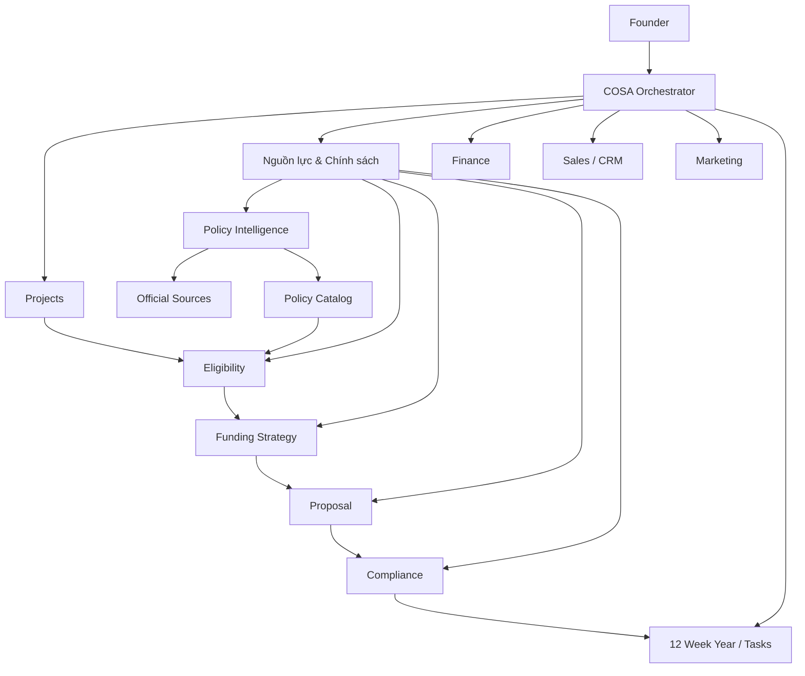

# COSA — Tài liệu điều chỉnh & tích hợp Policy/Funding Intelligence

**Tên đề xuất trong giao diện:** **Nguồn lực & Chính sách**  
**Tên kỹ thuật nội bộ:** `PolicyFunding Intelligence` — *hệ thống phân tích chính sách và nguồn lực hỗ trợ*  
**Phạm vi:** COSA dành cho Founder/One Person Company  
**Mục tiêu:** biến thông tin chính sách, quỹ, chương trình hỗ trợ, voucher, tín dụng ưu đãi, cloud credit và nguồn lực hệ sinh thái thành **cơ hội có thể hành động** gắn trực tiếp với từng Project của COSA.

---

## 0. Nguyên tắc ngôn ngữ cho Founder

COSA phải ưu tiên tiếng Việt trong giao diện. Chỉ giữ tiếng Anh khi đó là thuật ngữ quốc tế, tên kỹ thuật, tên sản phẩm hoặc từ khóa cần tra cứu.

Quy tắc hiển thị:

- `TRL (Technology Readiness Level — Mức độ sẵn sàng công nghệ)`
- `MVP (Minimum Viable Product — Sản phẩm khả dụng tối thiểu)`
- `PoC (Proof of Concept — Bằng chứng khả thi của ý tưởng/công nghệ)`
- `Eligibility (Điều kiện đủ/khả năng đáp ứng điều kiện)`
- `Readiness Score (Điểm sẵn sàng hồ sơ)`
- `Match Score (Điểm phù hợp giữa Project và chương trình)`
- `Policy Intelligence (Phân tích và theo dõi chính sách)`
- `Funding Intelligence (Phân tích và theo dõi nguồn vốn/nguồn lực)`
- `Compliance (Tuân thủ)`
- `Evidence (Minh chứng)`
- `Milestone (Mốc kết quả)`
- `Voucher (Phiếu hỗ trợ tài chính/trợ giá)`
- `Sandbox (Cơ chế thử nghiệm có kiểm soát)`
- `Grant (Khoản tài trợ)`
- `Cloud Credit (Tín dụng sử dụng hạ tầng đám mây)`
- `Spin-off (Doanh nghiệp hình thành để thương mại hóa tài sản trí tuệ/kết quả nghiên cứu)`
- `Startup (Doanh nghiệp khởi nghiệp sáng tạo)`

**Không hiển thị giao diện kiểu “toàn tiếng Anh rồi yêu cầu Founder tự hiểu”.**

---

# 1. Mục tiêu điều chỉnh COSA

COSA hiện không nên chỉ dừng ở:

**Project → OKRs → 12 Week Year → Tasks → Finance → Sales/Marketing**

Cần bổ sung một lớp hỗ trợ xuyên suốt:

**Project → Policy/Funding Intelligence → Cơ hội → Điều kiện → Hồ sơ → Nguồn lực → Thực thi → Báo cáo**

Mục tiêu cuối cùng là trả lời cho Founder 5 câu hỏi:

1. **Project của tôi hiện thuộc loại nào?**
2. **Project đang ở giai đoạn nào?**
3. **Có chương trình/quỹ/nguồn lực nào phù hợp?**
4. **Tôi còn thiếu điều kiện, hồ sơ hay minh chứng gì?**
5. **Việc tiếp theo cần làm là gì và cần hoàn thành trước thời điểm nào?**

COSA không chỉ trả lời “có chương trình NATIF”, mà phải tiến tới dạng:

> Project A có khả năng phù hợp với Chương trình X.  
> Điều kiện bắt buộc đã đáp ứng: 7/9.  
> Còn thiếu: hồ sơ SHTT, minh chứng vốn đối ứng và 2 KPI đầu ra.  
> Điểm sẵn sàng hồ sơ: 68/100.  
> Việc nên làm trong tuần này: hoàn tất 3 minh chứng còn thiếu.

---

# 2. Căn cứ từ tài liệu Founders’ Meetup #1

Tài liệu đính kèm cho thấy một chuỗi hỗ trợ mới tập trung vào thương mại hóa:

**Khoa học → Công nghệ → Sản phẩm/MVP → Sản xuất → Thị trường**

Các nội dung quan trọng cần chuyển hóa thành chức năng COSA:

- phân loại Startup / Spin-off / Doanh nghiệp KH&CN / SME đổi mới;
- phân loại theo giai đoạn: tiền ươm tạo, ươm tạo, tăng tốc, tăng trưởng/đổi mới;
- quản lý `TRL — Mức độ sẵn sàng công nghệ`;
- theo dõi tài sản trí tuệ;
- kết hợp tài trợ, hỗ trợ lãi suất, voucher, hạ tầng dùng chung, chuyên gia và nguồn lực thị trường;
- coi “hồ sơ thuyết minh + đầu ra định lượng + tài chính + minh chứng” là yếu tố quyết định;
- tránh trùng lặp nguồn hỗ trợ;
- theo dõi nghĩa vụ sau tài trợ;
- phân biệt chính sách đã ban hành với chương trình còn là dự thảo;
- hỗ trợ tiếp cận nguồn lực theo đúng **giai đoạn**, không chỉ theo số tiền.

Tài liệu cũng có một số điểm biên tập chưa hoàn toàn nhất quán giữa tiêu đề và nội dung ở một vài slide. Vì vậy:

> **PDF này được dùng làm nguồn kiến thức khởi tạo, không được dùng làm “nguồn pháp lý chuẩn” để COSA tự động khẳng định quyền lợi.**

Mọi chính sách hiển thị trong sản phẩm phải có nguồn chính thức và trạng thái xác minh.

---

# 3. Nguyên tắc kiến trúc

## 3.1. Không tạo thêm một “siêu module” độc lập khỏi Project

`Nguồn lực & Chính sách` phải là **lớp hỗ trợ gắn với Project**, không phải một kho tin tức rời rạc.

Mỗi Project có thể có:

- phân loại doanh nghiệp;
- Stage — *giai đoạn phát triển*;
- TRL — *mức sẵn sàng công nghệ*;
- nhu cầu vốn;
- nhu cầu hạ tầng;
- nhu cầu IP;
- nhu cầu chuyên gia;
- nhu cầu thị trường;
- danh sách cơ hội phù hợp;
- danh sách hồ sơ đang chuẩn bị;
- nguồn lực đã nhận;
- nghĩa vụ hậu tài trợ.

## 3.2. Không tạo quá nhiều Agent

Không triển khai 20–30 Agent riêng lẻ.

Đề xuất dùng **01 Orchestrator (bộ điều phối AI)** và 5 vai trò logic:

1. **Policy Intelligence Agent** — Agent phân tích và theo dõi chính sách.
2. **Eligibility Agent** — Agent đánh giá điều kiện.
3. **Funding Strategy Agent** — Agent xây dựng chiến lược nguồn lực.
4. **Proposal Agent** — Agent hỗ trợ tạo hồ sơ/thuyết minh.
5. **Compliance Agent** — Agent kiểm tra nghĩa vụ và tuân thủ.

Các Agent này có thể là **skills/capabilities (năng lực)** của cùng một hệ điều phối thay vì 5 tiến trình AI độc lập.

---

# 4. Vị trí trong kiến trúc COSA



### Nguyên tắc quan trọng

- `Project` là trung tâm.
- `Policy Catalog — Danh mục chính sách/chương trình` là dữ liệu dùng chung.
- AI không được tự tạo “chính sách tưởng tượng”.
- Mọi gợi ý phải truy ngược được về nguồn.
- Mọi hành động pháp lý/tài chính quan trọng cần Founder/Admin phê duyệt.

---

# 5. Tên chức năng trong UI

## Menu chính

**Nguồn lực & Chính sách**

Không nên dùng tên tiếng Anh làm menu chính.

Bên trong gồm:

1. **Cơ hội phù hợp**
2. **Điều kiện & mức sẵn sàng**
3. **Hồ sơ đang chuẩn bị**
4. **Nguồn lực đã nhận**
5. **Nghĩa vụ & báo cáo**
6. **Thư viện chính sách**
7. **Cảnh báo thay đổi**

Từ chuyên môn tiếng Anh chỉ hiển thị khi cần:

> TRL 4 — Mức độ sẵn sàng công nghệ: đã xác thực thành phần trong môi trường phòng thử nghiệm.

---

# 6. Hologram Hub

Hologram Hub không hiển thị danh sách dài các nghị định/quỹ. Nó chỉ hiển thị **tình trạng cần Founder chú ý**.

## Card 1 — Mức sẵn sàng nguồn lực

**Funding Readiness — Mức sẵn sàng tiếp cận nguồn lực**

Ví dụ:

- Điểm sẵn sàng: **72/100**
- 3 cơ hội phù hợp cao
- 4 minh chứng còn thiếu
- 1 hồ sơ sắp đến hạn

## Card 2 — Cơ hội ưu tiên

Ví dụ:

- NATIF — phù hợp 82%
- AWS Activate — phù hợp 95%
- Chương trình hỗ trợ địa phương — phù hợp 68%

**Lưu ý:** phần trăm trên là `Match Score — Điểm phù hợp`, không phải xác suất được duyệt.

## Card 3 — Việc cần làm

Ví dụ:

- Hoàn thiện hồ sơ SHTT.
- Xác nhận số dư vốn đối ứng.
- Bổ sung KPI đầu ra.
- Kiểm tra chương trình còn nhận hồ sơ hay không.

## Card 4 — Cảnh báo

Ví dụ:

- Có chính sách liên quan Project A vừa thay đổi.
- Chương trình B chuyển từ DRAFT sang ACTIVE.
- Có khả năng trùng chi phí với hồ sơ C.
- Mốc báo cáo tài trợ còn 14 ngày.

---

# 7. Ba loại đánh giá bắt buộc phải tách riêng

COSA không nên dùng một điểm duy nhất.

## 7.1. Eligibility Status — Trạng thái điều kiện

Giá trị:

- `ELIGIBLE` — Đủ điều kiện theo dữ liệu hiện có.
- `POTENTIALLY_ELIGIBLE` — Có khả năng đủ nhưng còn thiếu thông tin.
- `INELIGIBLE` — Có ít nhất một điều kiện bắt buộc không đạt.
- `NEEDS_VERIFICATION` — Cần xác minh bằng nguồn chính thức.

Điều kiện cứng luôn ưu tiên hơn điểm số.

## 7.2. Match Score — Điểm phù hợp

Thang 0–100.

Đo mức độ chương trình phù hợp với Project:

- loại doanh nghiệp;
- giai đoạn;
- lĩnh vực;
- TRL;
- địa phương;
- nhu cầu vốn;
- loại chi phí;
- mục tiêu chương trình.

## 7.3. Readiness Score — Điểm sẵn sàng hồ sơ

Thang 0–100.

Đo mức độ Founder đã chuẩn bị:

- pháp lý;
- SHTT;
- tài chính;
- vốn đối ứng;
- KPI;
- đội ngũ;
- khách hàng;
- kế hoạch thương mại hóa;
- tài liệu minh chứng.

**Ví dụ:** Project có thể Match Score 95/100 nhưng Readiness Score chỉ 40/100.

Điều đó nghĩa là **rất phù hợp nhưng chưa sẵn sàng nộp**.

---

# 8. Company & Project Classification

## 8.1. Company Type — Loại doanh nghiệp

Các lựa chọn:

- Startup — Khởi nghiệp sáng tạo.
- Spin-off — Doanh nghiệp thương mại hóa kết quả nghiên cứu/IP.
- Science & Technology Enterprise — Doanh nghiệp KH&CN.
- Innovative SME — SME đổi mới sáng tạo.
- Digital SME — SME công nghệ số.
- Other — Khác.

Không để AI tự quyết tuyệt đối.

UI:

> AI đề xuất: **Startup công nghệ số**  
> Độ tin cậy: 84%  
> Founder: **Xác nhận / Sửa**

## 8.2. Project Stage — Giai đoạn Project

Chuẩn hóa:

1. Idea — Ý tưởng.
2. PoC — Bằng chứng khả thi.
3. Prototype — Mẫu thử.
4. MVP — Sản phẩm khả dụng tối thiểu.
5. Market Validation — Xác thực thị trường.
6. Acceleration — Tăng tốc.
7. Scale-up — Mở rộng.
8. Growth / Innovation — Tăng trưởng / đổi mới công nghệ.

COSA có thể tự đề xuất Stage dựa trên:

- đã có sản phẩm chưa;
- đã có người dùng chưa;
- đã có doanh thu chưa;
- đã thử nghiệm thực tế chưa;
- mức TRL;
- có hợp đồng/pilot chưa.

Founder phải có quyền chỉnh.

---

# 9. TRL — Mức độ sẵn sàng công nghệ

COSA cần hỗ trợ TRL nhưng **không bắt Founder học thuộc TRL 1–9**.

Ví dụ UI:

> **TRL 3 — Đã chứng minh nguyên lý ban đầu**  
> Bạn đã có PoC nhưng chưa thử nghiệm trong môi trường thực tế.

Cần lưu:

- `trl_current`
- `trl_target`
- `trl_evidence`
- `trl_assessed_by`
- `trl_verified_at`

Khi chương trình yêu cầu `TRL ≥ 3`, COSA kiểm tra tự động nhưng phải hiển thị:

> Điều kiện: TRL ≥ 3  
> Project: TRL 4  
> Kết quả: Đạt  
> Minh chứng: Báo cáo thử nghiệm ngày …

---

# 10. Policy Catalog — Danh mục chính sách/chương trình

Mỗi chính sách/chương trình phải được lưu thành cấu trúc dữ liệu.

## Entity: `PolicyProgram`

| Trường | Ý nghĩa |
|---|---|
| `name` | Tên chương trình |
| `program_type` | Grant, Loan Support, Voucher, Credit, Infrastructure… |
| `legal_basis` | Căn cứ pháp lý |
| `authority` | Cơ quan quản lý |
| `geography` | Phạm vi địa lý |
| `company_types` | Đối tượng doanh nghiệp |
| `project_stages` | Giai đoạn phù hợp |
| `trl_min` | TRL tối thiểu |
| `industries` | Lĩnh vực |
| `funding_min/max` | Mức hỗ trợ |
| `matching_fund` | Vốn đối ứng |
| `eligible_costs` | Nhóm chi phí được hỗ trợ |
| `application_window` | Thời gian nộp |
| `requirements` | Điều kiện |
| `evidence_required` | Minh chứng |
| `reporting_obligations` | Nghĩa vụ báo cáo |
| `source_url` | Nguồn chính thức |
| `source_document` | Văn bản/nguồn |
| `last_verified_at` | Lần xác minh gần nhất |
| `status` | Trạng thái |

---

# 11. Trạng thái chính sách bắt buộc

Không dùng một field “active=true/false” đơn giản.

Sử dụng:

- `DRAFT` — Dự thảo.
- `ENACTED` — Đã ban hành/có hiệu lực theo nguồn xác minh.
- `UPCOMING` — Đã công bố nhưng chưa mở nhận hồ sơ.
- `ACTIVE` — Đang tiếp nhận hồ sơ.
- `CLOSED` — Đã đóng đợt nhận hồ sơ.
- `EXPIRED` — Hết hiệu lực/hết chương trình.
- `SUSPENDED` — Tạm dừng.
- `UNKNOWN` — Chưa xác minh.

UI luôn dịch:

> `DRAFT — Dự thảo, chưa được coi là quyền lợi hiện hành.`

Đặc biệt, dữ liệu được nhập từ PDF hội thảo ban đầu phải mang:

> `source_type = PRESENTATION`  
> `verification_status = UNVERIFIED`

và **không được mặc định là ACTIVE**.

---

# 12. Source Provenance — Truy xuất nguồn

Mỗi dữ liệu quan trọng phải trả lời được:

> Thông tin này lấy từ đâu?

Entity:

`SourceDocument`

- tiêu đề;
- cơ quan;
- loại tài liệu;
- số hiệu;
- ngày ban hành;
- URL;
- ngày truy cập;
- bản PDF/snapshot;
- hash;
- trạng thái;
- ghi chú xác minh.

Mỗi rule trong Eligibility phải tham chiếu `source_document_id`.

Ví dụ:

> **Yêu cầu vốn đối ứng: có**  
> Nguồn: Văn bản X, Điều Y  
> Xác minh gần nhất: 12/08/2026

AI không được viết:

> “Theo quy định hiện hành…”

nếu không có nguồn xác minh.

---

# 13. Policy Intelligence Agent — Agent phân tích chính sách

## Nhiệm vụ

- theo dõi nguồn chính thức;
- nhận biết chương trình mới;
- phát hiện văn bản thay đổi;
- trích xuất điều kiện;
- so sánh phiên bản;
- chuyển trạng thái DRAFT → ENACTED → ACTIVE khi có bằng chứng;
- gửi thay đổi vào hàng chờ Admin review.

## Không được phép

- tự đưa chính sách chưa xác minh vào Production;
- tự suy luận số tiền hỗ trợ nếu nguồn không ghi rõ;
- tự thay đổi rule ảnh hưởng Eligibility mà không có audit log.

## Workflow

```text
Official Source
→ Fetch
→ Parse
→ Detect Change
→ Extract Candidate Facts
→ Compare Existing Record
→ Human/Admin Verification
→ Publish
→ Recalculate Matching
→ Notify Founder
```

---

# 14. Eligibility Agent — Agent đánh giá điều kiện

Đầu vào:

- Company Profile.
- Project Profile.
- Stage.
- TRL.
- IP.
- doanh thu/khách hàng.
- địa phương.
- nhu cầu vốn.
- evidence.

Đầu ra:

- `Eligibility Status`.
- điều kiện đạt.
- điều kiện không đạt.
- điều kiện chưa xác minh.
- Match Score.
- Readiness Score.
- danh sách việc cần làm.

Ví dụ:

```text
NATIF — Dự án đổi mới công nghệ

Eligibility: POTENTIALLY_ELIGIBLE
Match Score: 88/100
Readiness Score: 61/100

Đã đạt:
✓ Có pháp nhân
✓ Dự án đổi mới công nghệ
✓ Có MVP
✓ Có khách hàng thử nghiệm

Còn thiếu:
! Minh chứng vốn đối ứng
! Hồ sơ IP chưa hoàn chỉnh
! Chưa có dự toán theo biểu mẫu

Không xác minh được:
? Đợt nhận hồ sơ hiện tại
```

---

# 15. Funding Strategy Agent — Agent chiến lược nguồn lực

Không giới hạn “Funding — nguồn vốn” chỉ là tiền mặt.

COSA phải quản lý:

1. Grant — Tài trợ.
2. Preferential Loan — Tín dụng ưu đãi.
3. Interest Subsidy — Hỗ trợ lãi suất.
4. Voucher — Phiếu hỗ trợ tài chính.
5. Cloud Credit — Tín dụng hạ tầng cloud.
6. Expert Support — Hỗ trợ chuyên gia.
7. Infrastructure — Hạ tầng/lab/co-working.
8. Private Capital — Vốn tư nhân.
9. Corporate Program — Chương trình hỗ trợ của doanh nghiệp lớn.
10. Procurement/Pilot — Đặt hàng hoặc thử nghiệm.

## Funding Stack — Cơ cấu nguồn lực

Ví dụ Project cần 1 tỷ đồng:

```text
300M Founder Capital — Vốn Founder
250M Grant — Tài trợ
100M Cloud Credits — Quy đổi lợi ích hạ tầng
150M Voucher / Program Support
200M Commercial Revenue — Doanh thu
```

COSA không cộng Cloud Credit vào tiền mặt trong báo cáo kế toán.

Phải tách:

- `cash_funding`
- `non_cash_support`
- `credit_support`
- `service_support`

---

# 16. Proposal Agent — Agent hỗ trợ hồ sơ

Proposal Agent không được “viết hồ sơ đẹp nhưng bịa dữ liệu”.

Nó phải build hồ sơ từ dữ liệu thật trong Project.

## Các block

1. Bối cảnh.
2. Vấn đề.
3. Mục tiêu.
4. Công nghệ.
5. TRL hiện tại.
6. Đầu ra.
7. KPI.
8. Kế hoạch triển khai.
9. Thương mại hóa.
10. Khách hàng.
11. Ngân sách.
12. Vốn đối ứng.
13. Đội ngũ.
14. IP.
15. Rủi ro.
16. Minh chứng.

Nếu dữ liệu thiếu:

> `[CẦN FOUNDER BỔ SUNG: số khách hàng pilot]`

không được tự điền.

## Template Versioning — Quản lý phiên bản biểu mẫu

Mỗi chương trình có template riêng.

- `template_version`
- `effective_date`
- `source`
- `required_sections`
- `required_attachments`

Khi biểu mẫu mới xuất hiện, không ghi đè hồ sơ cũ.

---

# 17. Compliance Agent — Agent tuân thủ

Đây là phần rất quan trọng vì tài liệu nhấn mạnh nguồn hỗ trợ công là **“vốn có điều kiện”**.

Compliance Agent quản lý:

- milestone;
- KPI;
- lịch giải ngân;
- báo cáo;
- hóa đơn/chứng từ nếu yêu cầu;
- nghiệm thu;
- thay đổi phạm vi;
- nghĩa vụ hậu tài trợ;
- nguồn vốn đối ứng;
- tránh trùng hỗ trợ.

## Double Funding Guard — Cơ chế chống trùng nguồn hỗ trợ

COSA cần cảnh báo nếu:

- cùng Project;
- cùng giai đoạn;
- cùng hạng mục;
- cùng kỳ thời gian;
- cùng khoản chi;

đã được khai báo ở hai nguồn hỗ trợ khác nhau.

Không chỉ so tên chi phí.

Cần so:

`project + work_package + period + cost_category + purpose`

Ví dụ:

> Cảnh báo: “Chi phí thử nghiệm MVP tháng 9–10” đang xuất hiện ở hồ sơ A và hồ sơ B.

Founder/Admin quyết định xử lý.

---

# 18. Opportunity Pipeline — Pipeline cơ hội

Pipeline là chuỗi trạng thái của một cơ hội:

```text
DISCOVERED
→ MATCHED
→ REVIEWING
→ PREPARING
→ READY
→ SUBMITTED
→ UNDER_REVIEW
→ APPROVED / REJECTED
→ CONTRACTED
→ DISBURSING
→ REPORTING
→ COMPLETED
```

Hiển thị tiếng Việt:

- Đã phát hiện.
- Phù hợp.
- Đang xem xét.
- Đang chuẩn bị.
- Sẵn sàng nộp.
- Đã nộp.
- Đang thẩm định.
- Được duyệt / Không được duyệt.
- Đã ký.
- Đang giải ngân.
- Đang báo cáo.
- Hoàn thành.

---

# 19. Tích hợp với 12 Week Year

Policy/Funding không phải một hệ thống kế hoạch riêng.

Khi thiếu điều kiện, COSA có thể đề xuất tạo Tactic/Task.

Ví dụ:

**Objective:** Hoàn thiện điều kiện để nộp chương trình hỗ trợ.

**Tactics:**
- Tuần 1: hoàn thiện hồ sơ SHTT.
- Tuần 2: xác nhận vốn đối ứng.
- Tuần 3: hoàn thiện dự toán.
- Tuần 4: review thuyết minh.
- Tuần 5: nộp hồ sơ.

AI chỉ **đề xuất**.

Founder chọn:

> `Add to 12WY — Thêm vào 12 Week Year`

Không tự động làm thay đổi OKR/12WY đã được Founder phê duyệt.

---

# 20. Tích hợp Finance

Finance cần biết:

- nguồn vốn;
- nguồn hỗ trợ;
- điều kiện sử dụng;
- tiến độ;
- dòng tiền;
- vốn đối ứng;
- khoản hỗ trợ không hoàn lại;
- khoản vay;
- hỗ trợ lãi suất;
- non-cash credit.

Entity:

`FundingAward`

- `program_id`
- `project_id`
- `award_type`
- `approved_amount`
- `cash_amount`
- `non_cash_value`
- `matching_required`
- `matching_actual`
- `start_date`
- `end_date`
- `restricted_use`
- `reporting_schedule`

**Không tự ghi nhận kế toán chỉ vì chương trình được “approved”.**

Finance chỉ ghi nhận theo transaction/disbursement thực tế và quy tắc kế toán của hệ thống.

---

# 21. Tích hợp CRM/Sales

Nguồn lực chính sách có thể hỗ trợ market validation.

COSA nên liên kết:

`Voucher → Campaign → Lead → Customer → Order`

Ví dụ nếu doanh nghiệp được voucher để trợ giá khách hàng đầu tiên:

- Sales CRM biết khách hàng nào dùng voucher.
- Revenue biết doanh thu thật.
- Policy module biết chi phí nào được hoàn.
- Proposal module dùng dữ liệu đó làm evidence cho vòng sau.

Mục tiêu:

> không để “chính sách” tách khỏi bán hàng thực tế.

---

# 22. Tích hợp Marketing

Marketing có thể dùng:

- chương trình hỗ trợ;
- giải thưởng;
- accelerator;
- chứng nhận;
- case study;
- partner program

làm Social Proof — *bằng chứng tạo uy tín*.

Nhưng:

- không được quảng cáo “được Nhà nước bảo chứng” nếu chỉ là tham gia chương trình;
- không dùng trạng thái DRAFT để quảng cáo quyền lợi;
- mọi claim quan trọng phải link evidence.

---

# 23. Tích hợp n8n / Automation

`n8n` dùng cho Automation — *tự động hóa quy trình*, không dùng làm bộ ra quyết định.

## n8n phù hợp để:

- chạy lịch lấy nguồn;
- theo dõi RSS/API/web page;
- tải văn bản mới;
- gửi event về COSA;
- gửi Telegram/Zalo/Email;
- nhắc deadline;
- kích hoạt review.

## COSA chịu trách nhiệm:

- normalize dữ liệu;
- lưu source;
- AI extraction;
- rules;
- eligibility;
- approvals;
- audit.

Workflow:

```text
n8n detects update
→ COSA ingestion endpoint
→ create Source Snapshot
→ AI extracts changes
→ Admin Review
→ Publish
→ recalculate Project matches
→ notify Founder
```

---

# 24. Notification — Thông báo

Ưu tiên thông báo theo tác động, không spam.

## Critical

- chương trình phù hợp cao vừa mở;
- deadline dưới 7 ngày;
- chính sách đang dùng thay đổi;
- hồ sơ có nguy cơ không đủ điều kiện;
- báo cáo đến hạn;
- có nguy cơ double funding.

## Normal

- có chương trình mới phù hợp trung bình;
- evidence score tăng;
- Project chuyển stage;
- Draft mới đáng theo dõi.

Kênh:

- In-app.
- Hologram Hub.
- Telegram.
- Zalo.
- Email.

Founder được chọn kênh.

---

# 25. Prompt Governance — Quản trị Prompt

Prompt, rule quan trọng và Build Spec chỉ Admin/Founder được sửa.

Áp dụng nguyên tắc đã thống nhất cho COSA:

- Founder/Admin là role duy nhất ban đầu.
- Staff role chỉ bật sau.
- Prompt hệ thống có Default Version.
- Admin có thể sửa.
- Admin có thể `Reset to Default — Khôi phục mặc định`.
- Mọi thay đổi có version và audit log.

Các prompt cần quản lý:

- policy extraction;
- legal/status classification;
- project classification;
- eligibility explanation;
- readiness analysis;
- funding strategy;
- proposal drafting;
- compliance review.

AI prompt không được chứa số liệu pháp lý “hard-code” nếu dữ liệu đó nên lấy từ database.

---

# 26. RBAC — Phân quyền

`RBAC (Role-Based Access Control — Phân quyền theo vai trò)`

## Giai đoạn đầu

### Founder/Admin

- toàn quyền;
- sửa prompt;
- sửa spec;
- xác minh policy;
- duyệt hồ sơ;
- duyệt AI output;
- xuất tài liệu;
- ký/xác nhận thủ công.

## Giai đoạn sau

Có thể thêm:

- Staff.
- Finance.
- Legal.
- Sales.
- Reviewer.

Nhưng **không triển khai phức tạp ở MVP**.

---

# 27. Human-in-the-loop

`Human-in-the-loop — Con người duyệt ở các điểm quan trọng`

Bắt buộc Founder/Admin duyệt trước:

- xác nhận loại Project;
- xác nhận TRL;
- xác nhận trạng thái đủ điều kiện;
- xuất hồ sơ chính thức;
- gửi hồ sơ;
- xác nhận nguồn vốn;
- thay đổi rule;
- publish chính sách;
- xác nhận hoàn thành nghĩa vụ.

AI được quyền:

- phân tích;
- đề xuất;
- so sánh;
- kiểm tra thiếu;
- tóm tắt;
- tạo draft;
- cảnh báo.

AI không được quyền:

- ký;
- nộp tự động;
- xác nhận pháp lý;
- cam kết vay;
- cam kết vốn đối ứng;
- tự thay đổi dữ liệu tài chính quan trọng.

---

# 28. Data Model đề xuất

## Core

- `companies`
- `projects`
- `project_stage_assessments`
- `trl_assessments`
- `ip_assets`
- `funding_needs`

## Policy

- `policy_programs`
- `program_rounds`
- `eligibility_rules`
- `program_requirements`
- `program_documents`
- `source_documents`
- `source_snapshots`

## Matching

- `project_program_matches`
- `eligibility_evaluations`
- `readiness_evaluations`
- `missing_requirements`

## Application

- `applications`
- `application_sections`
- `application_evidence`
- `application_versions`
- `submission_events`

## Post Award

- `funding_awards`
- `disbursements`
- `milestones`
- `compliance_obligations`
- `compliance_reports`
- `cost_allocations`

## Governance

- `prompt_templates`
- `prompt_versions`
- `policy_change_logs`
- `audit_logs`
- `admin_reviews`

---

# 29. API đề xuất

## Project

`GET /projects/{id}/funding-overview`

Trả:

- stage;
- TRL;
- opportunities;
- readiness;
- missing evidence;
- deadlines.

## Matching

`POST /projects/{id}/policy-match`

Chạy matching lại.

## Program

`GET /policy-programs`

`GET /policy-programs/{id}`

## Eligibility

`POST /projects/{projectId}/programs/{programId}/evaluate`

## Application

`POST /applications`

`POST /applications/{id}/generate-draft`

`POST /applications/{id}/approve-section`

## Admin

`POST /admin/policy/import`

`POST /admin/policy/{id}/verify`

`POST /admin/policy/{id}/publish`

`POST /admin/policy/{id}/reset-extraction`

---

# 30. Admin UI — Trung tâm xác minh

Cần một màn hình dành riêng Admin:

## Policy Inbox — Hộp chờ chính sách

Mỗi item:

- nguồn;
- ngày phát hiện;
- thay đổi;
- AI summary;
- extracted fields;
- confidence;
- diff;
- status.

Actions:

- Verify — Xác minh.
- Edit — Sửa.
- Publish — Công bố vào hệ thống.
- Reject — Loại.
- Mark Draft — Đánh dấu dự thảo.
- Request Re-analysis — Phân tích lại.

---

# 31. Import tài liệu PDF hội thảo

PDF Founders’ Meetup có thể dùng để seed dữ liệu ban đầu nhưng phải tuân thủ:

1. Import thành `SourceDocument`.
2. Gắn loại `PRESENTATION`.
3. Gắn `UNVERIFIED`.
4. Extract candidate programs.
5. Không publish điều kiện pháp lý ngay.
6. Từng program phải được map tới nguồn chính thức.
7. Chương trình ghi “Dự thảo 7/2026” phải giữ `DRAFT`.
8. Dữ liệu mâu thuẫn trong slide phải tạo flag `REVIEW_REQUIRED`.

Ví dụ:

```json
{
  "source_type": "PRESENTATION",
  "verification_status": "UNVERIFIED",
  "legal_authority": "NOT_CONFIRMED",
  "publish_to_matching": false
}
```

---

# 32. Logic Matching

Pseudo logic:

```text
1. Hard Filters
   - geography
   - company type
   - legal entity
   - stage
   - TRL minimum
   - industry
   - status/deadline

2. Soft Matching
   - funding need
   - cost fit
   - target market
   - IP readiness
   - commercial readiness

3. Readiness
   - evidence
   - budget
   - team
   - co-funding
   - KPI
   - documents

4. Risk
   - deadline
   - double funding
   - unverified policy
   - incomplete legal basis

5. Explain
```

AI luôn trả **lý do**.

Không chỉ trả số.

---

# 33. Readiness Checklist — Danh sách sẵn sàng

## Pháp lý

- [ ] Pháp nhân.
- [ ] Ngành nghề phù hợp.
- [ ] Hồ sơ đại diện.
- [ ] Chữ ký số nếu yêu cầu.

## Công nghệ

- [ ] Mô tả công nghệ.
- [ ] TRL.
- [ ] PoC/MVP.
- [ ] Kết quả thử nghiệm.

## IP

- [ ] Quyền sở hữu/sử dụng.
- [ ] Đăng ký/giấy tờ.
- [ ] Không tranh chấp.
- [ ] License nếu có.

## Thị trường

- [ ] Khách hàng mục tiêu.
- [ ] Pilot.
- [ ] Doanh thu/LOI nếu có.
- [ ] Go-to-market — kế hoạch ra thị trường.

## Tài chính

- [ ] Budget.
- [ ] Cash flow.
- [ ] Vốn đối ứng.
- [ ] Chứng minh nguồn lực.

## Thực thi

- [ ] Team.
- [ ] Advisor/Expert.
- [ ] Milestones.
- [ ] KPI.

---

# 34. Không biến COSA thành “máy săn tiền hỗ trợ”

Mục đích của Policy/Funding Intelligence không phải tối đa số chương trình xin được.

Nguyên tắc:

> **Project phải hợp với chương trình — không bẻ Project để chạy theo chương trình.**

COSA cần cảnh báo nếu:

- founder đổi mục tiêu quá nhiều để khớp nguồn vốn;
- chi phí compliance lớn hơn lợi ích;
- chương trình làm chậm market validation;
- nguồn hỗ trợ tạo lock-in không cần thiết;
- hồ sơ mất quá nhiều thời gian so với opportunity cost — *chi phí cơ hội*.

Mỗi Opportunity nên có:

`Expected Value — Giá trị kỳ vọng`

bao gồm:

- số tiền/lợi ích;
- xác suất thực tế do Founder tự đánh giá hoặc AI hỗ trợ;
- thời gian chuẩn bị;
- chi phí compliance;
- time-to-cash — thời gian dự kiến tới lúc nhận nguồn lực.

---

# 35. Multi-Project — Nhiều Project

COSA phải hỗ trợ Founder có nhiều Project.

Ví dụ cùng một chương trình phù hợp 3 Project:

| Project | Match | Readiness | Khuyến nghị |
|---|---:|---:|---|
| A | 91 | 76 | Ưu tiên |
| B | 78 | 82 | Có thể nộp |
| C | 88 | 41 | Chưa sẵn sàng |

COSA đề xuất:

> Nộp Project A trước vì fit cao và hồ sơ đã tương đối sẵn.

Nhưng Founder là người quyết định.

---

# 36. Multi-Source Funding — Kết hợp nhiều nguồn

Một Project có thể dùng:

- founder capital;
- revenue;
- grant;
- loan;
- credit;
- cloud credit;
- voucher;
- partner support.

Nhưng phải có `Funding Allocation Map — Bản đồ phân bổ nguồn lực`.

Ví dụ:

```text
R&D           → Grant A
Cloud         → AWS Credit
Marketing     → Founder Capital
Pilot         → Voucher
Working Cash  → Revenue
Equipment     → Loan
```

Mục tiêu:

- tối ưu nguồn lực;
- tránh double funding;
- dễ audit;
- dễ báo cáo.

---

# 37. AWS Activate và các nguồn lực tư nhân

AWS Activate trong tài liệu là ví dụ tốt cho `Non-cash Support — Hỗ trợ phi tiền mặt`.

Thiết kế COSA không hard-code riêng AWS.

Tạo generic entity:

`ProviderProgram`

Ví dụ:

- AWS Activate.
- Google Cloud for Startups.
- Microsoft for Startups.
- accelerator credit.
- SaaS startup credits.
- partner vouchers.

Mỗi chương trình tư nhân vẫn có:

- eligibility;
- value;
- expiry;
- usage restrictions;
- source;
- application link;
- evidence.

---

# 38. Search / Chat behavior của COSA

Khi Founder hỏi:

> “Project COSA có xin được hỗ trợ gì không?”

COSA không được trả ngay một danh sách dài.

Flow:

1. Xác định Project.
2. Đọc profile Project.
3. Kiểm tra Stage.
4. Kiểm tra TRL.
5. Kiểm tra Policy Catalog.
6. Lọc program ACTIVE/UPCOMING.
7. Kiểm tra eligibility.
8. Trả Top opportunities.
9. Nêu thiếu gì.
10. Đề xuất hành động.

Nếu Founder chỉ chào “Chào”:

> COSA trả lời bình thường.

**Không tự kích hoạt flow kiểm tra Project/chính sách** nếu người dùng không có ý định đó.

---

# 39. Voice / LiveKit

Policy/Funding có thể dùng voice nhưng voice chỉ là giao diện.

Ví dụ Founder hỏi bằng giọng nói:

> “COSA, project mVault hiện có cơ hội hỗ trợ nào đáng chú ý?”

COSA:

- đọc Project;
- chạy matching;
- trả 3 cơ hội;
- tóm tắt bằng giọng nói;
- Hologram Hub mở card chi tiết.

Không đọc toàn bộ nghị định bằng voice.

Desktop có thể dùng LiveKit local theo kiến trúc COSA hiện tại; mobile dùng LiveKit Cloud. Policy/Funding layer không phụ thuộc trực tiếp vào LiveKit.

---

# 40. Security & Privacy

Dữ liệu hồ sơ funding có thể chứa:

- tài chính;
- IP;
- kế hoạch sản phẩm;
- chiến lược;
- khách hàng;
- vốn;
- văn bản pháp lý.

Yêu cầu:

- encryption at rest;
- audit log;
- RBAC;
- tách source public và evidence private;
- export có quyền;
- không gửi full evidence ra model nếu không cần;
- redact — *che dữ liệu nhạy cảm* trước khi gửi AI nếu có thể.

---

# 41. Local-first & Sync

Đề xuất:

## Canonical Data — Dữ liệu chuẩn

Policy Catalog và Application canonical nằm trong PostgreSQL/FastAPI.

## Desktop Cache

Desktop có thể cache:

- program list;
- source metadata;
- project readiness;
- draft hồ sơ.

Không nên để bản local trở thành nguồn chuẩn duy nhất cho chính sách vì:

- dữ liệu cần cập nhật internet;
- nhiều nguồn thay đổi;
- mobile cần đọc;
- audit cần tập trung.

Nếu offline:

> hiển thị “Dữ liệu được xác minh gần nhất ngày …”

---

# 42. Logging & Audit

Mọi thay đổi quan trọng:

- ai sửa program;
- AI extraction version;
- prompt version;
- ai verify;
- ai publish;
- rule nào tạo kết quả eligibility;
- source nào được dùng;
- founder override gì.

Ví dụ:

```text
15/08/2026 10:32
Admin verified Program X
Source: document abc.pdf
Changed status: DRAFT → ENACTED
Eligibility recalculated for 4 projects
```

---

# 43. Acceptance Criteria — Tiêu chí nghiệm thu

## MVP phải làm được

- [ ] Founder mở Project thấy tab Nguồn lực.
- [ ] Có Company Type.
- [ ] Có Project Stage.
- [ ] Có TRL.
- [ ] Import Policy Program thủ công.
- [ ] Program có nguồn và status.
- [ ] Matching Project ↔ Program.
- [ ] Tách Eligibility / Match / Readiness.
- [ ] Hiển thị missing requirements.
- [ ] Founder tạo task từ missing requirement.
- [ ] Hologram Hub có Funding Readiness card.
- [ ] Có Application record.
- [ ] Có Evidence checklist.
- [ ] Có double funding warning cơ bản.
- [ ] Admin có verify/publish.
- [ ] Prompt chỉ Admin sửa.
- [ ] Có reset prompt về mặc định.
- [ ] Chat “chào” không tự kích hoạt Project flow.

## Không bắt buộc trong MVP

- tự crawl toàn bộ internet;
- auto-submit;
- ký điện tử tự động;
- OCR hàng loạt;
- 20 Agent;
- staff permissions phức tạp;
- auto accounting;
- full legal interpretation.

---

# 44. Roadmap triển khai

## Phase 0 — Foundation

- Data model.
- Status model.
- Source provenance.
- Admin governance.
- Prompt versioning.

## Phase 1 — Project Readiness

- Company Type.
- Stage.
- TRL.
- IP readiness.
- Funding needs.
- Readiness checklist.

## Phase 2 — Policy Catalog

- Program CRUD.
- Source upload.
- Verification.
- DRAFT/ACTIVE/etc.
- seed dữ liệu từ tài liệu hội thảo dưới trạng thái chưa xác minh.

## Phase 3 — Matching

- hard rules;
- match score;
- readiness score;
- explainability;
- opportunity list.

## Phase 4 — Proposal

- application workspace;
- evidence;
- templates;
- AI draft;
- founder approval.

## Phase 5 — Compliance

- awards;
- milestones;
- disbursement;
- reporting;
- double funding.

## Phase 6 — Automation

- n8n ingestion;
- official source monitoring;
- Zalo/Telegram/Email;
- deadline alerts.

## Phase 7 — Hologram Intelligence

- cards;
- multi-project comparison;
- voice query;
- proactive alerts.

---

# 45. Ưu tiên triển khai cho COSA hiện tại

Không nên build tất cả ngay.

## P0 — Bắt buộc

1. Policy Catalog.
2. Source/status.
3. Project Stage + TRL.
4. Matching.
5. Readiness.
6. Hologram Card.
7. Admin verification.

## P1 — Sau đó

8. Proposal Workspace.
9. Evidence.
10. Funding Stack.
11. Compliance.
12. 12WY integration.

## P2 — Cuối

13. n8n auto monitoring.
14. Zalo/Telegram/Email alerts.
15. voice.
16. full multi-project optimization.

---

# 46. UI chi tiết cho Project

Tab:

`Project > Nguồn lực`

## Header

**Mức sẵn sàng: 72/100**

- Stage: Market Validation — Xác thực thị trường
- TRL: 5
- Company Type: Startup công nghệ
- 3 cơ hội phù hợp cao

## Section A — Cơ hội

Card:

**Tên chương trình**

- Trạng thái: ACTIVE — Đang nhận hồ sơ
- Match: 88/100
- Readiness: 61/100
- Deadline: …
- Nguồn: …
- Last verified: …

Buttons:

- Xem điều kiện.
- So sánh.
- Chuẩn bị hồ sơ.
- Bỏ qua.
- Theo dõi.

## Section B — Thiếu gì?

- IP evidence.
- Vốn đối ứng.
- KPI.
- Budget.

Button:

`Tạo Tasks cho 12WY`

## Section C — Funding Stack

Hiển thị pie/list theo loại.

## Section D — Application

Timeline.

---

# 47. UI cho Founder không chuyên pháp lý

Không hiển thị:

> NĐ 268/2025 — Đ.23–24 — voucher ĐMST.

chỉ như vậy.

Hiển thị:

> **Voucher — Phiếu hỗ trợ tài chính**  
> Hỗ trợ khách hàng thử sản phẩm/dịch vụ mới với mức giá giảm.  
> Căn cứ: NĐ … Điều …  
> COSA đánh giá Project A: Có khả năng phù hợp.  
> [Xem nguồn pháp lý]

Tầng 1: giải thích đơn giản.  
Tầng 2: điều kiện.  
Tầng 3: văn bản gốc.

---

# 48. Glossary — Từ điển Founder

| Thuật ngữ | Nghĩa |
|---|---|
| Policy | Chính sách/quy định/chương trình hỗ trợ |
| Funding | Nguồn vốn hoặc nguồn lực tài chính |
| Intelligence | Hệ thống thu thập, phân tích và biến dữ liệu thành quyết định |
| Eligibility | Điều kiện đủ |
| Match Score | Mức độ phù hợp |
| Readiness Score | Mức độ sẵn sàng |
| TRL | Mức độ sẵn sàng công nghệ |
| PoC | Bằng chứng khả thi |
| Prototype | Mẫu thử |
| MVP | Sản phẩm khả dụng tối thiểu |
| Validation | Xác thực |
| Scale-up | Mở rộng quy mô |
| Grant | Tài trợ |
| Voucher | Phiếu hỗ trợ/trợ giá |
| Subsidy | Trợ cấp/hỗ trợ |
| Credit | Tín dụng |
| Cloud Credit | Hạn mức sử dụng dịch vụ cloud |
| Compliance | Tuân thủ |
| Evidence | Minh chứng |
| Milestone | Mốc kết quả |
| Audit | Kiểm tra/đối soát |
| Spin-off | Doanh nghiệp tách ra để thương mại hóa nghiên cứu/IP |
| Sandbox | Thử nghiệm có kiểm soát |
| Pipeline | Chuỗi trạng thái xử lý |
| Orchestrator | Bộ điều phối |
| Human-in-the-loop | Con người duyệt tại các điểm quan trọng |
| RBAC | Phân quyền theo vai trò |
| Provenance | Truy xuất nguồn gốc dữ liệu |

---

# 49. Quy tắc AI bắt buộc

1. Không biến DRAFT thành ACTIVE.
2. Không trả lời pháp lý nếu thiếu source.
3. Không tự chế số tiền hỗ trợ.
4. Không tự suy luận deadline.
5. Không auto-submit.
6. Không cam kết doanh nghiệp chắc chắn được duyệt.
7. Không dùng “95% khả năng được duyệt” nếu đó chỉ là Match Score.
8. Luôn phân biệt:
   - phù hợp;
   - đủ điều kiện;
   - sẵn sàng;
   - đã xác minh.
9. Luôn nêu missing evidence.
10. Luôn cho Founder mở source.
11. Không kích hoạt Project flow chỉ vì người dùng chào.
12. Không tạo nhiệm vụ trong 12WY nếu Founder chưa duyệt.
13. Không sửa Prompt/Spec nếu không phải Admin.
14. Có khả năng Reset Prompt về Default.

---

# 50. Definition of Done — Điều kiện hoàn thành chức năng

Policy/Funding Intelligence được coi là tích hợp thành công khi:

> Founder có thể mở một Project và trong dưới 60 giây biết:
>
> - Project đang ở stage nào;
> - TRL bao nhiêu;
> - có cơ hội hỗ trợ nào đáng xem;
> - vì sao phù hợp;
> - điều kiện nào chưa đạt;
> - còn thiếu tài liệu gì;
> - nguồn chính thức ở đâu;
> - deadline nào quan trọng;
> - việc nào nên đưa vào 12WY;
> - nguồn hỗ trợ nào đã nhận;
> - nghĩa vụ nào chưa hoàn thành.

COSA khi đó không còn chỉ là **AI quản lý công việc**, mà trở thành:

> **Founder Operating System — Hệ điều hành cho Founder**
>
> giúp Founder nối:
>
> **Project → Strategy → Execution → Finance → Sales → Marketing → Policy → Funding → Compliance**

mà vẫn giữ Founder là người quyết định cuối cùng.

---

# 51. Chỉ thị triển khai cho Claude Code

Ưu tiên làm theo thứ tự:

1. Đọc schema hiện tại của COSA trước khi tạo bảng mới.
2. Tái sử dụng Project, Task, 12WY, Finance và notification hiện có.
3. Không tạo duplicate modules.
4. Policy/Funding là domain bổ sung gắn vào Project.
5. Không enable lại Strategy nếu phiên bản hiện tại đang disable.
6. Không tạo menu dư thừa.
7. Hologram Hub chỉ hiển thị actionable cards.
8. Prompt/spec quan trọng chỉ Admin sửa.
9. Mọi policy/program phải có source + status + verification.
10. Dữ liệu PDF hội thảo chỉ seed ở trạng thái unverified.
11. Viết migration an toàn.
12. Bảo đảm backward compatibility với dữ liệu hiện tại.
13. Thêm test cho:
    - DRAFT không được match như ACTIVE;
    - hard eligibility fail;
    - readiness calculation;
    - double funding;
    - admin permission;
    - chat greeting không kích hoạt project tool.
14. Trước khi merge phải demo được 3 flow:

### Flow A — Founder tìm cơ hội

```text
Project
→ Nguồn lực
→ Top 3 Opportunities
→ xem điều kiện
→ tạo tasks
```

### Flow B — Founder chuẩn bị hồ sơ

```text
Opportunity
→ Application
→ Missing Evidence
→ AI Draft
→ Founder Approve
→ Ready to Submit
```

### Flow C — Sau khi được hỗ trợ

```text
Award
→ Funding Stack
→ Milestones
→ Compliance
→ Report
→ Complete
```

---

## Kết luận

Phần `Nguồn lực & Chính sách` nên được triển khai như một **lớp trí tuệ hỗ trợ Founder**, không phải một thư viện văn bản pháp luật.

Định nghĩa sản phẩm cuối cùng:

> **COSA đọc chính sách → hiểu Project → tìm cơ hội → kiểm tra điều kiện → chỉ ra phần còn thiếu → giúp Founder chuẩn bị → theo dõi nguồn lực → kiểm soát nghĩa vụ.**

Nguyên tắc UX:

> **Founder hiểu trước — thuật ngữ chuyên môn đứng sau.**

Nguyên tắc dữ liệu:

> **Có nguồn — có trạng thái — có ngày xác minh — có người chịu trách nhiệm.**

Nguyên tắc AI:

> **Đề xuất mạnh, nhưng không tự quyết thay Founder.**
