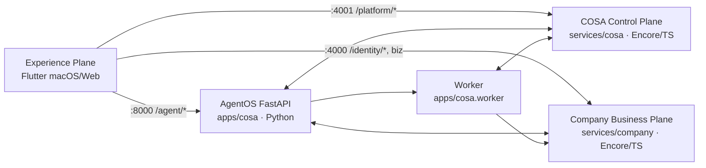

# COSA — Founder / Company Operating System

> **Create. Operate. Scale. Automate.**  
> Hệ điều hành vận hành doanh nghiệp tích hợp AI Multi-Agent.

README này cung cấp hướng dẫn đầy đủ về kiến trúc hệ thống, phân bổ cổng (port mapping), quy trình khởi động stack phát triển, và cơ chế đăng ký / đăng nhập (hỗ trợ cả Email và Số điện thoại).

---

## 1. Bản Đồ Kiến Trúc & Phân Bổ Cổng (Port Mapping)

Hệ thống COSA phân tách rõ ràng giữa **Nền tảng Quản trị Trung tâm (Control Plane)**, **Nghiệp vụ Công ty (Business Plane)**, **Tầng AI Thực thi (Agent Platform)** và **Giao diện Người dùng (Frontend)**:



### Chi tiết các Cổng & Dịch vụ

| Cổng | Dịch vụ | Thư mục mã nguồn | Vai trò cốt lõi |
| :--- | :--- | :--- | :--- |
| **`4001`** | **COSA Control Plane** | `services/cosa` (Encore.ts) | Quản lý danh tính trung tâm (`/platform/auth/*`), công ty, subscription, cấp phát tenant. **Bắt buộc phải chạy để Đăng nhập & Đăng ký**. |
| **`4000`** | **Company Business Plane** | `services/company` (Encore.ts) | Nghiệp vụ công ty: Chiến lược, Vận hành, Bán hàng, Tài chính - Pháp lý, và đồng bộ danh tính (`/identity/sync-from-platform`). |
| **`8000`** | **AgentOS API** | `apps/cosa` (FastAPI) | Multi-Agent platform, streaming chat, workforce routes, orchestration. |
| **`8765`** | **Desktop Worker** | `desktop_worker` (Python) | Loopback execution worker cho tác vụ desktop/cục bộ. |
| **`5432`** | **PostgreSQL (Docker)** | `cosa_postgres` (pgvector 16) | Chứa 3 cơ sở dữ liệu: `cosa` (platform), `workspace` (business), `agent` (state & run). |
| **`9000/9001`** | **MinIO S3 (Docker)** | `cosa_minio` | Lưu trữ file, document ingestion, knowledge artifacts. |
| **`7880/7881`** | **LiveKit (Docker)** | `cosa_livekit_local` | Kênh giao tiếp Voice & Audio thời gian thực. |

---

## 2. Hướng Dẫn Khởi Động Môi Trường Phát Triển

### Yêu Cầu Tiên Quyết
- **Docker & Docker Compose** (đang chạy)
- **Node.js v20+** & **Encore CLI** (`brew install encoredev/tap/encore`)
- **Python 3.11+** và môi trường ảo (`.venv`)
- **Flutter SDK** (nếu chạy ứng dụng giao diện)

---

### Bước 1: Thiết lập Biến Môi Trường
```bash
cd /Volumes/SSD/DEV/miva/javis-saas

# Copy file cấu hình mẫu nếu chưa có .env
cp .env.example .env

# Nạp biến môi trường cho phiên làm việc hiện tại (nếu terminal không dùng direnv)
source scripts/load-dev-env.sh
```

---

### Bước 2: Kiểm tra & Giải Phóng Xung Đột Cổng

> [!WARNING]  
> Nếu bạn đang chạy các dịch vụ khác (ví dụ: `miva-core-services` chạy Encore mặc định trên cổng `4000`), bạn **phải tắt hoặc giải phóng cổng** trước khi bật COSA stack, nếu không dịch vụ `services/company` sẽ không thể khởi động.

Kiểm tra các cổng đang bị chiếm:
```bash
lsof -i :4000 -i :4001 -i :8000
```
Nếu cổng 4000 hoặc 4001 đang bị tiến trình khác chiếm dụng, hãy tắt tiến trình đó hoặc kill PID tương ứng:
```bash
kill -9 <PID>
```

---

### Bước 3: Khởi Động Backend Stack

#### Lựa chọn A — Khởi động toàn bộ từ đầu (Infra Docker + Migrations + 4 Services):
```bash
make dev-stack
```
*Lệnh này sẽ khởi động Docker Postgres/MinIO/LiveKit, tự động chạy migration theo thứ tự `Agent -> COSA -> Company`, sau đó khởi động đồng thời cả 4 dịch vụ (`Company:4000`, `Control Plane:4001`, `FastAPI:8000`, `Worker`). Nhấn `Ctrl+C` để dừng toàn bộ.*

#### Lựa chọn B — Chỉ khởi động Backend Services (khi Docker đã chạy sẵn):
```bash
make dev-stack-no-infra
```

---

### Bước 4: Kiểm Tra Trạng Thái & Độ Sẵn Sàng (Health Check)

Kiểm tra tiến trình và các cổng:
```bash
make dev-status
```
Kiểm tra cấu hình và các endpoint sức khỏe:
```bash
make dev-preflight
```

Các endpoint kiểm tra trực tiếp qua trình duyệt hoặc curl:
- **COSA Control Plane:** `http://127.0.0.1:4001/healthz`
- **Company Business:** `http://127.0.0.1:4000/healthz`
- **AgentOS Readiness:** `http://127.0.0.1:8000/healthz`

---

### Bước 5: Khởi Động Ứng Dụng Frontend (Flutter)

Chuyển vào thư mục `frontend`:
```bash
cd frontend
```

#### Chạy trên macOS Desktop:
```bash
flutter run -d macos
```

#### Chạy trên Trình duyệt Web (Chrome):
```bash
flutter run -d chrome
```

#### Khởi động với Base URL tuỳ chỉnh:
Nếu backend của bạn chạy trên cổng khác hoặc địa chỉ IP mạng LAN/VPS:
```bash
flutter run -d macos \
  --dart-define=PLATFORM_BASE_URL=http://127.0.0.1:4001 \
  --dart-define=API_BASE_URL=http://127.0.0.1:4000 \
  --dart-define=AGENTOS_BASE_URL=http://127.0.0.1:8000
```

---

## 3. Cơ Chế Xác Thực: Đăng Nhập & Đăng Ký (Email / Phone)

### Hỗ Trợ Đăng Nhập Đa Kênh
COSA hỗ trợ người dùng đăng nhập bằng cả **Email** hoặc **Số điện thoại** cùng **Mật khẩu**:

> **Danh tính do `backend/core` quản lý.** COSA không còn giữ mật khẩu hay tự đăng nhập: app đăng nhập/đăng ký
> trực tiếp với core rồi dùng access token OIDC của client `vn.mivacorp.cosa` (Authorization Code + PKCE).
> Cấu hình app: `--dart-define=CORE_BASE_URL=http://127.0.0.1:4010`. Cấu hình `services/cosa`:
> `CORE_BASE_URL`, `CORE_INTROSPECT_CLIENT_ID`, `CORE_INTROSPECT_CLIENT_SECRET` (xem `.env.example`; cấp secret bằng
> `node --env-file=.env scripts/provision-cosa-backend-client.mjs` trong `backend/core`).

1. **Bước 1 — Xác thực với backend/core:**  
   Frontend gửi `POST {CORE_BASE_URL}/auth/login` (header `X-Client-ID: vn.mivacorp.cosa`) với body:
   ```json
   {
     "emailOrPhone": "mivacorp@icloud.com",  // hoặc số điện thoại: "0901234567"
     "password": "your_secure_password",
     "clientId": "vn.mivacorp.cosa"
   }
   ```
   Core trả phiên đăng nhập; app đổi phiên đó lấy access token OIDC bằng `GET /oauth/authorize` (PKCE `S256`) rồi
   `POST /oauth/token` (xem `frontend/lib/modules/auth/services/core_auth_client.dart`). Access token là chuỗi opaque, hết hạn
   ngắn và được tự làm mới bằng refresh token (`PlatformTokenProvider`). Mọi API `/platform/*` của COSA dùng token này làm Bearer;
   COSA xác thực bằng `POST /oauth/introspect` của core.

2. **Bước 2 — Đồng bộ Dữ liệu Cục bộ (Local Business Sync):**  
   Frontend tự động lấy access token gửi tới `POST http://127.0.0.1:4000/identity/sync-from-platform`:
   ```json
   {
     "platform_access_token": "<access_token_ở_bước_1>"
   }
   ```
   Company service hỏi Control Plane (COSA) danh tính và các organization mà người dùng là thành viên (COSA xác thực với core),
   đồng bộ profile và workspace xuống cơ sở dữ liệu `workspace`, rồi cấp phát `local_session_token`.

3. **Bước 3 — Phiên Làm Việc (Workspace Context):**  
   Frontend sử dụng `local_session_token` kèm header `X-Workspace-Id` để truy cập toàn bộ module nghiệp vụ (Chiến lược, Vận hành, Bán hàng, Tài chính, Chat Agent).

---

### Quy Trình Đăng Ký Tài Khoản Mới
1. **Tạo thông tin cá nhân (backend/core, có xác nhận email):** `POST {CORE_BASE_URL}/auth/signup` (Email, Họ tên) gửi mã OTP,
   sau đó `POST {CORE_BASE_URL}/auth/signup/complete` (Email, Mật khẩu, OTP) tạo tài khoản; app đổi phiên lấy access token như phần đăng nhập.
2. **Khởi tạo Công ty / Workspace:** Tạo organization mới ở core qua COSA (`POST /platform/auth/companies/create`, người tạo là `founder`) hoặc chấp nhận mã mời tham gia (`POST /platform/auth/companies/invitations/accept`).
3. **Đồng bộ về Local:** Tự động gọi `POST /identity/sync-from-platform` để sẵn sàng làm việc.

---

## 4. Quản Trị & Kiểm Tra Dữ Liệu Trực Tiếp Trong Database

Khi cần kiểm tra danh sách tài khoản đã đăng ký hoặc gán số điện thoại:
```bash
# Xem danh sách người dùng trong Control Plane:
docker exec -it cosa_postgres psql -U postgres -d cosa -c \
  "SELECT id, email, phone, created_at FROM cosa.users;"

# Cập nhật số điện thoại cho tài khoản thử nghiệm:
docker exec -it cosa_postgres psql -U postgres -d cosa -c \
  "UPDATE cosa.users SET phone = '0901234567' WHERE email = 'mivacorp@icloud.com';"
```

---

## 5. Danh Mục Lệnh Makefile Hữu Ích

| Lệnh | Ý nghĩa |
| :--- | :--- |
| `make dev-stack` | Khởi động toàn bộ hạ tầng Docker + migrations + 4 dịch vụ backend |
| `make dev-stack-no-infra` | Khởi động 4 dịch vụ backend (không chạy lại Docker) |
| `make dev-status` | Kiểm tra trạng thái các port và Docker containers |
| `make dev-preflight` | Kiểm tra tính hợp lệ của môi trường trước khi chạy |
| `make docker-up` | Khởi động riêng các container Docker (Postgres, MinIO, LiveKit) |
| `make docker-down` | Dừng các container Docker |
| `make services-migrate-cosa` | Chạy migration cho database COSA Control Plane |
| `make services-migrate-company` | Chạy migration cho database Company Business |
| `make verify` | Chạy toàn bộ bộ kiểm thử và kiểm tra chất lượng (CI test suite) |
