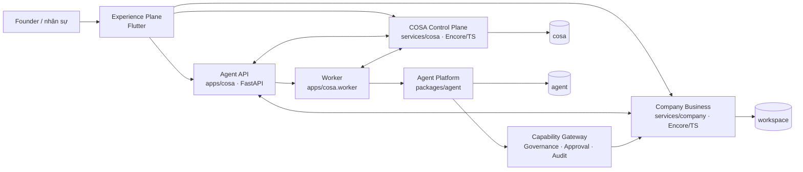

# COSA — Founder / Company Operating System

> **Create. Operate. Scale. Automate.**

COSA là hệ điều hành vận hành công ty có AI hỗ trợ. Hệ thống biến chiến lược,
công việc, khách hàng, tài chính và tuân thủ thành dữ liệu cùng quy trình có
cấu trúc; các agent là lực lượng thực thi có kiểm soát, không phải những bot
độc lập tự quyết định nghiệp vụ.

README này mô tả **hành vi đang có trong mã nguồn**. Nó ưu tiên các ranh giới
thực thi, dữ liệu và quyền hạn để cả founder lẫn kỹ sư biết rõ COSA làm gì,
luồng nào đang chạy và giới hạn hiện tại nằm ở đâu.

## COSA giải quyết việc gì?

| Lĩnh vực | Chức năng chính | Nơi giữ sự thật nghiệp vụ |
| --- | --- | --- |
| Chiến lược | Hồ sơ venture, stage, evidence, phân tích PESTEL/SWOT/TOWS, mục tiêu, OKR, initiative, task, review và next-best action | `services/company/operations/strategy/` |
| Vận hành | Project, execution plan, task, dependency, lịch chu kỳ và theo dõi kết quả thực thi | `services/company/operations/` |
| Thương mại | CRM (lead, account, contact, opportunity, customer), marketing, chiến dịch và customer engagement | `services/company/commercial/` |
| Tài chính và pháp lý | Pháp nhân, kỳ kế toán, chứng từ, sổ sách/báo cáo TT58, CAS, thanh toán, nghĩa vụ pháp lý và AI compliance | `services/company/finance-legal/` |
| Lực lượng lao động | Một mô hình `WorkforceMember` chung cho người và AI; gán vai trò, agent, lịch, approval và dashboard | `services/company/identity/`, `apps/cosa/api/workforce_routes.py` |
| Agent Platform | Hội thoại, run bất đồng bộ, capability, skillpack, workflow, audit, event stream, knowledge ingestion và connector | `packages/agent/`, `apps/cosa/` |

`workspace` là đơn vị tenant chính. Mọi request nghiệp vụ và agent run đều
được ràng buộc vào workspace đã xác minh; client không thể tự chọn workspace
chỉ bằng header.

## Bản đồ kiến trúc

Tên “COSA” xuất hiện ở ba ngữ cảnh khác nhau:

| Tên | Vai trò |
| --- | --- |
| `services/cosa` | **Control Plane** TypeScript/Encore: identity nền tảng, plan/license, policy, connector, scheduler, run lease và runtime node. |
| `apps/cosa` | **Composition layer** Python: FastAPI, worker và nơi ghép Agent Platform với các service nghiệp vụ. |
| COSA | Toàn bộ sản phẩm — Experience, Control Plane, Business Plane và Agent Platform. |



### Bốn vùng và nguyên tắc phân lớp

1. **Experience Plane — `frontend/`**: ứng dụng Flutter cho chat, dashboard,
   strategy, workforce, task, finance, approval, settings và các module nghiệp
   vụ khác. Các capability giao diện được ràng buộc qua
   [`shared/contracts/mvp-surface.json`](shared/contracts/mvp-surface.json),
   thay vì để giao diện gọi route tự do.
2. **COSA Control Plane — `services/cosa/`**: xác thực nền tảng, workspace
   membership, entitlement/agent policy, connector grant, scheduler bền vững,
   execution lease, schedule, mission/task/worker và document-ingestion record.
3. **Company Business Plane — `services/company/`**: sáu service Encore
   (`identity`, `operations`, `commercial`, `finance-legal`, `events`,
   `academy`). Đây là nguồn sự thật cho dữ liệu doanh nghiệp và quyết định
   nghiệp vụ.
4. **Agent Platform — `packages/agent/` + `apps/cosa/`**: framework Python
   dùng lại được và lớp composition COSA. Agent Platform không ghi trực tiếp
   vào database business; mọi side effect đi qua Capability Gateway, policy,
   governance và audit.

PostgreSQL/pgvector được tách theo quyền sở hữu dữ liệu thành ba database:

| Database | Dữ liệu thuộc về |
| --- | --- |
| `agent` | Run, checkpoint, conversation, artifact, memory, knowledge, registry, governance và audit của Agent Platform. |
| `cosa` | Danh tính/plan nền tảng, policy, connector, scheduler, lease, runtime node và schedule. |
| `workspace` | Identity, chiến lược, vận hành, thương mại, tài chính-pháp lý và event outbox của công ty. |

## Các luồng hoạt động chính

### 1. Thiết lập workspace và quyền truy cập

1. Người dùng đăng nhập tại Control Plane hoặc dùng local business session.
2. `services/company/identity` tạo/đồng bộ workspace, membership và
   `WorkforceMember`.
3. Mỗi request Agent API gửi `Authorization` và `X-Workspace-Id`.
4. `apps/cosa` xác minh token rồi gọi `identity/tenant-context/resolve` để
   đối chiếu workspace với membership thật. Không xác minh được thì từ chối
   (fail closed), không coi header của client là authority.
5. Token delegation ngắn hạn được mint theo đúng hướng gọi cross-plane;
   delegation sang Company còn bị giới hạn bởi `workspace_id`, `run_id` và
   danh sách capability.

### 2. Chiến lược đến thực thi

Chiến lược không nằm trong slide tĩnh. Hệ thống duy trì lineage giữa phân tích,
quyết định và việc thực hiện:

```text
Venture / Project
  → stage và assumption
  → experiment, interview, signal và evidence
  → gate evaluation + decision record
  → BSC (khung lọc cấu hình theo workspace)
  → PESTEL / resource assessment / SWOT
  → TOWS option được ưu tiên
  → strategic objective / OKR
  → initiative được duyệt
  → task, dependency và execution record
  → weekly/cycle review, PMF scoreboard, next-best action
```

- BSC là bộ lọc khi ghi chiến lược theo cấu hình workspace, không phải một
  “lens” song song tách rời chuỗi thực thi.
- TOWS → OKR → Initiative → Task là lineage được lưu lại. Task không phải
  BAU chỉ có thể được tạo dưới initiative đã được duyệt.
- Stage và gate được đánh giá bằng policy/evidence có cấu trúc; chuyển stage
  dùng versioning và kiểm tra decision/evidence để tránh dùng quyết định cũ.
- Xem chi tiết miền này tại
  [`services/company/operations/strategy/README.md`](services/company/operations/strategy/README.md).

### 3. Chat với agent: từ message đến kết quả

Chat không chạy kernel trong process HTTP. API trả nhanh sau khi lưu message
và lập lịch task bền vững; worker riêng chịu trách nhiệm thực thi.

```mermaid
sequenceDiagram
    participant UI as Flutter / client
    participant API as apps/cosa FastAPI
    participant CP as services/cosa scheduler
    participant Worker as COSA worker
    participant Agent as Kernel + Capability Gateway
    participant Biz as services/company

    UI->>API: POST conversation message + token + workspace
    API->>Biz: xác minh tenant context
    API->>API: lưu message và tạo run_id
    API->>CP: schedule task chứa delegation ngắn hạn
    API-->>UI: 202 Accepted + run_id
    Worker->>CP: poll và atomic claim task
    Worker->>CP: acquire run lease; heartbeat claim/lease
    Worker->>Agent: resolve AgentSpec, policy và compliance
    Agent->>Biz: capability scoped (đọc/ghi theo quyền)
    Agent-->>Worker: output, artifact hoặc approval checkpoint
    Worker->>API: lưu event/run outcome
    API-->>UI: SSE stream và session timeline
```

Trình tự kiểm soát trong worker:

1. Resolve `AgentSpec` đúng version/hash từ registry; không tin object Python
   đang import khi rolling deploy.
2. Lấy snapshot policy workspace và resolve AI compliance. Thiếu policy,
   compliance hoặc delegation hợp lệ sẽ từ chối run.
3. Kernel chạy với capability đã đăng ký. Capability Gateway kiểm tra quyền,
   idempotency, connector grant và governance trước khi gọi service nghiệp vụ.
4. Action rủi ro cao tạo checkpoint approval. Approval bị ràng buộc đúng bộ
   `run_id + tool_call_id + checkpoint_ref`, nên không thể dùng lại nhầm cho
   action khác.
5. Worker gửi heartbeat cho cả task claim và run lease, rồi complete/fail task
   bằng fencing token. Event, output và artifact được lưu để UI đọc qua SSE.

### 4. Agent hiện được triển khai

| Agent | Mức tự chủ | Phạm vi thực tế |
| --- | --- | --- |
| Operations Specialist | `L0_OBSERVE` | Đọc task/project/PMF/evidence, gợi ý next action và tạo task draft. `founder_assistant` hiện ánh xạ vào agent này. |
| Finance Specialist | `L1_PROPOSE` | Đọc giao dịch/kết nối, ghi nhận hoặc phân loại theo capability; các khoản chi/xác nhận nhạy cảm vẫn đi qua policy và approval. |
| Marketing Specialist | `L0_OBSERVE` | Marketing context, campaign/asset/experiment, knowledge profile và web search có budget. |
| Customer Support Copilot | `L0_OBSERVE` | Đọc thread/customer 360/knowledge đã duyệt và tạo bản nháp hoặc artifact; không tự gửi tin hay ghi CRM. |
| Customer Support Autopilot | `L2_EXECUTE` | Chỉ trả lời FAQ/qualification trong phạm vi hẹp; thiếu độ tin cậy thì handoff người. Gửi tin yêu cầu approval trừ template đã pre-authorize. |

AgentSpec hiện được author trong mã Python, seed vào registry khi khởi động và
resolve từ registry lúc chạy. Đây là mô hình hybrid có chủ đích: thay đổi spec
vẫn cần sửa mã và deploy, không phải tính năng quản trị runtime tự do.

### 5. Event, lịch và knowledge

- **Event backbone**: Company service ghi event outbox cùng transaction nghiệp
  vụ. Relay claim event, ký HMAC và chuyển sang `/agent/internal/events`; Agent
  Platform xác thực, chống trùng và chỉ schedule automation khi rule/policy cho
  phép.
- **Schedule**: Control Plane giữ schedule và task; worker poll/claim để chạy
  one-off run, resume, scheduled session, Weekly Goal Agent (WGA), kickoff
  suggestion hoặc knowledge ingestion.
- **Knowledge ingestion**: khi `KNOWLEDGE_INGESTION_ENABLED=true`, người dùng
  tạo upload ticket, hoàn tất upload để scanner/worker xử lý, rồi reviewer
  publish hoặc reject nguồn tri thức. Chỉ nguồn đã duyệt mới được công bố.
- **Connector**: cài đặt, authorize, grant và revoke connector ở Control
  Plane; Capability Gateway yêu cầu grant còn hiệu lực trước khi dùng.

## Các ranh giới an toàn quan trọng

- Không có quyền tenant mặc định: workspace scope được xác minh server-side,
  và lỗi mạng/xác minh được xử lý fail closed.
- Business authorization và database business thuộc các Encore service;
  Agent Platform chỉ gọi qua HTTP capability có scope.
- Secret cross-plane là một chiều và một mục đích. Không dùng lại secret JWT,
  delegation hoặc worker service token cho hướng khác.
- Governance là code xác định, không suy luận từ câu trả lời của LLM. Run,
  tool call, approval, checkpoint và audit record là state có cấu trúc.
- API FastAPI kiểm tra readiness khi thiếu dependency cốt lõi; môi trường
  staging/production yêu cầu CORS và service identity rõ ràng.

## Trạng thái và giới hạn cần biết

| Hạng mục | Trạng thái hiện tại |
| --- | --- |
| Vault document API (`/agent/vault/*`) | Chưa phát hành. Các endpoint trả `501 Not Implemented`, không giả lập upload/index/retrieval. |
| Knowledge ingestion | Có pipeline và review, nhưng phải bật feature flag và cấu hình object storage/control-plane hợp lệ. |
| AgentSpec | Hybrid: code là nơi author, registry là nguồn resolve khi chạy. |
| Voice | Push-to-talk và LiveKit/Gemini Live là luồng riêng khỏi Agent worker; xem cấu hình runtime trước khi triển khai. |
| Mô hình AI | OpenAI Agents SDK là execution kernel; model mặc định được ghép qua LiteLLM với DeepSeek theo cấu hình môi trường. |

## Chạy môi trường phát triển

Yêu cầu chính: Docker, Python 3.11+, Node/Encore CLI và Flutter nếu chạy giao
diện. Không đưa secret thật vào repository.

```bash
cp .env.example .env
source scripts/load-dev-env.sh
make dev-stack
```

`make dev-stack` khởi động PostgreSQL, MinIO và LiveKit trong Docker; chạy
migration theo thứ tự **Agent → COSA Control Plane → Company**; rồi khởi động
Company (`:4000`), Control Plane (`:4001`), FastAPI (`:8000`) và worker.

```bash
make dev-status       # kiểm tra service/port
make dev-preflight    # kiểm tra cấu hình, migration và dependency
```

Các health endpoint ở local:

```text
http://127.0.0.1:4000/healthz  # Company Business
http://127.0.0.1:4001/healthz  # COSA Control Plane
http://127.0.0.1:8000/healthz  # COSA Agent Platform readiness
```

Với terminal không dùng `direnv`, cần chạy `source scripts/load-dev-env.sh`
trước mỗi lệnh `make` cần biến môi trường. Encore không tự nạp `.env`.

## Kiểm thử và kiểm tra chất lượng

| Mục tiêu | Lệnh |
| --- | --- |
| Agent framework | `make agent-test` |
| FastAPI/composition | `make apps-cosa-test` |
| Hai Encore app | `make services-test` |
| Flutter | `make frontend-test` và `make frontend-analyze` |
| Contract/boundary | `make boundary-check`, `make skillpacks-validate`, `make frontend-api-contract-check` |
| Golden path | `make e2e-test` |
| Cross-plane thật với Postgres disposable | `make e2e-cross-plane-smoke` |
| Gate CI đầy đủ | `make verify` |

Không dùng test mock hoặc static check để kết luận authorization, recovery,
concurrency hay durability đã được chứng minh. Các luồng này cần test qua
service/process và Postgres thật.

## Cấu trúc repository

```text
frontend/                 Flutter Experience Plane
services/cosa/            COSA Control Plane (Encore/TypeScript)
services/company/         Company Business Plane (Encore/TypeScript)
packages/agent/           Agent framework tái sử dụng (Python)
apps/cosa/                FastAPI, worker và composition COSA
skillpacks/               Prompt/skill khai báo theo domain
shared/contracts/         Hợp đồng frontend–backend–test
deploy/                   Cấu hình hạ tầng và production
docs/architecture/        ADR, overview và tài liệu kiến trúc
```

## Tài liệu liên quan

- [Tổng quan kiến trúc](docs/architecture/overview/00-tong-quan.md)
- [Bốn vùng kiến trúc](docs/architecture/overview/01-bon-vung-kien-truc.md)
- [Workflow nghiệp vụ](docs/architecture/overview/02-workflow-nghiep-vu.md)
- [Agent Platform và governance](docs/architecture/overview/03-agent-va-governance.md)
- [Hướng dẫn database](db.md)
- [Triển khai](DEPLOYMENT.md)
- [Cross-plane E2E](docs/testing/cross-plane-e2e.md)
