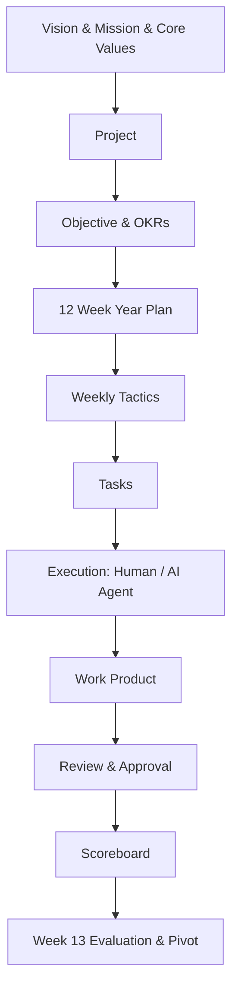
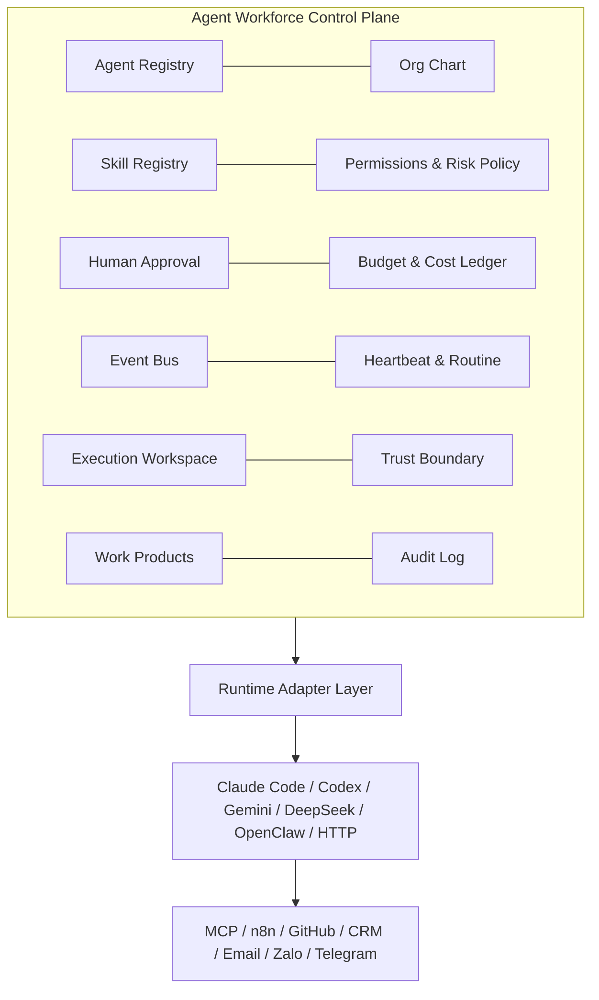

# Kế hoạch Triển khai Chi tiết: D2-COSA — Agent Workforce Control Plane Integration

## 1. Tổng quan và Phân tích Kiến trúc (Executive Architecture Analysis)

Tài liệu [D2-COSA — Agent Workforce Control Plane Integration.md](file:///Volumes/SSD/javis-saas/markdown/D2-COSA%20%E2%80%94%20Agent%20Workforce%20Control%20Plane%20Integration.md) xác lập định vị kiến trúc tối cao của COSA:

> **ĐÍCH KIẾN TRÚC:**
> **COSA = Founder Operating System + AI Workforce Control Plane**
> 
> *Founder là cơ quan thẩm quyền tối cao (Supreme Authority); các AI Agent là lực lượng phân tích và thực thi có vai trò, kỹ năng, phân quyền, ngân sách, môi trường thực thi (runtime) và trách nhiệm giải trình minh bạch.*

### 1.1. Chu trình Vận hành Doanh nghiệp (Company Operating Cycle)

- **Lưu ý loại bỏ:** *Startup Validation* hoàn toàn không nằm trong flow vận hành chuẩn của COSA.
- **Vai trò của Chat / Voice:** Chỉ là **Command Interface** (giao diện tiếp nhận chỉ thị), không tự ý kích hoạt Project workflow nếu chưa qua xác nhận/lập kế hoạch.

---

## 2. Phân tích 14 Khối Thành phần Kiến trúc (The 14 Control Plane Blocks)

| Khối Thành Phần | Mô Tả Chức Năng Chi Tiết | Ánh Xạ Kỹ Thuật (Backend / DB) |
| :--- | :--- | :--- |
| **1. Agent Registry** | Định danh, metadata, role, level, model config mặc định, state (active/inactive/busy). | Table `cosa_agents`, Model `AgentEntity` |
| **2. Org Chart** | Cơ cấu báo cáo (hierarchy), department, quan hệ giữa Founder, Nhân sự (Human) và AI Agent. | Table `cosa_agent_hierarchy`, quan hệ Parent/Child/Manager |
| **3. Runtime Adapter** | Lớp trừu tượng (Adapter Pattern) gọi các LLM/Agent Engine khác nhau (Claude Code, Gemini, DeepSeek, Codex...). | Module `backend/app/agent_platform/adapters/` |
| **4. Skill Registry** | Quản lý catalog skill, loader, tách biệt logic code tool, prompt, MCP config, hỗ trợ versioning & diff. | Table `cosa_skills`, `cosa_agent_skills` |
| **5. Permissions** | Permission Engine hợp nhất cho cả Người và Agent (RBAC/ABAC), Least Privilege, Tool-level ACL. | Table `cosa_permissions`, `cosa_role_permissions` |
| **6. Human Approval** | Phân tầng rủi ro (LOW: tự chạy, HIGH: cần lead duyệt, CRITICAL: chỉ Founder duyệt). | Table `cosa_approvals`, state: `PENDING, APPROVED, REJECTED` |
| **7. Budget** | Hạn mức chi tiêu (Daily / Monthly / 12-Week) cho từng Agent, Project hoặc Department. | Table `cosa_budgets`, hard-limit & soft-limit alerts |
| **8. Cost Ledger** | Sổ cái ghi nhận chính xác chi phí token, tiền USD/VND, latency của từng Agent Run. | Table `cosa_cost_ledger`, immutable entries |
| **9. Event Bus** | Trục trao đổi sự kiện bất đồng bộ nội bộ (ưu tiên Event-driven > Schedule > Polling). | Redis Pub/Sub, Postgres LISTEN/NOTIFY, hoặc Async In-memory Bus |
| **10. Heartbeat** | Giám sát trạng thái hoạt động (Liveness / Health-check / Stalled Task Detection). | Celery/Redis Heartbeat worker + cron health check |
| **11. Routine** | Quản lý tác vụ định kỳ gắn liền chu kỳ 12-Week Year (Weekly Tactics, Daily Standup, Report). | Table `cosa_routines`, Celery Beat / Cron Dispatcher |
| **12. Execution Workspace**| Môi trường sandbox an toàn cho Coding Agent (Docker container, isolated folder, temp workspace). | Module `backend/app/agent_platform/workspace/` |
| **13. Trust Boundary** | Lọc và phòng thủ dữ liệu đầu vào không tin cậy (Email, Webhook, Chat untrusted injection sanitization). | Gateway Sanitizer & Prompt Security Guard |
| **14. Work Products & Audit Log** | Lưu trữ thành phẩm có versioning, kèm nhật ký kiểm toán không thể can thiệp (Immutable Audit Trail). | Table `cosa_work_products`, Table `cosa_audit_logs` |

---

## 3. Chuyển Hóa 14 Nguyên Tắc Cốt Lõi Thành Ràng Buộc Kỹ Thuật

1. **Model Agnostic**: Tách biệt hoàn toàn code xử lý nghiệp vụ với Provider SDK qua `BaseRuntimeAdapter`.
2. **Event-driven First**: Thiết kế ưu tiên Event-driven > Scheduled > Polling (Polling chỉ là fallback cuối cùng).
3. **Tách Biệt 4 Lớp (Separation of Concerns)**:
   - **Prompt**: System prompt template có tham số hóa.
   - **Skill**: Code tool / MCP function có schema rõ ràng.
   - **Policy**: Ràng buộc rủi ro, quyền hạn, budget.
   - **Spec**: Định nghĩa input/output của task.
4. **Quyền Quản Trị Cấu Hình**: Chỉ Role `FOUNDER` hoặc `ADMIN` được phép cập nhật Prompt/Spec/Policy lõi.
5. **Versioning & Reset to Default**: Mọi thay đổi Prompt/Skill phải ghi lại `version`, hỗ trợ xem `diff` và có nút bấm `Reset to Default Template`.
6. **Hợp Nhất Permission Engine**: Cả Human User và AI Agent đều là `Principal` đi qua một middleware kiểm tra quyền duy nhất (`can(principal_id, action, resource)`).
7. **Phân Cấp Rủi Ro (Risk Matrix)**:
   - **LOW**: Đọc dữ liệu, tóm tắt, draft tài liệu $\rightarrow$ Tự động thực thi.
   - **HIGH**: Gửi email khách hàng, cập nhật CRM, sửa code $\rightarrow$ Human-in-the-loop duyệt.
   - **CRITICAL**: Chi tiền, xóa database, public deploy, cấp quyền $\rightarrow$ Chỉ đích danh Founder duyệt.
8. **Bắt Buộc Ghi Cost Ledger**: Không có bất kỳ Agent Run nào chạy "miễn phí" ngầm; mọi token đều quy đổi thành chi phí và trừ vào quota ngân sách.
9. **Isolated Workspace**: Coding Agent chạy trong thư mục tách biệt, không được quyền ghi đè trực tiếp lên repository production nếu chưa được test & merge.
10. **Zero-Trust Input**: Dữ liệu từ webhook ngoài, email hay chat người dùng lạ phải được khử trùng (sanitized) trước khi nhét vào prompt context.
11. **Cấm Tự Sinh Agent (No Self-Spawning)**: Agent chỉ được tạo sub-task cho agent có sẵn trong Registry; không được tự ý gọi API tạo bot mới.
12. **Giới Hạn Scope (Recommendations Only)**: Khi gặp vấn đề ngoài quyền hạn, Agent chỉ được sinh `Recommendation` kèm phân tích, không tự ý mở rộng phạm vi thực thi.
13. **Chat/Voice Command Interface**: Lệnh từ Chat/Voice chỉ tạo ra bản nháp chỉ thị (Action Draft / Proposed Task), cần Founder bấm xác nhận mới đưa vào Project execution pipeline.
14. **Tenant Isolation & Zero Secret Export**: API key, company data tách biệt hoàn toàn theo Tenant; tính năng Export Company Package bắt buộc loại bỏ mọi secret/API token.

---

## 4. Lộ Trình Triển Khai 6 Giai Đoạn (Implementation Roadmap Phase A - F)

### **Phase A — Core Control Plane**
- [ ] **A.1 Database Schema**: Thiết kế và tạo bảng `cosa_agents`, `cosa_agent_runs`, `cosa_audit_logs`.
- [ ] **A.2 Agent Registry Module**: CRUD agent, metadata, model configurations, status lifecycle.
- [ ] **A.3 Runtime Adapter Interface**: Xây dựng `BaseRuntimeAdapter` và triển khai các adapter:
  - `ClaudeCodeAdapter`
  - `GeminiAdapter`
  - `DeepSeekAdapter`
  - `GenericHttpAdapter`
- [ ] **A.4 Task Assignment & Dispatcher**: Gán task từ Weekly Tactics cho Human hoặc Agent, quản lý lifecycle tác vụ (`ASSIGNED -> RUNNING -> COMPLETED / FAILED`).
- [ ] **A.5 Core Audit Trail**: Ghi nhận toàn bộ tương tác, prompt, tool calls vào bảng audit bất biến.

### **Phase B — Governance & Financial Accountability**
- [ ] **B.1 Unified Permission Engine**: Thiết kế RBAC/ABAC engine chung cho User và Agent.
- [ ] **B.2 Risk Policy Evaluator**: Đánh giá mức độ rủi ro của từng hành động (LOW, HIGH, CRITICAL).
- [ ] **B.3 Human Approval Inbox Backend**: Cơ chế giữ task (PAUSED) chờ phê duyệt, webhook/notif thông báo đến Founder/Lead.
- [ ] **B.4 Budgeting Engine**: Định cấu hình ngân sách theo chu kỳ 12-Week, theo dõi ngưỡng cảnh báo (80%, 100%).
- [ ] **B.5 Cost Ledger**: Thu thập token usage từ Runtime Adapters, tính toán chi phí thực tế và lưu trữ vào sổ cái chi phí.

### **Phase C — Skills & Extensibility Framework**
- [ ] **C.1 Skill Registry & Catalog**: Quản lý các tool/skill (MCP tools, internal functions, REST APIs).
- [ ] **C.2 Dynamic Skill Loader**: Cấp phát danh sách tools động cho Agent theo từng Run dựa trên Permission.
- [ ] **C.3 Skill Versioning & Diffing**: Lưu trữ lịch sử sửa đổi của Prompt & Skill Spec.
- [ ] **C.4 Reset to Default Mechanism**: Khôi phục Prompt/Skill về bộ mẫu chuẩn của hệ thống.

### **Phase D — Automation & Orchestration**
- [ ] **D.1 Internal Event Bus**: Tích hợp Event Dispatcher cho toàn bộ vòng đời tác vụ và sự kiện doanh nghiệp.
- [ ] **D.2 Heartbeat & Liveness Worker**: Giám sát các agent đang chạy, phát hiện timeout, stalled task, deadlocks.
- [ ] **D.3 Routine Scheduler**: Tự động kích hoạt các Routine tuần hoàn (ví dụ: tạo Weekly Scoreboard vào sáng thứ 2, tổng kết cuối tuần).

### **Phase E — Secure Execution & Sandboxing**
- [ ] **E.1 Workspace Isolation**: Tạo sandbox workspace riêng cho Coding Agents (thư mục cách ly / containerized runtime).
- [ ] **E.2 Low-Trust Boundary Guard**: Bộ lọc prompt injection và sanitize input từ bên thứ ba (Webhooks, Zalo, Telegram, Email).
- [ ] **E.3 Secret Vault Integration**: Bảo vệ API key doanh nghiệp, cơ chế xuất Package không chứa Secret.
- [ ] **E.4 Loop Protection & Circuit Breaker**: Tự động ngắt khi phát hiện Agent bị lặp vô tận hoặc vượt quá max steps/cost.

### **Phase F — UX & Hologram Workforce Interface (Flutter / Web)**
- [ ] **F.1 Hologram Workforce View / Org Chart**: Giao diện trực quan hóa toàn bộ đội ngũ AI Agent và nhân sự.
- [ ] **F.2 Agent Cards & Profile**: Xem thông tin, role, kỹ năng, ngân sách còn lại, trạng thái hoạt động của từng Agent.
- [ ] **F.3 Approval Inbox UI**: Màn hình duyệt lệnh nhanh (Phê duyệt / Từ chối / Yêu cầu chỉnh sửa) dành cho Founder/Lead.
- [ ] **F.4 Cost & Budget Dashboard**: Biểu đồ tiêu thụ token, chi phí theo ngày/tuần/dự án.
- [ ] **F.5 Run History & Work Product Viewer**: Xem lại chi tiết từng lượt chạy, công việc hoàn thành và sản phẩm bàn giao.

---

## 5. Kế hoạch Kiểm Thử và Xác Nhận (Verification Plan)

### 5.1. Unit & Integration Tests (Backend)
- `pytest tests/test_agent_registry.py`: Kiểm tra đăng ký, cập nhật và trạng thái Agent.
- `pytest tests/test_runtime_adapters.py`: Mock API và kiểm thử chuyển đổi giữa các provider (Claude, Gemini, DeepSeek).
- `pytest tests/test_permission_engine.py`: Kiểm thử phân quyền chung cho Human & Agent, kiểm tra chặn vi phạm quyền.
- `pytest tests/test_approval_flow.py`: Kiểm tra luồng LOW tự chạy, HIGH/CRITICAL bị chặn chờ phê duyệt.
- `pytest tests/test_cost_ledger.py`: Kiểm tra tính toán token và ghi sổ cái chi phí.
- `pytest tests/test_trust_boundary.py`: Kiểm tra phát hiện và lọc bỏ prompt injection từ input lạ.

### 5.2. System & End-to-End Scenarios
- **Scenario 1 - Chu trình Weekly Tactics**: Task từ 12-Week Year được giao cho Agent $\rightarrow$ Agent chạy qua Runtime $\rightarrow$ Tạo Work Product $\rightarrow$ Founder review $\rightarrow$ Ghi nhận Scoreboard.
- **Scenario 2 - Chặn hành động High Risk**: Agent thực hiện hành động sửa database hoặc chi tiền $\rightarrow$ Hệ thống tự động chuyển sang `PENDING_APPROVAL` và gửi thông báo đến Founder $\rightarrow$ Founder bấm Duyệt thì task mới tiếp tục chạy.
- **Scenario 3 - Vượt ngân sách (Budget Exceeded)**: Mô phỏng Agent đạt 100% budget $\rightarrow$ Hệ thống kích hoạt Circuit Breaker, tạm ngưng chạy và thông báo Founder.

---

## 6. Câu Hỏi & Quyết Định Cần Founder Thống Nhất Trước Khi Bắt Đầu Code

1. **Message Broker / Event Bus lựa chọn**: Hệ thống ưu tiên dùng **Redis Pub/Sub** (nhẹ, sẵn có trong stack) hay **PostgreSQL Listen/Notify** để tối giản dependency?
2. **Sandbox Engine cho Coding Agent**: Dùng môi trường thư mục cách ly (`chroot/temp dir`) trên Local/VPS trước, hay triển khai trực tiếp Docker Sandbox?
3. **Provider LLM ưu tiên cho Phase A**: Trong số Claude Code, Gemini, DeepSeek, OpenClaw, provider nào sẽ được triển khai Adapter chuẩn hóa đầu tiên?
