# TÀI LIỆU PHÂN TÍCH TOÀN DIỆN KIẾN TRÚC, CHỨC NĂNG VÀ LUỒNG HOẠT ĐỘNG HỆ THỐNG COSA OS

> **Phiên bản:** COSA OS (Focused Company Cycle OS v13 / Company Runtime v13.1 / Revenue OS v13.2 / Agent Runtime Harness)  
> **Cập nhật:** 2026-08-15 (đã đối chiếu trực tiếp với `backend/app/`, `desktop_worker/`, `services/realtime_agent/`, `docker-compose.yml`, `.env.example` và `docs/adr/`; các chỗ mô tả hành vi chưa có code tương ứng được đánh dấu rõ thay vì trình bày như năng lực đang chạy)  
> **Mục tiêu:** Cung cấp bức tranh toàn cảnh, chi tiết về kiến trúc kỹ thuật, chức năng nghiệp vụ, mô hình dữ liệu và toàn bộ các luồng vận hành (end-to-end flows) của hệ sinh thái COSA OS.
>
> **Ngoài phạm vi tài liệu này:** Có khối lượng code mới đáng kể, **chưa commit**, cho lớp Execution Runtime dựa trên OpenSandbox (`backend/app/agents/execution/` — ~1.400 dòng: `manager.py`, `adapters/opensandbox.py`, `adapters/mock.py`, `policies.py`, ...; cộng service `opensandbox` mới trong `docker-compose.yml`, gated sau `profiles: ["sandbox"]`, mặc định `COSA_EXECUTION_PROVIDER=mock`). Đây là hiện thực hoá một phần `docs/architecture/COSA_OPENSANDBOX_EXECUTION_RUNTIME_PLAN.md`. Vì code này đang thay đổi nhanh và chưa ổn định tại thời điểm rà soát, tài liệu này chưa mô tả nó — nên thêm một mục 3.x/Flow riêng sau khi nhánh việc đó ổn định và được commit.

---

## MỤC LỤC

1. [TỔNG QUAN HỆ THỐNG VÀ TRIẾT LÝ THIẾT KẾ](#1-tổng-quan-hệ-thống-và-triết-lý-thiết-kế)
2. [KIẾN TRÚC KỸ THUẬT TỔNG THỂ (SYSTEM ARCHITECTURE)](#2-kiến-trúc-kỹ-thuật-tổng-thể-system-architecture)
3. [PHÂN TÍCH CHI TIẾT CÁC MODULE CHỨC NĂNG](#3-phân-tích-chi-tiết-các-module-chức-năng)
   - [3.1. Phân hệ Định danh & Không gian làm việc (IAM & Multi-Tenancy)](#31-phân-hệ-định-danh--không-gian-làm-việc-iam--multi-tenancy)
   - [3.2. Phân hệ Tri thức & RAG Đa tầng (Vault, Vector & Knowledge Graph)](#32-phân-hệ-tri-thức--rag-đa-tầng-vault-vector--knowledge-graph)
   - [3.3. Phân hệ Chat, AI Model Gateway & Tool Execution](#33-phân-hệ-chat-ai-model-gateway--tool-execution)
   - [3.4. Phân hệ Chiến lược & Chu kỳ Doanh nghiệp 13 Tuần (13-Week Company Cycle OS)](#34-phân-hệ-chiến-lược--chu-kỳ-doanh-nghiệp-13-tuần-13-week-company-cycle-os)
   - [3.5. Phân hệ Điều phối Hoạt động Doanh nghiệp (Company Runtime & AI Chief of Staff)](#35-phân-hệ-điều-phối-hoạt-động-doanh-nghiệp-company-runtime--ai-chief-of-staff)
   - [3.6. 5 Chức năng Doanh nghiệp Tự trị (5 Autonomous AI Functions)](#36-5-chức-năng-doanh-nghiệp-tự-trị-5-autonomous-ai-functions)
     - [3.6.1. Marketing Function](#361-marketing-function)
     - [3.6.2. Sales / Revenue Operating System](#362-sales--revenue-operating-system)
     - [3.6.3. Finance Function (Chuẩn kế toán TT58/2026/TT-BTC)](#363-finance-function-chuẩn-kế-toán-tt582026tt-btc)
     - [3.6.4. Legal Function](#364-legal-function)
     - [3.6.5. Tech Function & Local Desktop Worker](#365-tech-function--local-desktop-worker)
   - [3.7. Phân hệ Thực thi Kết quả & Đội ngũ Lai (Outcomes & Hybrid Workforce)](#37-phân-hệ-thực-thi-kết-quả--đội-ngũ-lai-outcomes--hybrid-workforce)
   - [3.8. Phân hệ Nhiệm vụ, Lập lịch & Quy trình Tự động (Tasks & Workflows Engine)](#38-phân-hệ-nhiệm-vụ-lập-lịch--quy-trình-tự-động-tasks--workflows-engine)
   - [3.9. Phân hệ Bộ nhớ Trí tuệ Nhân tạo (Agent Memory System v12.3)](#39-phân-hệ-bộ-nhớ-trí-tuệ-nhân-tạo-agent-memory-system-v123)
   - [3.10. Phân hệ Giọng nói Thời gian thực & Hologram Hub (Realtime Voice & LiveKit)](#310-phân-hệ-giọng-nói-thời-gian-thực--hologram-hub-realtime-voice--livekit)
   - [3.11. Agent Runtime & Automation Runtime (DeepSeek Harness & n8n Integration)](#311-agent-runtime--automation-runtime-deepseek-harness--n8n-integration)
   - [3.12. Phân hệ Kết nối & Kênh Giao tiếp (Integrations, Connectors & Channels)](#312-phân-hệ-kết-nối--kênh-giao-tiếp-integrations-connectors--channels)
   - [3.13. Phân hệ Nền tảng, Feature Flags, Nhật ký & Giám sát (Platform & Governance)](#313-phân-hệ-nền-tảng-feature-flags-nhật-ký--giám-sát-platform--governance)
4. [LUỒNG HOẠT ĐỘNG TOÀN TRÌNH (END-TO-END WORKFLOWS & SEQUENCE FLOWS)](#4-luồng-hoạt-động-toàn-trình-end-to-end-workflows--sequence-flows)
   - [Flow 1: Chu kỳ Chiến lược 13 Tuần (13-Week Strategic Operating Loop)](#flow-1-chu-kỳ-chiến-lược-13-tuần-13-week-strategic-operating-loop)
   - [Flow 2: Hội thoại Chat, AI Turn & Tool Calling Đa bước](#flow-2-hội-thoại-chat-ai-turn--tool-calling-đa-bước)
   - [Flow 3: Tương tác Giọng nói Thời gian thực & Điều hướng Ý định (Voice & Talk-to-Work)](#flow-3-tương-tác-giọng-nói-thời-gian-thực--điều-hướng-ý-định-voice--talk-to-work)
   - [Flow 4: Phân rã Nhiệm vụ, Giao việc & Bàn giao Liên chức năng (Company Runtime Handoff)](#flow-4-phân-rã-nhiệm-vụ-giao-việc--bàn-giao-liên-chức-năng-company-runtime-handoff)
   - [Flow 5: Thu thập Tri thức, Trích xuất Vector & Tìm kiếm Ngữ nghĩa (Vault RAG Pipeline)](#flow-5-thu-thập-tri-thức-trích-xuất-vector--tìm-kiếm-ngữ-nghĩa-vault-rag-pipeline)
   - [Flow 6: Vận hành Doanh thu & Bán hàng Toàn trình (Lead-to-Revenue Pipeline)](#flow-6-vận-hành-doanh-thu--bán-hàng-toàn-trình-lead-to-revenue-pipeline)
   - [Flow 7: Hạch toán & Quản trị Tài chính Doanh nghiệp Vi mô (Finance TT58 Engine)](#flow-7-hạch-toán--quản-trị-tài-chính-doanh-nghiệp-vi-mô-finance-tt58-engine)
   - [Flow 8: Xử lý Tắc nghẽn, Phê duyệt & Hàng đợi "Needs You" của Founder](#flow-8-xử-lý-tắc-nghẽn-phê-duyệt--hàng-đợi-needs-you-của-founder)
   - [Flow 9: Thực thi Tác vụ Kỹ thuật Máy trạm (Tech Developer Job & Local Worker)](#flow-9-thực-thi-tác-vụ-kỹ-thuật-máy-trạm-tech-developer-job--local-worker)
5. [CƠ SỞ DỮ LIỆU VÀ MÔ HÌNH THỰC THỂ (DATA MODELS & ERD)](#5-cơ-sở-dữ-liệu-và-mô-hình-thực-thể-data-models--erd)
6. [BẢO MẬT, KIỂM SOÁT & TRIỂN KHAI VẬN HÀNH](#6-bảo-mật-kiểm-soát--triển-khai-vận-hành)

---

## 1. TỔNG QUAN HỆ THỐNG VÀ TRIẾT LÝ THIẾT KẾ

### 1.1. Giới thiệu COSA OS
**COSA OS (Company Operating System)** là một hệ điều hành doanh nghiệp thế hệ mới, đóng vai trò là **AI Chief of Staff (Tổng tham mưu trưởng AI)** và nền tảng tự trị cho các nhà sáng lập (Founder) cùng doanh nghiệp vi mô / vừa và nhỏ (SMB). 

Hệ thống hợp nhất quản trị chiến lược dài hạn, chu kỳ thực thi 13 tuần (12 Week Year), điều phối nhân sự lai (người + 5 phòng ban AI: Marketing, Sales, Finance, Legal, Tech), cùng bộ nhớ ngữ cảnh và tự động hóa quy trình.

```
+-----------------------------------------------------------------------------------+
|                                     COSA OS                                       |
|  +-----------------------------------------------------------------------------+  |
|  |                          FOUNDER & CHIEF OF STAFF                           |  |
|  |     Strategic Loop: Vision -> OKRs -> 12WY -> Weekly Missions -> Learn      |  |
|  +-----------------------------------------------------------------------------+  |
|                                         |                                         |
|  +-----------------------------------------------------------------------------+  |
|  |                               COMPANY RUNTIME                               |  |
|  |    Talk-to-Work | Task-Outcome DAG | Handoffs | Blockers | Needs You Queue   |  |
|  +-----------------------------------------------------------------------------+  |
|         |                   |                  |               |            |     |
|  +-------------+    +---------------+    +-----------+    +---------+   +-------+ |
|  |  MARKETING  |    |     SALES     |    |  FINANCE  |    |  LEGAL  |   |  TECH | |
|  | (Campaigns) |    |  (Revenue OS) |    |  (TT58)   |    | (Check) |   | (Dev) | |
|  +-------------+    +---------------+    +-----------+    +---------+   +-------+ |
|                                         |                                         |
|  +-----------------------------------------------------------------------------+  |
|  |                           CORE INFRASTRUCTURE                               |  |
|  |     PostgreSQL (Snowflake ID) | MinIO S3 | PGVector | LiveKit | Worker Bus  |  |
|  +-----------------------------------------------------------------------------+  |
+-----------------------------------------------------------------------------------+
```

### 1.2. Triết lý Thiết kế Cốt lõi
1. **One Single Execution Loop (Một vòng lặp thực thi duy nhất):**  
   Chiến lược không nằm trên giấy mà đi thẳng vào hành động: `Chu kỳ Chiến lược 13 tuần` $\rightarrow$ `OKRs` $\rightarrow$ `12 Week Year Plan` $\rightarrow$ `Nhiệm vụ Tuần (Weekly Mission)` $\rightarrow$ `Thực thi qua 5 AI Functions` $\rightarrow$ `Đánh giá Tuần (Weekly Review)` $\rightarrow$ `Rút ra Bài học (Lessons Learned)` $\rightarrow$ `Tuần 13 Tái định hình & Ăn mừng (Week 13 Review & Celebration)`.
2. **Không tạo công cụ thực thi thứ hai (No Second Execution Engine Rule):**  
   Mọi công việc trong toàn bộ hệ thống (dù phát sinh từ Sales, Marketing, Tech hay Voice) đều được quy về 2 nguyên thủy duy nhất: `Task` (đơn vị thực thi, trạng thái, người/AI nhận việc) và `Outcome` (hợp đồng kết quả, tiêu chí nghiệm thu `acceptance_criteria`, artifact đầu ra).
3. **AI Chief of Staff — Đánh chặn & Phân luồng:**  
   AI tự động xử lý, chuyển giao liên phòng ban (Handoff), kiểm tra chất lượng (QA Review), và chỉ làm phiền Nhà sáng lập qua hàng đợi **"Needs You"** khi thực sự cần con người quyết định (ngoại lệ tài chính, ký duyệt hợp đồng, phê duyệt merge mã nguồn).
4. **Phân tách Ranh giới Runtime Tuyệt đối (Strict Runtime Boundary):**  
   Toàn bộ mã nguồn kế thừa (`javis/`, `backend/server/`) bị cô lập hoàn toàn. Frontend Flutter chỉ giao tiếp với Backend FastAPI qua `/api/v1` chuẩn REST, SSE và WebSocket chuẩn hóa.
5. **Chuẩn Định danh Toàn cục Snowflake ID 64-bit:**  
   Mọi Entity trong hệ thống sử dụng Snowflake ID 64-bit (`SnowflakeIDMixin` / `generate_snowflake_id()`). Khi serialize sang REST JSON, luôn chuyển thành chuỗi (`id_str`) để tránh mất độ chính xác trong JavaScript/JSON Parsers của Web/Mobile.
6. **Multi-Tenancy Server-side Enforcement:**  
   Bắt buộc cô lập theo `workspace_id` và `brain_id` trên từng câu truy vấn và tầng logic nghiệp vụ, không bao giờ tin cậy dữ liệu định danh gửi từ client.

---

## 2. KIẾN TRÚC KỸ THUẬT TỔNG THỂ (SYSTEM ARCHITECTURE)

Hệ thống COSA OS được xây dựng theo kiến trúc phân tầng Micro-Service & Modular Monolith hiện đại:

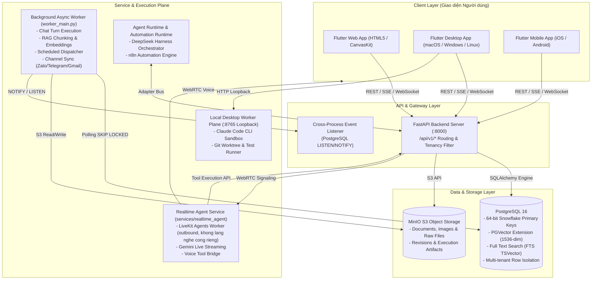

### 2.1. Chi tiết các thành phần công nghệ (Tech Stack)

| Phân hệ | Công nghệ sử dụng | Vai trò & Đặc tính kỹ thuật |
| :--- | :--- | :--- |
| **Frontend UI** | Flutter 3.x, Dart, GetX Pattern | Giao diện hợp nhất (Web/Desktop/Mobile), Reactive State Management, Dark/Light Theme, Hologram Voice Canvas |
| **Backend API** | FastAPI, Python 3.11+, Pydantic v2 | API Gateway, xác thực JWT, Tenancy Filter, Router module hóa, OpenAPI Docs |
| **ORM & Database** | SQLAlchemy 2.0, Alembic, PostgreSQL 16 | Quản lý dữ liệu quan hệ, quan hệ đa bảng, hỗ trợ `pgvector` cho Embeddings và `tsvector` cho Full-text search |
| **Background Worker** | Python `asyncio`, PostgreSQL `SKIP LOCKED` | Xử lý bất đồng bộ đa luồng: AI Chat turns, chunking tài liệu, scheduler, sync Zalo/Email |
| **Realtime Voice** | LiveKit RTC, Gemini Live API, Python (`services/realtime_agent`) | Xử lý âm thanh hai chiều (bi-directional audio streaming), độ trễ thấp (<500ms), Voice Tool Calling. Chạy như một **LiveKit Agents worker** (tiến trình `python main.py start` kết nối ra ngoài tới LiveKit server), không mở cổng lắng nghe riêng; là deploy unit tách biệt với `brain-api` (venv/`requirements.txt` riêng do phụ thuộc `livekit-agents`/`google-genai` nặng) và hiện **chưa** có service block trong `docker-compose.yml` gốc |
| **Object Storage** | MinIO (S3 Compatible Storage) | Lưu trữ file thô, tài liệu Vault, các bản sửa đổi (Revisions) và Artifacts của AI |
| **Local Worker Plane**| Python FastAPI Loopback (Port 8765) | Vỏ bọc thực thi lệnh shell chung (`subprocess.run`) trên máy trạm qua endpoint `POST /execute-task`; Claude Code CLI/Git là lệnh được gọi qua đó, không phải logic branching/test/diff tự động có sẵn trong worker (xem ghi chú ở §3.6.5 và Flow 9) |
| **Automation** | n8n, DeepSeek Harness | Tự động hóa quy trình nghiệp vụ ngoài. *(MCP/Model Context Protocol chưa có triển khai trong `backend/app` — xem ghi chú §3.12)* |

---

## 3. PHÂN TÍCH CHI TIẾT CÁC MODULE CHỨC NĂNG

### 3.1. Phân hệ Định danh & Không gian làm việc (IAM & Multi-Tenancy)
- **Vị trí mã nguồn:** `backend/app/modules/iam/`, `backend/app/core/tenancy.py`, `backend/app/core/auth.py`
- **Mô hình Dữ liệu:**
  - `User`: Lưu trữ thông tin tài khoản người dùng, email, mật khẩu băm (bcrypt), trạng thái kích hoạt.
  - `Workspace`: Thực thể cốt lõi xác định không gian làm việc của công ty/tổ chức (Tenant), sở hữu các tài nguyên.
  - `WorkspaceMember`: Liên kết nhiều-nhiều giữa `User` và `Workspace`, gán vai trò (`owner`, `admin`, `member`, `viewer`).
- **Cơ chế Tenancy Security:**
  - Mọi request yêu cầu xác thực Bearer JWT Token.
  - `get_current_workspace()` tự động trích xuất `workspace_id` từ header hoặc thông tin user, sau đó áp dụng bộ lọc bắt buộc lên toàn bộ truy vấn SQLAlchemy. Không có truy vấn nào được phép bỏ qua `workspace_id`.

---

### 3.2. Phân hệ Tri thức & RAG Đa tầng (Vault, Vector & Knowledge Graph)
- **Vị trí mã nguồn:** `backend/app/modules/vault/`
- **Chức năng chính:**
  1. **Brain & VaultDocument Management:** Quản lý kho tri thức đa não bộ (Brain), phân loại tài liệu (Chính sách, Hướng dẫn, Quy trình, Hồ sơ kỹ thuật, Tài chính).
  2. **Revisioning & MinIO Storage:** Mỗi tài liệu được lưu trữ nguyên bản trên MinIO. Khi tài liệu thay đổi, một bản ghi `VaultRevision` được tạo kèm `object_key` tương ứng để lưu lịch sử phiên bản.
  3. **Tự động Chunking & Vectorization:** Khi tạo revision mới, hệ thống tự động đẩy một `ChunkingJob` vào hàng đợi. Background worker sẽ lấy job (`SKIP LOCKED`), thực hiện:
     - Tách đoạn thông minh (Markdown / Semantic chunking) thành `DocumentChunk`.
     - Tạo Vector Embedding (1536 chiều) lưu vào trường `embedding` (`pgvector`).
     - Tạo chỉ mục tìm kiếm văn bản đầy đủ (`to_tsvector('english', text)`).
  4. **Tìm kiếm lai kết hợp (Hybrid Search):** Kết hợp thuật toán Vector Cosine Similarity và PostgreSQL Full-Text Search (BM25 ranking) mang lại độ chính xác ngữ cảnh cao nhất cho AI.
  5. **Knowledge Graph (KnowledgeObject & KnowledgeRelation):** Trích xuất các thực thể tri thức và mối quan hệ ngữ nghĩa (ví dụ: `[Quy chế tài chính] --governs--> [Quy trình tạm ứng]`) phục vụ suy luận đồ thị.

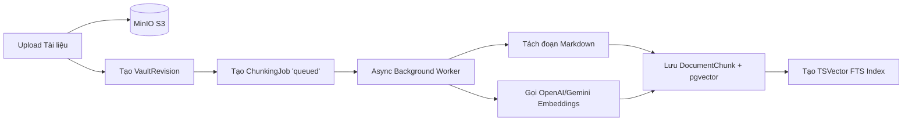

---

### 3.3. Phân hệ Chat, AI Model Gateway & Tool Execution
- **Vị trí mã nguồn:** `backend/app/modules/chat/`
- **Chức năng chính:**
  1. **Multi-Model Gateway (`AIRouter` & `providers.py`):** Hỗ trợ chuyển đổi linh hoạt giữa các nhà cung cấp LLM: Google Gemini, Anthropic Claude, OpenAI, DeepSeek và APIAI.vn. Cấu hình linh hoạt theo từng chế độ hội thoại (Thinking mode, Fast mode, Coding mode).
  2. **Streaming Bus & Event Notification (`chat_stream_bus.py`):** Phục vụ phản hồi tức thì (SSE - Server Sent Events). Khi người dùng gửi tin nhắn, hệ thống tạo bản ghi `ChatMessage(status="pending")` và phát tín hiệu NOTIFY qua PostgreSQL. Chat worker tiếp nhận, gọi LLM, stream từng token về client, lưu câu trả lời `assistant` kèm thống kê token (`AIRun`).
  3. **Hệ thống Tool Calling Tự động:** AI trong Chat có quyền truy xuất trực tiếp các công cụ hệ thống thông qua registry công cụ (`app/core/tool_registry.py` — `ToolSpec` + hàm `register()`/`chat_tools()`, không phải một class `ToolRegistry` đơn nhất), nạp bởi `app/core/tool_bootstrap.py`:
     - `company_tools`: Đọc OKRs, tạo Task, kiểm tra tiến độ dự án, tra cứu tri thức Vault.
     - `gmail_tools`: Đọc hòm thư, soạn thảo email gửi duyệt.
     - `proposal_tools`: Đề xuất các thay đổi chiến lược hoặc phê duyệt hành động.

---

### 3.4. Phân hệ Chiến lược & Chu kỳ Doanh nghiệp 13 Tuần (13-Week Company Cycle OS)
- **Vị trí mã nguồn:** `backend/app/modules/strategy/`
- **Định hướng Tinh gọn trong V13 (Focused Company Cycle OS):**
  > **Lưu ý kiến trúc quan trọng (V12 vs V13):**  
  > Trong các phiên bản V12.x trước đây, hệ thống từng tích hợp các công cụ phân tích chiến lược phức tạp như *Full Strategic Canvas, Living PESTEL, SWOT/TOWS, BSC Scorecard, Complex Capacity Planner, Portfolio Dependency Graph*.  
  > Tuy nhiên, từ phiên bản **V13 (Focused Company Cycle OS)**, các module này bị đẩy ra khỏi luồng vận hành chính và ẩn mặc định sau Feature Flags: `shared_pestel` (`FLAG_SHARED_PESTEL_V12`), `portfolio_swot_tows` (`FLAG_PORTFOLIO_SWOT_TOWS_V12`), `living_pestel` (`FLAG_LIVING_PESTEL_V12`) — cả ba đều `enabled=False` mặc định trong `backend/app/core/feature_flags.py`. **Riêng BSC Scorecard không có flag ẩn riêng**: bảng `bsc_scorecards`, `methodology_router.py` và `canvas_router.list_bsc_scorecards` vẫn là code khả dụng/không bị chặn — tài liệu này không dùng khoá `pestel_full`/`swot_full`/`tows_full`/`bsc_full` như bản nháp cũ (`mCOSA_V13_Focused_Company_Cycle_OS_Claude_Code_Implementation.md`) vì các khoá đó không tồn tại trong mã nguồn thật. Ngoài ra, tại thời điểm cập nhật tài liệu này, `living_pestel_router.py`/`living_pestel_service.py` đang được **xoá hẳn** khỏi `backend/app/modules/strategy/` (working tree) — hằng số `FLAG_LIVING_PESTEL_V12` cần được dọn theo sau khi việc xoá này merge, nếu không sẽ là flag trỏ tới code không còn tồn tại. Hệ thống V13 tinh gọn tập trung 100% vào **vòng lặp thực thi 13 tuần**.
- **Chức năng trọng tâm đang vận hành trong V13:**
  1. **Nền tảng Tinh gọn (Strategy Foundation):** Chỉ giữ lại Tầm nhìn (Vision), Sứ mệnh (Mission), và Giá trị cốt lõi (`CoreValue`) để định hướng cho OKRs.
  2. **Khung Quản trị OKR:** Quản lý Chu kỳ OKR (`OkrCycle`), Mục tiêu chiến lược (`OkrObjective`) và Kết quả Then chốt (`KeyResult`). Liên kết trực tiếp với Sáng kiến (`Initiative`) qua bảng liên kết `OkrLink`.
  3. **Chu kỳ Thực thi 12 Week Year (`TwelveWeekCycle`):** Biến mục tiêu năm thành chu kỳ 12 tuần hành động tập trung.
     - `WeeklyPlan`: Kế hoạch cam kết từng tuần.
     - `WeeklyCommitment`: Cam kết cụ thể của từng tuần, phân định rõ công việc của Founder (`human`) và công việc của AI Functions (`ai`).
  4. **Tuần 13 Đánh giá & Ăn mừng (Week 13 Review & Celebration):**
     - `WeeklyReview`: Biên bản đánh giá hiệu suất hàng tuần.
     - `CycleReview`: Đánh giá tổng kết chu kỳ 13 tuần.
     - `CelebrationRecord`: Ghi nhận thành tựu, phần thưởng và năng lượng tích cực cho đội ngũ.
  5. **Quản trị Dự án Thực thi (Projects & Milestones):** Quản lý các dự án triển khai (`Project`), các giai đoạn MVP (`MvpStage`), và các mốc kiểm soát chất lượng (`Milestone`, `GateDecision`).
  6. **Động cơ Hành động Kế tiếp (Next Best Action Engine):** Gợi ý hành động ưu tiên cao nhất (`NextActionCandidate`) giúp Founder luôn biết việc quan trọng nhất cần làm tiếp theo.

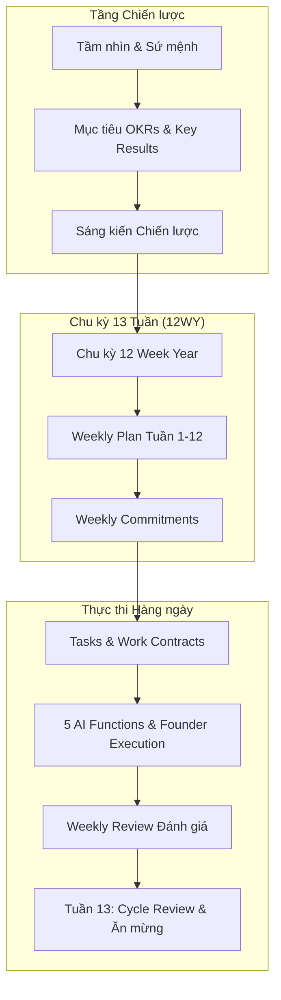

---

### 3.5. Phân hệ Điều phối Hoạt động Doanh nghiệp (Company Runtime & AI Chief of Staff)
- **Vị trí mã nguồn:** `backend/app/modules/company_runtime/`
- **Triết lý:** Biến COSA thành một "Tổng tham mưu trưởng" thông minh, tự phân việc, tự nghiệm thu, và tự tháo gỡ tắc nghẽn.
- **Các thành phần cốt lõi:**
  1. **WorkItem Primitives (`Task` + `Outcome`):**
     - `Task` đại diện cho luồng thực thi (trạng thái, người/AI được giao việc, thời hạn).
     - `Outcome` đại diện cho "Hợp đồng kết quả" (Work Contract): Định nghĩa kết quả mong đợi (`desired_result`), tiêu chí nghiệm thu (`acceptance_criteria`), bằng chứng đầu ra (`artifacts`).
  2. **Đồ thị Phụ thuộc Nhiệm vụ (Dependency DAG - `TaskDependency`):** Quản lý quan hệ phụ thuộc giữa các công việc (Công việc B chỉ chạy khi Công việc A hoàn thành). Tự động phát hiện và chặn vòng lặp tuần hoàn (Cyclic Dependency Check).
  3. **Hệ thống Chuyển giao Liên phòng ban (Cross-Function Handoffs - `Handoff`):**
     - Khi một chức năng hoàn tất công việc, dữ liệu đầu ra được đóng gói thành Handoff và tự động kích hoạt chức năng tiếp theo.
     - Ví dụ: `Marketing (Tạo Lead)` $\rightarrow$ `Handoff` $\rightarrow$ `Sales (Đánh giá Cơ hội)` $\rightarrow$ `Handoff` $\rightarrow$ `Finance (Lập Hạch toán Doanh thu)`.
  4. **Quản lý Tắc nghẽn Có cấu trúc (Structured Blockers - `Blocker`):** Khi AI gặp khó khăn (thiếu quyền, thiếu dữ liệu, phát hiện rủi ro pháp lý), AI tự động tạo Blocker với nguyên nhân, giải pháp đề xuất và mức độ nghiêm trọng.
  5. **Hàng đợi Ngoại lệ của Founder ("Needs You" Queue - `NeedsYouItem`):** Thay vì làm phiền Founder bằng mọi thông báo, hệ thống gom toàn bộ các việc cần con người can thiệp (Blocker mức độ cao, Phê duyệt thanh toán, Ký hợp đồng, Duyệt bài viết) vào hàng đợi tập trung.
  6. **Đánh giá & Kiểm soát Chất lượng (Review & Rework - `WorkReview`):** Tự động chấm điểm kết quả công việc AI dựa trên tiêu chí nghiệm thu. Nếu không đạt yêu cầu, tự động chuyển về trạng thái `needs_rework` kèm hướng dẫn chỉnh sửa.
  7. **Điểm kiểm tra Phục hồi (Runtime Checkpoint - `RuntimeCheckpoint`):** Lưu trạng thái ngữ cảnh thực thi, cho phép tạm dừng và phục hồi phiên làm việc bất kỳ lúc nào mà không mất dữ liệu.
  8. **Bộ phân loại Ý định (Talk-to-Work Router & Intent Classifier):** Nhận dạng câu nói tự nhiên của Founder trong lúc trò chuyện/họp để tự động chuyển thành Task và Outcome chuẩn hóa.

---

### 3.6. 5 Chức năng Doanh nghiệp Tự trị (5 Autonomous AI Functions)

```
                       +-------------------------------+
                       |      FOUNDER / CHIEF OF STAFF |
                       +-------------------------------+
                                       |
       +-------------------------------+-------------------------------+
       |               |               |               |               |
+--------------+ +------------+ +-------------+ +-------------+ +---------------+
|  MARKETING   | |   SALES    | |   FINANCE   | |    LEGAL    | |     TECH      |
|  - Chiến dịch| | - Revenue  | | - Kế toán   | | - Rà soát   | | - Viết mã     |
|  - Nội dung  | | - Leads    | |   TT58      | |   Pháp lý   | | - Chạy Tests  |
|  - Kênh MXH  | | - Deals    | | - Sổ sách   | | - Hợp đồng  | | - Git Worktree|
+--------------+ +------------+ +-------------+ +-------------+ +---------------+
```

#### 3.6.1. Marketing Function
- **Vị trí mã nguồn:** `backend/app/modules/marketing/`
- **Chức năng:** Quản lý bối cảnh Marketing (`MarketingContext`), Mục tiêu chiến dịch (`MarketingObjective`), Chiến dịch (`MarketingCampaign`), Tạo tài sản nội dung (`CampaignAsset`), Theo dõi chỉ số chuyển đổi (`MarketingMetric`), và Thử nghiệm A/B (`MarketingExperiment`).

#### 3.6.2. Sales / Revenue Operating System
- **Vị trí mã nguồn:** `backend/app/modules/sales/`
- **Chức năng:** Nâng cấp chức năng bán hàng thành Hệ điều hành Doanh thu hoàn chỉnh:
  - Quản lý Khách hàng Doanh nghiệp (`Account`) và Người liên hệ (`Contact`).
  - Phân loại và chấm điểm Tiềm năng (`SalesLead`). Khử trùng lặp thông minh theo Email và Số điện thoại.
  - Phễu Cơ hội Bán hàng (`Opportunity`): Quản lý các giai đoạn từ Tiếp cận $\rightarrow$ Khám phá $\rightarrow$ Đề xuất $\rightarrow$ Đàm phán $\rightarrow$ Đóng Deal (Won/Lost với lý do cụ thể).
  - Hồ sơ Khách hàng chính thức (`Customer`) và Nhật ký Tương tác (`SalesActivity`).
  - Handoff tự động: Nhận Lead từ Marketing; chuyển Deal Won sang Finance để ghi nhận công nợ.

#### 3.6.3. Finance Function (Chuẩn kế toán TT58/2026/TT-BTC)
- **Vị trí mã nguồn:** `backend/app/modules/finance/`
- **Chức năng:** Hệ thống kế toán tự trị chuyên biệt cho doanh nghiệp siêu nhỏ và nhỏ tại Việt Nam:
  - **Hồ sơ Kế toán (`AccountingProfile`):** Cấu hình phương pháp tính thuế, đồng tiền hạch toán (VND), chế độ kế toán theo Thông tư 58/2026/TT-BTC.
  - **Chứng từ Kế toán (`AccountingDocument`):** Quản lý hóa đơn đầu vào/đầu ra, phiếu thu, phiếu chi, giấy báo có/nợ.
  - **Giao dịch & Sổ cái (`FinancialTransaction`, `AccountingRecord`):** Tự động định khoản kép (Nợ/Có) vào hệ thống tài khoản kế toán chuẩn TT58.
  - **Kỳ kế toán & Khóa sổ (`AccountingPeriod`):** Quản lý kỳ kế toán tháng/quý/năm, chốt số liệu bất biến để phục vụ báo cáo tài chính và thanh tra thuế.
  - **Ngoại lệ Tài chính (`FinanceException`):** Tự động phát hiện chi tiêu bất thường hoặc thiếu hóa đơn hợp lệ, đẩy lên hàng đợi "Needs You".

#### 3.6.4. Legal Function
- **Vị trí mã nguồn:** `backend/app/modules/legal/`
- **Chức năng:** Rà soát nghĩa vụ pháp lý (`LegalObligation`), danh mục tuân thủ doanh nghiệp (`LegalChecklistItem`), hỗ trợ thẩm định điều khoản hợp đồng trước khi Founder ký duyệt.

#### 3.6.5. Tech Function & Local Desktop Worker
- **Vị trí mã nguồn:** `backend/app/modules/tech/`, `backend/app/modules/devices/`, `desktop_worker/`
- **Chức năng:** Tự động hóa tác vụ lập trình và hạ tầng:
  - Tiếp nhận yêu cầu kỹ thuật, đóng gói thành `DeveloperJob` (`status`: `QUEUED` → `WAITING_FOR_DEVICE` → `CLAIMED` → `RUNNING` → `WAITING_APPROVAL` → `SUCCEEDED`/`FAILED`/`CANCELLED`), với các route thật trong `backend/app/modules/devices/router.py`: `POST /devices/jobs`, `GET /devices/jobs`, `POST /devices/{device_id}/jobs/{job_id}/claim`, `POST /devices/jobs/{job_id}/submit-results`, `POST /devices/jobs/{job_id}/resolve-approval`.
  - Kết nối máy trạm an toàn qua `Local Desktop Worker Plane` (chạy loopback cổng `8765`).
  - **Lưu ý mức độ hoàn thiện:** phần trên (backend `devices` module) đã triển khai đầy đủ vòng đời job. Nhưng `desktop_worker/main.py` — phía chạy trên máy trạm — hiện chỉ là một shim ~56 dòng: `GET /health` (khai báo tĩnh `capabilities: ["claude_code","git","filesystem","browser"]`) và `POST /execute-task` chạy `subprocess.run(command, shell=True)` bất kỳ. Nó **không** tự động phân nhánh Git, không tự gọi Claude Code CLI, không tự chạy bộ kiểm thử, không tự trích Diff Summary, và không chủ động poll `GET /devices/jobs` để nhận việc — toàn bộ orchestration đó (nếu có) phải do phía gọi `/execute-task` điều khiển từng bước bằng lệnh shell cụ thể. Mô tả "tự động phân nhánh Git, gọi Claude Code CLI, chạy test, trích Diff" trong Flow 9 bên dưới là hành vi **kỳ vọng/thiết kế**, chưa phải hành vi đã cứng hoá trong `desktop_worker/`.

---

### 3.7. Phân hệ Thực thi Kết quả & Đội ngũ Lai (Outcomes & Hybrid Workforce)
- **Vị trí mã nguồn:** `backend/app/modules/outcomes/`, `backend/app/modules/organization/`
- **Chức năng:**
  - `Outcome`, `OutcomeRun`, `RunStep`, `RunEvent`, `Artifact`: Cung cấp khả năng quan sát chi tiết từng bước thực thi của AI (từ việc suy luận, gọi tool, cho đến sinh file artifact).
  - `Organization`, `Department`, `WorkforceMember`: Quản lý sơ đồ cơ cấu tổ chức bao gồm cả nhân sự con người và các Agent AI, phân định rõ vai trò và quyền hạn.

---

### 3.8. Phân hệ Nhiệm vụ, Lập lịch & Quy trình Tự động (Tasks & Workflows Engine)
- **Vị trí mã nguồn:** `backend/app/modules/tasks/`, `backend/app/modules/workflows/`
- **Chức năng:**
  - `Task`: Quản lý danh sách việc cần làm, độ ưu tiên, hạn chót, chế độ thực thi (`manual`, `ai_autonomous`, `semi_autonomous`).
  - `TaskSchedule`: Lập lịch định kỳ bằng biểu thức Cron.
  - `WorkflowDefinition`, `WorkflowVersion`, `WorkflowStep`, `WorkflowRun`: Động cơ thực thi quy trình làm việc tự động (Workflow Engine), hỗ trợ các bước phê duyệt trung gian (`WorkflowApproval`).

---

### 3.9. Phân hệ Bộ nhớ Trí tuệ Nhân tạo (Agent Memory System v12.3)
- **Vị trí mã nguồn:** `backend/app/modules/agent_memory/`
- **Chức năng:**
  - Quản lý trí nhớ dài hạn của AI qua 3 cấp phạm vi (`AgentMemoryScope`): Phạm vi Người dùng (User Preferences), Phạm vi Doanh nghiệp (Company Knowledge), và Phạm vi Agent (Agent Experience).
  - Tự động trích xuất các thông tin quan trọng từ hội thoại thành `MemoryCandidate`.
  - Bộ lọc ẩn danh dữ liệu nhạy cảm (`redact.py`) loại bỏ mật khẩu, token, thông tin thẻ trước khi lưu trữ.
  - Thăng hạng bộ nhớ (`MemoryPromotion`) và đánh giá chất lượng bộ nhớ (`MemoryEvaluation`).

---

### 3.10. Phân hệ Giọng nói Thời gian thực & Hologram Hub (Realtime Voice & LiveKit)
- **Vị trí mã nguồn:** `backend/app/modules/realtime/`, `services/realtime_agent/`, `frontend/lib/modules/hologram_hub/`
- **Chức năng:**
  - **LiveKit WebRTC Integration:** Truyền tải âm thanh thời gian thực với độ trễ siêu thấp giữa ứng dụng Flutter và Agent Python.
  - **Gemini Live & Realtime Voice Model:** Cho phép Founder trò chuyện tự nhiên bằng giọng nói với AI Chief of Staff.
  - **Voice Tool Calling Bridge:** Cho phép Voice Agent thực hiện hành động ngay trong lúc nói chuyện (ví dụ: "Hãy kiểm tra doanh thu tuần này", AI sẽ gọi Tool Finance và đọc to kết quả).
  - **Hologram Hub Canvas:** Giao diện trực quan hóa sóng âm 3D sống động trên Flutter.

---

### 3.11. Agent Runtime & Automation Runtime (DeepSeek Harness & n8n Integration)
- **Vị trí mã nguồn:** `backend/app/agents/`, `backend/app/automations/`
- **Chức năng:**
  - **Agent Runtime:** Tích hợp DeepSeek Harness làm bộ não suy luận, lập kế hoạch nhiều bước (Multi-step Reasoning & Subagent Delegation) và kiểm soát chính sách an toàn (`PolicyEngine`).
  - **Automation Runtime:** Tích hợp n8n xử lý các quy trình tự động hóa phức tạp kết nối với hàng trăm dịch vụ bên thứ ba (Webhooks, Trigger, Sync).

---

### 3.12. Phân hệ Kết nối & Kênh Giao tiếp (Integrations, Connectors & Channels)
- **Vị trí mã nguồn:** `backend/app/modules/integrations/`
- **Chức năng:**
  - **Kênh Tương tác Đa nền tảng:** Kết nối Telegram, Zalo (qua quét mã Zalo QR Session), Gmail (Google OAuth2) và Webhooks.
  - **Phê duyệt qua Email (`EmailApproval`):** Gửi email chứa liên kết ký duyệt một chạm bảo mật cho Founder.
  - **Plugin Host (`plugin_host.py`, `plugins_router.py`):** Khung bật/tắt plugin theo workspace (`POST /workspace-plugins/{id}/enable`); `PluginHost.load_plugins()`/`execute_plugin()` hiện là **stub MVP** (trả về danh sách rỗng / kết quả tĩnh), chưa thực thi plugin thật.
  - **MCP Gateway (Model Context Protocol) — chưa triển khai:** Không có module MCP server/client nào trong `backend/app` tại thời điểm cập nhật (không có route, adapter hay dependency MCP trong toàn bộ codebase). Không nên liệt mục này cùng nhóm với các năng lực đã chạy thật ở trên cho tới khi có code tương ứng.

---

### 3.13. Phân hệ Nền tảng, Feature Flags, Nhật ký & Giám sát (Platform & Governance)
- **Vị trí mã nguồn:** `backend/app/modules/platform/`, `backend/app/core/feature_flags.py`
- **Chức năng:**
  - **Feature Flags đa tầng:** Bật/tắt tính năng linh hoạt theo từng Workspace hoặc toàn hệ thống mà không cần restart server.
  - **Nhật ký Kiểm toán Toàn diện (`AuditLog`):** Ghi lại mọi hành vi nhạy cảm (truy cập dữ liệu, thay đổi cấu hình, giao dịch tài chính).
  - **Giám sát Sức khỏe Hệ thống (`/live`, `/ready`):** Kiểm tra trạng thái Database, MinIO S3, Alembic Migrations, và Worker Heartbeat.

---

## 4. LUỒNG HOẠT ĐỘNG TOÀN TRÌNH (END-TO-END WORKFLOWS & SEQUENCE FLOWS)

### Flow 1: Chu kỳ Chiến lược 13 Tuần (13-Week Strategic Operating Loop)
Quy trình biến định hướng vĩ mô thành kết quả đo lường được trong từng tuần.

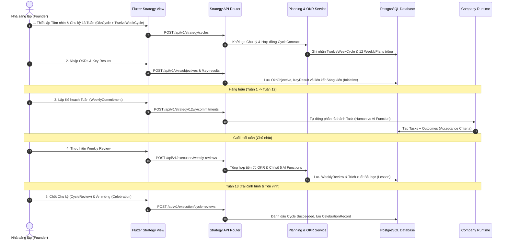

---

### Flow 2: Hội thoại Chat, AI Turn & Tool Calling Đa bước
Luồng xử lý tin nhắn tương tác người dùng, stream phản hồi và gọi tool hệ thống.

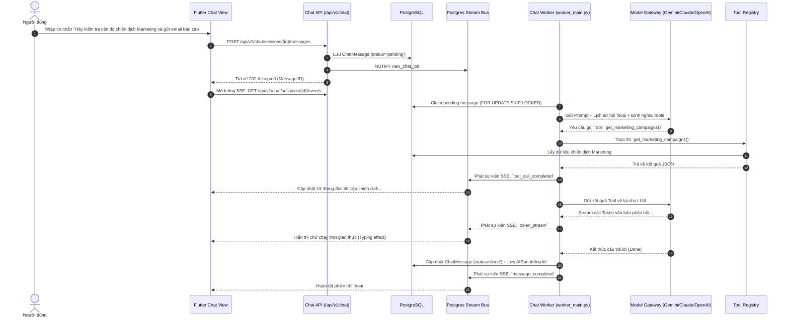

---

### Flow 3: Tương tác Giọng nói Thời gian thực & Điều hướng Ý định (Voice & Talk-to-Work)
Luồng tương tác trực tiếp bằng giọng nói, kết hợp nhận diện ý định để giao việc.

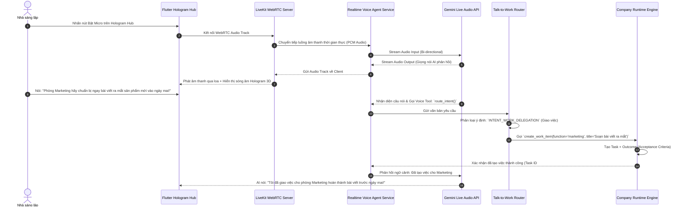

---

### Flow 4: Phân rã Nhiệm vụ, Giao việc & Bàn giao Liên chức năng (Company Runtime Handoff)
Luồng phối hợp tự động giữa 5 phòng ban AI mà không cần sự can thiệp thủ công.

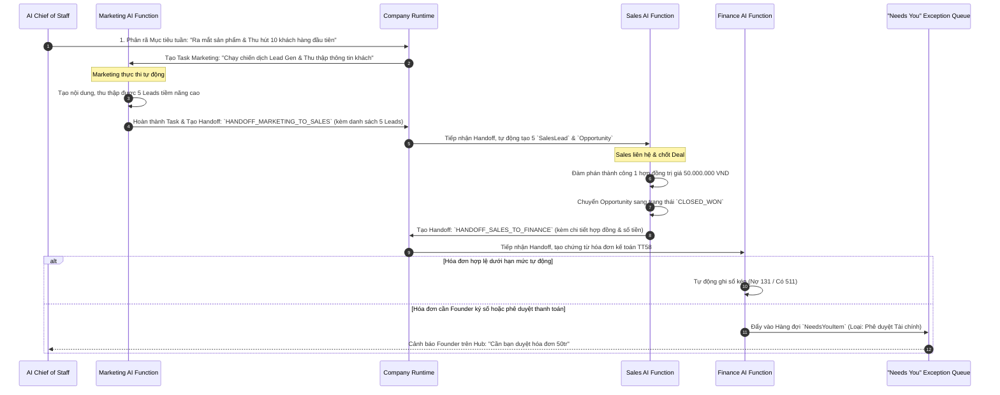

---

### Flow 5: Thu thập Tri thức, Trích xuất Vector & Tìm kiếm Ngữ nghĩa (Vault RAG Pipeline)
Quy trình nạp tài liệu, tách đoạn và truy vấn RAG chính xác.

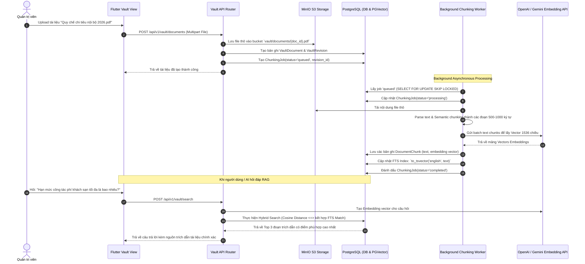

---

### Flow 6: Vận hành Doanh thu & Bán hàng Toàn trình (Lead-to-Revenue Pipeline)
Quy trình khép kín từ tiếp nhận khách hàng đến chốt doanh thu theo chuẩn v13.2.

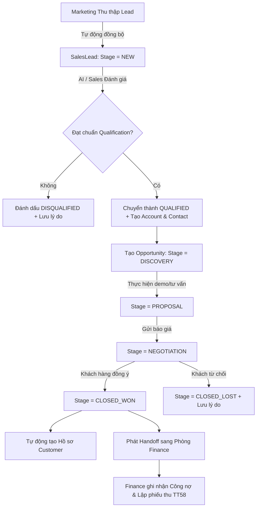

---

### Flow 7: Hạch toán & Quản trị Tài chính Doanh nghiệp Vi mô (Finance TT58 Engine)
Quy trình tuân thủ chế độ kế toán Thông tư 58/2026/TT-BTC.

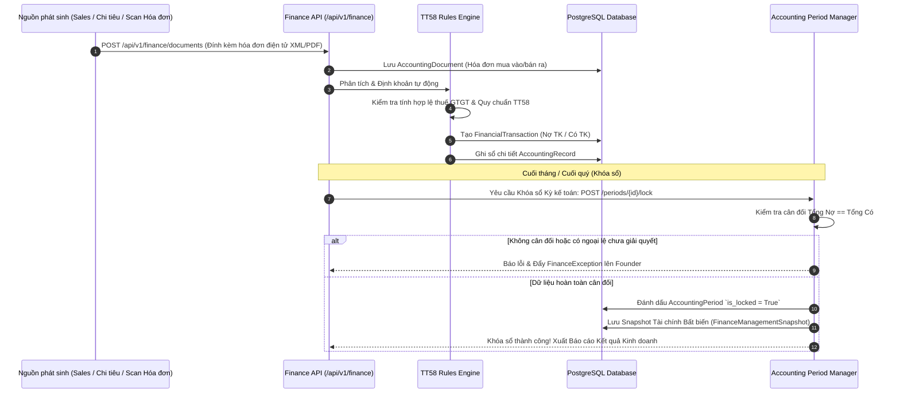

---

### Flow 8: Xử lý Tắc nghẽn, Phê duyệt & Hàng đợi "Needs You" của Founder
Cơ chế tự chủ và chỉ ngắt quãng con người khi thực sự cần thiết.

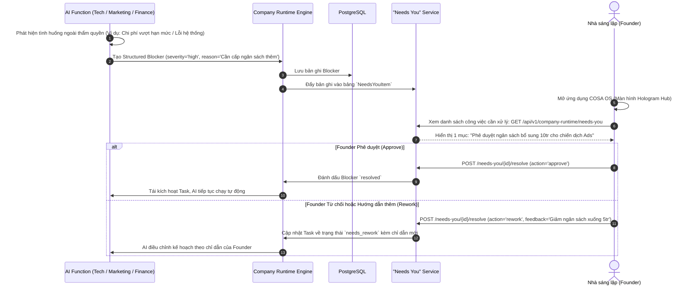

---

### Flow 9: Thực thi Tác vụ Kỹ thuật Máy trạm (Tech Developer Job & Local Worker)
Quy trình AI lập trình, viết mã, chạy kiểm thử và nộp bản vá lên máy trạm lập trình viên.

> **Ghi chú mức độ triển khai:** Nửa trên (Backend `devices` module — tạo/liệt kê/claim/submit-results/resolve-approval `DeveloperJob`) là code thật, đã kiểm chứng trong `backend/app/modules/devices/router.py`. Nửa dưới (các bước Git branch / `claude-code --prompt` / chạy test / tạo Diff Patch / poll việc định kỳ) mô tả **hành vi thiết kế kỳ vọng** của `Local Desktop Worker`; bản thân `desktop_worker/main.py` hiện chỉ có `GET /health` và `POST /execute-task` (thực thi một lệnh shell bất kỳ do caller truyền vào) — không có vòng lặp poll, không tự tạo branch, không tự gọi Claude Code CLI. Xem thêm §3.6.5.

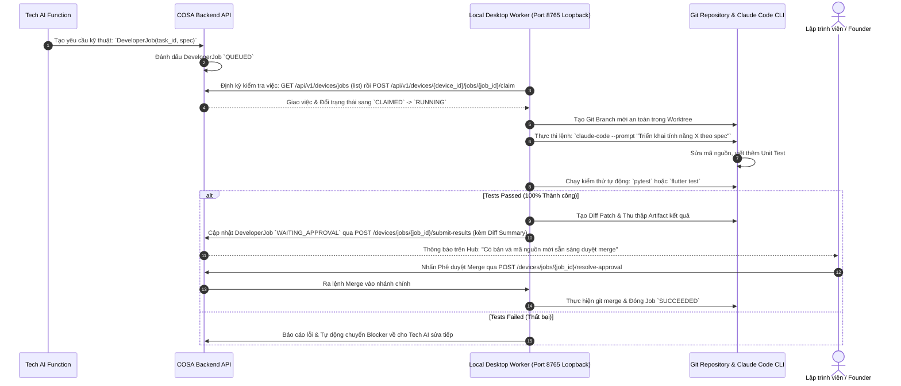

---

## 5. CƠ SỞ DỮ LIỆU VÀ MÔ HÌNH THỰC THỂ (DATA MODELS & ERD)

Toàn bộ hệ thống COSA OS sử dụng PostgreSQL với hơn 50 bảng thực thể được chuẩn hóa. Dưới đây là sơ đồ quan hệ giữa các thực thể trọng tâm:

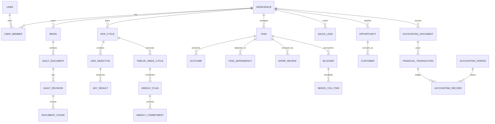

### Bảng tóm tắt các thực thể cốt lõi

| Bảng Cơ sở dữ liệu | Module | Ý nghĩa & Chức năng |
| :--- | :--- | :--- |
| `workspaces` | IAM | Đơn vị cô lập dữ liệu người thuê (Tenant) |
| `users` | IAM | Tài khoản người dùng |
| `brains` | Vault | Phân vùng kho tri thức theo bộ não/phòng ban |
| `vault_documents` | Vault | Tài liệu tri thức gốc |
| `document_chunks` | Vault | Các đoạn văn bản kèm Vector Embeddings (1536 chiều) và FTS |
| `chat_sessions` / `chat_messages` | Chat | Phiên hội thoại và lịch sử tin nhắn |
| `okr_cycles` / `okr_objectives` | Strategy | Chu kỳ OKR và các mục tiêu chiến lược |
| `twelve_week_cycles` / `weekly_plans` | Strategy | Chu kỳ thực thi 12 tuần và kế hoạch từng tuần |
| `tasks` | Tasks | Nguyên thủy thực thi công việc (Human / AI Function) |
| `outcomes` | Outcomes | Hợp đồng kết quả, tiêu chí nghiệm thu và artifacts |
| `task_dependencies` | Company Runtime | Đồ thị DAG quan hệ phụ thuộc công việc |
| `handoffs` | Company Runtime | Chuyển giao công việc và dữ liệu giữa các phòng ban AI |
| `blockers` | Company Runtime | Điểm tắc nghẽn công việc có cấu trúc |
| `needs_you_items` | Company Runtime | Hàng đợi ngoại lệ cần Founder xử lý |
| `sales_leads` / `opportunities` | Sales | Khách hàng tiềm năng và phễu cơ hội bán hàng |
| `accounting_documents` | Finance | Chứng từ kế toán (hóa đơn, phiếu thu, phiếu chi) |
| `financial_transactions` | Finance | Định khoản kế toán kép theo Thông tư 58 |
| `developer_jobs` | Devices / Tech | Tác vụ lập trình máy trạm cục bộ |
| `feature_flags` | Platform | Bật tắt tính năng động theo Workspace |
| `audit_logs` | Platform | Nhật ký kiểm toán bảo mật toàn hệ thống |

---

## 6. BẢO MẬT, KIỂM SOÁT & TRIỂN KHAI VẬN HÀNH

### 6.1. Bảo mật Đa người thuê (Server-side Tenancy Isolation)
- Toàn bộ truy vấn SQL đều đi qua lớp bảo vệ `tenancy.py`. Bất kỳ yêu cầu nào không có `workspace_id` hợp lệ sẽ bị từ chối với mã lỗi `403 Forbidden` ngay từ tầng xác thực.
- Khóa chính sử dụng 64-bit Snowflake ID ngẫu nhiên theo thời gian, chống tấn công dò quét ID tuần tự (Insecure Direct Object References - IDOR).

### 6.2. Kiểm soát Tính năng Bằng Feature Flags
Hệ thống sử dụng cơ chế Feature Flag hai tầng (Global Fallback + Workspace Override):
- Toàn bộ các tính năng nâng cao hoặc thử nghiệm (như V13.1 Company Runtime, V13.2 Sales OS, Advanced Org Chart, Finance TT58) đều được bảo vệ sau các flags: `FLAG_FINANCE_FUNCTION_V13`, `FLAG_SALES_FUNCTION_V13`, `FLAG_NEEDS_YOU_QUEUE_V13_1`, v.v.
- Cho phép bật tính năng theo từng công ty mà không làm ảnh hưởng đến các khách hàng khác trên hệ thống SaaS.

### 6.3. Thực thi Cục bộ An toàn (Safe Local Execution)
- `Local Desktop Worker Plane` chỉ lắng nghe trên giao diện loopback `127.0.0.1:8765`.
- Không bao giờ mở cổng ra Internet công cộng; bảo vệ tối đa mã nguồn và máy trạm của lập trình viên.

### 6.4. Kiểm tra Sức khỏe Hệ thống (Health & Readiness Probes)
Hệ thống cung cấp sẵn hai điểm cuối chuẩn Kubernetes/Docker:
- `/live`: Kiểm tra API Gateway có đang sống và nhận request hay không.
- `/ready`: Kiểm tra toàn diện 4 trụ cột hạ tầng:
  1. Kết nối PostgreSQL (`SELECT 1`).
  2. Kết nối MinIO S3 Object Storage (`list_buckets`).
  3. Trạng thái Alembic Migration (Kiểm tra DB đã migrate đến bản mới nhất chưa).
  4. Trạng thái Background Worker Heartbeat (Đảm bảo tiến trình `worker_main.py` đang hoạt động ổn định).

---

## 7. TỔNG KẾT

Hệ thống **COSA OS** là một giải pháp hoàn chỉnh, kiến trúc vững chắc, kết hợp hài hòa giữa **Quản trị Chiến lược Cấp cao**, **Thực thi Chu kỳ 13 Tuần Kỷ luật**, và **Đội ngũ 5 Phòng ban AI Tự trị**. 

Với cơ chế điều phối thông minh của **AI Chief of Staff** và hàng đợi **Needs You**, hệ thống giải phóng tối đa thời gian của Nhà sáng lập khỏi các tác vụ vận hành vụn vặt, đồng thời duy trì sự kiểm soát tuyệt đối trên từng quyết định quan trọng của doanh nghiệp.
