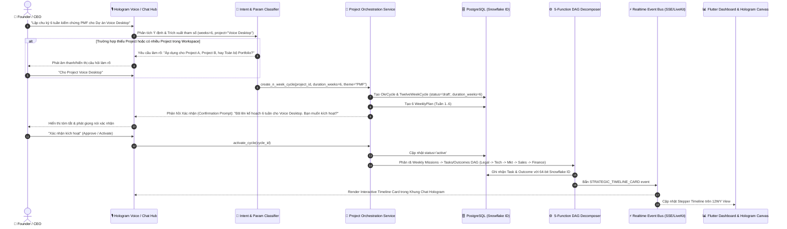

# KẾ HOẠCH THIẾT KẾ & TRIỂN KHAI: ONE SINGLE EXECUTION LOOP (DYNAMIC N-WEEKS, PROJECT SCOPE & HOLOGRAM TIMELINE)

> **Tài liệu Kỹ thuật & Bản thiết kế Thực thi COSA OS**  
> **Phiên bản:** 1.0 — Chuẩn hóa V13 Focused Company Cycle OS  
> **Mã thiết kế:** `COSA-EXEC-LOOP-DYN-NWEEKS`  
> **Trạng thái:** Sẵn sàng Triển khai (Ready for Implementation)

---

## 1. TỔNG QUAN VÀ TRIẾT LÝ THIẾT KẾ CỐT LÕI

### 1.1. Triết lý "One Single Execution Loop"
Hệ thống **COSA OS** vận hành theo một vòng lặp thực thi duy nhất từ cấp chiến lược cao nhất đến hành động tác nghiệp hàng ngày của 5 phòng ban AI (*Legal, Tech, Marketing, Sales, Finance*) và con người:

$$\text{Vision / Tầm nhìn} \longrightarrow \text{OKRs} \longrightarrow \text{Chu kỳ N Tuần} \longrightarrow \text{Nhiệm vụ Tuần (Weekly Mission)} \longrightarrow \text{Phân rã DAG 5 Phòng ban} \longrightarrow \text{Tasks \& Outcomes} \longrightarrow \text{Đánh giá \& Transition}$$

* **Nguyên tắc "No Second Execution Engine":** Không tạo ra luồng việc thứ hai. Bất kỳ tác vụ nào (dù đến từ Voice Hologram, Chat, hay Scheduled Job) đều quy về 2 nguyên thủy: `Task` và `Outcome`.
* **Chu kỳ mặc định 13 tuần:** 12 tuần thực thi nước rút (12 Week Year) + Tuần 13 Đệm, Đánh giá (Retrospective), Ăn mừng (Celebration) và Tái định hình chiến lược.

### 1.2. Mục tiêu Nâng cấp Mở rộng
1. **Dynamic $N$-Weeks (Tùy biến số tuần linh hoạt):** Hỗ trợ chu kỳ với số tuần bất kỳ ($N$ tuần: 4 tuần Sprint, 6 tuần MVP, 8 tuần PMF, hoặc mặc định 13 tuần) khi Founder ra lệnh tự nhiên qua Voice/Chat hoặc thao tác trên UI.
2. **Project Scope Disambiguation & Confirmation (Xác nhận rõ phạm vi Dự án):** Tự động phát hiện, xác nhận và phân định rõ ràng chu kỳ áp dụng cho **1 Dự án cụ thể** (Single-Project) hay **Nhiều Dự án song song / Toàn công ty** (Multi-Project Portfolio) trước khi ghi nhận vào hệ thống.
3. **Interactive Timeline in Hologram Chat & Dashboard (Timeline trực quan các bước):** Biểu diễn lộ trình và tiến độ các bước triển khai trực tiếp ngay trong **Khung Chat Hologram Hub** (Hologram Voice Canvas) và **Strategy Dashboard**, cập nhật thời gian thực (Real-time SSE/WebSocket) khi AI hoàn thành nhiệm vụ.

---

## 2. KIẾN TRÚC TỔNG THỂ & LUỒNG TƯƠNG TÁC (END-TO-END FLOW)



---

## 3. THIẾT KẾ CHI TIẾT TỪNG PHÂN HỆ

### 3.1. Phân hệ Nhận diện & Trích xuất Tham số (Intent & Parameter Extraction)
Tại `backend/app/modules/company_runtime/intent_classifier.py` và `talk_work_router.py`:
* **Regex & NLP Extractor:**
  * Bắt các mẫu số tuần: `r"(?:chu kỳ|cycle|kế hoạch)\s+(\d+)\s*(?:tuần|weeks?)"` hoặc `r"(\d+)\s*(?:tuần|weeks?)"`.
  * Nếu không phát hiện số tuần $\rightarrow$ Mặc định gán `duration_weeks = 13`.
* **Project Entity Resolver:**
  * Quét danh sách các Projects thuộc `workspace_id`.
  * Nếu câu lệnh chứa tên project $\rightarrow$ Ánh xạ sang `project_id`.
  * Nếu Workspace chỉ có **1 Project duy nhất** $\rightarrow$ Tự động gán `project_id` và thông báo ngầm cho user.
  * Nếu Workspace có **nhiều Projects** và không khớp tên $\rightarrow$ Trả về intent `NEEDS_CLARIFICATION` kèm danh sách gợi ý.

### 3.2. CSDL & Schema Data Models
Tại `backend/app/modules/strategy/models.py`:
* **Bảng `twelve_week_cycles`:**
  * Bổ sung cột: `duration_weeks: Mapped[int] = mapped_column(Integer, default=13)`
  * Bổ sung quan hệ: `project_id: Mapped[Optional[int]] = mapped_column(ForeignKey("projects.id"), nullable=True, index=True)`
* **Bảng `weekly_plans`:**
  * Ràng buộc: `UniqueConstraint('cycle_id', 'week_no', name='uix_weekly_plan_cycle_week')` (Hỗ trợ linh hoạt `week_no` từ $1 \dots N$).
* **Phân rã DAG 5 Phòng ban (`DecompositionService`):**
  * Mỗi Task và Outcome đều gắn `workspace_id`, `project_id`, `cycle_id`, `weekly_commitment_id` và định danh bằng 64-bit Snowflake ID.

### 3.3. Dịch vụ Biên dịch & Tổng kết Chu kỳ (Services Layer)
1. **`ProjectOrchestrationService`:**
   * Hỗ trợ tạo đúng $N$ bản ghi `WeeklyPlan` dựa trên tham số `duration_weeks`.
   * Cập nhật `MvpStage` sang `ACTIVE`.
2. **`PlanningCompilerService`:**
   * Biên dịch tự động toàn bộ cam kết tuần của $N$ tuần sang Task/Outcome DAG.
3. **`ReviewAndTransitionService`:**
   * Đánh giá tuần (Weekly Review) cho tuần $1 \dots N$.
   * Tự động xác định tuần thứ $N$ là **Tuần Tổng kết & Chuyển giao (Transition & Celebration)** thay vì cố định tuần 13.

### 3.4. Dữ liệu Timeline Trả về Khung Chat (Timeline Payload Contract)
Gói tin chuẩn JSON gửi qua SSE / WebSocket / LiveKit Data Channel:
```json
{
  "type": "STRATEGIC_TIMELINE_CARD",
  "data": {
    "cycle_id": "8934710293847104",
    "project_id": "7812938471029381",
    "project_name": "Javis Voice Desktop",
    "total_weeks": 6,
    "current_week": 2,
    "status": "active",
    "timeline_steps": [
      {
        "step_no": 1,
        "week_range": "Tuần 1",
        "title": "Thiết lập Mục tiêu & Rào cản Pháp lý",
        "owner_functions": ["LEGAL", "TECH"],
        "status": "completed",
        "progress_percent": 100.0,
        "outcomes_count": 2,
        "outcomes_done": 2
      },
      {
        "step_no": 2,
        "week_range": "Tuần 2 - 3",
        "title": "Hoàn thiện Core Audio & Loopback Sandbox",
        "owner_functions": ["TECH"],
        "status": "in_progress",
        "progress_percent": 65.0,
        "outcomes_count": 3,
        "outcomes_done": 1
      },
      {
        "step_no": 3,
        "week_range": "Tuần 4 - 5",
        "title": "Launch Beta & Outreach 50 Khách hàng",
        "owner_functions": ["MARKETING", "SALES"],
        "status": "pending",
        "progress_percent": 0.0,
        "outcomes_count": 4,
        "outcomes_done": 0
      },
      {
        "step_no": 4,
        "week_range": "Tuần 6",
        "title": "Tổng kết Chu kỳ, Đối soát & Transition",
        "owner_functions": ["FINANCE", "CHIEF_OF_STAFF"],
        "status": "pending",
        "progress_percent": 0.0,
        "outcomes_count": 2,
        "outcomes_done": 0
      }
    ]
  }
}
```

### 3.5. Giao diện Người dùng (Frontend Flutter UI)
1. **Hologram Hub Chat Panel (`frontend/lib/modules/hologram_hub/`):**
   * Widget `StrategicTimelineCardWidget`: Card hiệu ứng Glassmorphism hiển thị Timeline Stepper, thanh tiến độ từng tuần, badge trạng thái của 5 phòng ban AI.
   * Micro Action Button: Bấm mic để nói trực tiếp với AI phụ trách step đó.
2. **Strategy Dashboard View (`frontend/lib/modules/strategy/`):**
   * View `twelve_week_year_view.dart`: Render động danh sách $N$ Tab tuần dựa trên mảng `plans` từ API, không giới hạn cứng ở 12 hay 13 tab.

---

## 4. KẾ HOẠCH TRIỂN KHAI & BƯỚC THỰC HIỆN

### Giai đoạn 1: Backend Data Model & Intent Refinement
* [x] Rà soát các models `TwelveWeekCycle`, `WeeklyPlan`, `Project`, `MvpStage`.
* [ ] Thêm trích xuất `duration_weeks` và `project_id` trong `WorkIntentClassifier` & `TalkWorkRouter`.
* [ ] Cập nhật `ProjectOrchestrationService` hỗ trợ sinh $N$ tuần theo tham số.

### Giai đoạn 2: Service Logic & DAG Compilation
* [ ] Cập nhật `PlanningCompilerService` để hỗ trợ chu kỳ $N$ tuần liền mạch.
* [ ] Cập nhật `ReviewAndTransitionService` gắn mốc Transition vào tuần thứ $N$.
* [ ] Bổ sung API endpoint tạo Timeline Payload cho chu kỳ: `GET /api/v1/execution/twelve-week-cycles/{id}/timeline`.

### Giai đoạn 3: Frontend Hologram & Dashboard Integration
* [ ] Xây dựng widget `StrategicTimelineCardWidget` trong `frontend/lib/modules/hologram_hub/presentation/widgets/`.
* [ ] Tích hợp render timeline card trong `HubChatPanel` và `floating_voice_hologram.dart`.
* [ ] Đảm bảo `twelve_week_year_view.dart` hiển thị linh hoạt số lượng $N$ tuần mượt mà.

### Giai đoạn 4: Kiểm thử Tự động & Nghiệm thu
* [ ] Viết test case Backend Pytest: Tạo chu kỳ 4 tuần, 6 tuần, 13 tuần cho các kịch bản Single Project và Multi-Project.
* [ ] Viết test case Flutter Analyzer & Widget Test cho Timeline Card.
* [ ] Xác thực luồng Voice Hologram $\rightarrow$ Tạo chu kỳ $\rightarrow$ Bắn timeline ra màn hình chat.

---

## 5. KẾT LUẬN
Bản thiết kế này chuẩn hóa triệt để **One Single Execution Loop** của COSA OS, giúp hệ thống vừa giữ vững tính kỷ luật chiến lược, vừa linh hoạt đáp ứng mọi quy mô dự án và thời lượng tuần, đồng thời đem lại trải nghiệm thị giác đỉnh cao trên giao diện Hologram Voice Canvas.
