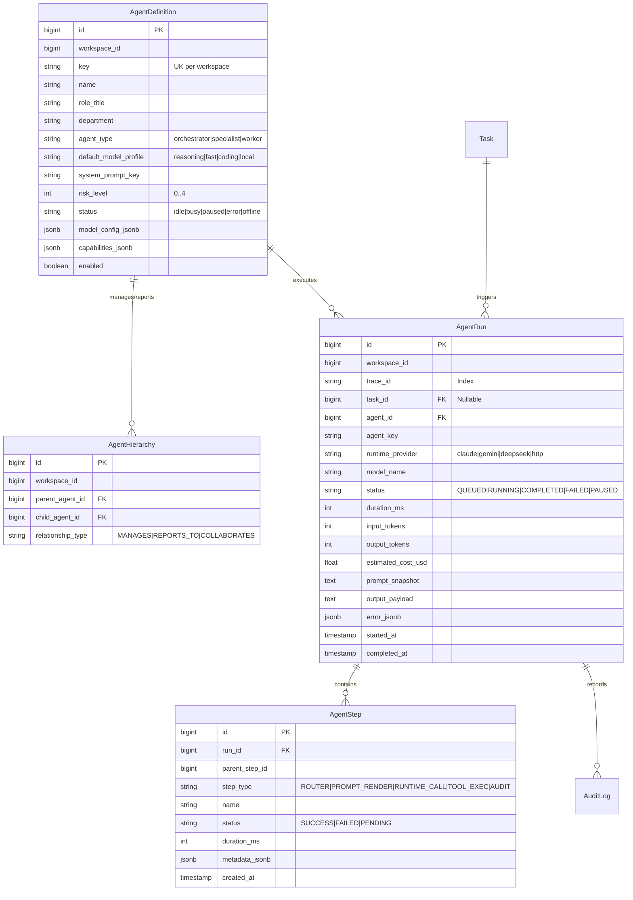
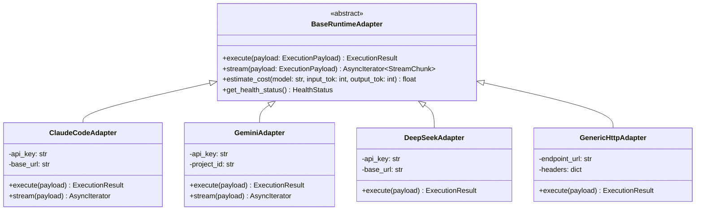
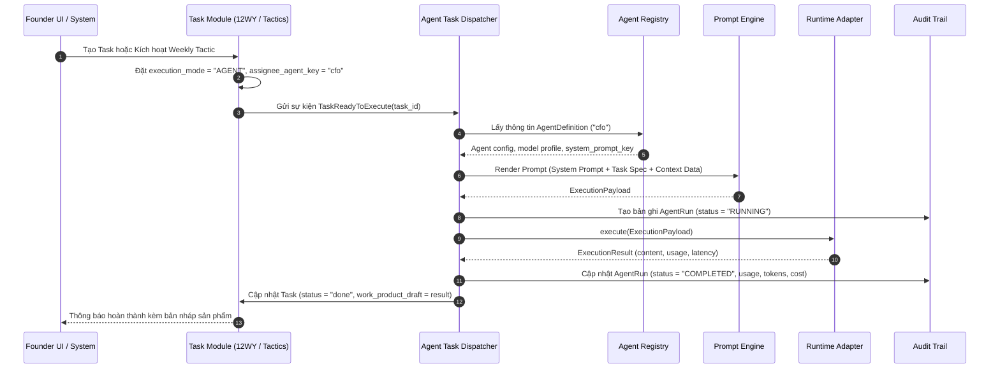

# Kế hoạch Triển khai Chi tiết: Phase A — Core Control Plane (COSA)

Tài liệu này đặc tả chi tiết kế hoạch kỹ thuật, kiến trúc mã nguồn, database schema, interface adapters và luồng thực thi cho **Phase A — Core Control Plane** thuộc hệ thống **COSA (Founder Operating System + AI Workforce Control Plane)**.

---

## 1. Mục Tiêu & Tiêu Chí Thành Công (Phase A Objectives)

### 1.1. Mục tiêu cốt lõi
1. **Agent Registry & Org Structure**: Quản lý toàn bộ danh bạ Agent, định danh, role, model profile mặc định, trạng thái hoạt động (`idle`, `busy`, `paused`, `error`, `offline`) và sơ đồ tổ chức cấp bậc (*Org Chart*).
2. **Runtime Adapter Layer**: Xây dựng lớp trừu tượng đa nhà cung cấp (*Model/Provider Agnostic*) cho phép Agent chạy trên Claude Code, Gemini (ADK 2.0), DeepSeek và Generic OpenAI/HTTP Endpoint mà không sửa đổi core logic.
3. **Task Assignment & Dispatcher Engine**: Kết nối thông suốt giữa các Task từ chu kỳ vận hành doanh nghiệp (Weekly Tactics/12-Week Year) với Agent hoặc Human, quản lý vòng đời chuyển trạng thái tác vụ.
4. **Agent Run & Execution Pipeline**: Quản lý phiên chạy (Run Context), thu thập token metrics, duration, output payload và error handler.
5. **Immutable Core Audit Trail**: Ghi nhật ký kiểm toán không thể can thiệp cho mọi lần chạy (trace ID, prompt snapshot, model response, tool invocations).

### 1.2. Tiêu chí nghiệm thu (Definition of Done - DoD)
- [ ] CRUD và quản lý Agent đầy đủ qua REST API và SQLAlchemy models.
- [ ] Khởi tạo thành công 12+ Agent chuẩn từ Factory Defaults (Founder Assistant, CFO, CMO, Sales Lead, Legal Officer, Tech Lead, DevOps, Data Analyst, Product Lead, HR...).
- [ ] Hoàn thành 4 Runtime Adapters (`ClaudeCodeAdapter`, `GeminiAdapter`, `DeepSeekAdapter`, `GenericHttpAdapter`) vượt qua unit test giả lập (Mock Test) và live execution test.
- [ ] Task gán cho AI Agent được tự động Dispatcher nhận diện, nạp Context, gọi Runtime tương ứng và cập nhật trạng thái `COMPLETED` kèm `AgentRun` log.
- [ ] Toàn bộ quá trình chạy được lưu vết vào `platform_agent_runs` và `platform_agent_steps` với đầy đủ token metrics.

---

## 2. Thiết Kế Database Schema & Data Models



---

## 3. Kiến Trúc Runtime Adapter Layer

Lớp Runtime Adapter chịu trách nhiệm chuẩn hóa giao tiếp giữa COSA và các AI Model Provider khác nhau, bảo đảm nguyên tắc **Model Agnostic**.



### 3.1. Unified Payloads & Data Transfer Objects (DTO)

```python
# backend/app/agent_platform/adapters/base.py

from dataclasses import dataclass, field
from typing import List, Dict, Any, Optional
from enum import Enum

class ModelRole(str, Enum):
    SYSTEM = "system"
    USER = "user"
    ASSISTANT = "assistant"
    TOOL = "tool"

@dataclass
class Message:
    role: ModelRole
    content: str
    name: Optional[str] = None
    tool_call_id: Optional[str] = None
    metadata: Dict[str, Any] = field(default_factory=dict)

@dataclass
class ExecutionPayload:
    trace_id: str
    agent_key: str
    model_name: str
    messages: List[Message]
    temperature: float = 0.2
    max_tokens: int = 4096
    tools_schema: Optional[List[Dict[str, Any]]] = None
    stop_sequences: Optional[List[str]] = None
    extra_params: Dict[str, Any] = field(default_factory=dict)

@dataclass
class TokenUsage:
    prompt_tokens: int
    completion_tokens: int
    total_tokens: int
    cost_usd: float = 0.0

@dataclass
class ExecutionResult:
    trace_id: str
    content: str
    tool_calls: List[Dict[str, Any]] = field(default_factory=list)
    usage: TokenUsage = field(default_factory=lambda: TokenUsage(0, 0, 0, 0.0))
    finish_reason: str = "stop"  # stop | length | tool_calls | error
    latency_ms: int = 0
    raw_response: Optional[Dict[str, Any]] = None
```

### 3.2. Dynamic Adapter Factory
Bộ điều phối Adapter tự động tra cứu cấu hình model profile (`fast` $\rightarrow$ Gemini 2.0 Flash, `reasoning` $\rightarrow$ Claude 3.5 Sonnet / DeepSeek R1, `coding` $\rightarrow$ Claude Code / Codex, `local` $\rightarrow$ Ollama HTTP) và khởi tạo Adapter tương ứng.

---

## 4. Quy Trình Phân Công & Thực Thi Tác Vụ (Task Dispatcher Workflow)



---

## 5. Danh Mục Các Tệp Cần Triển Khai Trong Phase A

### 5.1. Database & Models
- `[MODIFY] backend/app/agent_platform/models.py`:
  - Mở rộng model `AgentDefinition`: bổ sung `role_title`, `department`, `status`, `capabilities_jsonb`, `model_config_jsonb`.
  - Tạo mới model `AgentHierarchy` (Org Chart quan hệ cấp bậc giữa các Agent và Human Lead).
  - Hoàn thiện model `AgentRun`, `AgentStep` đồng bộ chặt chẽ với DTO `ExecutionResult`.
- `[NEW] backend/alembic/versions/xxxx_cosa_phase_a_models.py`:
  - File di chuyển cơ sở dữ liệu (Alembic migration) khởi tạo và cập nhật schema.

### 5.2. Runtime Adapters Layer
- `[NEW] backend/app/agent_platform/adapters/__init__.py`: Export toàn bộ interface và adapter classes.
- `[NEW] backend/app/agent_platform/adapters/base.py`: Abstract Base Class `BaseRuntimeAdapter`, `ExecutionPayload`, `ExecutionResult`, `TokenUsage`.
- `[NEW] backend/app/agent_platform/adapters/factory.py`: `RuntimeAdapterFactory` chọn adapter theo cấu hình Agent.
- `[NEW] backend/app/agent_platform/adapters/claude_adapter.py`: Adapter cho Anthropic Claude API / Claude Code.
- `[NEW] backend/app/agent_platform/adapters/gemini_adapter.py`: Adapter cho Google Gemini API / ADK 2.0.
- `[NEW] backend/app/agent_platform/adapters/deepseek_adapter.py`: Adapter cho DeepSeek API (V3/R1).
- `[NEW] backend/app/agent_platform/adapters/http_generic_adapter.py`: Adapter chuẩn OpenAI-compatible / Local Ollama.

### 5.3. Task Dispatcher & Execution Engine
- `[NEW] backend/app/agent_platform/dispatcher/__init__.py`: Package init.
- `[NEW] backend/app/agent_platform/dispatcher/task_dispatcher.py`: `AgentTaskDispatcher` nhận task từ module `tasks`, chuẩn bị context và điều phối execution.
- `[NEW] backend/app/agent_platform/dispatcher/context_builder.py`: Tổng hợp ngữ cảnh cho Agent (System prompt, Task details, Company profile, 12WY Objective).
- `[NEW] backend/app/agent_platform/dispatcher/runner.py`: `AgentRunnerService` thực thi và quản lý lifecycle của `AgentRun`.

### 5.4. Agent Registry & Factory Defaults
- `[MODIFY] backend/app/agent_platform/registry/defaults.py`: Cập nhật bộ 12+ Agent chuẩn theo mô hình COSA Founder OS:
  1. `founder_copilot` (Chief of Staff)
  2. `cfo_agent` (Finance & Cashflow)
  3. `cmo_agent` (Marketing & Growth)
  4. `sales_agent` (B2B Pipeline & Deal closer)
  5. `tech_lead_agent` (Architecture & Tech Radar)
  6. `devops_agent` (Infrastructure & Reliability)
  7. `legal_agent` (Compliance & Contract reviewer)
  8. `hr_agent` (Workforce & Culture)
  9. `product_agent` (Spec & Feature roadmap)
  10. `data_analyst_agent` (Metrics & Scoreboard analytics)
  11. `researcher_agent` (Market intelligence & Policy funding)
  12. `operations_agent` (12WY Tactics Tracking)
- `[MODIFY] backend/app/agent_platform/registry/agent_registry.py`: Bổ sung methods quản lý Org Chart, trạng thái liveness, và seed data mở rộng.

### 5.5. API & Admin Endpoints
- `[MODIFY] backend/app/agent_platform/api/admin_api.py`:
  - Thêm endpoint `POST /api/v1/agent-platform/agents/{key}/test-run`: Test trực tiếp agent với mock/real prompt.
  - Thêm endpoint `GET /api/v1/agent-platform/org-chart`: Trả về sơ đồ cây phân cấp nhân sự số.
  - Thêm endpoint `GET /api/v1/agent-platform/runs`: Liệt kê lịch sử chạy, lọc theo status, agent, date.
  - Thêm endpoint `GET /api/v1/agent-platform/runs/{run_id}`: Xem chi tiết các bước (AgentStep), prompt snapshot và output payload.

---

## 6. Kế Hoạch Kiểm Thử Chi Tiết (Test Suite Cho Phase A)

```
tests/agent_platform/
├── test_agent_registry.py      # Test CRUD agent, seed factory defaults, org chart hierarchy
├── test_runtime_adapters.py    # Test mock calls & error handling cho Claude, Gemini, DeepSeek, HTTP
├── test_task_dispatcher.py     # Test luồng nhận task, gán agent, build context và trigger runner
├── test_agent_runner.py        # Test lifecycle của AgentRun, token counter, latency calculation
└── test_audit_trail.py         # Test tính toàn vẹn và bất biến của bảng Audit Logs
```

### Kịch bản kiểm thử mẫu (Test Cases)
1. **TC-A1 (Registry Defaults)**: Khởi tạo database mới $\rightarrow$ Gọi seed defaults $\rightarrow$ Xác nhận 12 Agent xuất hiện đầy đủ với đúng key, prompt key, risk level.
2. **TC-A2 (Adapter Switching)**: Chạy cùng 1 ExecutionPayload qua `ClaudeCodeAdapter` và `GeminiAdapter` (sử dụng Mock HTTP Client) $\rightarrow$ Xác nhận cấu trúc `ExecutionResult` đồng nhất về `content`, `usage`, `finish_reason`.
3. **TC-A3 (Task Dispatching)**: Tạo một Task trong bảng `tasks` với `execution_mode="AGENT"` và `assignee_agent_key="cfo_agent"` $\rightarrow$ Kích hoạt `AgentTaskDispatcher.dispatch_task(task_id)` $\rightarrow$ Xác nhận task chuyển sang trạng thái `done`, có bản ghi `AgentRun` tương ứng được liên kết.
4. **TC-A4 (Audit Immutability)**: Xác nhận sau khi AgentRun kết thúc, các trường `prompt_snapshot`, `output_payload`, `input_tokens`, `output_tokens` được ghi nhận đầy đủ và không bị mất mát.

---

## 7. Các Bước Triển Khai Theo Thứ Tự Thực Hiện (Step-by-Step Execution Plan)

```
Step A.1: Nâng cấp Database Models (AgentDefinition, AgentHierarchy, AgentRun) & Alembic Migration
   ↓
Step A.2: Cập nhật Catalog 12 Agent Defaults & Registry Service (Org Chart support)
   ↓
Step A.3: Xây dựng Core Runtime Adapter Layer (Base + Claude + Gemini + DeepSeek + HTTP Generic)
   ↓
Step A.4: Xây dựng Context Builder & Agent Task Dispatcher kết nối với module Tasks
   ↓
Step A.5: Hoàn thiện REST APIs (Org Chart, Test Run, Run History Detail)
   ↓
Step A.6: Chạy toàn bộ Test Suite Phase A và hoàn thiện báo cáo nghiệm thu
```
