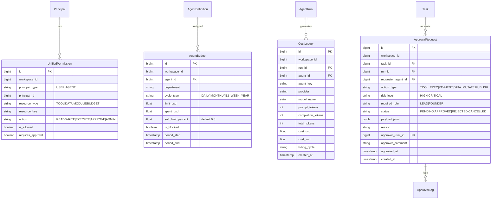

# Kế hoạch Triển khai Chi tiết: Phase B — Governance & Financial Accountability (COSA)

Tài liệu này đặc tả chi tiết kế hoạch kỹ thuật, cơ sở dữ liệu, logic phân quyền hợp nhất, ma trận rủi ro, quy trình phê duyệt (Approval Inbox), quản trị ngân sách và sổ cái chi phí (*Cost Ledger*) cho **Phase B** thuộc hệ thống **COSA (Founder Operating System + AI Workforce Control Plane)**.

---

## 1. Mục Tiêu & Tiêu Chí Thành Công (Phase B Objectives)

### 1.1. Mục tiêu cốt lõi
1. **Unified Permission Engine**: Cả Human User và AI Agent đều là `Principal` đi qua một cơ chế kiểm tra quyền duy nhất (`can(principal, action, resource)`).
2. **3-Tier Risk Policy Evaluator**: Phân loại rủi ro chuẩn hóa theo 3 cấp độ:
   - **LOW**: Tự động thực thi không cần duyệt (Đọc, tìm kiếm, soạn thảo nháp).
   - **HIGH**: Tạm dừng và yêu cầu Nhân sự / Lead phê duyệt (Gửi email, cập nhật CRM, sinh code).
   - **CRITICAL**: Bắt buộc đích danh Founder phê duyệt (Chi tiền, xóa dữ liệu, hạch toán kế toán, cấp quyền).
3. **Human Approval Inbox**: Quản lý phiếu phê duyệt (`ApprovalRequest`) với cơ chế giữ trạng thái tác vụ (`waiting_approval`), hỗ trợ Founder/Lead duyệt lệnh nhanh hoặc từ chối kèm lý do.
4. **Budgeting Engine & Quotas**: Thiết lập hạn mức ngân sách (Daily / Monthly / 12-Week Year) cho từng Agent và Department, cảnh báo 80% (Soft limit) và chặn khi đạt 100% (Hard limit).
5. **Immutable Cost Ledger**: Sổ cái tài chính bất biến ghi nhận chi phí token, tiền USD/VND cho mọi Agent Run, phục vụ kế toán quản trị và minh bạch tài chính.

### 1.2. Tiêu chí nghiệm thu (Definition of Done - DoD)
- [ ] Bổ sung các bảng `cosa_permissions`, `cosa_approvals`, `cosa_budgets`, `cosa_cost_ledger` vào SQLAlchemy models.
- [ ] Permission Engine kiểm tra quyền chính xác cho cả User và Agent.
- [ ] Hành động HIGH/CRITICAL tự động tạo phiếu chờ duyệt trong Approval Inbox và tạm dừng Task.
- [ ] Khi Founder bấm `APPROVED`, Task tự động tiếp tục hoàn thành và ghi nhận kết quả.
- [ ] Cost Ledger ghi nhận chính xác chi phí token, tiền USD/VND cho từng AgentRun và trừ vào quota của Budget.
- [ ] Đạt 100% test cases trong Test Suite của Phase B.

---

## 2. Thiết Kế Database Schema Cho Governance

---

## 3. Danh Mục Các Tệp Triển Khai Trong Phase B

### 3.1. Database Models & Schema
- `[MODIFY] backend/app/agent_platform/models.py`:
  - Thêm model `UnifiedPermission` (quản lý phân quyền Human & Agent chung).
  - Thêm model `ApprovalRequest` (phiếu phê duyệt của Human Approval Inbox).
  - Thêm model `AgentBudget` (ngân sách chi tiêu theo chu kỳ).
  - Thêm model `CostLedger` (sổ cái ghi nhận chi phí token/tiền).

### 3.2. Governance Engines
- `[NEW] backend/app/agent_platform/governance/__init__.py`: Package export.
- `[NEW] backend/app/agent_platform/governance/permission_engine.py`: `UnifiedPermissionEngine` kiểm tra quyền tập trung cho cả Human và Agent.
- `[NEW] backend/app/agent_platform/governance/risk_evaluator.py`: `RiskPolicyEvaluator` phân tầng rủi ro 3 cấp (LOW, HIGH, CRITICAL).
- `[NEW] backend/app/agent_platform/governance/approval_service.py`: `ApprovalInboxService` tạo phiếu, duyệt, từ chối và resume execution.
- `[NEW] backend/app/agent_platform/governance/budget_service.py`: `BudgetingEngine` kiểm tra quota, cảnh báo 80% và kích hoạt circuit breaker khi vượt 100%.
- `[NEW] backend/app/agent_platform/governance/cost_ledger_service.py`: `CostLedgerService` ghi sổ cái tài chính, quy đổi USD $\rightarrow$ VND (tỷ giá 25,400) và xuất báo cáo tổng hợp.

### 3.3. Tích Hợp Vào Dispatcher & Gateway
- `[MODIFY] backend/app/agent_platform/dispatcher/task_dispatcher.py`:
  - Trước khi chạy: Kiểm tra Budget quota qua `BudgetingEngine`.
  - Đánh giá Risk: Nếu hành động là HIGH/CRITICAL $\rightarrow$ Tự động chuyển Task sang `waiting_approval` và tạo `ApprovalRequest`.
  - Sau khi chạy: Ghi nhận chi phí vào `CostLedger` và trừ vào `AgentBudget`.

### 3.4. REST API Endpoints
- `[MODIFY] backend/app/agent_platform/api/admin_api.py`:
  - `GET /api/v1/agent-platform/approvals`: Lấy danh sách phiếu chờ duyệt (Inbox).
  - `POST /api/v1/agent-platform/approvals/{id}/approve`: Founder/Lead duyệt phiếu.
  - `POST /api/v1/agent-platform/approvals/{id}/reject`: Từ chối phiếu kèm lý do.
  - `GET /api/v1/agent-platform/budgets`: Danh sách ngân sách các Agent & Phòng ban.
  - `POST /api/v1/agent-platform/budgets`: Thiết lập hạn mức ngân sách.
  - `GET /api/v1/agent-platform/cost-ledger`: Sổ cái chi phí và báo cáo tài chính.

---

## 4. Kế Hoạch Kiểm Thử Phase B (Pytest)

- Tạo tệp `backend/app/tests/agent_platform/test_cosa_phase_b_governance.py`:
  - `TestUnifiedPermissions`: Test kiểm tra quyền của User và Agent chung engine.
  - `TestRiskMatrixAndApprovalFlow`: Test hành động LOW tự chạy, HIGH/CRITICAL tạo phiếu `ApprovalRequest` và resume khi Founder bấm duyệt.
  - `TestBudgetQuotaAndCircuitBreaker`: Test phát hiện vượt ngân sách và ngắt chạy.
  - `TestCostLedgerRecording`: Test ghi nhận sổ cái bất biến, quy đổi USD/VND chính xác.
