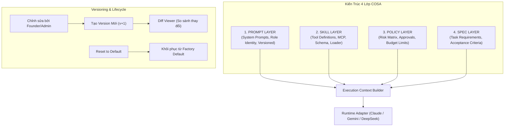

# Kế hoạch Triển khai Chi tiết: Phase C — Skills & Extensibility Framework (COSA)

Tài liệu này đặc tả chi tiết kế hoạch kỹ thuật, cơ sở dữ liệu, kiến trúc nạp kỹ năng động (*Dynamic Skill Loader*), phân tách 4 lớp (*Prompt, Skill, Policy, Spec*), cơ chế phiên bản (*Versioning & Diffing*), và khôi phục cài đặt gốc (*Reset to Default*) cho **Phase C** thuộc hệ thống **COSA (Founder Operating System + AI Workforce Control Plane)**.

---

## 1. Mục Tiêu & Tiêu Chí Thành Công (Phase C Objectives)

### 1.1. Mục tiêu cốt lõi
1. **Phân Tách 4 Lớp (Separation of 4 Layers)**:
   - **Prompt**: System prompt và ngữ cảnh vai trò (được tham số hóa và versioning).
   - **Skill (Tools)**: Khối kỹ năng thực thi (Python local tool, MCP Server tool, REST API tool) có schema I/O rõ ràng.
   - **Policy**: Bộ quy tắc rủi ro và điều kiện phê duyệt (Risk Matrix R0-R4).
   - **Spec**: Đặc tả nhiệm vụ và tiêu chuẩn nghiệm thu đầu ra của Task.
2. **Skill Registry & Manifest Catalog**: Quản lý toàn bộ danh mục kỹ năng, hỗ trợ khai báo MCP servers, API endpoints và Python native tools.
3. **Dynamic Skill Loader**: Cấp phát danh sách tools động vào payload của LLM theo từng lượt chạy dựa trên quyền hạn (`UnifiedPermissionEngine`) của Agent.
4. **Skill & Prompt Versioning with Diffing**: Lưu trữ toàn bộ lịch sử chỉnh sửa prompt/tool spec, hỗ trợ xem `diff` giữa các phiên bản.
5. **Reset to Default Mechanism**: Nút khôi phục một chạm đưa Prompt hoặc Skill Spec về cấu hình chuẩn gốc của nhà sản xuất (Factory Defaults).

### 1.2. Tiêu chí nghiệm thu (Definition of Done - DoD)
- [ ] Bổ sung bảng `platform_tool_versions` và model `SkillManifest` hoàn chỉnh.
- [ ] Phân tách rõ ràng 4 lớp: Prompt, Skill, Policy, Spec trong cấu trúc dữ liệu.
- [ ] `DynamicSkillLoader` lọc và cung cấp chính xác danh sách Tools được phép cho Agent trước mỗi Run.
- [ ] Chức năng Versioning ghi nhận version mới mỗi khi cập nhật Prompt hoặc Tool, có API xem `diff`.
- [ ] Tính năng `Reset to Default` khôi phục chính xác nội dung gốc từ manifest chuẩn.
- [ ] Vượt qua 100% test cases trong Test Suite của Phase C.

---

## 2. Thiết Kế Kiến Trúc 4 Lớp & Versioning

---

## 3. Danh Mục Các Tệp Triển Khai Trong Phase C

### 3.1. Database Models & Schema
- `[MODIFY] backend/app/agent_platform/models.py`:
  - Thêm model `PlatformToolVersion` (lưu lịch sử sửa đổi Tool Definition).
  - Bổ sung trường `version`, `default_config_jsonb`, `default_input_schema` vào `ToolDefinition`.

### 3.2. Skill Registry & Dynamic Loader
- `[NEW] backend/app/agent_platform/skills/__init__.py`: Package export.
- `[NEW] backend/app/agent_platform/skills/skill_registry.py`: `SkillRegistryService` mở rộng quản lý skills, MCP tool discovery và tool definitions.
- `[NEW] backend/app/agent_platform/skills/skill_loader.py`: `DynamicSkillLoader` nạp danh sách tools động theo Agent Permissions và format OpenAI/Anthropic/Gemini Tool Schema.
- `[NEW] backend/app/agent_platform/skills/versioning.py`: `SkillVersioningService` tính toán phiên bản, tạo bản ghi diff và hỗ trợ reset to default.

### 3.3. Tích Hợp Vào Execution Pipeline
- `[MODIFY] backend/app/agent_platform/dispatcher/context_builder.py`:
  - Nạp tools động từ `DynamicSkillLoader` vào `ExecutionPayload.tools_schema`.

### 3.4. REST API Endpoints
- `[MODIFY] backend/app/agent_platform/api/admin_api.py`:
  - `GET /api/v1/agent-platform/skills`: Danh bạ toàn bộ skills & MCP tools.
  - `GET /api/v1/agent-platform/skills/{key}/versions`: Lịch sử các phiên bản của Skill.
  - `POST /api/v1/agent-platform/skills/{key}/restore-default`: Khôi phục Skill về mặc định.
  - `GET /api/v1/agent-platform/prompts/{key}/versions`: Lịch sử phiên bản Prompt.
  - `GET /api/v1/agent-platform/prompts/{key}/diff`: So sánh giữa phiên bản hiện tại và mặc định/phiên bản cũ.

---

## 4. Kế Hoạch Kiểm Thử Phase C (Pytest)

- Tạo tệp `backend/app/tests/agent_platform/test_cosa_phase_c_skills.py`:
  - `TestDynamicSkillLoader`: Kiểm thử cấp phát tool động dựa trên quyền hạn Agent.
  - `TestSkillVersioningAndDiff`: Kiểm thử tự động tăng version và tính toán diff.
  - `TestResetToDefault`: Kiểm thử khôi phục cả Prompt và Tool về Factory Defaults.
  - `TestFourLayersSeparation`: Kiểm thử tách biệt 4 lớp (Prompt, Skill, Policy, Spec).
