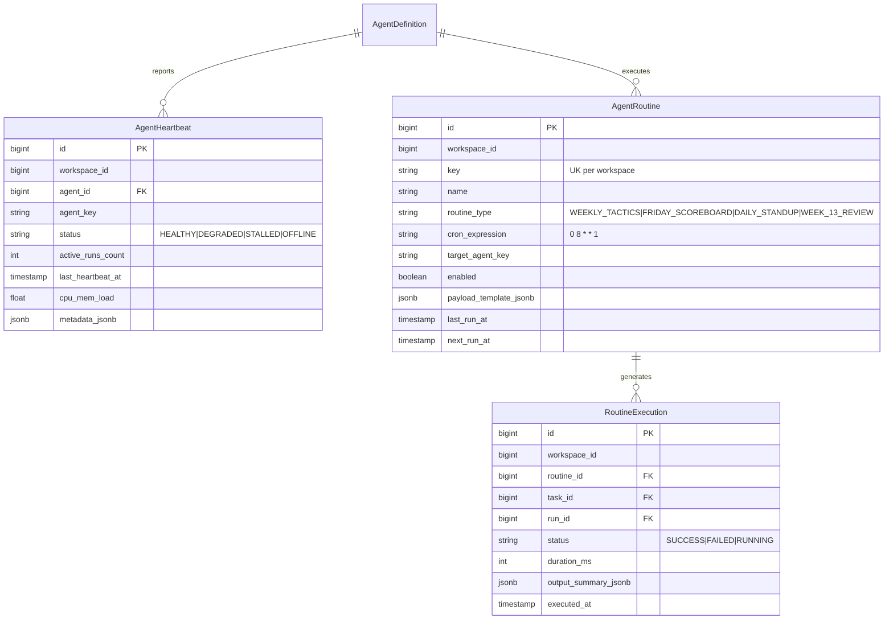

# Kế hoạch Triển khai Chi tiết: Phase D — Automation & Orchestration (COSA)

Tài liệu này đặc tả chi tiết kế hoạch kỹ thuật, cơ sở dữ liệu, trục sự kiện nội bộ (*Internal Event Bus*), cơ chế giám sát liveness (*Heartbeat Worker*), và động cơ lập lịch quy trình tuần hoàn (*12-Week Year Routines*) cho **Phase D** thuộc hệ thống **COSA (Founder Operating System + AI Workforce Control Plane)**.

---

## 1. Mục Tiêu & Tiêu Chí Thành Công (Phase D Objectives)

### 1.1. Mục tiêu cốt lõi
1. **Event-driven First Architecture**: Xây dựng trục sự kiện nội bộ bất đồng bộ (*Internal Async Event Bus*), ưu tiên phản ứng tức thì theo sự kiện (Event-driven > Scheduled > Polling).
2. **Heartbeat & Liveness Monitor**: Giám sát nhịp tim và trạng thái của toàn bộ AI Agent, phát hiện các tác vụ bị treo (Stalled Runs), quá thời gian thực thi (Timeouts) và tự động phục hồi.
3. **12-Week Year Routine Engine**: Tự động hóa các quy trình doanh nghiệp tuần hoàn theo chu kỳ 12-Week Year:
   - **Thứ 2 (08:00 AM)**: Khởi tạo bảng kế hoạch tuần (*Weekly Tactics Dispatch*), giao việc cho Human và AI Agent.
   - **Thứ 6 (17:00 PM)**: Tổng hợp bảng chỉ số (*Weekly Scoreboard Aggregation*) và tạo báo cáo tuần cho Founder.
   - **Hàng ngày (Daily 09:00 AM)**: Tóm tắt Daily Standup Brief & kiểm tra Blocker.
   - **Tuần 13 (Week 13 Routine)**: Đánh giá hiệu suất chu kỳ và chuẩn bị chuyển giao chu kỳ mới.
4. **Resilient Error Recovery & Deadlock Prevention**: Ngăn chặn tình trạng Agent chờ đợi vô tận, tự động giải phóng tài nguyên khi lỗi.

### 1.2. Tiêu chí nghiệm thu (Definition of Done - DoD)
- [ ] Bổ sung các bảng `cosa_routines`, `cosa_routine_logs`, `cosa_agent_heartbeats` vào models.
- [ ] `InternalEventBus` phát và nhận sự kiện bất đồng bộ chính xác giữa các module.
- [ ] `HeartbeatMonitor` phát hiện thành công AgentRun bị kẹt (`RUNNING > 10 phút`) và chuyển sang trạng thái `FAILED` kèm cảnh báo.
- [ ] `RoutineScheduler` kích hoạt đúng các chu kỳ tự động (Weekly Tactics, Friday Scoreboard, Daily Standup).
- [ ] Đạt 100% test cases trong Test Suite của Phase D.

---

## 2. Thiết Kế Database Schema & Kiến Trúc Tự Động Hóa

---

## 3. Danh Mục Các Tệp Triển Khai Trong Phase D

### 3.1. Database Models & Schema
- `[MODIFY] backend/app/agent_platform/models.py`:
  - Thêm model `AgentHeartbeat` (ghi nhận trạng thái liveness).
  - Thêm model `AgentRoutine` (cấu hình routine định kỳ).
  - Thêm model `RoutineExecution` (lịch sử thực thi routine).

### 3.2. Automation & Orchestration Services
- `[NEW] backend/app/agent_platform/automation/__init__.py`: Package export.
- `[NEW] backend/app/agent_platform/automation/event_bus.py`: `InternalEventBus` phát và xử lý sự kiện bất đồng bộ (`publish`, `subscribe`, `dispatch`).
- `[NEW] backend/app/agent_platform/automation/heartbeat_monitor.py`: `HeartbeatMonitorService` kiểm tra liveness, phát hiện và thu hồi các run bị treo (Stalled Run Recovery).
- `[NEW] backend/app/agent_platform/automation/routine_service.py`: `RoutineService` quản lý và kích hoạt các quy trình tuần hoàn (Weekly Tactics, Friday Scoreboard, Daily Standup, Week 13 Review).

### 3.3. Tích Hợp Vào Dispatcher & API
- `[MODIFY] backend/app/agent_platform/dispatcher/task_dispatcher.py`:
  - Phát sự kiện `TaskDispatchedEvent` và `TaskCompletedEvent` qua `InternalEventBus`.
- `[MODIFY] backend/app/agent_platform/api/admin_api.py`:
  - `GET /api/v1/agent-platform/heartbeats`: Danh sách nhịp tim liveness của các Agent.
  - `POST /api/v1/agent-platform/heartbeats/check-stalled`: Kích hoạt thủ công kiểm tra và dọn dẹp task bị treo.
  - `GET & POST /api/v1/agent-platform/routines`: Quản lý danh sách routines tuần hoàn.
  - `POST /api/v1/agent-platform/routines/{key}/trigger`: Kích hoạt ngay một Routine.

---

## 4. Kế Hoạch Kiểm Thử Phase D (Pytest)

- Tạo tệp `backend/app/tests/agent_platform/test_cosa_phase_d_automation.py`:
  - `TestInternalEventBus`: Kiểm thử publish/subscribe và truyền sự kiện giữa các subscribers.
  - `TestHeartbeatAndStalledRecovery`: Kiểm thử phát hiện AgentRun bị treo quá thời gian và thu hồi an toàn.
  - `TestRoutineScheduler12WY`: Kiểm thử kích hoạt Monday Morning Tactics và Friday Scoreboard routines.
  - `TestEventDrivenExecutionFlow`: Kiểm thử luồng Task Dispatcher tự động phát sinh sự kiện và kích hoạt downstream handlers.
