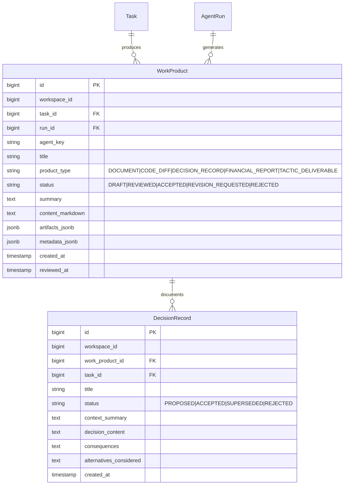

# Kế hoạch Triển khai Chi tiết: Phase E — Work Product Contract (COSA)

Tài liệu này đặc tả chi tiết kế hoạch kỹ thuật, cơ sở dữ liệu, tiêu chuẩn văn bản hóa (*Work Product Contract*), chuyển đổi đầu ra thô thành sản phẩm bàn giao (*Draft Artifact*), và hệ thống ghi nhận quyết định / nhật ký thay đổi (*Decision Records & Changelogs*) cho **Phase E** thuộc hệ thống **COSA (Founder Operating System + AI Workforce Control Plane)**.

---

## 1. Mục Tiêu & Tiêu Chí Thành Công (Phase E Objectives)

### 1.1. Mục tiêu cốt lõi
1. **Nguyên Tắc Văn Bản Hóa Tuyệt Đối (Work Product Contract)**:
   - Chấm dứt tình trạng Agent chỉ trả về văn bản chat thô. Mọi lượt chạy hoàn thành bắt buộc phải sản sinh ra một **Work Product** có cấu trúc, mã định danh, tiêu đề, tóm tắt điều hành và sản phẩm bàn giao chi tiết.
2. **Draft Artifact Generation**:
   - Tự động đóng gói kết quả thành bản thảo bàn giao (*Draft Artifact*), cho phép Founder/Lead xem trước, chỉnh sửa hoặc yêu cầu hiệu đính (*Request Revision*).
3. **Decision Records (ADR) & Changelog Engine**:
   - Tự động trích xuất các quyết định quan trọng thành **Decision Record** (Bối cảnh, Quyết định, Hệ quả, Phương án thay thế) phục vụ lưu trữ tri thức doanh nghiệp dài hạn.
4. **Quy Trình Nghiệm Thu Sản Phẩm (Acceptance Workflow)**:
   - Trạng thái vòng đời sản phẩm: `DRAFT` $\rightarrow$ `REVIEWED` $\rightarrow$ `ACCEPTED` (hoặc `REVISION_REQUESTED` / `REJECTED`). Khi Founder bấm *Accept*, Task chính thức được đánh dấu hoàn thành xuất sắc.

### 1.2. Tiêu chí nghiệm thu (Definition of Done - DoD)
- [ ] Bổ sung các bảng `work_products`, `work_product_artifacts`, `decision_records` vào models.
- [ ] `WorkProductTransformer` tự động chuẩn hóa chuỗi text thô của LLM thành thực thể `WorkProduct` chuẩn.
- [ ] Hỗ trợ xuất và lưu `DecisionRecord` có cấu trúc cho các quyết định chiến lược.
- [ ] Các API Nghiệm thu (`/accept`, `/revise`, `/reject`) hoạt động đồng bộ với trạng thái Task.
- [ ] Đạt 100% test cases trong Test Suite của Phase E.

---

## 2. Thiết Kế Database Schema & Vòng Đời Work Product

---

## 3. Danh Mục Các Tệp Triển Khai Trong Phase E

### 3.1. Database Models & Schema
- `[MODIFY] backend/app/agent_platform/models.py`:
  - Thêm model `WorkProduct` (sản phẩm bàn giao văn bản hóa).
  - Thêm model `DecisionRecord` (bản ghi quyết định quản trị/kỹ thuật ADR).

### 3.2. Work Product & Decision Services
- `[NEW] backend/app/agent_platform/work_product/__init__.py`: Package export.
- `[NEW] backend/app/agent_platform/work_product/transformer.py`: `WorkProductTransformer` chuyển đổi chuỗi phản hồi thô thành `WorkProduct` chuẩn cấu trúc Markdown & Artifacts.
- `[NEW] backend/app/agent_platform/work_product/work_product_service.py`: `WorkProductService` quản lý vòng đời (Tạo Draft, Review, Accept, Request Revision).
- `[NEW] backend/app/agent_platform/work_product/decision_service.py`: `DecisionRecordService` tạo và quản lý hồ sơ quyết định kiến trúc/chiến lược.

### 3.3. Tích Hợp Task Dispatcher & REST API
- `[MODIFY] backend/app/agent_platform/dispatcher/task_dispatcher.py`:
  - Tự động tạo `WorkProduct` sau khi Agent hoàn thành lượt chạy.
- `[MODIFY] backend/app/agent_platform/api/admin_api.py`:
  - `GET /api/v1/agent-platform/work-products`: Danh sách Work Products theo Task/Agent/Status.
  - `GET /api/v1/agent-platform/work-products/{id}`: Chi tiết sản phẩm bàn giao kèm artifacts.
  - `POST /api/v1/agent-platform/work-products/{id}/accept`: Founder nghiệm thu sản phẩm.
  - `POST /api/v1/agent-platform/work-products/{id}/revise`: Yêu cầu Agent sửa lại.
  - `GET & POST /api/v1/agent-platform/decisions`: Quản lý hồ sơ quyết định (Decision Records).

---

## 4. Kế Hoạch Kiểm Thử Phase E (Pytest)

- Tạo tệp `backend/app/tests/agent_platform/test_cosa_phase_e_work_product.py`:
  - `TestWorkProductTransformer`: Kiểm thử chuẩn hóa output thô thành Work Product có cấu trúc.
  - `TestWorkProductLifecycle`: Kiểm thử quy trình từ Draft $\rightarrow$ Revision $\rightarrow$ Acceptance.
  - `TestDecisionRecordGeneration`: Kiểm thử tạo và tra cứu ADR.
  - `TestTaskDispatcherWorkProductIntegration`: Kiểm thử Dispatcher tự động tạo Work Product khi hoàn tất task.
