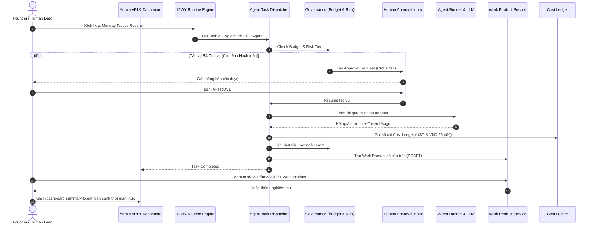

# Kế hoạch Triển khai Chi tiết: Phase F — End-to-End System Verification & Dashboard Ready (COSA)

Tài liệu này đặc tả chi tiết kế hoạch kỹ thuật, API tổng hợp bảng điều khiển trung tâm (*Master Control Plane Dashboard Summary*), bộ kiểm thử tích hợp xuyên suốt (*End-to-End System Verification Test Suite*), và quy chuẩn chứng nhận vận hành (*Conformance Certification*) cho **Phase F** thuộc hệ thống **COSA (Founder Operating System + AI Workforce Control Plane)**.

---

## 1. Mục Tiêu & Tiêu Chí Thành Công (Phase F Objectives)

### 1.1. Mục tiêu cốt lõi
1. **Master Control Plane Dashboard Aggregator API**:
   - Cung cấp điểm cuối duy nhất `GET /api/v1/agent-platform/dashboard-summary` tổng hợp toàn diện:
     - **Workforce Status**: 12 Agents phân theo 6 phòng ban, trạng thái liveness (Healthy/Degraded/Stalled).
     - **Financial & Token Consumption**: Tổng chi phí USD, VND (tỷ giá 25,400), quota ngân sách còn lại, chi phí theo từng Agent & Provider.
     - **Governance & Approvals**: Số lượng phiếu chờ duyệt trong Inbox, số lượng tác vụ rủi ro cao.
     - **12-Week Year Progress**: Số lượng Routines đã chạy, số lượng Work Products đã tạo/được duyệt.
2. **End-to-End (E2E) Integration Flow Verification**:
   - Kiểm thử chu trình khép kín mô phỏng ngày làm việc thực tế của Founder:
     1. Khởi động quy trình tuần hoàn *Monday Morning Tactics*.
     2. Điều phối tác vụ tới các Agent chuyên môn.
     3. Tác vụ rủi ro thấp tự động chạy $\rightarrow$ Ghi sổ cái $\rightarrow$ Trừ budget $\rightarrow$ Tạo Work Product.
     4. Tác vụ rủi ro cao tự động chặn lại $\rightarrow$ Tạo phiếu duyệt trong Inbox $\rightarrow$ Chờ Founder duyệt $\rightarrow$ Resume chạy tiếp.
     5. Nghiệm thu sản phẩm bàn giao (Accept Work Product) & ghi nhận Quyết định chiến lược (Decision Record).
     6. Giám sát nhịp tim Heartbeat đảm bảo không có tác vụ bị kẹt.
3. **Control Plane Conformance & Full Regression Pass**:
   - Đảm bảo toàn bộ test suites từ Phase A đến Phase F chạy đồng nhất, 100% passed.

### 1.2. Tiêu chí nghiệm thu (Definition of Done - DoD)
- [ ] API `/api/v1/agent-platform/dashboard-summary` trả về đầy đủ các chỉ số thống kê thời gian thực.
- [ ] Xây dựng test suite E2E hoàn chỉnh tại `test_cosa_phase_f_e2e_verification.py`.
- [ ] Vượt qua 100% test cases trên toàn bộ hệ thống (Phase A $\rightarrow$ Phase F).
- [ ] Hoàn tất tài liệu báo cáo tổng kết và nghiệm thu toàn bộ dự án COSA D2 Control Plane.

---

## 2. Thiết Kế Luồng Tích Hợp E2E (End-to-End Lifecycle)

---

## 3. Danh Mục Các Tệp Triển Khai Trong Phase F

### 3.1. Dashboard Summary Aggregator Service
- `[NEW] backend/app/agent_platform/dashboard_service.py`: `ControlPlaneDashboardService` tính toán và tổng hợp toàn bộ số liệu thời gian thực từ 6 module con.

### 3.2. REST API Integration
- `[MODIFY] backend/app/agent_platform/api/admin_api.py`:
  - `GET /api/v1/agent-platform/dashboard-summary`: Bảng điều khiển trung tâm dành cho Founder.

### 3.3. End-to-End System Test Suite
- `[NEW] backend/app/tests/agent_platform/test_cosa_phase_f_e2e_verification.py`:
  - Kiểm thử toàn diện kịch bản E2E từ Monday Tactics $\rightarrow$ Governance Approval $\rightarrow$ Cost Ledger $\rightarrow$ Work Product $\rightarrow$ Dashboard Summary.

---

## 4. Kế Hoạch Kiểm Thử Toàn Diện (Full Conformance Suite)

Chạy kiểm thử tích lũy toàn bộ các module:
- `test_cosa_phase_a_control_plane.py` (Core Control Plane, 12 Manifests, 4 Adapters, Dispatcher)
- `test_cosa_phase_b_governance.py` (Unified Permissions, 3-Tier Risk, Inbox, Budget, Cost Ledger)
- `test_cosa_phase_c_skills.py` (4-Layer Separation, Dynamic Skill Loader, Diff, Reset Default)
- `test_cosa_phase_d_automation.py` (Event Bus, Heartbeat Monitor, 12WY Routines)
- `test_cosa_phase_e_work_product.py` (Work Product Contract, Transformer, ADR Decisions)
- `test_cosa_phase_f_e2e_verification.py` (End-to-End Full System Verification & Dashboard Summary)
