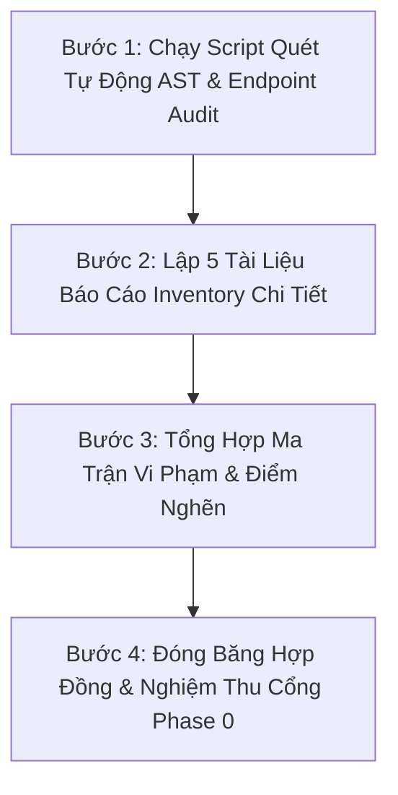

# KẾ HOẠCH CHI TIẾT PHASE 0: KHẢO SÁT & KIỂM KÊ TOÀN DIỆN (SYSTEM INVENTORY & CONTRACT FREEZE)

> **Tài liệu tham chiếu:**
> - [CLAUDE.md](file:///Volumes/SSD/javis-saas/CLAUDE.md)
> - [markdown/Structure.md](file:///Volumes/SSD/javis-saas/markdown/Structure.md) (Mục 50 - Phase 0)
> - [docs/COSA_Comprehensive_Refactoring_Plan_Backend_Frontend.md](file:///Volumes/SSD/javis-saas/docs/COSA_Comprehensive_Refactoring_Plan_Backend_Frontend.md)
> - Trạng thái: **Proposed Detailed Plan (Chưa triển khai code)**
> - Ngày lập: 2026-08-20

---

## 1. MỤC TIÊU & NGUYÊN TẮC CỐT LÕI CỦA PHASE 0

Theo Mục 50 của [markdown/Structure.md](file:///Volumes/SSD/javis-saas/markdown/Structure.md):
> *"Claude Code phải lập inventory: existing agents, prompts, tools, workflows, services, DB tables, API endpoints, UI screens, duplicated logic. Không code trước inventory."*

### 1.1. Mục tiêu Cốt lõi
1. **Lập Bản Đồ Toàn Cảnh (System Map):** Định vị chính xác 100% các thành phần đang chạy trong hệ thống hiện tại (`backend/` và `frontend/`).
2. **Đóng Băng Hợp Đồng & API Schema (Contract Freeze):** Ghi nhận chính xác input/output của toàn bộ API và Database để đảm bảo quá trình tái cấu trúc **Zero Regression** (không làm gãy bất kỳ tính năng nghiệp vụ nào).
3. **Phát Hiện Điểm Nối Rủi Ro (Coupling & Violation Audit):** Chỉ ra chính xác các vị trí mà Business Code đang phụ thuộc trực tiếp vào LLM vendor, các prompt dài chứa quy trình nghiệp vụ ngầm, và các màn hình Frontend gọi API trực tiếp trong UI widget.

---

## 2. NỘI DUNG VÀ DANH MỤC KIỂM KÊ CHI TIẾT (INVENTORY BREAKDOWN)

Phase 0 được chia làm **5 hạng mục khảo sát chuyên sâu**:

```text
PHASE 0 INVENTORY
├── 1. Backend API & Routers Audit        (Endpoints, DTOs, Middleware, Errors)
├── 2. Database Schema & Models Audit     (PostgreSQL Tables, Relations, SQLite)
├── 3. AI Workforce, Tools & Prompts Audit(Agents, Tools, Prompts, Workflows)
├── 4. Frontend Modules & UI Screens Audit(37+ Modules, State, UI/Logic Coupling)
└── 5. Duplicated Logic & Coupling Matrix (DRY Violations, Cross-domain Dependencies)
```

---

### 2.1. Hạng mục 1: Kiểm kê API Endpoints & Routers Backend
* **Phạm vi:** Toàn bộ 5 Domain Master Routers trong `backend/app/main.py` (`founder_os`, `business`, `workforce`, `integrations`, `platform`) cùng `capabilities_router`.
* **Thông tin thu thập cho từng Endpoint:**
  1. `Endpoint Path & HTTP Method` (ví dụ: `POST /api/v1/founder_os/strategy/evaluate`).
  2. `Request DTO & Validation Schema` (Pydantic model hoặc raw json payload).
  3. `Response Contract` (Cấu trúc trả về, Status code, Error envelope).
  4. `Dependencies & Auth Scopes` (JWT, Tenant, Permission check).
  5. `Đánh giá Phân tầng (Layer Quality):`
     - *Clean:* Router $\rightarrow$ Service $\rightarrow$ DB Repo.
     - *Coupled:* Router tự viết SQL query hoặc gọi thẳng LLM client.
* **Đầu ra:** Bảng ma trận `docs/inventory/01_backend_api_inventory.md`.

---

### 2.2. Hạng mục 2: Kiểm kê Cơ sở Dữ liệu & Schema (Database Models)
* **Phạm vi:** Toàn bộ SQLAlchemy Models trong `backend/app/` và các file migration `alembic/versions/`.
* **Thông tin thu thập cho từng Bảng dữ liệu:**
  1. `Tên Bảng & Domain sở hữu` (`companies`, `projects`, `tasks`, `okrs`, `crm_leads`, `agent_sessions`...).
  2. `Khóa chính & Quan hệ (Foreign Keys / Indexes):` Chỉ ra bảng nào thuộc về **Business Data** (PostgreSQL) và bảng nào thuộc về **Agent Execution / Traces** (chuyển sang SQLite Event Store).
  3. `Rà soát Vi phạm Phụ thuộc LLM (CLAUDE §5):` Phát hiện các cột vi phạm như `deepseek_session_id`, `claude_prompt` nằm trực tiếp trong bảng Business Core (`projects`, `companies`).
* **Đầu ra:** Tài liệu `docs/inventory/02_database_schema_inventory.md`.

---

### 2.3. Hạng mục 3: Kiểm kê AI Workforce, Tools, Prompts & Workflows
* **Phạm vi:** Khối `backend/app/workforce/` và toàn bộ các file `.py`, `.yaml`, `.md` chứa prompts/agent runners.
* **Nội dung kiểm kê chi tiết:**
  1. **Danh sách 12+ Agents hiện tại:**
     - Tên, vai trò (Marketing, Sales, Finance, Legal, Coding...).
     - System prompt nằm ở đâu? Kích thước prompt (tokens)?
     - Các tool và capability mà agent đó đang được gán.
  2. **Danh mục Tools hiện có:**
     - Input/Output schema của từng tool.
     - Tool có đang trả về JSON tự do không? (Cần chuẩn hóa sang `ToolResult`).
     - Rủi ro vận hành (Risk level: LOW, MEDIUM, HIGH, CRITICAL).
     - Tool Presenter (Đã có format cho Hologram Hub chưa hay chỉ trả raw JSON).
  3. **Danh mục Workflows & Business Processes:**
     - Quy trình nào đang bị "viết cứng" trong prompt thay vì tách thành code workflow tất định.
  4. **Kiểm tra Lỗi Greeting ("chào") & Context Loading:**
     - Xác định chính xác đoạn code nào đang tự động trigger truy vấn database khi người dùng gửi tin nhắn chào hỏi thông thường.
* **Đầu ra:** Tài liệu `docs/inventory/03_agent_workforce_inventory.md`.

---

### 2.4. Hạng mục 4: Kiểm kê Frontend Modules, UI Screens & State
* **Phạm vi:** Toàn bộ 37+ modules trong `frontend/lib/modules/`.
* **Nội dung kiểm kê chi tiết cho từng Module:**
  1. `Tên Module & Domain tương ứng` (ví dụ: `modules/marketing`, `modules/finance`, `modules/hologram_hub`...).
  2. `Cấu trúc hiện tại:` Đã có `bindings/`, `controllers/`, `views/` chưa?
  3. `Mức độ Tách biệt Logic & UI (UI Coupling Audit):`
     - *Loại A (Tốt):* View chỉ nhận state từ Controller, Controller gọi Service.
     - *Loại B (Trung bình):* Controller gọi trực tiếp HTTP client không qua Repository.
     - *Loại C (Vi phạm nặng):* View/Widget gọi trực tiếp API hoặc parse raw JSON string trong hàm `build()`.
  4. `Đánh giá Hiện trạng Hologram Hub:`
     - Các widget hiển thị hiện tại.
     - Trạng thái tích hợp Live Trajectory Timeline, Approval Modal và Artifacts Explorer.
  5. `Đánh giá Tính Responsive:`
     - Màn hình nào đã hỗ trợ co giãn theo kích thước Desktop / Tablet / Mobile? Màn hình nào bị vỡ layout (RenderFlex overflow)?
* **Đầu ra:** Tài liệu `docs/inventory/04_frontend_modules_inventory.md`.

---

### 2.5. Hạng mục 5: Khảo sát Logic Trùng Lặp & Ma Trận Phụ Thuộc (Duplication & Coupling)
* **Nội dung kiểm kê:**
  1. `Logic trùng lặp (DRY):` Các hàm helper, HTTP handlers, prompt fragments bị lặp lại giữa các modules.
  2. `Ma trận phụ thuộc chéo (Circular Dependencies):` Các import vòng vèo giữa các domain (`founder_os` import `workforce`, `business` import `integrations`...).
* **Đầu ra:** Báo cáo `docs/inventory/05_duplication_and_coupling_report.md`.

---

## 3. KẾ HOẠCH THỰC HIỆN PHASE 0 THEO 4 BƯỚC (PHASE 0 STEP-BY-STEP WORKFLOW)



### Bước 1: Khảo sát & Trích xuất Tự động (Automated Scanning)
- Viết các script phân tích tĩnh (Static Analysis Script) không can thiệp code nguồn:
  - Script quét toàn bộ FastAPI routes và trích xuất Pydantic schemas.
  - Script quét toàn bộ Flutter widgets phát hiện các điểm vi phạm gọi API trực tiếp.
  - Script tìm kiếm các từ khóa LLM coupling (`openai`, `anthropic`, `deepseek`) trong `core/` và `business/`.

### Bước 2: Biên soạn 5 Tài liệu Kiểm kê vào thư mục `docs/inventory/`
- Tạo cấu trúc thư mục `docs/inventory/`.
- Điền chi tiết toàn bộ thông tin khảo sát vào 5 tài liệu độc lập với các bảng biểu Markdown rõ ràng.

### Bước 3: Tổng hợp Bản đồ Rủi ro & Điểm cần tái cấu trúc
- Chỉ rõ danh sách các điểm cần refactor ưu tiên trong Phase 1 và Phase 2.

### Bước 4: Đóng băng Hợp đồng & Nghiệm thu Cổng Phase 0 (Gate Review)
- Trình bày toàn bộ kết quả khảo sát cho Founder.
- Xác nhận hoàn tất Phase 0 để chuyển sang **Phase 1: Core Contracts & Isolations**.

---

## 4. TIÊU CHUẨN NGHIỆM THU PHASE 0 (PHASE 0 EXIT CRITERIA / GATE REVIEW)

Phase 0 chỉ được coi là hoàn tất khi đạt đủ 5 tiêu chí:

1. [ ] **100% API Endpoints** được ghi nhận đầy đủ Request/Response DTO và phân loại mức độ coupling.
2. [ ] **100% Database Tables** được lập bản đồ quan hệ và phân chia rõ ràng giữa PostgreSQL (Business Data) và SQLite (Session/Trace Data).
3. [ ] **100% Agents & Tools** được phân loại rõ ràng theo đúng công thức: `Profile + Skills + Tools + Workflows + Permissions + Runtime`.
4. [ ] **Toàn bộ 37+ Modules Flutter** được phân loại theo mức độ tách biệt UI/Logic và khả năng Responsive.
5. [ ] **Thư mục `docs/inventory/`** chứa đầy đủ 5 báo cáo chi tiết mà **không làm thay đổi bất kỳ dòng code nguồn nào của dự án**.
