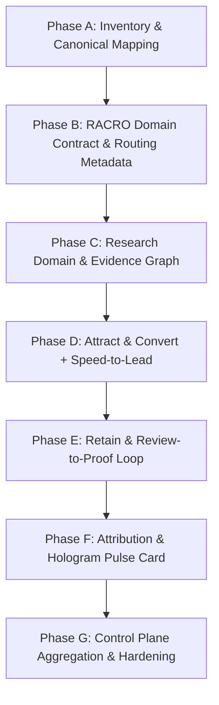

# COSA — RACRO AI Marketing System Integration Master Plan

> **Tài liệu tham chiếu:** [COSA_AI_Marketing_System_Integration_Spec.md](file:///Volumes/SSD/javis-saas/markdown/COSA_AI_Marketing_System_Integration_Spec.md)  
> **Trạng thái:** Draft Plan (Chưa triển khai)

---

## 1. Mục tiêu & Nguyên tắc Kiến trúc Cốt lõi

- **Không tạo subsystem song song:** Không tạo `racro_v2`, không tạo 15 AI agent độc lập gây phân mảnh và rối loạn giao diện cho Founder.
- **COSA Co-Founder là trung tâm:** Mọi tương tác marketing đi qua Co-Founder Router hiện tại.
- **Hệ phân cấp chuẩn:**
  $$\text{Business Capability} \longrightarrow \text{Skill} \longrightarrow \text{Workflow} \longrightarrow \text{Tool / Adapter}$$
- **Quy tắc Invariant `NO INTENT = NO TOOL`:** Khi câu chào hoặc không có intent rõ ràng, không chạy tool, không truy vấn database CRM/Research.
- **Stage-Aware Marketing:** Tự động điều chỉnh hành vi marketing theo giai đoạn phát triển của dự án (`project_stage`).
- **Evidence-First Marketing:** Mọi tín hiệu (`MarketingSignal`) và kết quả chiến dịch đều có khả năng gắn vào `Evidence` của dự án.
- **Data Locality (Ranh giới bảo mật):**
  - **Local/Private DB (PostgreSQL):** Chứa toàn bộ PII (tên, SĐT, email), CRM leads, hội thoại, nội dung chi tiết.
  - **Supabase Control Plane:** Chỉ đồng bộ dữ liệu quản trị nền tảng (Auth, License, Project Registry) và Aggregate usage metrics (số lead tổng, usage).
- **Knowledge Pack Precedence:** `Company Override > Factory Default`. Admin là người duy nhất có quyền sửa spec/prompt gốc.

---

## 2. Mô hình RACRO & Ánh xạ Capability

| Khối RACRO | Capabilities | Input / Nguồn dữ liệu | Output / Tác động hệ thống |
| :--- | :--- | :--- | :--- |
| **1. RESEARCH** | • Market Intelligence • Competitor Intelligence • Demand Intelligence | Search trends, Social listening, CRM signals, đối thủ, web search | Sinh `MarketingSignal`, chuyển thành `Evidence` gắn với `Hypothesis` của dự án |
| **2. ATTRACT** | • Search & Discovery • Content & Creative • Distribution Channels | Demand signals, ICP, Brand profile, Offer | Nội dung content pillars, briefs, SEO/GBP recommendations |
| **3. CONVERT** | • Campaign & Offer • Speed-to-Lead • Intake & Qualification | Landing pages, Public Form API, Lead intake | `Lead` chuẩn trong CRM, tự động kích hoạt phản hồi tức thì và chấm điểm |
| **4. RETAIN** | • Follow-Up Playbooks • Reputation / Reviews • Referral Loops | CRM Customer lifecycle, Feedback, Reviews | Đề xuất follow-up, biến Review tốt thành Social Proof / Testimonials |
| **5. ORCHESTRATE** | • Marketing Planner • Attribution Engine • Founder Daily Brief | Toàn bộ sự kiện marketing, chi phí, doanh thu | Widget **Marketing Pulse** & **Founder Daily Brief** trên Hologram Hub |

---

## 3. Lộ trình Triển khai Chi tiết (Phases A – G)

### Phase A: Rà soát & Ánh xạ Thực thể (Inventory & Mapping)
- **Mục tiêu:** Rà soát toàn bộ code hiện tại trong `backend/app/workforce` và `backend/app/business/marketing` để chống trùng lặp.
- **Deliverables:** Bảng mapping thực thể canonical (`Lead`, `Customer`, `Project`, `Evidence`) với các RACRO Move.

### Phase B: Định nghĩa RACRO Domain Contract & Metadata
- **Mục tiêu:** Thiết lập các cấu trúc dữ liệu và routing chuẩn.
- **Deliverables:**
  - Enum `MarketingMove` (`RESEARCH`, `ATTRACT`, `CONVERT`, `RETAIN`, `ORCHESTRATE`).
  - Model `MarketingMission`, `MarketingSignal`.
  - Đăng ký metadata vào `MissionOrchestrator` và `SpecialistRouter`.

### Phase C: Tích hợp Khối RESEARCH & Kết nối Evidence
- **Mục tiêu:** Cung cấp khả năng nghiên cứu thị trường, đối thủ và nhu cầu.
- **Deliverables:**
  - Skills: `market_intelligence`, `competitor_intelligence`, `demand_intelligence`.
  - Tool Adapters: `WebSearchProvider`, `GoogleTrendsProvider`.
  - Tự động chuyển đổi `MarketingSignal` thành `Evidence` theo phê duyệt của Founder.

### Phase D: Tích hợp Khối ATTRACT & CONVERT (CRM + Speed-to-Lead)
- **Mục tiêu:** Kéo lead và xử lý lead tốc độ cao.
- **Deliverables:**
  - Kết nối `app_generator_service` & `public_intake_service` với CRM Lead chuẩn.
  - Xử lý workflow **Speed-to-Lead**: Tự động thông báo và gửi phản hồi ban đầu qua channel adapter (Zalo/Telegram/Email).

### Phase E: Tích hợp Khối RETAIN (Chăm sóc & Phản hồi)
- **Mục tiêu:** Tăng giá trị vòng đời khách hàng và thu hút giới thiệu.
- **Deliverables:**
  - Playbook follow-up theo trạng thái CRM (`New`, `Contacted`, `Qualified`, `Won`, `Inactive`).
  - Review-to-Proof: Đưa đánh giá tích cực vào thư viện bằng chứng truyền thông.

### Phase F: Attribution Engine & Giao diện Hologram Hub
- **Mục tiêu:** Đo lường hiệu quả tiếp thị theo dòng tiền và trực quan hóa cho Founder.
- **Deliverables:**
  - Chuỗi định danh: `campaign_id` $\rightarrow$ `utm_*` $\rightarrow$ `lead_id` $\rightarrow$ `customer_id` $\rightarrow$ `revenue_event_id`.
  - Giao diện **Marketing Pulse Card** và **Daily Founder Brief** trên màn hình chính của Founder.

### Phase G: Đồng bộ Control Plane & Phân quyền Admin
- **Mục tiêu:** Hoàn thiện ranh giới dữ liệu và bảo mật hệ thống.
- **Deliverables:**
  - Sync metrics tổng hợp lên Supabase Control Plane (loại bỏ 100% PII).
  - Phân quyền Admin: Khóa quyền chỉnh sửa System Prompts và Factory Pack với User thông thường.

---

## 4. Kế hoạch Kiểm thử & Tiêu chuẩn Nghiệm thu (Verification Plan)

### Kiểm thử Tự động & Unit Tests:
- `test_intent_guard_greeting`: Gửi greeting $\rightarrow$ 0 tool calls, không đọc CRM/Research.
- `test_marketing_mission_routing`: Định tuyến đúng move và capability từ câu lệnh tự nhiên của founder.
- `test_speed_to_lead_trigger`: Tạo lead mới $\rightarrow$ kích hoạt event và tính điểm tiềm năng.
- `test_data_locality_no_pii_in_control_plane`: Payload đồng bộ lên Supabase không chứa email, SĐT, tên cá nhân.
- `test_company_override_precedence`: Cấu hình Company Override có độ ưu tiên cao hơn Factory Pack.

### Nghiệm thu Thủ công:
- Thử nghiệm trên Co-Founder Chat & Voice (LiveKit) để đảm bảo trải nghiệm liền mạch từ một điểm chạm duy nhất.
