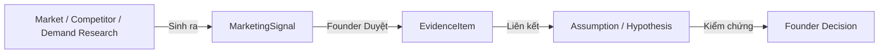

# COSA — RACRO AI Marketing System: Phase C Plan & Evidence Graph

> **Tài liệu tham chiếu gốc:** [COSA_AI_Marketing_System_Integration_Spec.md](file:///Volumes/SSD/javis-saas/markdown/COSA_AI_Marketing_System_Integration_Spec.md)  
> **Giai đoạn:** Phase C — RESEARCH Domain & Evidence-First Graph Integration  
> **Trạng thái:** Đã phê duyệt và triển khai

---

## 1. Mục tiêu Cốt lõi của Phase C

Phase C hiện thực hóa nguyên tắc **"Know before you spend"** (Hiểu rõ trước khi chi tiền) thông qua 3 Capabilities:
1. **Market Intelligence:** Nghiên cứu quy mô thị trường, phân khúc khách hàng mục tiêu, ICP và xu hướng ngành.
2. **Competitor Intelligence:** Thu thập, phân tích động thái của đối thủ (giá bán, cấu trúc offer, kênh phân phối, SEO).
3. **Demand Intelligence:** Bắt các tín hiệu nhu cầu thực tế (Demand Signals) với điểm tin cậy `confidence` đo lường được.
4. **Evidence Graph Bridge:** Kết nối luồng dữ liệu từ `Research Signal` $\longrightarrow$ `EvidenceItem` $\longrightarrow$ `Assumption` $\longrightarrow$ `Founder Decision`.

---

## 2. Mô hình Đồ thị Bằng chứng (Evidence-First Graph)



- **Quy tắc quan trọng:** AI chỉ phát hiện tín hiệu (`confidence` thể hiện độ tin cậy của nguồn dữ liệu), **không tự ý biến tín hiệu thành sự thật đã kiểm chứng (Fact)**. Chỉ Founder hoặc quy trình phê duyệt mới chuyển `MarketingSignal` thành `EvidenceItem` gắn vào `Assumption`.

---

## 3. Kiến trúc Tool Adapter Độc lập (Provider Agnostic)

```text
Business Capability (Market / Competitor / Demand)
        ↓
RACROResearchService
        ↓
SearchProvider Adapter Interface
   ├─ Real Web / Search Provider
   ├─ Trends Provider
   └─ Mock / Sandbox Fallback Provider
```

- Domain logic không gắn chết vào bất kỳ API cụ thể nào của Google/Meta/Bing. Khi nhà cung cấp thay đổi hoặc gặp sự cố, Adapter tự động fallback nhẹ nhàng mà không làm crash service.
