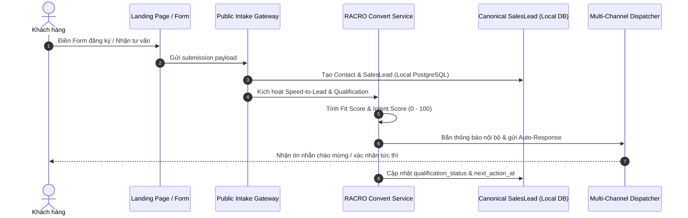

# COSA — RACRO AI Marketing System: Phase D Plan & Conversion Engine

> **Tài liệu tham chiếu gốc:** [COSA_AI_Marketing_System_Integration_Spec.md](file:///Volumes/SSD/javis-saas/markdown/COSA_AI_Marketing_System_Integration_Spec.md)  
> **Giai đoạn:** Phase D — ATTRACT & CONVERT Domains (Content, Qualification & Speed-to-Lead)  
> **Trạng thái:** Đã phê duyệt và triển khai

---

## 1. Mục tiêu Cốt lõi của Phase D

Phase D giải quyết hai bài toán sống còn của tiếp thị:
1. **ATTRACT (Thu hút đúng đối tượng):** Sản xuất nội dung và offer có nguồn gốc từ tín hiệu nhu cầu (`Demand Signal`) và chân dung khách hàng (`ICP`), không sinh content vô định vô hướng.
2. **CONVERT (Chuyển đổi tức thì - Speed-to-Lead):** Tiếp nhận lead từ landing pages/forms, tự động chấm điểm tiềm năng (`Qualification Score`), và kích hoạt phản hồi tức thì (< 5 phút) qua các kênh liên lạc (Zalo/Telegram/Email).

---

## 2. Chuỗi Quy trình Chuyển đổi (Speed-to-Lead Architecture)

---

## 3. Quy tắc Đánh giá Tiềm năng Lead (Qualification Rules)

| Tiêu chí | Trọng số | Yếu tố đánh giá |
| :--- | :---: | :--- |
| **Fit Score (Độ phù hợp ICP)** | 50% | Quy mô công ty, ngành nghề, vai trò/chức danh của người liên hệ. |
| **Intent Score (Ý định mua hàng)** | 30% | Nhu cầu cấp bách, thông điệp cụ thể, nguồn UTM chiến dịch. |
| **Budget Signal (Tín hiệu ngân sách)** | 20% | Ngân sách dự kiến hoặc quy mô giải pháp yêu cầu. |

- **Phân loại tự động:**
  - $\ge 70$ điểm $\longrightarrow$ `QUALIFIED` (Bàn giao Sales liên hệ ngay lập tức).
  - $40 - 69$ điểm $\longrightarrow$ `NURTURING` (Đưa vào luồng chăm sóc tự động Phase E).
  - $< 40$ điểm $\longrightarrow$ `DISQUALIFIED` (Ghi nhận lý do không phù hợp).
