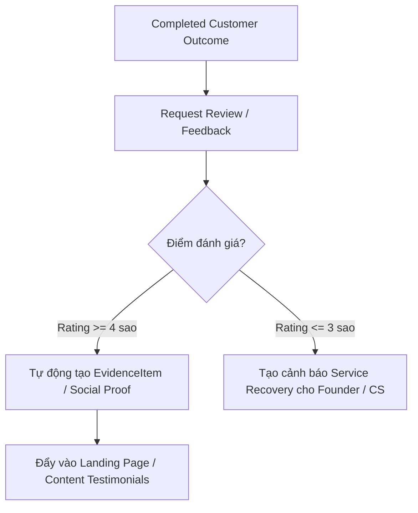

# COSA — RACRO AI Marketing System: Phase E Plan & Retention Loops

> **Tài liệu tham chiếu gốc:** [COSA_AI_Marketing_System_Integration_Spec.md](file:///Volumes/SSD/javis-saas/markdown/COSA_AI_Marketing_System_Integration_Spec.md)  
> **Giai đoạn:** Phase E — RETAIN Domain (Follow-Up Playbooks, Review-to-Proof & Referral Loops)  
> **Trạng thái:** Đã phê duyệt và triển khai

---

## 1. Mục tiêu Cốt lõi của Phase E

Phase E hiện thực hóa nguyên tắc **"Keep them coming back"** (Giữ chân và nhân rộng giá trị khách hàng) qua 3 Capabilities:
1. **Follow-Up & Playbooks:** Tự động hóa kịch bản chăm sóc theo từng trạng thái vòng đời CRM (`NEW`, `NURTURING`, `WON`, `INACTIVE`, `RENEWAL`).
2. **Reputation & Review-to-Proof Loop:** Thu thập phản hồi sau khi hoàn thành dịch vụ; biến đánh giá tích cực thành `Evidence` / Bằng chứng truyền thông và cảnh báo khi có phản hồi tiêu cực.
3. **Referral Acquisition Loops:** Vòng lặp giới thiệu khách hàng mới từ khách hàng hài lòng có gắn định danh người giới thiệu (`referred_by_contact_id`).

---

## 2. Vòng lặp Biến Đánh giá thành Bằng chứng (Review-to-Proof Loop)

---

## 3. Ma trận Kịch bản Chăm sóc (Lifecycle Playbooks)

| Trạng thái CRM | Mục tiêu | Kịch bản hành động | Thời điểm kích hoạt |
| :--- | :--- | :--- | :--- |
| **NURTURING** | Tăng hiểu biết & tin cậy | Gửi Case Study & hướng dẫn giải pháp | Sau 3 ngày không phản hồi |
| **WON / CUSTOMER** | Onboarding & Khảo sát | Gửi tài liệu hướng dẫn & xin đánh giá | Sau 7 ngày sử dụng |
| **INACTIVE** | Tái kích hoạt (Winback) | Gửi ưu đãi đặc biệt cho khách hàng cũ | Sau 30 ngày không tương tác |
| **RENEWAL_DUE** | Gia hạn dịch vụ | Thông báo kế hoạch gia hạn & quyền lợi | Trước hạn 14 ngày |
