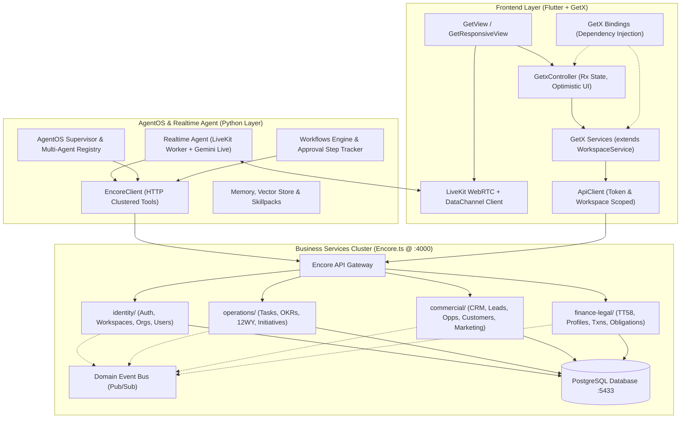

# COSA System Integration & Step-by-Step Implementation Plan: Services, AgentOS & Flutter (GetX)

Tài liệu thiết kế kiến trúc và kế hoạch triển khai chi tiết tuần tự cho 3 tầng hệ thống **Javis SaaS (COSA)**:
1. **Business Services Cluster** (`services/`): Microservices viết bằng **Encore.ts** + PostgreSQL + Domain Event Bus.
2. **AI & Multi-Agent Layer** (`agentos/`): Engine điều phối đa Agent (Supervisor, Debate), Orchestration Workflows, Tool Clusters và Human-in-the-loop Approval viết bằng **Python**.
3. **Frontend Application** (`frontend/`): Ứng dụng quản trị & điều hành thông minh xây dựng bằng **Flutter**, tuân thủ chuẩn kiến trúc **GetX** (Model - View - Controller - Service - Binding).

---

## 1. Tổng Quan Kiến Trúc & Luồng Dữ Liệu 3 Tầng



---

## 2. Tiêu Chuẩn Thiết Kế Frontend GetX (Flutter GetX Standard)

Mỗi module trong `frontend/lib/modules/<feature>/` được chuẩn hóa theo cấu trúc 4 thành phần:

```
modules/<feature>/
├── bindings/
│   └── <feature>_binding.dart      # Khai báo Get.lazyPut cho Controller và Service
├── controllers/
│   └── <feature>_controller.dart   # Quản lý Reactive State (Rx), xử lý logic, gọi Service
├── services/
│   └── <feature>_service.dart      # Kế thừa WorkspaceService, giao tiếp trực tiếp với Backend API
└── views/
    ├── <feature>_view.dart         # Kế thừa GetView<<Feature>Controller>
    └── widgets/                    # Sub-widgets chia nhỏ giao diện
```

### 2.1. Quy ước Service (`extends WorkspaceService`)
Mọi Service trong các module đều kế thừa `WorkspaceService` để tự động:
- Đính kèm `Authorization: Bearer <token>`
- Đính kèm header `X-Workspace-Id: <active_workspace_id>`
- Chuẩn hóa endpoint qua `ApiClient.normalizeEndpoint()`
- Trả về DTOs / Typed Models thay vì dynamic Map.

### 2.2. Quy ước Controller (`extends GetxController`)
- **Reactive State**: Sử dụng `.obs` cho các biến trạng thái (`isLoading = false.obs`, `items = <ItemModel>[].obs`).
- **Optimistic UI Update**: Cập nhật danh sách local ngay lập tức trước khi gọi API, tự động hoàn tác (revert) và hiển thị thông báo lỗi qua `Get.snackbar()` nếu request thất bại.
- **Realtime Listener Integration**: Đăng ký lắng nghe sự kiện từ `RealtimeService` trong hàm `onInit()` và hủy đăng ký trong `onClose()`.

### 2.3. Quy ước Binding (`extends Bindings`)
- Đăng ký Controller bằng `Get.lazyPut<<Feature>Controller>(() => <Feature>Controller())`.
- Gắn Binding tương ứng vào danh sách `GetPage` trong file [app_routes.dart](file:///Volumes/SSD/javis-saas/frontend/lib/core/routing/app_routes.dart).

---

## 3. Lộ Trình Triển Khai Tuần Tự Theo Thứ Tự (5 Bước)

### 🎯 Bước 1: Cụm Tài Chính & Pháp Lý (Finance & Legal)
* **Mục tiêu**: Thay thế toàn bộ `dynamic` / `Map<String, dynamic>` trong `FinanceService` và `LegalService` bằng Typed Data Models chuẩn.
* **Các file triển khai**:
  1. `[NEW]` [frontend/lib/data/models/finance_legal_models.dart](file:///Volumes/SSD/javis-saas/frontend/lib/data/models/finance_legal_models.dart):
     - `AccountingProfileModel`
     - `AccountingPeriodModel`
     - `FinancialTransactionModel`
     - `FinanceSnapshotModel`
     - `LegalObligationModel`
     - `LegalChecklistItemModel`
  2. `[MODIFY]` [frontend/lib/modules/finance/services/finance_service.dart](file:///Volumes/SSD/javis-saas/frontend/lib/modules/finance/services/finance_service.dart):
     - Chuyển đổi các hàm thành Typed Model API (`Future<List<FinancialTransactionModel>>`, `Future<AccountingProfileModel?>`, v.v.).
  3. `[MODIFY]` [frontend/lib/modules/legal/services/legal_service.dart](file:///Volumes/SSD/javis-saas/frontend/lib/modules/legal/services/legal_service.dart):
     - Chuyển đổi các hàm thành Typed Model API (`Future<List<LegalObligationModel>>`, `Future<List<LegalChecklistItemModel>>`).
  4. `[MODIFY]` [frontend/lib/modules/finance/controllers/finance_controller.dart](file:///Volumes/SSD/javis-saas/frontend/lib/modules/finance/controllers/finance_controller.dart) & [legal_controller.dart](file:///Volumes/SSD/javis-saas/frontend/lib/modules/legal/controllers/legal_controller.dart):
     - Sử dụng `RxList<FinancialTransactionModel>`, `Rx<FinanceSnapshotModel?>`, `RxList<LegalObligationModel>`.

---

### 🎯 Bước 2: Cụm Thương Mại & CRM (Sales & Marketing)
* **Mục tiêu**: Chuẩn hóa toàn bộ Sales Pipeline và Marketing Funnels thành Typed Data Models.
* **Các file triển khai**:
  1. `[NEW]` [frontend/lib/data/models/commercial_models.dart](file:///Volumes/SSD/javis-saas/frontend/lib/data/models/commercial_models.dart):
     - `LeadModel`
     - `OpportunityModel`
     - `AccountModel`
     - `CustomerModel`
     - `CampaignModel`
  2. `[MODIFY]` [frontend/lib/modules/sales/services/sales_service.dart](file:///Volumes/SSD/javis-saas/frontend/lib/modules/sales/services/sales_service.dart):
     - `Future<List<LeadModel>> getLeads()`, `Future<List<OpportunityModel>> getOpportunities()`, `Future<List<CustomerModel>> getCustomers()`.
  3. `[MODIFY]` [frontend/lib/modules/marketing/services/marketing_service.dart](file:///Volumes/SSD/javis-saas/frontend/lib/modules/marketing/services/marketing_service.dart):
     - `Future<List<CampaignModel>> getCampaigns()`.
  4. `[MODIFY]` [frontend/lib/modules/sales/controllers/sales_controller.dart](file:///Volumes/SSD/javis-saas/frontend/lib/modules/sales/controllers/sales_controller.dart) & [marketing_controller.dart](file:///Volumes/SSD/javis-saas/frontend/lib/modules/marketing/controllers/marketing_controller.dart).

---

### 🎯 Bước 3: Cụm Workflows & Phê Duyệt (Workflows & Approvals)
* **Mục tiêu**: Chuẩn hóa luồng trigger workflow và danh sách Human-in-the-loop pending actions.
* **Các file triển khai**:
  1. `[NEW]` [frontend/lib/data/models/workflow_models.dart](file:///Volumes/SSD/javis-saas/frontend/lib/data/models/workflow_models.dart):
     - `WorkflowDefinitionModel`
     - `WorkflowRunModel`
     - `ApprovalRequestModel`
  2. `[MODIFY]` [frontend/lib/modules/workflows/services/workflows_service.dart](file:///Volumes/SSD/javis-saas/frontend/lib/modules/workflows/services/workflows_service.dart):
     - `Future<List<WorkflowDefinitionModel>> getDefinitions()`, `Future<WorkflowRunModel?> triggerRun(...)`.
  3. `[MODIFY]` [frontend/lib/modules/approvals/services/approvals_service.dart](file:///Volumes/SSD/javis-saas/frontend/lib/modules/approvals/services/approvals_service.dart):
     - `Future<List<ApprovalRequestModel>> getPendingApprovals()`, `Future<bool> decideApproval(...)`.
  4. `[MODIFY]` [frontend/lib/modules/workflows/controllers/workflows_controller.dart](file:///Volumes/SSD/javis-saas/frontend/lib/modules/workflows/controllers/workflows_controller.dart) & [approvals_controller.dart](file:///Volumes/SSD/javis-saas/frontend/lib/modules/approvals/controllers/approvals_controller.dart).

---

### 🎯 Bước 4: Mở Rộng Tool Clusters (AgentOS Layer)
* **Mục tiêu**: Đồng bộ các phương thức gọi API trong `agentos/tools/clusters/` khớp chính xác với Backend Encore.
* **Các file cần cập nhật**:
  1. `[MODIFY]` [agentos/tools/clusters/identity_tools.py](file:///Volumes/SSD/javis-saas/agentos/tools/clusters/identity_tools.py)
  2. `[MODIFY]` [agentos/tools/clusters/operations_tools.py](file:///Volumes/SSD/javis-saas/agentos/tools/clusters/operations_tools.py)
  3. `[MODIFY]` [agentos/tools/clusters/commercial_tools.py](file:///Volumes/SSD/javis-saas/agentos/tools/clusters/commercial_tools.py)
  4. `[MODIFY]` [agentos/tools/clusters/finance_tools.py](file:///Volumes/SSD/javis-saas/agentos/tools/clusters/finance_tools.py)

---

### 🎯 Bước 5: Kiểm Thử Tích Hợp Toàn Bộ Hệ Thống (Verification)
1. `encore test` (Backend Encore.ts - 117 tests)
2. `pytest` (AgentOS Python - 313 tests)
3. `flutter analyze` & `flutter test` (Frontend Flutter)
