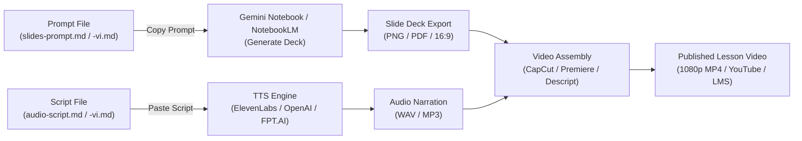

# COSA Academy: Complete Slide & Audio Production Master Catalog (Song Ngữ EN / VI)

> **Comprehensive Production Assets for all 7 Modules and 62 Lessons (248 Production Files: 124 EN + 124 VI)**

Mỗi bài học trong chương trình vòng đời khởi nghiệp COSA Academy được cung cấp đầy đủ **4 file sản xuất chuyên nghiệp**:
1. **`{prefix}-slides-prompt.md`**: Prompt Tiếng Anh chuẩn cho **Gemini Notebook (NotebookLM / Gemini Pro)** để sinh bộ slide 16:9 6 trang theo COSA Dark Theme.
2. **`{prefix}-slides-prompt-vi.md`**: Prompt Tiếng Việt chuẩn hóa cho **Gemini Notebook** với hệ thống thuật ngữ Venture Architect đã được tinh chỉnh sắc sảo.
3. **`{prefix}-audio-script.md`**: Kịch bản lồng tiếng TTS Tiếng Anh với đánh dấu ngắt nghỉ `[pause 0.5s]`, voice profile người sáng lập và khối văn bản đọc liền mạch 1-click.
4. **`{prefix}-audio-script-vi.md`**: Kịch bản lồng tiếng TTS Tiếng Việt chuẩn hóa tối ưu cho ElevenLabs Multilingual v2, OpenAI TTS (`onyx`, `alloy`), FPT.AI, Zalo AI.

---

## 1. Production Workflow: From Text to Published Video

### Step A: Generating Slides via Gemini Notebook (Tạo Slides)
1. Mở **Gemini Notebook (NotebookLM)** hoặc **Gemini 1.5 Pro**.
2. Mở file `{prefix}-slides-prompt.md` (nếu làm bản tiếng Anh) hoặc `{prefix}-slides-prompt-vi.md` (nếu làm bản tiếng Việt).
3. Cuộn xuống mục **Master Execution Prompt Block** (ở cuối file) và sao chép toàn bộ khối lệnh.
4. Dán vào Gemini Notebook.
5. Gemini sẽ sinh ra bộ 6 slide thuyết trình chuẩn xác theo đúng cấu trúc, mã màu và hình ảnh minh họa.

### Step B: Generating Voiceover via TTS Software (Tạo Âm thanh Giọng đọc)
1. Mở công cụ TTS lựa chọn:
   - **Bản Tiếng Anh**: **ElevenLabs** (giọng: *Adam*, *George*, hoặc *Brian*) hoặc **OpenAI TTS** (giọng: *Onyx* hoặc *Echo*), tốc độ ~130 WPM.
   - **Bản Tiếng Việt**: **ElevenLabs Multilingual v2** (giọng: *Adam*, *Brian*, *Rachel*) hoặc **OpenAI TTS** (giọng: *onyx*, *alloy*), hoặc **FPT.AI** (giọng *Ban Mai*, *Minh Quang*), tốc độ ~120–130 từ/phút.
2. Mở file `{prefix}-audio-script.md` hoặc `{prefix}-audio-script-vi.md`.
3. Sao chép khối **Continuous Raw Script** ở cuối file để sinh audio toàn bài chỉ với 1 click.
4. Xuất file âm thanh chất lượng cao (`.wav` hoặc `.mp3`).

### Step C: Assembling the Lesson Video (Ghép Video Hoàn chỉnh)
1. Nhập ảnh slide đã xuất (16:9 1920x1080) và track audio vào phần mềm dựng (**CapCut**, **Descript**, hoặc **Premiere Pro**).
2. Sử dụng các điểm mốc đánh dấu `[SLIDE 1]`, `[SLIDE 2]`, ... trong file kịch bản audio để căn chỉnh thời điểm chuyển slide khớp từng giây với lời thoại.
3. Thêm nhạc nền nhẹ nhàng (ambient synthpad hoặc corporate chill ở mức -24dB).
4. Xuất video bài học hoàn thiện chuẩn 1080p MP4.

---

## 2. Design System Tokens (Dark Navy Editorial Aesthetics)

| Element | Hex Token | CSS / Usage | Ý nghĩa thiết kế |
|---|---|---|---|
| **Canvas Background** | `#070C18` | Deep void space canvas | Không gian nền đen vũ trụ sâu thẳm |
| **Surface / Card Background** | `#0D172A` | Floating card background with `rgba(255,255,255,0.08)` border | Thẻ chứa nội dung nổi với viền mờ |
| **Primary Brand Accent** | `#14B8A6` | Teal highlight for core takeaways and active stages | Màu xanh ngọc Teal COSA - Tiến trình & Hành động |
| **Secondary Accent** | `#2DD4BF` | Light teal for badges and icons | Điểm nhấn phụ cho huy hiệu và biểu tượng |
| **Evidence / Data Accent** | `#38BDF8` | Sky blue for verified empirical metrics | Xanh da trời cho dữ liệu và bằng chứng khách hàng |
| **Hazard / Anti-Pattern** | `#F43F5E` | Rose crimson for mistakes and traps | Đỏ hồng cho cạm bẫy, rủi ro và chỉ số ảo |
| **Typography** | `Inter` / `Outfit` | Editorial sans-serif, high contrast white `#F8FAFC` and muted `#94A3B8` | Kiểu chữ sans-serif hiện đại, độ tương phản cao |

---

## 3. Complete Curriculum Master Catalog (All 62 Lessons — Song Ngữ EN & VI)

### Module 00: Founder Foundations: From Idea to Operating Rhythm
**Tên Tiếng Việt**: *Nền Tảng Cho Nhà Sáng Lập: Từ Ý Tưởng Đến Nhịp Điệu Vận Hành* (8 bài học = 32 files: 2 EN + 2 VI mỗi bài)
Thư mục: `docs/academy/module-00-founder-foundations/slides-and-audio/`

| # | ID | Lesson Title | Slide Prompts (EN / VI) | Audio Scripts (EN / VI) |
|:---:|:---:|---|---|---|
| 1 | **0.1** | Welcome to COSA: Your Founder Operating System | [EN Slide](module-00-founder-foundations/slides-and-audio/00-01-slides-prompt.md) · [VI Slide](module-00-founder-foundations/slides-and-audio/00-01-slides-prompt-vi.md) | [EN Audio](module-00-founder-foundations/slides-and-audio/00-01-audio-script.md) · [VI Audio](module-00-founder-foundations/slides-and-audio/00-01-audio-script-vi.md) |
| 2 | **0.2** | What Is a Startup? Searching Under Uncertainty | [EN Slide](module-00-founder-foundations/slides-and-audio/00-02-slides-prompt.md) · [VI Slide](module-00-founder-foundations/slides-and-audio/00-02-slides-prompt-vi.md) | [EN Audio](module-00-founder-foundations/slides-and-audio/00-02-audio-script.md) · [VI Audio](module-00-founder-foundations/slides-and-audio/00-02-audio-script-vi.md) |
| 3 | **0.3** | Startup for a One-Person Company: Leverage Without Losing Control | [EN Slide](module-00-founder-foundations/slides-and-audio/00-03-slides-prompt.md) · [VI Slide](module-00-founder-foundations/slides-and-audio/00-03-slides-prompt-vi.md) | [EN Audio](module-00-founder-foundations/slides-and-audio/00-03-audio-script.md) · [VI Audio](module-00-founder-foundations/slides-and-audio/00-03-audio-script-vi.md) |
| 4 | **0.4** | From an Idea to a Project: Framing Bounded Venture Bets | [EN Slide](module-00-founder-foundations/slides-and-audio/00-04-slides-prompt.md) · [VI Slide](module-00-founder-foundations/slides-and-audio/00-04-slides-prompt-vi.md) | [EN Audio](module-00-founder-foundations/slides-and-audio/00-04-audio-script.md) · [VI Audio](module-00-founder-foundations/slides-and-audio/00-04-audio-script-vi.md) |
| 5 | **0.5** | The Project Lifecycle: Learn Before You Scale | [EN Slide](module-00-founder-foundations/slides-and-audio/00-05-slides-prompt.md) · [VI Slide](module-00-founder-foundations/slides-and-audio/00-05-slides-prompt-vi.md) | [EN Audio](module-00-founder-foundations/slides-and-audio/00-05-audio-script.md) · [VI Audio](module-00-founder-foundations/slides-and-audio/00-05-audio-script-vi.md) |
| 6 | **0.6** | Your First 12-Week Year: Focus, Rhythm, and Execution | [EN Slide](module-00-founder-foundations/slides-and-audio/00-06-slides-prompt.md) · [VI Slide](module-00-founder-foundations/slides-and-audio/00-06-slides-prompt-vi.md) | [EN Audio](module-00-founder-foundations/slides-and-audio/00-06-audio-script.md) · [VI Audio](module-00-founder-foundations/slides-and-audio/00-06-audio-script-vi.md) |
| 7 | **0.7** | OKRs for Early-Stage Founders: Direction Without Bureaucracy | [EN Slide](module-00-founder-foundations/slides-and-audio/00-07-slides-prompt.md) · [VI Slide](module-00-founder-foundations/slides-and-audio/00-07-slides-prompt-vi.md) | [EN Audio](module-00-founder-foundations/slides-and-audio/00-07-audio-script.md) · [VI Audio](module-00-founder-foundations/slides-and-audio/00-07-audio-script-vi.md) |
| 8 | **0.8** | Run Your Week: Cadence, Decisions, Approvals, and AI Agents | [EN Slide](module-00-founder-foundations/slides-and-audio/00-08-slides-prompt.md) · [VI Slide](module-00-founder-foundations/slides-and-audio/00-08-slides-prompt-vi.md) | [EN Audio](module-00-founder-foundations/slides-and-audio/00-08-audio-script.md) · [VI Audio](module-00-founder-foundations/slides-and-audio/00-08-audio-script-vi.md) |

### Module 01: Problem Discovery and Customer Insight
**Tên Tiếng Việt**: *Khám Phá Vấn Đề và Thấu Cảm Khách Hàng* (9 bài học = 36 files: 2 EN + 2 VI mỗi bài)
Thư mục: `docs/academy/module-01-problem-discovery-customer-insight/slides-and-audio/`

| # | ID | Lesson Title | Slide Prompts (EN / VI) | Audio Scripts (EN / VI) |
|:---:|:---:|---|---|---|
| 1 | **1.1** | The Problem Discovery Framework: Deconstructing Real Pain | [EN Slide](module-01-problem-discovery-customer-insight/slides-and-audio/01-01-slides-prompt.md) · [VI Slide](module-01-problem-discovery-customer-insight/slides-and-audio/01-01-slides-prompt-vi.md) | [EN Audio](module-01-problem-discovery-customer-insight/slides-and-audio/01-01-audio-script.md) · [VI Audio](module-01-problem-discovery-customer-insight/slides-and-audio/01-01-audio-script-vi.md) |
| 2 | **1.2** | Conducting Qualitative Discovery Interviews: Uncovering Truth Without Leading | [EN Slide](module-01-problem-discovery-customer-insight/slides-and-audio/01-02-slides-prompt.md) · [VI Slide](module-01-problem-discovery-customer-insight/slides-and-audio/01-02-slides-prompt-vi.md) | [EN Audio](module-01-problem-discovery-customer-insight/slides-and-audio/01-02-audio-script.md) · [VI Audio](module-01-problem-discovery-customer-insight/slides-and-audio/01-02-audio-script-vi.md) |
| 3 | **1.3** | Defining a Target Customer Segment: The Beachhead Niche | [EN Slide](module-01-problem-discovery-customer-insight/slides-and-audio/01-03-slides-prompt.md) · [VI Slide](module-01-problem-discovery-customer-insight/slides-and-audio/01-03-slides-prompt-vi.md) | [EN Audio](module-01-problem-discovery-customer-insight/slides-and-audio/01-03-audio-script.md) · [VI Audio](module-01-problem-discovery-customer-insight/slides-and-audio/01-03-audio-script-vi.md) |
| 4 | **1.4** | Using Jobs to Be Done: Uncovering the Functional, Emotional, and Social Dimensions | [EN Slide](module-01-problem-discovery-customer-insight/slides-and-audio/01-04-slides-prompt.md) · [VI Slide](module-01-problem-discovery-customer-insight/slides-and-audio/01-04-slides-prompt-vi.md) | [EN Audio](module-01-problem-discovery-customer-insight/slides-and-audio/01-04-audio-script.md) · [VI Audio](module-01-problem-discovery-customer-insight/slides-and-audio/01-04-audio-script-vi.md) |
| 5 | **1.5** | Distinguishing Real Problem Signals from Assumptions | [EN Slide](module-01-problem-discovery-customer-insight/slides-and-audio/01-05-slides-prompt.md) · [VI Slide](module-01-problem-discovery-customer-insight/slides-and-audio/01-05-slides-prompt-vi.md) | [EN Audio](module-01-problem-discovery-customer-insight/slides-and-audio/01-05-audio-script.md) · [VI Audio](module-01-problem-discovery-customer-insight/slides-and-audio/01-05-audio-script-vi.md) |
| 6 | **1.6** | Documenting and Classifying Problems: Building the Evidence Repository | [EN Slide](module-01-problem-discovery-customer-insight/slides-and-audio/01-06-slides-prompt.md) · [VI Slide](module-01-problem-discovery-customer-insight/slides-and-audio/01-06-slides-prompt-vi.md) | [EN Audio](module-01-problem-discovery-customer-insight/slides-and-audio/01-06-audio-script.md) · [VI Audio](module-01-problem-discovery-customer-insight/slides-and-audio/01-06-audio-script-vi.md) |
| 7 | **1.7** | Testing a Problem Hypothesis: Formulating Falsifiable Beliefs | [EN Slide](module-01-problem-discovery-customer-insight/slides-and-audio/01-07-slides-prompt.md) · [VI Slide](module-01-problem-discovery-customer-insight/slides-and-audio/01-07-slides-prompt-vi.md) | [EN Audio](module-01-problem-discovery-customer-insight/slides-and-audio/01-07-audio-script.md) · [VI Audio](module-01-problem-discovery-customer-insight/slides-and-audio/01-07-audio-script-vi.md) |
| 8 | **1.8** | Synthesizing Interview Insights: Clustering Patterns and Surfacing Truth | [EN Slide](module-01-problem-discovery-customer-insight/slides-and-audio/01-08-slides-prompt.md) · [VI Slide](module-01-problem-discovery-customer-insight/slides-and-audio/01-08-slides-prompt-vi.md) | [EN Audio](module-01-problem-discovery-customer-insight/slides-and-audio/01-08-audio-script.md) · [VI Audio](module-01-problem-discovery-customer-insight/slides-and-audio/01-08-audio-script-vi.md) |
| 9 | **1.9** | Preparing for Solution Validation: The P0 to P1 Transition Gate | [EN Slide](module-01-problem-discovery-customer-insight/slides-and-audio/01-09-slides-prompt.md) · [VI Slide](module-01-problem-discovery-customer-insight/slides-and-audio/01-09-slides-prompt-vi.md) | [EN Audio](module-01-problem-discovery-customer-insight/slides-and-audio/01-09-audio-script.md) · [VI Audio](module-01-problem-discovery-customer-insight/slides-and-audio/01-09-audio-script-vi.md) |

### Module 02: Solution Design and Early Validation
**Tên Tiếng Việt**: *Thiết Kế Giải Pháp và Kiểm Chứng Sớm* (9 bài học = 36 files: 2 EN + 2 VI mỗi bài)
Thư mục: `docs/academy/module-02-solution-design-and-early-validation/slides-and-audio/`

| # | ID | Lesson Title | Slide Prompts (EN / VI) | Audio Scripts (EN / VI) |
|:---:|:---:|---|---|---|
| 1 | **2.1** | The Solution-Fit Framework: Connecting Pain to Relief | [EN Slide](module-02-solution-design-and-early-validation/slides-and-audio/02-01-slides-prompt.md) · [VI Slide](module-02-solution-design-and-early-validation/slides-and-audio/02-01-slides-prompt-vi.md) | [EN Audio](module-02-solution-design-and-early-validation/slides-and-audio/02-01-audio-script.md) · [VI Audio](module-02-solution-design-and-early-validation/slides-and-audio/02-01-audio-script-vi.md) |
| 2 | **2.2** | Designing a Minimum Viable Product: The Smallest Testable Experience | [EN Slide](module-02-solution-design-and-early-validation/slides-and-audio/02-02-slides-prompt.md) · [VI Slide](module-02-solution-design-and-early-validation/slides-and-audio/02-02-slides-prompt-vi.md) | [EN Audio](module-02-solution-design-and-early-validation/slides-and-audio/02-02-audio-script.md) · [VI Audio](module-02-solution-design-and-early-validation/slides-and-audio/02-02-audio-script-vi.md) |
| 3 | **2.3** | Running Solution Tests: Experiment Methods and Decision Rules | [EN Slide](module-02-solution-design-and-early-validation/slides-and-audio/02-03-slides-prompt.md) · [VI Slide](module-02-solution-design-and-early-validation/slides-and-audio/02-03-slides-prompt-vi.md) | [EN Audio](module-02-solution-design-and-early-validation/slides-and-audio/02-03-audio-script.md) · [VI Audio](module-02-solution-design-and-early-validation/slides-and-audio/02-03-audio-script-vi.md) |
| 4 | **2.4** | Conducting Prototype Feedback Interviews: Observing Friction and Hesitation | [EN Slide](module-02-solution-design-and-early-validation/slides-and-audio/02-04-slides-prompt.md) · [VI Slide](module-02-solution-design-and-early-validation/slides-and-audio/02-04-slides-prompt-vi.md) | [EN Audio](module-02-solution-design-and-early-validation/slides-and-audio/02-04-audio-script.md) · [VI Audio](module-02-solution-design-and-early-validation/slides-and-audio/02-04-audio-script-vi.md) |
| 5 | **2.5** | Evaluating Product-Solution Fit: Strong, Mixed, or Weak Evidence | [EN Slide](module-02-solution-design-and-early-validation/slides-and-audio/02-05-slides-prompt.md) · [VI Slide](module-02-solution-design-and-early-validation/slides-and-audio/02-05-slides-prompt-vi.md) | [EN Audio](module-02-solution-design-and-early-validation/slides-and-audio/02-05-audio-script.md) · [VI Audio](module-02-solution-design-and-early-validation/slides-and-audio/02-05-audio-script-vi.md) |
| 6 | **2.6** | Mapping Competitive Alternatives: Direct, Indirect, and Non-Consumption | [EN Slide](module-02-solution-design-and-early-validation/slides-and-audio/02-06-slides-prompt.md) · [VI Slide](module-02-solution-design-and-early-validation/slides-and-audio/02-06-slides-prompt-vi.md) | [EN Audio](module-02-solution-design-and-early-validation/slides-and-audio/02-06-audio-script.md) · [VI Audio](module-02-solution-design-and-early-validation/slides-and-audio/02-06-audio-script-vi.md) |
| 7 | **2.7** | Articulating a Core Value Proposition: Clear, Differentiated, and Proven | [EN Slide](module-02-solution-design-and-early-validation/slides-and-audio/02-07-slides-prompt.md) · [VI Slide](module-02-solution-design-and-early-validation/slides-and-audio/02-07-slides-prompt-vi.md) | [EN Audio](module-02-solution-design-and-early-validation/slides-and-audio/02-07-audio-script.md) · [VI Audio](module-02-solution-design-and-early-validation/slides-and-audio/02-07-audio-script-vi.md) |
| 8 | **2.8** | Synthesizing Solution-Fit Evidence: Decision-Ready Validation Briefs | [EN Slide](module-02-solution-design-and-early-validation/slides-and-audio/02-08-slides-prompt.md) · [VI Slide](module-02-solution-design-and-early-validation/slides-and-audio/02-08-slides-prompt-vi.md) | [EN Audio](module-02-solution-design-and-early-validation/slides-and-audio/02-08-audio-script.md) · [VI Audio](module-02-solution-design-and-early-validation/slides-and-audio/02-08-audio-script-vi.md) |
| 9 | **2.9** | Preparing for Business-Model Validation: The P1 to P2 Transition Gate | [EN Slide](module-02-solution-design-and-early-validation/slides-and-audio/02-09-slides-prompt.md) · [VI Slide](module-02-solution-design-and-early-validation/slides-and-audio/02-09-slides-prompt-vi.md) | [EN Audio](module-02-solution-design-and-early-validation/slides-and-audio/02-09-audio-script.md) · [VI Audio](module-02-solution-design-and-early-validation/slides-and-audio/02-09-audio-script-vi.md) |

### Module 03: Business Model and Monetization Validation
**Tên Tiếng Việt**: *Mô Hình Kinh Doanh và Kiểm Chứng Khả Năng Thu Tiền* (9 bài học = 36 files: 2 EN + 2 VI mỗi bài)
Thư mục: `docs/academy/module-03-business-model-and-monetization/slides-and-audio/`

| # | ID | Lesson Title | Slide Prompts (EN / VI) | Audio Scripts (EN / VI) |
|:---:|:---:|---|---|---|
| 1 | **3.1** | Common Business-Model Patterns: Designing the Commercial Engine | [EN Slide](module-03-business-model-and-monetization/slides-and-audio/03-01-slides-prompt.md) · [VI Slide](module-03-business-model-and-monetization/slides-and-audio/03-01-slides-prompt-vi.md) | [EN Audio](module-03-business-model-and-monetization/slides-and-audio/03-01-audio-script.md) · [VI Audio](module-03-business-model-and-monetization/slides-and-audio/03-01-audio-script-vi.md) |
| 2 | **3.2** | Revenue Hypotheses and Willingness to Pay: Validating Budget | [EN Slide](module-03-business-model-and-monetization/slides-and-audio/03-02-slides-prompt.md) · [VI Slide](module-03-business-model-and-monetization/slides-and-audio/03-02-slides-prompt-vi.md) | [EN Audio](module-03-business-model-and-monetization/slides-and-audio/03-02-audio-script.md) · [VI Audio](module-03-business-model-and-monetization/slides-and-audio/03-02-audio-script-vi.md) |
| 3 | **3.3** | Testing Pricing: Discovery Experiments and Elasticity | [EN Slide](module-03-business-model-and-monetization/slides-and-audio/03-03-slides-prompt.md) · [VI Slide](module-03-business-model-and-monetization/slides-and-audio/03-03-slides-prompt-vi.md) | [EN Audio](module-03-business-model-and-monetization/slides-and-audio/03-03-audio-script.md) · [VI Audio](module-03-business-model-and-monetization/slides-and-audio/03-03-audio-script-vi.md) |
| 4 | **3.4** | Fundamentals of Unit Economics: CAC, LTV, and Margins | [EN Slide](module-03-business-model-and-monetization/slides-and-audio/03-04-slides-prompt.md) · [VI Slide](module-03-business-model-and-monetization/slides-and-audio/03-04-slides-prompt-vi.md) | [EN Audio](module-03-business-model-and-monetization/slides-and-audio/03-04-audio-script.md) · [VI Audio](module-03-business-model-and-monetization/slides-and-audio/03-04-audio-script-vi.md) |
| 5 | **3.5** | Defining a Revenue Metric Contract: Clarity, Sources, and Ownership | [EN Slide](module-03-business-model-and-monetization/slides-and-audio/03-05-slides-prompt.md) · [VI Slide](module-03-business-model-and-monetization/slides-and-audio/03-05-slides-prompt-vi.md) | [EN Audio](module-03-business-model-and-monetization/slides-and-audio/03-05-audio-script.md) · [VI Audio](module-03-business-model-and-monetization/slides-and-audio/03-05-audio-script-vi.md) |
| 6 | **3.6** | Identifying Revenue-Model Risks: Mitigating Churn, Margin, and Sales Cycles | [EN Slide](module-03-business-model-and-monetization/slides-and-audio/03-06-slides-prompt.md) · [VI Slide](module-03-business-model-and-monetization/slides-and-audio/03-06-slides-prompt-vi.md) | [EN Audio](module-03-business-model-and-monetization/slides-and-audio/03-06-audio-script.md) · [VI Audio](module-03-business-model-and-monetization/slides-and-audio/03-06-audio-script-vi.md) |
| 7 | **3.7** | Optimizing Sales Channels: Distribution Economics and Channel Fit | [EN Slide](module-03-business-model-and-monetization/slides-and-audio/03-07-slides-prompt.md) · [VI Slide](module-03-business-model-and-monetization/slides-and-audio/03-07-slides-prompt-vi.md) | [EN Audio](module-03-business-model-and-monetization/slides-and-audio/03-07-audio-script.md) · [VI Audio](module-03-business-model-and-monetization/slides-and-audio/03-07-audio-script-vi.md) |
| 8 | **3.8** | Synthesizing Business-Model Evidence: Commercial Decision Briefs | [EN Slide](module-03-business-model-and-monetization/slides-and-audio/03-08-slides-prompt.md) · [VI Slide](module-03-business-model-and-monetization/slides-and-audio/03-08-slides-prompt-vi.md) | [EN Audio](module-03-business-model-and-monetization/slides-and-audio/03-08-audio-script.md) · [VI Audio](module-03-business-model-and-monetization/slides-and-audio/03-08-audio-script-vi.md) |
| 9 | **3.9** | Preparing a Customer Pilot: The P2 to P3 Transition Gate | [EN Slide](module-03-business-model-and-monetization/slides-and-audio/03-09-slides-prompt.md) · [VI Slide](module-03-business-model-and-monetization/slides-and-audio/03-09-slides-prompt-vi.md) | [EN Audio](module-03-business-model-and-monetization/slides-and-audio/03-09-audio-script.md) · [VI Audio](module-03-business-model-and-monetization/slides-and-audio/03-09-audio-script-vi.md) |

### Module 04: Pilot and Go-to-Market Execution
**Tên Tiếng Việt**: *Triển Khai Thử Nghiệm (Pilot) và Thực Thi Ra Mắt Thị Trường (GTM)* (9 bài học = 36 files: 2 EN + 2 VI mỗi bài)
Thư mục: `docs/academy/module-04-pilot-and-go-to-market-execution/slides-and-audio/`

| # | ID | Lesson Title | Slide Prompts (EN / VI) | Audio Scripts (EN / VI) |
|:---:|:---:|---|---|---|
| 1 | **4.1** | Designing a Controlled Pilot: Operational Discipline in the Field | [EN Slide](module-04-pilot-and-go-to-market-execution/slides-and-audio/04-01-slides-prompt.md) · [VI Slide](module-04-pilot-and-go-to-market-execution/slides-and-audio/04-01-slides-prompt-vi.md) | [EN Audio](module-04-pilot-and-go-to-market-execution/slides-and-audio/04-01-audio-script.md) · [VI Audio](module-04-pilot-and-go-to-market-execution/slides-and-audio/04-01-audio-script-vi.md) |
| 2 | **4.2** | Defining Pilot Metrics: Leading Signals, Usage Telemetry, and Outcome Proof | [EN Slide](module-04-pilot-and-go-to-market-execution/slides-and-audio/04-02-slides-prompt.md) · [VI Slide](module-04-pilot-and-go-to-market-execution/slides-and-audio/04-02-slides-prompt-vi.md) | [EN Audio](module-04-pilot-and-go-to-market-execution/slides-and-audio/04-02-audio-script.md) · [VI Audio](module-04-pilot-and-go-to-market-execution/slides-and-audio/04-02-audio-script-vi.md) |
| 3 | **4.3** | Managing Beta Customer Relationships: Onboarding, Trust, and Cadence | [EN Slide](module-04-pilot-and-go-to-market-execution/slides-and-audio/04-03-slides-prompt.md) · [VI Slide](module-04-pilot-and-go-to-market-execution/slides-and-audio/04-03-slides-prompt-vi.md) | [EN Audio](module-04-pilot-and-go-to-market-execution/slides-and-audio/04-03-audio-script.md) · [VI Audio](module-04-pilot-and-go-to-market-execution/slides-and-audio/04-03-audio-script-vi.md) |
| 4 | **4.4** | Analyzing Pilot Data Weekly: Turning Telemetry into Action | [EN Slide](module-04-pilot-and-go-to-market-execution/slides-and-audio/04-04-slides-prompt.md) · [VI Slide](module-04-pilot-and-go-to-market-execution/slides-and-audio/04-04-slides-prompt-vi.md) | [EN Audio](module-04-pilot-and-go-to-market-execution/slides-and-audio/04-04-audio-script.md) · [VI Audio](module-04-pilot-and-go-to-market-execution/slides-and-audio/04-04-audio-script-vi.md) |
| 5 | **4.5** | Making a Pilot Go or No-Go Decision: Objective Conversion Gates | [EN Slide](module-04-pilot-and-go-to-market-execution/slides-and-audio/04-05-slides-prompt.md) · [VI Slide](module-04-pilot-and-go-to-market-execution/slides-and-audio/04-05-slides-prompt-vi.md) | [EN Audio](module-04-pilot-and-go-to-market-execution/slides-and-audio/04-05-audio-script.md) · [VI Audio](module-04-pilot-and-go-to-market-execution/slides-and-audio/04-05-audio-script-vi.md) |
| 6 | **4.6** | Synthesizing Pilot Evidence: Auditable Proof of Operational Value | [EN Slide](module-04-pilot-and-go-to-market-execution/slides-and-audio/04-06-slides-prompt.md) · [VI Slide](module-04-pilot-and-go-to-market-execution/slides-and-audio/04-06-slides-prompt-vi.md) | [EN Audio](module-04-pilot-and-go-to-market-execution/slides-and-audio/04-06-audio-script.md) · [VI Audio](module-04-pilot-and-go-to-market-execution/slides-and-audio/04-06-audio-script-vi.md) |
| 7 | **4.7** | Preparing a Go-to-Market Plan: Repeatable Acquisition Engine | [EN Slide](module-04-pilot-and-go-to-market-execution/slides-and-audio/04-07-slides-prompt.md) · [VI Slide](module-04-pilot-and-go-to-market-execution/slides-and-audio/04-07-slides-prompt-vi.md) | [EN Audio](module-04-pilot-and-go-to-market-execution/slides-and-audio/04-07-audio-script.md) · [VI Audio](module-04-pilot-and-go-to-market-execution/slides-and-audio/04-07-audio-script-vi.md) |
| 8 | **4.8** | Assessing Product-Market-Fit Readiness: Repeatable Demand Signals | [EN Slide](module-04-pilot-and-go-to-market-execution/slides-and-audio/04-08-slides-prompt.md) · [VI Slide](module-04-pilot-and-go-to-market-execution/slides-and-audio/04-08-slides-prompt-vi.md) | [EN Audio](module-04-pilot-and-go-to-market-execution/slides-and-audio/04-08-audio-script.md) · [VI Audio](module-04-pilot-and-go-to-market-execution/slides-and-audio/04-08-audio-script-vi.md) |
| 9 | **4.9** | Preparing for Product-Market Fit: The P3 to P4 Transition Gate | [EN Slide](module-04-pilot-and-go-to-market-execution/slides-and-audio/04-09-slides-prompt.md) · [VI Slide](module-04-pilot-and-go-to-market-execution/slides-and-audio/04-09-slides-prompt-vi.md) | [EN Audio](module-04-pilot-and-go-to-market-execution/slides-and-audio/04-09-audio-script.md) · [VI Audio](module-04-pilot-and-go-to-market-execution/slides-and-audio/04-09-audio-script-vi.md) |

### Module 05: Product-Market Fit and Early Growth
**Tên Tiếng Việt**: *Độ Phù Hợp Sản Phẩm - Thị Trường (PMF) và Tăng Trưởng Giai Đoạn Đầu* (9 bài học = 36 files: 2 EN + 2 VI mỗi bài)
Thư mục: `docs/academy/module-05-product-market-fit-and-early-growth/slides-and-audio/`

| # | ID | Lesson Title | Slide Prompts (EN / VI) | Audio Scripts (EN / VI) |
|:---:|:---:|---|---|---|
| 1 | **5.1** | Defining and Measuring Product-Market Fit: Quantifying Market Pull | [EN Slide](module-05-product-market-fit-and-early-growth/slides-and-audio/05-01-slides-prompt.md) · [VI Slide](module-05-product-market-fit-and-early-growth/slides-and-audio/05-01-slides-prompt-vi.md) | [EN Audio](module-05-product-market-fit-and-early-growth/slides-and-audio/05-01-audio-script.md) · [VI Audio](module-05-product-market-fit-and-early-growth/slides-and-audio/05-01-audio-script-vi.md) |
| 2 | **5.2** | Cohort and Retention Analysis: Visualizing Customer Longevity | [EN Slide](module-05-product-market-fit-and-early-growth/slides-and-audio/05-02-slides-prompt.md) · [VI Slide](module-05-product-market-fit-and-early-growth/slides-and-audio/05-02-slides-prompt-vi.md) | [EN Audio](module-05-product-market-fit-and-early-growth/slides-and-audio/05-02-audio-script.md) · [VI Audio](module-05-product-market-fit-and-early-growth/slides-and-audio/05-02-audio-script-vi.md) |
| 3 | **5.3** | Building an NPS and CSAT System: Listening at Scale | [EN Slide](module-05-product-market-fit-and-early-growth/slides-and-audio/05-03-slides-prompt.md) · [VI Slide](module-05-product-market-fit-and-early-growth/slides-and-audio/05-03-slides-prompt-vi.md) | [EN Audio](module-05-product-market-fit-and-early-growth/slides-and-audio/05-03-audio-script.md) · [VI Audio](module-05-product-market-fit-and-early-growth/slides-and-audio/05-03-audio-script-vi.md) |
| 4 | **5.4** | Optimizing Acquisition Channels: Channel Quality, CAC, and Velocity | [EN Slide](module-05-product-market-fit-and-early-growth/slides-and-audio/05-04-slides-prompt.md) · [VI Slide](module-05-product-market-fit-and-early-growth/slides-and-audio/05-04-slides-prompt-vi.md) | [EN Audio](module-05-product-market-fit-and-early-growth/slides-and-audio/05-04-audio-script.md) · [VI Audio](module-05-product-market-fit-and-early-growth/slides-and-audio/05-04-audio-script-vi.md) |
| 5 | **5.5** | Creating a Sales Playbook: Repeatable Deal Execution | [EN Slide](module-05-product-market-fit-and-early-growth/slides-and-audio/05-05-slides-prompt.md) · [VI Slide](module-05-product-market-fit-and-early-growth/slides-and-audio/05-05-slides-prompt-vi.md) | [EN Audio](module-05-product-market-fit-and-early-growth/slides-and-audio/05-05-audio-script.md) · [VI Audio](module-05-product-market-fit-and-early-growth/slides-and-audio/05-05-audio-script-vi.md) |
| 6 | **5.6** | Running Structured Growth Experiments: Scientific Acceleration | [EN Slide](module-05-product-market-fit-and-early-growth/slides-and-audio/05-06-slides-prompt.md) · [VI Slide](module-05-product-market-fit-and-early-growth/slides-and-audio/05-06-slides-prompt-vi.md) | [EN Audio](module-05-product-market-fit-and-early-growth/slides-and-audio/05-06-audio-script.md) · [VI Audio](module-05-product-market-fit-and-early-growth/slides-and-audio/05-06-audio-script-vi.md) |
| 7 | **5.7** | Managing Early Customer Success: Onboarding, Adoption, and Churn Defense | [EN Slide](module-05-product-market-fit-and-early-growth/slides-and-audio/05-07-slides-prompt.md) · [VI Slide](module-05-product-market-fit-and-early-growth/slides-and-audio/05-07-slides-prompt-vi.md) | [EN Audio](module-05-product-market-fit-and-early-growth/slides-and-audio/05-07-audio-script.md) · [VI Audio](module-05-product-market-fit-and-early-growth/slides-and-audio/05-07-audio-script-vi.md) |
| 8 | **5.8** | Building the Team and Operating Cadence: Role Clarity and AI Workforce | [EN Slide](module-05-product-market-fit-and-early-growth/slides-and-audio/05-08-slides-prompt.md) · [VI Slide](module-05-product-market-fit-and-early-growth/slides-and-audio/05-08-slides-prompt-vi.md) | [EN Audio](module-05-product-market-fit-and-early-growth/slides-and-audio/05-08-audio-script.md) · [VI Audio](module-05-product-market-fit-and-early-growth/slides-and-audio/05-08-audio-script-vi.md) |
| 9 | **5.9** | Preparing for Scale: The P4 to P5/P6 Transition Gate | [EN Slide](module-05-product-market-fit-and-early-growth/slides-and-audio/05-09-slides-prompt.md) · [VI Slide](module-05-product-market-fit-and-early-growth/slides-and-audio/05-09-slides-prompt-vi.md) | [EN Audio](module-05-product-market-fit-and-early-growth/slides-and-audio/05-09-audio-script.md) · [VI Audio](module-05-product-market-fit-and-early-growth/slides-and-audio/05-09-audio-script-vi.md) |

### Module 06: Scale Operations and Governance
**Tên Tiếng Việt**: *Mở Rộng Quy Mô, Vận Hành và Quản Trị Doanh Nghiệp* (9 bài học = 36 files: 2 EN + 2 VI mỗi bài)
Thư mục: `docs/academy/module-06-scale-operations-and-governance/slides-and-audio/`

| # | ID | Lesson Title | Slide Prompts (EN / VI) | Audio Scripts (EN / VI) |
|:---:|:---:|---|---|---|
| 1 | **6.1** | Designing a Scalable Organization: Operating Architecture and Pods | [EN Slide](module-06-scale-operations-and-governance/slides-and-audio/06-01-slides-prompt.md) · [VI Slide](module-06-scale-operations-and-governance/slides-and-audio/06-01-slides-prompt-vi.md) | [EN Audio](module-06-scale-operations-and-governance/slides-and-audio/06-01-audio-script.md) · [VI Audio](module-06-scale-operations-and-governance/slides-and-audio/06-01-audio-script-vi.md) |
| 2 | **6.2** | Managing OKRs and Strategy Execution at Scale: The 12-Week Cadence | [EN Slide](module-06-scale-operations-and-governance/slides-and-audio/06-02-slides-prompt.md) · [VI Slide](module-06-scale-operations-and-governance/slides-and-audio/06-02-slides-prompt-vi.md) | [EN Audio](module-06-scale-operations-and-governance/slides-and-audio/06-02-audio-script.md) · [VI Audio](module-06-scale-operations-and-governance/slides-and-audio/06-02-audio-script-vi.md) |
| 3 | **6.3** | Financial Modeling and Unit Economics at Scale: P&L and Cash Mastery | [EN Slide](module-06-scale-operations-and-governance/slides-and-audio/06-03-slides-prompt.md) · [VI Slide](module-06-scale-operations-and-governance/slides-and-audio/06-03-slides-prompt-vi.md) | [EN Audio](module-06-scale-operations-and-governance/slides-and-audio/06-03-audio-script.md) · [VI Audio](module-06-scale-operations-and-governance/slides-and-audio/06-03-audio-script-vi.md) |
| 4 | **6.4** | Building Data and Analytics Infrastructure: Single Source of Truth | [EN Slide](module-06-scale-operations-and-governance/slides-and-audio/06-04-slides-prompt.md) · [VI Slide](module-06-scale-operations-and-governance/slides-and-audio/06-04-slides-prompt-vi.md) | [EN Audio](module-06-scale-operations-and-governance/slides-and-audio/06-04-audio-script.md) · [VI Audio](module-06-scale-operations-and-governance/slides-and-audio/06-04-audio-script-vi.md) |
| 5 | **6.5** | Scaling Culture, Leadership, and Talent: High-Performance Architecture | [EN Slide](module-06-scale-operations-and-governance/slides-and-audio/06-05-slides-prompt.md) · [VI Slide](module-06-scale-operations-and-governance/slides-and-audio/06-05-slides-prompt-vi.md) | [EN Audio](module-06-scale-operations-and-governance/slides-and-audio/06-05-audio-script.md) · [VI Audio](module-06-scale-operations-and-governance/slides-and-audio/06-05-audio-script-vi.md) |
| 6 | **6.6** | Fundraising and Investor Relations at Scale: Institutional Capital and Data Rooms | [EN Slide](module-06-scale-operations-and-governance/slides-and-audio/06-06-slides-prompt.md) · [VI Slide](module-06-scale-operations-and-governance/slides-and-audio/06-06-slides-prompt-vi.md) | [EN Audio](module-06-scale-operations-and-governance/slides-and-audio/06-06-audio-script.md) · [VI Audio](module-06-scale-operations-and-governance/slides-and-audio/06-06-audio-script-vi.md) |
| 7 | **6.7** | Expanding Markets, Segments, and Internationalization: Scaling Beyond Beachheads | [EN Slide](module-06-scale-operations-and-governance/slides-and-audio/06-07-slides-prompt.md) · [VI Slide](module-06-scale-operations-and-governance/slides-and-audio/06-07-slides-prompt-vi.md) | [EN Audio](module-06-scale-operations-and-governance/slides-and-audio/06-07-audio-script.md) · [VI Audio](module-06-scale-operations-and-governance/slides-and-audio/06-07-audio-script-vi.md) |
| 8 | **6.8** | Building a Sustainable Competitive Advantage and Moats: Defensibility | [EN Slide](module-06-scale-operations-and-governance/slides-and-audio/06-08-slides-prompt.md) · [VI Slide](module-06-scale-operations-and-governance/slides-and-audio/06-08-slides-prompt-vi.md) | [EN Audio](module-06-scale-operations-and-governance/slides-and-audio/06-08-audio-script.md) · [VI Audio](module-06-scale-operations-and-governance/slides-and-audio/06-08-audio-script-vi.md) |
| 9 | **6.9** | Operational Excellence, Governance, and Long-Term Value: The Capstone | [EN Slide](module-06-scale-operations-and-governance/slides-and-audio/06-09-slides-prompt.md) · [VI Slide](module-06-scale-operations-and-governance/slides-and-audio/06-09-slides-prompt-vi.md) | [EN Audio](module-06-scale-operations-and-governance/slides-and-audio/06-09-audio-script.md) · [VI Audio](module-06-scale-operations-and-governance/slides-and-audio/06-09-audio-script-vi.md) |
