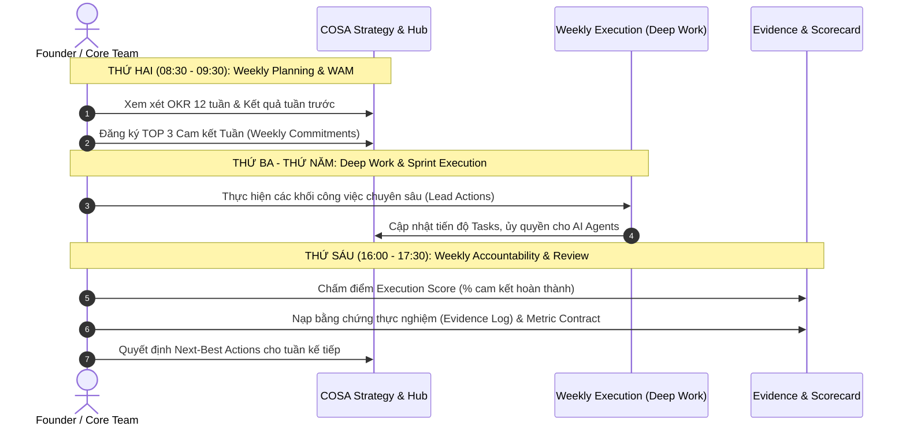

# GIÁO TRÌNH 12-WEEK YEAR CHO STARTUP
## Khung Vận Hành Thực Chiến: Từ Ý Tưởng Đến Sản Phẩm MVP & Khách Hàng Trả Phí
> **Hệ điều hành Doanh nghiệp COSA (COSA Founder Operating System)**  
> **Tài liệu tham khảo nền tảng & Cẩm nang hành động cho Founder**  
> *Phiên bản:* 1.0.0 | *Mã tài liệu:* `COSA-ACAD-12WY-01` | *Trạng thái:* Approved Standard

---

## MỤC LỤC

1. [TỔNG QUAN & TRIẾT LÝ VẬN HÀNH 12-WEEK YEAR](#1-tổng-quan--triết-lý-vận-hành-12-week-year)
   - 1.1. Nghịch lý của kế hoạch năm (The Annualized Trap)
   - 1.2. Định luật 12-Week Year trong khởi nghiệp công nghệ
   - 1.3. Sự giao thoa: 12-Week Year × Lean Startup
2. [BẢN ĐỒ CHIẾN LƯỢC: ÁNH XẠ VÒNG ĐỜI DỰ ÁN VÀO 12 TUẦN](#2-bản-đồ-chiến-lược-ánh-xạ-vòng-đời-dự-án-vào-12-tuần)
   - 2.1. Phân tích cấu trúc các giai đoạn (P0 → P5)
   - 2.2. Phân tích chuyên sâu: Bài toán "4 Tuần xây dựng MVP"
   - 2.3. Ma trận tổng thể 12 tuần của Startup
3. [CƠ CHẾ ĐIỀU HÀNH & NHỊP ĐIỆU HÀNG TUẦN (WEEKLY CADENCE)](#3-cơ-chế-điều-hành--nhịp-điệu-hàng-tuần-weekly-cadence)
   - 3.1. Nhịp điệu điều hành 5 ngày (Weekly Rhythm)
   - 3.2. Hệ thống chỉ số: Lead Indicators vs. Lag Indicators
   - 3.3. Đo lường Điểm số Thực thi (Execution Score & WAM)
4. [CHI TIẾT GIÁO TRÌNH VẬN HÀNH TỪNG TUẦN (WEEK-BY-WEEK PLAYBOOK)](#4-chi-tiết-giáo-trình-vận-hành-từng-tuần-week-by-week-playbook)
   - **PHA I: KHÁM PHÁ & THẤU CẢM VẤN ĐỀ (Tuần 1 – Tuần 2)**
     - Tuần 1: Problem Discovery & Target Customer Identification
     - Tuần 2: Problem Hypothesis Validation & Core Value Proposition
   - **PHA II: THIẾT KẾ GIẢI PHÁP & SPRINT MVP THẦN TỐC (Tuần 3 – Tuần 6)**
     - Tuần 3: Solution Architecture, Prototype Validation & Willingness-to-Pay Test
     - Tuần 4: MVP Sprint 1 — Foundation, Data Contracts & Multi-Plane Architecture
     - Tuần 5: MVP Sprint 2 — Core Killer Feature & Business Plane Logic
     - Tuần 6: MVP Sprint 3 — Experience Plane, Dogfooding & Feature Freeze
   - **PHA III: PILOT CÓ KIỂM SOÁT & XÁC THỰC DOANH THU (Tuần 7 – Tuần 9)**
     - Tuần 7: Pilot Kickoff & Onboarding First 10 Beta Customers
     - Tuần 8: Metric Contract Tracking & Rapid Pilot Iteration
     - Tuần 9: Monetization Gate & Paid Conversion Validation
   - **PHA IV: TĂNG TRƯỞNG SỚM, VẬN HÀNH & TỐT NGHIỆP CHU KỲ (Tuần 10 – Tuần 12)**
     - Tuần 10: Repeatable GTM Playbook & Acquisition Funnel Setup
     - Tuần 11: Early PMF Signal Audit & AI Workforce Integration
     - Tuần 12: 12-Week Year Graduation Review, Gate Transition & Cycle 2 Planning
5. [TÍCH HỢP HỆ THỐNG COSA OS & CODEBASE ARCHITECTURE](#5-tích-hợp-hệ-thống-cosa-os--codebase-architecture)
   - 5.1. Bounded Context: Strategy & Methodology Domain
   - 5.2. Bounded Context: 12-Week Year Execution Handlers & Calendar
   - 5.3. Bounded Context: AI Workforce, Capability Gateway & Governance
6. [BỘ BIỂU MẪU & BẰNG CHỨNG THỰC THI (FOUNDER ARTIFACT TEMPLATES)](#6-bộ-biểu-mẫu--bằng-chứng-thực-thi-founder-artifact-templates)

---

# 1. TỔNG QUAN & TRIẾT LÝ VẬN HÀNH 12-WEEK YEAR

### 1.1. Nghịch lý của kế hoạch năm (The Annualized Trap)
Hầu hết các startup thất bại không phải vì thiếu ý tưởng hay công nghệ kém, mà vì **ảo tưởng về thời gian**. Khi lập kế hoạch theo năm (12 tháng = 365 ngày):
- Tháng 1 đến tháng 6: Đội ngũ thường rơi vào trạng thái chủ quan, "chúng ta còn nhiều thời gian", dẫn đến mở rộng phạm vi (scope creep), tranh luận học thuật và trì hoãn tiếp xúc khách hàng.
- Tháng 10 đến tháng 12: Hoảng loạn chạy nước rút, tạo ra các tính năng vội vã, đốt cạn runway tiền bạc và sụp đổ.

### 1.2. Định luật 12-Week Year trong khởi nghiệp công nghệ
Khái niệm **12-Week Year** (Brian P. Moran & Michael Lennington) tái cấu trúc thời gian của một doanh nghiệp:
> **1 Năm = 12 Tuần.**  
> **1 Tuần = 1 Tháng.**  
> **1 Ngày = 1 Tuần.**

Trong chu kỳ 12 tuần, không có chỗ cho sự trì hoãn. Mỗi tuần đều là một mốc sống còn. Tính cấp bách (urgency) được duy trì liên tục, nhưng không gây kiệt sức (burnout) vì mục tiêu được thu hẹp vào duy nhất **1 đến 2 kết quả then chốt (Key Outcomes)**.

### 1.3. Sự giao thoa: 12-Week Year × Lean Startup × COSA Lifecycle
Trong hệ điều hành **COSA**, phương pháp 12-Week Year không phải là một danh sách việc cần làm (to-do list) đơn thuần, mà là một **khung nhịp điệu vận hành (operating cadence)** kết nối chặt chẽ chuỗi giá trị:

$$\text{Project} \longrightarrow \text{Stage} \longrightarrow \text{Assumption} \longrightarrow \text{Experiment} \longrightarrow \text{Evidence} \longrightarrow \text{Gate} \longrightarrow \text{Decision} \longrightarrow \text{Next Best Action}$$

- **Lean Startup**: Cung cấp tư duy kiểm chứng giả thuyết (Build - Measure - Learn).
- **12-Week Year**: Cung cấp kỷ luật thực thi theo tuần và chỉ số đo lường hiệu suất thực thi (Execution Score $\ge 85\%$).
- **COSA OS Architecture**: Cung cấp hạ tầng công nghệ (Control Plane, Business Plane, Agent Platform) và AI Workforce giúp nhà sáng lập đơn lẻ (Solo Founder) hoặc nhóm nhỏ thực thi với năng suất của một tổ chức 10 người.

---

# 2. BẢN ĐỒ CHIẾN LƯỢC: ÁNH XẠ VÒNG ĐỜI DỰ ÁN VÀO 12 TUẦN

### 2.1. Phân tích cấu trúc các giai đoạn (Project Lifecycle Stages)
Theo kiến trúc chuẩn hoá trong COSA (`shared/contracts/enums.json`), một dự án khởi nghiệp trải qua các giai đoạn chính tắc:
- `P0_DISCOVERY`: Khám phá vấn đề & xác định phân khúc mục tiêu.
- `P1_PROBLEM_VALIDATION`: Xác thực độ đau đớn của vấn đề & thiết kế giải pháp sơ bộ.
- `P2_SOLUTION_VALIDATION`: Xác thực mô hình kinh doanh & mức độ sẵn sàng chi trả (Willingness-to-pay).
- `P3_BUILD_VALIDATE`: Xây dựng sản phẩm khả dụng tối thiểu (MVP) & triển khai pilot.
- `P4_GO_TO_MARKET`: Mở rộng phễu bán hàng & vận hành chiến dịch ra mắt có kiểm soát.
- `P5_OPERATE_GROWTH`: Đo lường Product-Market Fit (PMF) & xây dựng cỗ máy tăng trưởng lặp lại.
- `P6_SCALE_GOVERN`: Mở rộng quy mô, hoàn thiện pháp lý & quản trị doanh nghiệp.

### 2.2. Phân tích chuyên sâu: Bài toán "4 Tuần xây dựng MVP"
> **Câu hỏi thực chiến của Founder:** *"Có thể dành 4 tuần đầu tiên để làm ngay sản phẩm MVP được không?"*

**Phân tích rủi ro:**
Nếu lao vào code ngay từ Tuần 1 đến Tuần 4 mà **chưa kiểm chứng vấn đề khách hàng**, startup rơi vào cái bẫy lớn nhất: **Product Death Cycle** (Xây dựng một phần mềm hoàn hảo cho một vấn đề không ai quan tâm).

**Lời giải chuẩn mực theo COSA Playbook:**
Chúng ta **vẫn có trọn vẹn 4 tuần tập trung cao độ để xây dựng MVP** (Sprint MVP 4 tuần), nhưng 4 tuần này được đặt tại vị trí chiến lược: **Từ Tuần 3 đến Tuần 6**, sau khi đã có bằng chứng xác nhận vấn đề ở Tuần 1 & 2!

```
[ Tuần 1 - 2 ] ──► [ Tuần 3 - 6 ] ──► [ Tuần 7 - 9 ] ──► [ Tuần 10 - 12 ]
Khám phá & Xác     4 TUẦN SPRINT      Pilot thực nghiệm   Tăng trưởng sớm &
thực Vấn đề (P0)   XÂY DỰNG MVP       & Thu tiền (P3/P4)  PMF Audit (P5)
(Discovery & Fit)  (Build & Contracts)
```

1. **Tuần 1 – Tuần 2 (Discovery & Solution Concept):** Founder làm rõ vấn đề qua 15 cuộc phỏng vấn Mom Test và bản vẽ Prototype giả lập (Interactive Wireframe). Điều này ngăn chặn việc lãng phí hàng trăm giờ code sai hướng.
2. **Tuần 3 – Tuần 6 (4 Tuần Build MVP Thực Chiến):**
   - *Tuần 3:* Khóa đặc tả hợp đồng (Contract Freeze), kiến trúc hệ thống và kiểm tra thiện chí trả tiền (LOI/Pre-order).
   - *Tuần 4 (MVP Week 1):* Xây dựng Core Foundation, Data Schema & Auth.
   - *Tuần 5 (MVP Week 2):* Xây dựng Killer Feature cốt lõi giải quyết đúng 1 tác vụ sống còn.
   - *Tuần 6 (MVP Week 3):* Hoàn thiện UI/UX, Dogfooding nội bộ, đóng băng code (Code Freeze).
3. **Tuần 7 – Tuần 9 (Pilot & Monetization):** Đưa MVP cho 10 khách hàng dùng thử có cam kết và thu những đồng doanh thu đầu tiên.
4. **Tuần 10 – Tuần 12 (Early Growth & PMF):** Tối ưu hóa chuyển đổi, xây dựng Sales Playbook và đánh giá cổng chuyển giai đoạn.

### 2.3. Ma trận tổng thể 12 tuần của Startup

| Tuần | Tên Chặng | Giai đoạn Lifecycle | Mục tiêu Trọng tâm (Weekly North Star) | Sản phẩm Bàn giao (Deliverables) | Cổng Đánh giá (Gate / Evidence) |
|:---:|---|:---:|---|---|---|
| **W1** | Discovery | `P0_DISCOVERY` | Nhận diện 1 vấn đề nhức nhối & 1 tệp khách hàng hẹp | 15 Bản ghi phỏng vấn Mom Test, Persona Card | Problem Evidence $\ge 0.7$ |
| **W2** | Problem Fit | `P1_PROBLEM_VALIDATION` | Kiểm chứng độ đau & định vị Core Value Proposition | Bản tuyên ngôn giá trị (CVP), Báo cáo tín hiệu vấn đề | Gate P0 → P1 Passed |
| **W3** | Solution Spec | `P1` → `P2` | Khóa Spec MVP & lấy 3–5 Thư cam kết trả phí (LOI) | Interactive Prototype, 3 LOI/Pre-orders, MVP Spec Doc | Pre-order Evidence |
| **W4** | MVP Sprint 1 | `P3_BUILD_VALIDATE` | Dựng móng kỹ thuật, Data Contracts & Auth/Tenant | Database schema, CI/CD, Authentication, Service Stubs | Architecture Approved |
| **W5** | MVP Sprint 2 | `P3_BUILD_VALIDATE` | Hoàn thiện "Killer Feature" giải quyết 1 luồng duy nhất | Core Business Logic, API endpoints, AI Agent workflow | Core Flow Functional |
| **W6** | MVP Sprint 3 | `P3_BUILD_VALIDATE` | Hoàn tất Frontend UI/UX, Dogfooding & Code Freeze | Bản build MVP v1.0 trên Staging, 0 Blocker Bugs | **MVP Release Gate** |
| **W7** | Pilot Launch | `P3_BUILD_VALIDATE` | Onboard 5–10 Beta Customers đầu tiên trong 48h | 10 Pilot Workspaces kích hoạt, Pilot Metric Contract | Activation Rate $\ge 80\%$ |
| **W8** | Pilot Sprint | `P3` → `P4` | Rút ngắn Time-to-Value & tinh chỉnh trải nghiệm | Changelog v1.1 vá lỗi tức thì, Báo cáo sử dụng hàng tuần | Retention Day 7 $\ge 60\%$ |
| **W9** | Monetization | `P2` & `P4` | Chuyển đổi Pilot thành khách hàng trả tiền thực tế | Hợp đồng trả phí đầu tiên, Doanh thu thực tế phát sinh | Gate P3 → P4 Passed |
| **W10**| GTM Playbook | `P4_GO_TO_MARKET` | Đóng gói cỗ máy bán hàng & kênh tiếp cận lặp lại | Sales Script, Onboarding Playbook, 2 Acquisition Channels| Qualified Leads Funnel |
| **W11**| PMF Pulse | `P5_OPERATE_GROWTH`| Khảo sát chỉ số PMF (Sean Ellis) & Tự động hóa Ops | Báo cáo Sean Ellis PMF, Cấu hình AI Workforce hỗ trợ | PMF Score & NPS |
| **W12**| Graduation | `P5` / Review | Tổng kết 12-Week Year Scorecard & Hoạch định Cycle 2| 12-Week Year Audit Report, Stage Transition Decision | Cycle Review Approved |

---

# 3. CƠ CHẾ ĐIỀU HÀNH & NHỊP ĐIỆU HÀNG TUẦN (WEEKLY CADENCE)

Phương pháp 12-Week Year đòi hỏi tính kỷ luật tuyệt đối thông qua nhịp điệu cố định (Operating Cadence). Nếu không có lịch cố định, kế hoạch sẽ nhanh chóng bị cuốn trôi bởi các việc sự vụ khẩn cấp.

### 3.1. Nhịp điệu điều hành 5 ngày (Weekly Rhythm)



- **Thứ Hai — Lập kế hoạch & Họp Trách nhiệm Tuần (Weekly Accountability Meeting - WAM):**
  - Thời lượng: 45–60 phút.
  - Nội dung: Đánh giá điểm số thực thi tuần trước; cam kết 3 mục tiêu ưu tiên (Top 3 Focus Commitments) cho tuần này. Không đùn đẩy, không viện lý do.
- **Thứ Ba đến Thứ Năm — Thực thi tập trung (Deep Work Blocks):**
  - Chia mỗi ngày thành các khối thời gian chiến lược (Strategic Blocks: 2–3 giờ không ngắt quãng dành cho Product/Code hoặc Khách hàng).
  - Tận dụng AI Workforce trong COSA để giải quyết các tác vụ lặp lại (viết tài liệu, soạn thảo email outreach, dựng test suite).
- **Thứ Sáu — Đánh giá hàng tuần & Ghi nhận bằng chứng (Weekly Review & Evidence Logging):**
  - Thời lượng: 60 phút.
  - Tính toán **Execution Score**: Tỷ lệ phần trăm các công việc đã cam kết vào Thứ Hai được hoàn thành 100%.
  - Nạp các bằng chứng thực tế (`Evidence` artifacts: ghi âm phỏng vấn, log hệ thống, hợp đồng) vào COSA Hub.
- **Cuối tuần — Tự suy ngẫm (Founder Reflection):**
  - Nhìn nhận bài học thất bại, đo lường năng lượng tinh thần (Founder Burnout Check) và chuẩn bị tâm thế cho tuần mới.

### 3.2. Hệ thống chỉ số: Lead Indicators vs. Lag Indicators
Sai lầm phổ biến của startup là chỉ nhìn vào chỉ số trễ (Lag Indicators). Trong chu kỳ 12 tuần, sự tập trung phải dồn 80% vào chỉ số dẫn dắt (Lead Indicators):

| Loại chỉ số | Đặc điểm | Ví dụ trong Chu kỳ 12 Tuần | Vai trò trong COSA |
|---|---|---|---|
| **Lead Indicators** *(Chỉ số dẫn dắt)* | - Nằm hoàn toàn trong tầm kiểm soát của đội ngũ.<br>- Dự báo trước kết quả tương lai.<br>- Thực hiện hàng ngày/hàng tuần. | - Số cuộc phỏng vấn khách hàng đã thực hiện.<br>- Số dòng mã/PRs hoàn thành kiểm thử.<br>- Số email cold outreach cá nhân hóa đã gửi.<br>- Số buổi demo 1-1 cho khách pilot. | Đo lường mức độ nỗ lực và tính kỷ luật của nhóm thông qua `WeeklyCommitment`. |
| **Lag Indicators** *(Chỉ số kết quả)* | - Kết quả cuối cùng đạt được.<br>- Không thể tác động trực tiếp mà chỉ phản ánh gián tiếp qua Lead actions. | - Doanh thu định kỳ tháng (MRR).<br>- Tỷ lệ chuyển đổi khách hàng trả phí.<br>- Điểm số Sean Ellis PMF Score.<br>- Điểm đánh giá sự hài lòng (NPS). | Dùng để đánh giá tại các cổng chuyển giai đoạn (`StagePolicy` & `GateEvaluation`). |

### 3.3. Đo lường Điểm số Thực thi (Execution Score & WAM)
Điểm số thực thi là thước đo cốt lõi của 12-Week Year:

$$\text{Execution Score} = \left( \frac{\text{Số cam kết hoàn thành đạt 100\%}}{\text{Tổng số cam kết đã đăng ký đầu tuần}} \right) \times 100\%$$

- **Quy tắc Vàng:**
  - Nếu $\text{Execution Score} \ge 85\%$: Startup gần như chắc chắn sẽ đạt được mục tiêu 12 tuần đề ra.
  - Nếu $\text{Execution Score} < 70\%$: Kế hoạch đang bị vỡ; cần lập tức giảm tải số lượng đầu mối công việc, loại bỏ các cuộc họp vô bổ, hoặc đánh giá lại mức độ khả thi.
  - Không có trạng thái "hoàn thành 80% một công việc". Trong 12-Week Year: Chỉ có **Đã xong (1)** hoặc **Chưa xong (0)**.

---

# 4. CHI TIẾT GIÁO TRÌNH VẬN HÀNH TỪNG TUẦN (WEEK-BY-WEEK PLAYBOOK)

---

## 🟥 PHA I: KHÁM PHÁ & THẤU CẢM VẤN ĐỀ (Tuần 1 – Tuần 2)
> **Trọng tâm:** Xác định vấn đề thực sự nhức nhối và phân khúc khách hàng mục tiêu chịu trả tiền.  
> **Giai đoạn Lifecycle:** `P0_DISCOVERY` $\longrightarrow$ `P1_PROBLEM_VALIDATION`  
> **Workspace Stage tương ứng:** `W0_IDEA` $\longrightarrow$ `W1_PROBLEM_VALIDATION`

---

### TUẦN 1: Problem Discovery & Target Customer Identification
*Khám phá vấn đề & Xác định chân dung khách hàng mục tiêu hẹp*

#### 1. Mục tiêu trọng tâm của tuần (Weekly Mission)
Rời khỏi văn phòng (Get out of the building), tiếp cận và thực hiện tối thiểu 15 cuộc phỏng vấn định tính không thiên kiến (Mom Test) để tìm ra 1 vấn đề đau đớn nhất mà khách hàng đang chủ động tìm giải pháp khắc phục.

#### 2. Chỉ số đo lường (Indicators)
- **Lead Indicators:** 40 tin nhắn/lời mời phỏng vấn được gửi đi; 15 cuộc phỏng vấn 1-1 (25 phút/cuộc) hoàn thành; 15 bảng ghi chép phân tích Jobs-to-be-Done (JTBD).
- **Lag Indicators:** Xác định được ít nhất 3 nỗi đau lặp lại ở $\ge 60\%$ số người được phỏng vấn; xác lập được 1 nhóm khách hàng có động lực mua hàng cao nhất (Beachhead Segment).

#### 3. Danh mục công việc thực thi chi tiết
- **Founder & Customer Discovery:**
  - Soạn thảo kịch bản phỏng vấn theo phương pháp *The Mom Test* (Nói về cuộc sống thực tế của họ, không hỏi về tương lai hay giới thiệu ý tưởng của mình).
  - Lập danh sách 50 khách hàng tiềm năng thuộc phân khúc mục tiêu giả định thông qua LinkedIn, cộng đồng chuyên môn hoặc mạng lưới quen biết.
  - Tiến hành phỏng vấn, ghi âm (với sự đồng ý) và trích xuất nguyên văn các trích dẫn (verbatim quotes) về khó khăn của họ.
- **Product & Strategy Analysis:**
  - Lập bản đồ Jobs-to-be-Done (JTBD): Khách hàng đang muốn hoàn thành công việc gì? Trở ngại chức năng (Functional), cảm xúc (Emotional) và xã hội (Social) là gì?
  - Lập ma trận đối chiếu: Cách họ đang giải quyết vấn đề hiện tại (Excel, giấy tờ, công cụ cũ, thuê ngoài) và chi phí họ đang phải trả (thời gian, tiền bạc, rủi ro).
- **Ops & Governance:**
  - Khởi tạo Dự án trên COSA Strategy với stage `P0_DISCOVERY`.
  - Lưu trữ 15 bản ghi phỏng vấn vào COSA Knowledge Ingestion dưới dạng tài liệu chứng cứ (`Evidence`).

#### 4. Bằng chứng cần thu thập (Evidence Artifacts)
- `evidence-p0-interview-notes.md`: Tổng hợp 15 biên bản phỏng vấn kèm trích dẫn thực tế.
- `target-persona-canvas.json`: Định nghĩa phân khúc khách hàng hẹp (Beachhead Market).

#### 5. Công cụ COSA hỗ trợ
- Module Strategy: `POST /operations/projects` (Khởi tạo project stage `P0_DISCOVERY`).
- AI Agent platform: Sử dụng Agent tóm tắt và bóc tách insight từ file ghi âm phỏng vấn.

#### 6. Bài học COSA Academy tương ứng
- **Lesson 0.2:** What Is a Startup?
- **Lesson 0.4:** From an Idea to a Project.
- **Lesson 1.1 (`p0-m1-l01`):** Khung phát hiện vấn đề (Problem Discovery Framework).
- **Lesson 1.2 (`p0-m1-l02`):** Phỏng vấn khám phá định tính.
- **Lesson 1.3 (`p0-m1-l03`):** Xác định phân khúc khách hàng mục tiêu.

#### 7. Tiêu chí qua cổng (Exit Gate P0 Check)
- Có tối thiểu 10/15 người được phỏng vấn xác nhận vấn đề là "cực kỳ nghiêm trọng" (Điểm đau đớn $\ge 8/10$) và đã từng chi tiền hoặc thời gian để giải quyết nhưng chưa hài lòng.

---

### TUẦN 2: Problem Hypothesis Validation & Core Value Proposition
*Kiểm chứng giả thuyết vấn đề & Thiết kế Lời hứa giá trị cốt lõi*

#### 1. Mục tiêu trọng tâm của tuần (Weekly Mission)
Kiểm tra chéo các tín hiệu vấn đề thu thập được ở Tuần 1, phân biệt giữa lời phàn nàn vu vơ với nỗi đau thương mại có khả năng chi trả; đóng gói bản Tuyên ngôn Giá trị Cốt lõi (Core Value Proposition - CVP).

#### 2. Chỉ số đo lường (Indicators)
- **Lead Indicators:** 5 cuộc phỏng vấn đào sâu xác nhận ngân sách; hoàn thành 1 bản phân tích bối cảnh cạnh tranh (Competitive Landscape); 3 phiên bản thông điệp CVP được thử nghiệm.
- **Lag Indicators:** 1 tài liệu CVP duy nhất được chọn; đạt được sự đồng thuận của Gatekeeper/Buyer về mức độ ưu tiên của giải pháp.

#### 3. Danh mục công việc thực thi chi tiết
- **Founder & Customer Alignment:**
  - Phỏng vấn người giữ túi tiền (Economic Buyer): Ai là người chịu trách nhiệm ngân sách cho vấn đề này? Quy trình phê duyệt mua sắm thế nào?
  - Nhận diện tín hiệu mua hàng thực sự: Họ có ngân sách sẵn có (allocated budget) cho việc này không, hay đây chỉ là việc "tiện thì làm" (nice-to-have)?
- **Solution & Value Proposition Design:**
  - Viết bản tuyên ngôn giá trị sắc bén theo cấu trúc: *"Chúng tôi giúp [Khách hàng mục tiêu] đạt được [Kết quả mong muốn] trong vòng [Thời gian] mà không phải chịu [Nỗi đau lớn nhất]."*
  - Phân tích vị thế cạnh tranh: Tại sao các giải pháp hiện nay thất bại? Yếu tố khác biệt hóa 10x của chúng ta nằm ở đâu (nhanh hơn 10x, rẻ hơn 10x, hay đơn giản hóa triệt để)?
- **Strategy & Governance:**
  - Chạy `StagePolicy` kiểm tra điều kiện chuyển từ `P0_DISCOVERY` sang `P1_PROBLEM_VALIDATION`.
  - Tạo bảng Assumption Register trong COSA với mức độ rủi ro $Impact \times Uncertainty$.

#### 4. Bằng chứng cần thu thập (Evidence Artifacts)
- `evidence-p1-value-proposition.md`: Bản mô tả CVP chi tiết kèm phân tích khác biệt hóa.
- `gate-evaluation-p0-p1.json`: Biên bản đánh giá cổng chuyển giai đoạn dựa trên bằng chứng.

#### 5. Công cụ COSA hỗ trợ
- API `strategy/gate-evaluations`: Thực thi đánh giá cổng P0 $\rightarrow$ P1 tất định.
- COSA Hub: Theo dõi Top 3 Focus của tuần.

#### 6. Bài học COSA Academy tương ứng
- **Lesson 1.4 (`p0-m1-l04`):** Phân tích Jobs-to-be-Done.
- **Lesson 1.5 (`p0-m1-l05`):** Nhận biết tín hiệu vấn đề thực vs. giả định.
- **Lesson 1.7 (`p0-m1-l07`):** Kiểm tra giả thuyết vấn đề (Problem Hypothesis Testing).
- **Lesson 2.1 (`p1-m2-l01`):** Khung Solution Fit.

#### 7. Tiêu chí qua cổng (Exit Gate Check)
- Biên bản Gate Evaluation phê duyệt chuyển stage sang `P1_PROBLEM_VALIDATION`. Xác nhận không có giả thuyết blocker nào ở mức rủi ro nghiêm trọng bị bỏ sót.

---

## 🟨 PHA II: THIẾT KẾ GIẢI PHÁP & SPRINT MVP THẦN TỐC (Tuần 3 – Tuần 6)
> **Trọng tâm:** 4 tuần tập trung xây dựng sản phẩm khả dụng tối thiểu (MVP) với kiến trúc chuẩn mực và xác thực thiện chí chi trả.  
> **Giai đoạn Lifecycle:** `P1_PROBLEM_VALIDATION` $\longrightarrow$ `P3_BUILD_VALIDATE`  
> **Workspace Stage tương ứng:** `W2_SOLUTION_VALIDATION` $\longrightarrow$ `W3_MVP_BUILD`

---

### TUẦN 3: Solution Architecture, Prototype Validation & Willingness-to-Pay Test
*Thử nghiệm nguyên mẫu tương tác, chốt đặc tả MVP & Kiểm tra thiện chí chi trả*

#### 1. Mục tiêu trọng tâm của tuần (Weekly Mission)
Thiết kế Interactive Prototype (Figma / Clickable Prototype), thực hiện User Feedback Loop với 10 khách hàng, lấy được tối thiểu **3 Thư bày tỏ nguyện vọng hợp tác (Letter of Intent - LOI)** hoặc tiền cọc (Pre-orders) trước khi viết dòng code chính thức nào.

#### 2. Chỉ số đo lường (Indicators)
- **Lead Indicators:** 1 bộ Clickable Prototype hoàn chỉnh (1 luồng trải nghiệm chính); 10 buổi demo nguyên mẫu cho khách hàng tiềm năng; 5 bản thảo thỏa thuận LOI/Pre-order gửi đi.
- **Lag Indicators:** Tối thiểu 3 thỏa thuận LOI có chữ ký hoặc 3 cam kết tham gia Closed Pilot có đặt cọc tượng trưng; 1 bản tài liệu đặc tả MVP Scope & Contracts được đóng băng (Freeze).

#### 3. Danh mục công việc thực thi chi tiết
- **Product & UX Design:**
  - Thiết kế luồng trải nghiệm người dùng (Happy Path) cho đúng 1 tính năng sát thủ (Killer Feature). Cắt bỏ hoàn toàn các tính năng phụ trợ (cài đặt nâng cao, đổi theme, thông báo phức tạp).
  - Dựng Clickable Prototype trên Figma.
- **Customer Feedback & Willingness-to-Pay Test:**
  - Demo prototype cho 10 khách hàng: Để họ tự bấm và tương tác mà không giải thích trước; quan sát điểm tắc nghẽn nhận thức của họ.
  - Đưa ra đề nghị bán hàng sớm: *"Nếu chúng tôi cung cấp hệ thống này trong 4 tuần tới với mức giá ưu đãi [X]/tháng cho nhóm pilot đầu tiên, anh/chị có sẵn sàng ký cam kết thử nghiệm không?"*
- **Engineering & Specification:**
  - Soạn thảo tài liệu `mvp-surface-contract.json`: Định nghĩa chính xác các API endpoints, schema dữ liệu, quyền hạn và ranh giới hệ thống.
  - Lập kế hoạch phân rã 3 tuần code tiếp theo (Tuần 4, 5, 6).

#### 4. Bằng chứng cần thu thập (Evidence Artifacts)
- `evidence-p2-prototype-feedback.json`: Bảng tổng hợp phản hồi trải nghiệm prototype.
- `evidence-p2-signed-lois.pdf`: Bản scan 3–5 LOI đã ký hoặc biên nhận pre-order.
- `mvp-specification-frozen.md`: Tài liệu đặc tả MVP đã khóa scope.

#### 5. Công cụ COSA hỗ trợ
- `services/company/commercial`: Khởi tạo Pipeline Leads & Opportunities cho các khách hàng tham gia LOI.
- `services/company/operations/strategy`: Nạp bằng chứng `LOI_SIGNED` với `strength: 0.85`.

#### 6. Bài học COSA Academy tương ứng
- **Lesson 2.2 (`p1-m2-l02`):** Thiết kế MVP tối giản.
- **Lesson 2.4 (`p1-m2-l04`):** Phỏng vấn phản hồi prototype.
- **Lesson 3.2 (`p2-m3-l02`):** Giả thuyết doanh thu và sẵn lòng chi trả.
- **Lesson 3.3 (`p2-m3-l03`):** Kiểm tra định giá.

#### 7. Tiêu chí qua cổng (Exit Gate P1 $\rightarrow$ P3 Check)
- Thu thập đủ tối thiểu 3 cam kết bằng văn bản (LOI/Pre-order). Scope của MVP được đóng băng chính thức. Chuyển stage sang `P3_BUILD_VALIDATE`.

---

### TUẦN 4: MVP Sprint 1 — Foundation, Data Contracts & Multi-Plane Architecture
*Xây dựng nền tảng kỹ thuật, Database Schema & Kiến trúc đa tầng*

#### 1. Mục tiêu trọng tâm của tuần (Weekly Mission)
Thiết lập toàn bộ hạ tầng kỹ thuật chuẩn mực (theo kiến trúc đa tầng tương tự COSA: Control Plane, Business Plane, Experience Plane), hoàn thiện cơ sở dữ liệu, phân tách Tenant/Workspace, Authentication và CI/CD tự động.

#### 2. Chỉ số đo lường (Indicators)
- **Lead Indicators:** 100% các bảng database cốt lõi được migrate thành công; hệ thống CI/CD chạy pass tất cả test nền tảng; tích hợp hoàn chỉnh luồng Sign-up/Sign-in & Workspace Resolution.
- **Lag Indicators:** Môi trường Staging sẵn sàng hoạt động với thời gian phản hồi API nền tảng $< 100\text{ms}$; 0 lỗi bảo mật rò rỉ dữ liệu giữa các tenant.

#### 3. Danh mục công việc thực thi chi tiết
- **Backend & System Architecture:**
  - Khởi tạo kiến trúc dự án (khuyến nghị phân lớp rõ ràng: Presentation Layer, Business Domain Service, Storage/Database Layer).
  - Thiết kế và triển khai Database Schema (PostgreSQL + Drizzle/Prisma/SQLAlchemy) đảm bảo cô lập dữ liệu theo `workspace_id`.
  - Triển khai xác thực (JWT Auth, RBAC - Role Based Access Control) và xác minh quyền truy cập tenant ở cấp độ server (Fail-closed policy).
- **DevOps & Infrastructure:**
  - Thiết lập Docker Compose cho môi trường phát triển cục bộ và container hóa ứng dụng.
  - Cấu hình GitHub Actions / CI pipeline chạy Linting, Type Check và Automated Unit Tests khi mở PR.
  - Triển khai Staging Environment trên hạ tầng đám mây (Cloud Server / VPS / Serverless).
- **Ops & Team Rhythm:**
  - Tổ chức Daily Standup 10 phút mỗi sáng: Cam kết khối lượng code hoàn thành trong ngày.

#### 4. Bằng chứng cần thu thập (Evidence Artifacts)
- `schema-architecture-diagram.png`: Sơ đồ quan hệ thực thể (ERD) và phân vùng database.
- `ci-cd-passing-report.json`: Log chạy CI pipeline thành công trên nhánh chính (`main`).

#### 5. Công cụ COSA hỗ trợ
- Tham chiếu kiến trúc `shared/contracts/enums.json` và `services/company/shared/auth/workspace-access.ts` để áp dụng chuẩn bảo mật đa người thuê (Multi-tenancy).

#### 6. Bài học COSA Academy tương ứng
- **Lesson 0.8:** Run Your Week: Tasks, Decisions, Approvals, and AI Workforce.
- **Lesson 2.7 (`p1-m2-l07`):** Xác định core value proposition.
- **Lesson 6.4 (`p5-m6-l04`):** Xây dựng hệ thống data và analytics (nền tảng ghi log & sự kiện).

#### 7. Tiêu chí qua cổng (Sprint 1 Review)
- Người dùng có thể đăng ký tài khoản mới, tạo Workspace, đăng nhập và nhận Token hợp lệ. API trả về mã `200` và bảo mật cách ly dữ liệu giữa các workspace được kiểm chứng qua unit test.

---

### TUẦN 5: MVP Sprint 2 — Core Killer Feature & Business Plane Logic
*Xây dựng tính năng sát thủ cốt lõi & Nghiệp vụ chuyên sâu*

#### 1. Mục tiêu trọng tâm của tuần (Weekly Mission)
Triển khai trọn vẹn 100% logic nghiệp vụ của Tính năng Sát thủ (Killer Feature). Dữ liệu có thể được tạo lập, xử lý và tạo ra giá trị giải quyết trực tiếp nỗi đau khách hàng đã xác thực ở Tuần 1 & 2.

#### 2. Chỉ số đo lường (Indicators)
- **Lead Indicators:** Hoàn thành 100% các API endpoints của tính năng cốt lõi; viết tối thiểu 15 Integration Tests bao phủ toàn bộ các trường hợp biên (Edge cases); tích hợp Agent / Background Worker (nếu có AI/automation).
- **Lag Indicators:** Luồng nghiệp vụ cốt lõi xử lý thành công với tỷ lệ lỗi $< 1\%$; dữ liệu đầu ra đạt độ chính xác và chất lượng theo kỳ vọng của khách hàng.

#### 3. Danh mục công việc thực thi chi tiết
- **Domain Business Logic Implementation:**
  - Lập trình các service nghiệp vụ chuyên sâu (Business Plane Services).
  - Đảm bảo logic tính toán, xử lý nghiệp vụ hoạt động độc lập và không phụ thuộc trực tiếp vào giao diện (UI decoupled).
  - Tích hợp AI / LLM Orchestration hoặc quy trình tự động hóa (nếu sản phẩm là AI-SaaS) thông qua hàng đợi tác vụ bất đồng bộ (Background Worker / Job Queue), tránh làm nghẽn HTTP API.
- **API Contracts & Integration Testing:**
  - Hoàn thiện tài liệu API Spec (OpenAPI / Swagger / Contracts).
  - Viết Integration Tests kiểm tra toàn diện luồng: *Input dữ liệu $\rightarrow$ Xử lý nghiệp vụ $\rightarrow$ Lưu trữ $\rightarrow$ Kết quả đầu ra*.
- **Pre-Pilot Communication:**
  - Gửi bản cập nhật tiến độ (Progress Update) cho 3–5 khách hàng đã ký LOI ở Tuần 3, hẹn lịch bàn giao sản phẩm trong tuần sau.

#### 4. Bằng chứng cần thu thập (Evidence Artifacts)
- `core-feature-api-spec.json`: Đặc tả API tính năng cốt lõi.
- `integration-test-results.xml`: Báo cáo chạy test tự động đạt tỷ lệ pass $100\%$.

#### 5. Công cụ COSA hỗ trợ
- Tham chiếu mô hình `apps/cosa` (FastAPI Composition + Asynchronous Worker) và `packages/agent` (Capability Gateway & Audit Trail).

#### 6. Bài học COSA Academy tương ứng
- **Lesson 2.3 (`p1-m2-l03`):** Phương pháp kiểm tra giải pháp.
- **Lesson 2.8 (`p1-m2-l08`):** Tổng hợp bằng chứng Solution Fit.

#### 7. Tiêu chí qua cổng (Sprint 2 Review)
- Tính năng cốt lõi có thể được gọi và phản hồi chính xác qua Postman/cURL hoặc automated script. Xử lý thành công toàn bộ luồng nghiệp vụ không có lỗi hệ thống (Zero 500 Internal Server Errors).

---

### TUẦN 6: MVP Sprint 3 — Experience Plane, Dogfooding & Feature Freeze
*Hoàn thiện giao diện người dùng, Thử nghiệm nội bộ & Đóng băng tính năng*

#### 1. Mục tiêu trọng tâm của tuần (Weekly Mission)
Kết nối giao diện người dùng (Frontend / UI / Flutter / Web) với Backend, hoàn thiện luồng trải nghiệm từ đầu đến cuối (End-to-End), thực hiện tự dùng sản phẩm nội bộ (Dogfooding) và chính thức **Đóng băng tính năng (Feature Freeze)** để chuẩn bị ra mắt Pilot.

#### 2. Chỉ số đo lường (Indicators)
- **Lead Indicators:** 100% màn hình thiết yếu được kết nối API; toàn bộ thành viên trong nhóm thực hiện trọn vẹn quy trình 10 lần (Dogfooding runs); khắc phục toàn bộ các lỗi nghiêm trọng (Blocker & Critical bugs).
- **Lag Indicators:** 0 lỗi cấp độ Blocker/Critical; bản build MVP v1.0 được tag và triển khai ổn định trên môi trường Staging/Production.

#### 3. Danh mục công việc thực thi chi tiết
- **Frontend Development & Polish:**
  - Xây dựng giao diện tinh gọn, phản hồi nhanh, ưu tiên tối đa tính dễ hiểu thay vì hoa mỹ phức tạp.
  - Xử lý mượt mà các trạng thái giao diện: Loading, Empty state, Error message dễ hiểu cho người dùng không rành kỹ thuật.
- **Dogfooding & End-to-End Testing:**
  - Founder và toàn đội ngũ đóng vai khách hàng thực sự, nhập dữ liệu thật và sử dụng sản phẩm để hoàn thành công việc thực tế.
  - Ghi nhận mọi điểm vướng mắc (UX friction) vào danh sách lỗi cần xử lý ngay.
- **Feature Freeze & Deployment:**
  - Đúng 17:00 Thứ Năm: **ĐÓNG BĂNG TÍNH NĂNG**. Tuyệt đối không thêm bất kỳ tính năng mới nào dù nhỏ.
  - Triển khai bản phát hành `v1.0.0-pilot` lên môi trường Production.
  - Kiểm tra hệ thống giám sát lỗi (Sentry / Datadog / Cloud Watch) và cơ chế sao lưu dữ liệu.

#### 4. Bằng chứng cần thu thập (Evidence Artifacts)
- `mvp-release-v1.0-notes.md`: Bản ghi phát hành sản phẩm và danh mục tính năng khả dụng.
- `dogfooding-audit-checklist.json`: Biên bản kiểm thử nội bộ đạt yêu cầu.

#### 5. Công cụ COSA hỗ trợ
- COSA Approvals: Tạo yêu cầu phê duyệt phát hành phiên bản MVP Release.
- COSA Task Center: Chuyển toàn bộ các ý tưởng phát sinh mới vào `Backlog - Post-Pilot`.

#### 6. Bài học COSA Academy tương ứng
- **Lesson 3.9 (`p2-m3-l09`):** Chuẩn bị pilot với khách hàng thực.
- **Lesson 4.1 (`p3-m4-l01`):** Thiết kế pilot có kiểm soát.

#### 7. Tiêu chí qua cổng (MVP Release Gate Check)
- Bản build MVP v1.0 đã trực tuyến, hoạt động ổn định, tài liệu hướng dẫn nhanh (Quick Start Guide) 1 trang đã sẵn sàng. Sẵn sàng bàn giao tài khoản cho khách hàng Pilot vào sáng Thứ Hai tuần tới!

---

## 🟩 PHA III: PILOT CÓ KIỂM SOÁT & XÁC THỰC DOANH THU (Tuần 7 – Tuần 9)
> **Trọng tâm:** Đưa MVP vào môi trường vận hành thực tế của khách hàng, theo dõi sát sao chỉ số sử dụng và kích hoạt thanh toán.  
> **Giai đoạn Lifecycle:** `P3_BUILD_VALIDATE` $\longrightarrow$ `P4_GO_TO_MARKET`  
> **Workspace Stage tương ứng:** `W3_MVP_BUILD` $\longrightarrow$ `W4_PRODUCT_MARKET_FIT`

---

### TUẦN 7: Pilot Kickoff & Onboarding First 10 Beta Customers
*Khởi động chương trình Pilot & Onboard 10 khách hàng thử nghiệm đầu tiên*

#### 1. Mục tiêu trọng tâm của tuần (Weekly Mission)
Trực tiếp onboard 5 đến 10 khách hàng thử nghiệm đầu tiên (ưu tiên các khách hàng đã ký LOI ở Tuần 3) thông qua các buổi hướng dẫn 1-1, đảm bảo họ đạt được **Khoảnh khắc nhận ra giá trị (Aha! Moment)** trong vòng 24 giờ đầu tiên.

#### 2. Chỉ số đo lường (Indicators)
- **Lead Indicators:** 10 buổi onboarding 1-1 qua Zoom/Google Meet (hoặc trực tiếp tại cơ sở của họ); thiết lập 1 nhóm hỗ trợ riêng (Telegram/Zalo/Slack) cho từng khách hàng.
- **Lag Indicators:** Tối thiểu $80\%$ khách hàng pilot (8/10) hoàn thành tác vụ đầu tiên (First Core Action Completed) trong vòng 24 giờ kể từ khi nhận tài khoản; thời gian đạt Time-to-Value (TTV) $< 24\text{h}$.

#### 3. Danh mục công việc thực thi chi tiết
- **White-glove Onboarding (Chăm sóc tận tay):**
  - Không gửi link rồi để khách hàng tự mò mẫm. Founder trực tiếp ngồi cùng khách hàng, hỗ trợ họ nhập dữ liệu thực tế và giải quyết vấn đề đầu tiên trên phần mềm.
  - Thiết lập **Metric Contract Pilot** với từng khách hàng: Thống nhất rõ tiêu chí thế nào là một đợt thử nghiệm thành công (ví dụ: tiết kiệm được 5 giờ làm việc/tuần, hoặc xử lý tự động 100 đơn hàng).
- **Customer Support & Immediate Hotfix:**
  - Đội ngũ kỹ thuật túc trực thời gian thực: Bất kỳ lỗi phát sinh trong quá trình onboarding phải được phản hồi trong vòng 15 phút và có bản vá trong vòng 4 giờ.
- **Behavioral Logging:**
  - Theo dõi nhật ký sử dụng hệ thống: Họ bấm vào đâu nhiều nhất? Họ bỏ ngang ở bước nào?

#### 4. Bằng chứng cần thu thập (Evidence Artifacts)
- `pilot-metric-contracts-signed.pdf`: Hợp đồng/Biên bản cam kết mục tiêu thử nghiệm có chữ ký 2 bên.
- `evidence-p3-first-run-logs.json`: Dữ liệu chứng minh người dùng đã hoàn thành First Core Action.

#### 5. Công cụ COSA hỗ trợ
- `services/company/commercial`: Chuyển trạng thái các deals sang `PILOT_ACTIVE`.
- `services/company/operations/strategy`: Kích hoạt metric contract tracking cho giai đoạn `P3`.

#### 6. Bài học COSA Academy tương ứng
- **Lesson 4.2 (`p3-m4-l02`):** Thiết lập metric contract pilot.
- **Lesson 4.3 (`p3-m4-l03`):** Quản lý quan hệ beta customer.

#### 7. Tiêu chí qua cổng (Exit Gate Check)
- Có ít nhất 7/10 khách hàng pilot hoàn thành tác vụ cốt lõi và đăng nhập sử dụng lại sản phẩm vào ngày tiếp theo (Day 2 Active).

---

### TUẦN 8: Metric Contract Tracking & Rapid Pilot Iteration
*Theo dõi sát sao chỉ số hợp đồng thử nghiệm & Vòng lặp cải tiến sản phẩm siêu tốc*

#### 1. Mục tiêu trọng tâm của tuần (Weekly Mission)
Phân tích dữ liệu sử dụng hàng tuần của đợt Pilot, giải quyết triệt để các rào cản ngăn cản khách hàng đạt được kết quả mong đợi, đẩy tỷ lệ giữ chân tuần đầu tiên (Week 1 Retention) lên $\ge 60\%$.

#### 2. Chỉ số đo lường (Indicators)
- **Lead Indicators:** 10 cuộc gọi Check-in giữa tuần (15 phút) với từng khách hàng pilot; phát hành tối thiểu 2 bản cập nhật nhỏ (v1.0.1 và v1.0.2) giải quyết các phản hồi nóng nhất.
- **Lag Indicators:** Tỷ lệ kích hoạt tính năng cốt lõi hàng ngày (DAU/WAU) $\ge 50\%$; điểm đánh giá mức độ hài lòng ban đầu (CSAT) $\ge 4/5$.

#### 3. Danh mục công việc thực thi chi tiết
- **Pilot Data Analysis:**
  - Phân tích sâu số liệu: Khách hàng nào đang dùng cuồng nhiệt? Khách hàng nào đang im lặng (nguy cơ bỏ rơi sản phẩm - Churn risk)?
  - Phỏng vấn ngay các khách hàng không dùng: Tìm hiểu lý do tại sao họ không đăng nhập (Do bận, do phần mềm khó hiểu, hay do vấn đề không còn quan trọng?).
- **Iterative Product Enhancement:**
  - Tập trung giải quyết các điểm ma sát trải nghiệm (Friction reduction) và tăng tốc độ xử lý của hệ thống.
  - Tuyệt đối không xây thêm tính năng lớn; chỉ làm sắc bén thêm tính năng hiện tại.
- **Success Story Formulation:**
  - Nhận diện 2–3 khách hàng pilot thành công nhất, phỏng vấn và ghi lại các con số định lượng họ đã đạt được nhờ sản phẩm (ví dụ: *"Doanh nghiệp X đã giảm $40\%$ thời gian xử lý sau 1 tuần dùng thử"*).

#### 4. Bằng chứng cần thu thập (Evidence Artifacts)
- `weekly-pilot-health-report.md`: Báo cáo sức khỏe pilot từng tài khoản (Active, At-risk, Churned).
- `customer-early-case-study.md`: Bản phác thảo câu chuyện thành công bước đầu.

#### 5. Công cụ COSA hỗ trợ
- COSA Strategy & Hub: Bảng hiển thị sức khỏe vận hành và cảnh báo khách hàng có rủi ro rời bỏ.
- COSA Tasks: Gán nhãn các task ưu tiên xử lý phản hồi của khách hàng Pilot.

#### 6. Bài học COSA Academy tương ứng
- **Lesson 4.4 (`p3-m4-l04`):** Phân tích dữ liệu pilot hàng tuần.
- **Lesson 4.6 (`p3-m4-l06`):** Tổng hợp bằng chứng pilot.

#### 7. Tiêu chí qua cổng (Exit Gate Check)
- Có tối thiểu 3 khách hàng đạt được 100% các tiêu chí thành công đã thống nhất trong Metric Contract Pilot.

---

### TUẦN 9: Monetization Gate & Paid Conversion Validation
*Cổng xác thực doanh thu & Chuyển đổi Pilot thành khách hàng trả tiền thực tế*

#### 1. Mục tiêu trọng tâm của tuần (Weekly Mission)
Kết thúc thời gian dùng thử của Pilot, kích hoạt cổng thanh toán (Monetization Gate) và chuyển đổi tối thiểu **3 khách hàng pilot thành khách hàng trả phí chính thức** (Paid Customers) bằng hợp đồng hoặc hóa đơn thật.

#### 2. Chỉ số đo lường (Indicators)
- **Lead Indicators:** 10 buổi họp tổng kết Pilot (Pilot Review & Commercial Proposal); 10 bản chào giá/hợp đồng chính thức được gửi; kiểm tra hệ thống thanh toán tự động/chuyển khoản ngân hàng.
- **Lag Indicators:** Tối thiểu 3 hợp đồng trả phí có hiệu lực hoặc 3 khoản thanh toán thuê bao (Subscription Payment) thành công; doanh thu đầu tiên (First Dollar Capital) được ghi nhận vào tài khoản.

#### 3. Danh mục công việc thực thi chi tiết
- **Closing the Deal (Chốt hợp đồng):**
  - Trình bày buổi tổng kết: Nhắc lại kết quả thực tế khách hàng đã đạt được trong 2 tuần qua (dựa trên dữ liệu từ Metric Contract).
  - Đưa ra đề nghị chuyển đổi: Cung cấp chính sách giá dành riêng cho khách hàng tiên phong (Founding Member Pricing) với cam kết hỗ trợ lâu dài.
  - Xử lý các từ chối về giá (Price Objection Handling): Nếu họ chần chừ, bóc tách xem nguyên nhân là do giá cao thật, hay do họ chưa thấy đủ giá trị, hoặc do thủ tục thanh toán phức tạp.
- **Legal & Financial Formalization:**
  - Ký kết hợp đồng dịch vụ chính thức (hoặc điều khoản dịch vụ trực tuyến - Terms of Service).
  - Xuất hóa đơn, thiết lập chu kỳ thu tiền (Monthly/Annual Billing) theo đúng quy định kế toán.
- **Pivot or Proceed Decision:**
  - Nếu chuyển đổi $\ge 3$ khách hàng: **PROCEED (Tiến lên giai đoạn GTM)**.
  - Nếu không ai chịu trả tiền dù đã đạt kết quả: Phải dừng lại (HOLD/PIVOT) để đánh giá lại mô hình định giá hoặc bản chất của giá trị mang lại.

#### 4. Bằng chứng cần thu thập (Evidence Artifacts)
- `evidence-p2-bank-transfer-receipts.pdf`: Ủy nhiệm chi / Hóa đơn thanh toán thực tế của khách hàng.
- `evidence-p3-pilot-conversion-report.json`: Tỷ lệ chuyển đổi và doanh thu định kỳ tháng (MRR) ban đầu.
- `decision-record-monetization-gate.json`: Bản ghi quyết định điều hành chính thức.

#### 5. Công cụ COSA hỗ trợ
- `services/company/finance-legal`: Ghi nhận giao dịch doanh thu vào sổ cái (General Ledger) và kỳ kế toán.
- `services/company/commercial`: Cập nhật trạng thái khách hàng thành `WON_CUSTOMER`.

#### 6. Bài học COSA Academy tương ứng
- **Lesson 3.4 (`p2-m3-l04`):** Phân tích unit economics cơ bản.
- **Lesson 3.8 (`p2-m3-l08`):** Xây dựng bằng chứng Business Model.
- **Lesson 4.5 (`p3-m4-l05`):** Quyết định dừng/tiếp tục pilot.

#### 7. Tiêu chí qua cổng (Monetization Gate P3 $\rightarrow$ P4 Check)
- Có tối thiểu 3 khách hàng chuyển đổi thành công sang gói trả phí. Doanh thu tiền mặt thực tế đã vào tài khoản ngân hàng của doanh nghiệp. Đạt tiêu chuẩn chuyển sang `P4_GO_TO_MARKET`.

---

## 🟦 PHA IV: TĂNG TRƯỞNG SỚM, VẬN HÀNH & TỐT NGHIỆP CHU KỲ (Tuần 10 – Tuần 12)
> **Trọng tâm:** Xây dựng quy trình bán hàng lặp lại, đo lường tín hiệu PMF ban đầu và tổng kết chu kỳ 12 tuần để bước vào nấc thang phát triển mới.  
> **Giai đoạn Lifecycle:** `P4_GO_TO_MARKET` $\longrightarrow$ `P5_OPERATE_GROWTH`  
> **Workspace Stage tương ứng:** `W4_PRODUCT_MARKET_FIT`

---

### TUẦN 10: Repeatable GTM Playbook & Acquisition Funnel Setup
*Đóng gói cỗ máy bán hàng lặp lại & Thiết lập phễu thu hút khách hàng mới*

#### 1. Mục tiêu trọng tâm của tuần (Weekly Mission)
Đúc kết kinh nghiệm từ các thương vụ thành công ở Tuần 9 thành **Cẩm nang Bán hàng (Sales Playbook)** chuẩn mực; kích hoạt 2 kênh thu hút khách hàng (Acquisition Channels) có khả năng mang lại dòng khách hàng tiềm năng liên tục mà không cần Founder phải can thiệp thủ công vào mọi khâu.

#### 2. Chỉ số đo lường (Indicators)
- **Lead Indicators:** Hoàn thiện 1 bộ tài liệu Sales & Demo Playbook chuẩn; gửi 100 thông điệp tiếp cận mục tiêu (Outbound Campaigns) hoặc xuất bản 3 nội dung chuyển đổi cao (Inbound Content/Case Studies); tổ chức 5 buổi demo với khách hàng mới.
- **Lag Indicators:** Thu hút tối thiểu 15 khách hàng tiềm năng đủ điều kiện (Marketing Qualified Leads - MQLs); bổ sung 5 cơ hội bán hàng mới vào Pipeline.

#### 3. Danh mục công việc thực thi chi tiết
- **Sales Playbook Formulation:**
  - Chuẩn hóa tài liệu bán hàng: Bộ slide thuyết trình giải pháp 6 trang, kịch bản trả lời thắc mắc thường gặp (Objection Handling Script), video demo 2 phút giải quyết đúng bài toán đau đớn.
  - Thiết lập quy trình từ lúc khách hàng để lại thông tin đến khi chốt đơn (Lead $\rightarrow$ Demo $\rightarrow$ Trial $\rightarrow$ Paid).
- **Outbound & Inbound Engine Activation:**
  - Triển khai chiến dịch Outbound có mục tiêu: Sử dụng case study thành công của các khách hàng ở Tuần 8 & 9 làm đòn bẩy thuyết phục các doanh nghiệp tương tự.
  - Xây dựng trang đích (Landing Page) tối ưu hóa chuyển đổi với các bằng chứng thực tế (Social Proof & Testimonials).
- **Customer Success Process:**
  - Thiết lập quy trình chăm sóc khách hàng tự động: Email hướng dẫn tự động (Drip Campaign) gửi đến các khách hàng mới khi đăng ký.

#### 4. Bằng chứng cần thu thập (Evidence Artifacts)
- `sales-playbook-v1.0.md`: Cẩm nang bán hàng và kịch bản demo chuẩn.
- `acquisition-funnel-dashboard.json`: Số liệu chuyển đổi các bước trong phễu bán hàng.

#### 5. Công cụ COSA hỗ trợ
- `services/company/commercial`: Thiết lập chiến dịch Marketing, tích hợp Webhook bắt Leads từ Landing page.
- AI Workforce: Cấu hình Agent tự động cá nhân hóa email tiếp cận khách hàng tiềm năng.

#### 6. Bài học COSA Academy tương ứng
- **Lesson 4.7 (`p3-m4-l07`):** Chuẩn bị go-to-market plan.
- **Lesson 5.4 (`p4-m5-l04`):** Tối ưu hóa acquisition channel.
- **Lesson 5.5 (`p4-m5-l05`):** Xây dựng sales playbook.

#### 7. Tiêu chí qua cổng (Exit Gate Check)
- Có dòng khách hàng tiềm năng mới ngoài mạng lưới quen biết của Founder chủ động đăng ký dùng thử hoặc đặt lịch demo qua hệ thống.

---

### TUẦN 11: Early PMF Signal Audit & AI Workforce Integration
*Kiểm toán tín hiệu PMF ban đầu & Tích hợp lực lượng lao động AI hỗ trợ vận hành*

#### 1. Mục tiêu trọng tâm của tuần (Weekly Mission)
Triển khai khảo sát đo lường Product-Market Fit theo tiêu chuẩn quốc tế (Sean Ellis PMF Survey); tái cấu trúc công việc nội bộ và giao các tác vụ lặp lại cho Lực lượng lao động AI (AI Workforce) để giải phóng thời gian của Founder cho các mục tiêu chiến lược.

#### 2. Chỉ số đo lường (Indicators)
- **Lead Indicators:** Gửi khảo sát PMF đến $100\%$ khách hàng đang sử dụng sản phẩm $\ge 2$ tuần; cấu hình và chạy thử nghiệm tối thiểu 2 AI Agents chuyên trách (Hỗ trợ khách hàng sơ bộ & Báo cáo số liệu hàng ngày).
- **Lag Indicators:** Tỷ lệ phản hồi khảo sát $\ge 70\%$; tỷ lệ khách hàng cảm thấy *"Rất thất vọng nếu ngày mai sản phẩm biến mất"* (Very Disappointed) đạt $\ge 40\%$ (Tín hiệu đạt PMF ban đầu); tiết kiệm được tối thiểu 10 giờ làm việc hành chính mỗi tuần nhờ AI.

#### 3. Danh mục công việc thực thi chi tiết
- **Sean Ellis PMF Survey Execution:**
  - Gửi câu hỏi trắc nghiệm vàng: *"Bạn sẽ cảm thấy thế nào nếu ngày mai không còn được sử dụng giải pháp này nữa?"*
    - [ ] A. Rất thất vọng (Very disappointed)
    - [ ] B. Hơi thất vọng (Somewhat disappointed)
    - [ ] C. Không thất vọng (Not disappointed)
    - [ ] D. Tôi không còn sử dụng nữa (No longer use)
  - Phân tích sâu nhóm chọn phương án A: Họ là ai? Họ sử dụng tính năng nào nhiều nhất? Lợi ích cốt lõi họ nhận được là gì? Đây chính là nhóm khách hàng hạt nhân (Ideal Customer Profile - ICP) cần nhân bản.
- **AI Workforce Integration (COSA Operating Leverage):**
  - Khởi tạo các vai trò `WorkforceMember` cho AI Agents trong hệ thống COSA.
  - Gán quyền hạn (Capabilities) có kiểm soát: Tự động tổng hợp báo cáo sử dụng hệ thống mỗi sáng; phân loại ticket hỗ trợ khách hàng; nhắc nhở task quá hạn.
- **Unit Economics Health Check:**
  - Tính toán chi phí thu hút khách hàng (CAC) sơ bộ và giá trị trọn đời kỳ vọng (LTV). Đảm bảo tỷ lệ $\text{LTV} / \text{CAC} > 3$ trên lý thuyết.

#### 4. Bằng chứng cần thu thập (Evidence Artifacts)
- `evidence-p4-pmf-survey-results.json`: Báo cáo chi tiết khảo sát Sean Ellis và điểm Net Promoter Score (NPS).
- `ai-workforce-audit-log.json`: Nhật ký các tác vụ được hoàn thành tự động bởi AI Agents.

#### 5. Công cụ COSA hỗ trợ
- `apps/cosa` & `packages/agent`: Capability Gateway, Governance, Approval Center và Workforce Member Management.
- `services/company/operations/strategy`: PMF Scoreboard.

#### 6. Bài học COSA Academy tương ứng
- **Lesson 5.1 (`p4-m5-l01`):** Định nghĩa và đo lường PMF.
- **Lesson 5.2 (`p4-m5-l02`):** Phân tích cohort và retention.
- **Lesson 5.3 (`p4-m5-l03`):** Xây dựng NPS và CSAT framework.
- **Lesson 0.3:** Startup for a One-Person Company (AI Workforce Leverage).

#### 7. Tiêu chí qua cổng (Exit Gate Check)
- Có kết quả đo lường PMF rõ ràng bằng số liệu thực. Nếu tỷ lệ "Rất thất vọng" $< 40\%$, xác định rõ danh sách các cải tiến cần thiết để điều chỉnh trong chu kỳ 12 tuần tiếp theo.

---

### TUẦN 12: 12-Week Year Graduation Review, Gate Transition & Cycle 2 Planning
*Đại hội tổng kết Chu kỳ 12 tuần, Chuyển giai đoạn chính thức & Lập kế hoạch Chu kỳ 2*

#### 1. Mục tiêu trọng tâm của tuần (Weekly Mission)
Kiểm toán toàn diện kết quả thực thi của toàn bộ chu kỳ 12 tuần (12-Week Year Scorecard Audit), thực hiện đánh giá cổng chính thức trên COSA OS, công bố các quyết định quản trị sống còn và hoạch định mục tiêu cho Chu kỳ 12 tuần tiếp theo (Cycle 2: Scaling & Repeatable Revenue).

#### 2. Chỉ số đo lường (Indicators)
- **Lead Indicators:** 100% các cam kết trong tuần được chốt trạng thái; hoàn thành báo cáo tài chính và dòng tiền sau 12 tuần; hoàn thành 1 buổi họp tổng kết chiến lược (Retrospective) toàn diện.
- **Lag Indicators:** Điểm số thực thi trung bình toàn chu kỳ (Cumulative Execution Score) đạt $\ge 80\%$; hoàn tất hồ sơ chuyển stage chính thức trên hệ thống; bộ OKR cho Chu kỳ 12 tuần kế tiếp được phê duyệt.

#### 3. Danh mục công việc thực thi chi tiết
- **Comprehensive 12-Week Execution Audit:**
  - Đánh giá tổng hợp điểm số thực thi từ Tuần 1 đến Tuần 12: Nhóm đã thực sự kỷ luật đến đâu? Những tuần nào bị tụt dốc và nguyên nhân sâu xa là gì?
  - Đối chiếu mục tiêu cam kết ban đầu (Outcome vs. Reality):
    - Đã có sản phẩm MVP hoàn chỉnh chạy thực tế chưa? (Có).
    - Đã có khách hàng trả tiền thực tế chưa? (Có).
    - Runway tài chính còn lại bao nhiêu tháng?
- **Stage Gate Formal Transition:**
  - Chạy quy trình đánh giá cổng chính thức trên COSA Strategy Domain: Chuyển Project Stage sang `P5_OPERATE_GROWTH` (hoặc `P4_GO_TO_MARKET` mở rộng).
  - Cập nhật trạng thái Workspace Stage sang `W4_PRODUCT_MARKET_FIT`.
  - Lưu trữ Snapshot toàn bộ bằng chứng vào hệ thống quản trị để phục vụ gọi vốn (Data Room Ready).
- **Celebration & Cycle 2 Planning:**
  - Tổ chức buổi liên hoan vinh danh nỗ lực của toàn đội ngũ sau 12 tuần chạy marathon với cường độ cao.
  - Lên khung kế hoạch Chu kỳ 12 tuần tiếp theo (Cycle 2: Tập trung mở rộng doanh thu, xây dựng đội ngũ và tối ưu hóa chuyển đổi).

#### 4. Bằng chứng cần thu thập (Evidence Artifacts)
- `12-week-year-graduation-report.pdf`: Bản báo cáo tổng kết chu kỳ toàn diện (Thực thi, Sản phẩm, Khách hàng, Tài chính).
- `formal-stage-transition-record.json`: Biên bản quyết định điều hành đóng băng chu kỳ 1 và kích hoạt chu kỳ 2.

#### 5. Công cụ COSA hỗ trợ
- `services/company/operations/handlers/twelve-week-year.handler.ts`: Đóng chu kỳ (`status: "COMPLETED"`), chốt `overallExecutionScore` và khởi tạo chu kỳ mới `POST /operations/cycles`.
- `services/company/operations/strategy`: Ký duyệt bản ghi `DecisionRecord` có giá trị pháp lý nội bộ.

#### 6. Bài học COSA Academy tương ứng
- **Lesson 0.6:** Your First 12-Week Year.
- **Lesson 5.8 (`p4-m5-l08`):** Xây dựng team và quy trình.
- **Lesson 5.9 (`p4-m5-l09`):** Chuẩn bị cho giai đoạn Scale.
- **Lesson 6.2 (`p5-m6-l02`):** OKR và goal-setting ở scale (The 12-Week Cadence).

#### 7. Tiêu chí tốt nghiệp chu kỳ (Graduation Criteria)
- Đạt đồng thời 3 cột mốc vàng:
  1. MVP đã qua thử nghiệm thực tế và có ít nhất 3 khách hàng trả tiền.
  2. Điểm số thực thi trung bình $\ge 75\%$.
  3. Hoàn tất kế hoạch hành động chi tiết cho Chu kỳ 12 tuần tiếp theo.

---

# 5. TÍCH HỢP HỆ THỐNG COSA OS & CODEBASE ARCHITECTURE

Giáo trình này được thiết kế để vận hành trực tiếp trên nền tảng công nghệ của **COSA OS**. Dưới đây là cách ánh xạ các hoạt động của từng tuần vào các module và API có sẵn trong codebase dự án `javis-saas`:

```
                           HỆ THỐNG HỖ TRỢ VẬN HÀNH COSA OS
┌─────────────────────────────────────────────────────────────────────────────┐
│ 1. STRATEGY & LIFECYCLE DOMAIN (services/company/operations/strategy)       │
│    Project → Stage → Assumption → Experiment → Evidence → Gate → Decision    │
├─────────────────────────────────────────────────────────────────────────────┤
│ 2. 12-WEEK YEAR EXECUTION ENGINE (services/company/operations/services)     │
│    TwelveWeekCycle → WeeklyPlan → WeeklyCommitment → ExecutionScore (>=85%)  │
├─────────────────────────────────────────────────────────────────────────────┤
│ 3. AGENT PLATFORM & AI WORKFORCE (packages/agent & apps/cosa)               │
│    WorkforceMember → CapabilityGateway → Policy & Approvals → Audit Trail   │
├─────────────────────────────────────────────────────────────────────────────┤
│ 4. COMMERCIAL & FINANCE ENGINE (services/company/commercial & finance)      │
│    Leads → Opportunities → Deals → Ledger (TT58/CAS) → Financial Runway     │
└─────────────────────────────────────────────────────────────────────────────┘
```

### 5.1. Bounded Context: Strategy & Methodology Domain
- **Thư mục mã nguồn:** `services/company/operations/strategy/`
- **Các thực thể chính:**
  - `Project`: Dự án khởi nghiệp cốt lõi của bạn.
  - `StagePolicy`: Quy tắc và điều kiện kiểm tra nghiêm ngặt để chuyển giai đoạn (ví dụ: `P0_DISCOVERY` $\rightarrow$ `P1_PROBLEM_VALIDATION`).
  - `Assumption`: Giả thuyết rủi ro được chấm điểm theo công thức $Impact \times Uncertainty$.
  - `Evidence`: Các bằng chứng thực tế được nạp vào hệ thống với độ mạnh (strength) và độ tin cậy (confidence) được chuẩn hóa $[0, 1]$.
  - `GateEvaluation` & `DecisionRecord`: Đưa ra quyết định điều hành (`proceed`, `pivot`, `kill`, `hold`) dựa trên bằng chứng thực nghiệm, hoàn toàn tất định và minh bạch.

### 5.2. Bounded Context: 12-Week Year Execution Handlers & Calendar
- **Thư mục mã nguồn:** `services/company/operations/handlers/twelve-week-year.handler.ts` & `services/twelve-week-year.service.ts`
- **Các API cốt lõi được sử dụng hàng tuần:**
  - `POST /operations/cycles`: Tạo mới chu kỳ 12 tuần (`durationWeeks: 12`, `theme`, `visionStatement`).
  - `POST /operations/weekly-plans`: Tạo kế hoạch tuần (`weekNo: 1..12`, `mission`, `focus`).
  - `POST /operations/weekly-commitments`: Đăng ký Top 3 cam kết thực thi vào mỗi sáng Thứ Hai (`lead_indicator`, `ownerId`).
  - `PATCH /operations/twelve-week-plans/:id`: Cập nhật `executionScore` vào chiều Thứ Sáu sau phiên họp WAM.
  - `PATCH /operations/cycles/:id`: Cập nhật tiến độ tổng thể và kết thúc chu kỳ.

### 5.3. Bounded Context: AI Workforce, Capability Gateway & Governance
- **Thư mục mã nguồn:** `packages/agent/`, `apps/cosa/`, `services/company/identity/`
- **Cơ chế vận hành:**
  - Khởi tạo `WorkforceMember` dạng AI: Nhân viên AI có danh tính, phạm vi quyền hạn và nhiệm vụ rõ ràng.
  - Mọi tác vụ có tính chất quan trọng (gửi email hàng loạt cho khách hàng, thay đổi trạng thái hợp đồng, xuất tiền) đều phải đi qua **Capability Gateway** và yêu cầu phê duyệt tại **COSA Approvals** của Founder.
  - Đảm bảo một Founder duy nhất vẫn có thể kiểm soát và vận hành mượt mà toàn bộ quy trình mà không lo sợ rủi ro AI tự quyết định sai lầm.

### 5.4. Tra cứu liên kết COSA Academy (62 bài học)
Toàn bộ 62 bài học trong `docs/academy` được kết nối trực tiếp làm tài liệu hướng dẫn kỹ năng cho từng tuần trong giáo trình:

```text
Chương trình Học tập (Academy) ──► Kỹ năng & Phương pháp
         │
         ▼
Giáo trình 12-Week Year (course.md) ──► Kế hoạch & Nhịp điệu thực thi
         │
         ▼
Hệ thống Vận hành COSA OS (Codebase) ──► Bằng chứng, Chỉ số & Quyết định thực tế
```

- **Tuần 1 & 2:** Khai thác toàn bộ **Module 0** (Foundations) và **Module 1** (Discovery: `p0-m1-l01` đến `p0-m1-l09`).
- **Tuần 3:** Khai thác **Module 2** (Solution Design: `p1-m2-l01` đến `p1-m2-l08`).
- **Tuần 4 đến 6:** Khai thác **Module 2** kết hợp các bài học về kiến trúc dữ liệu và công cụ vận hành.
- **Tuần 7 đến 9:** Khai thác **Module 3** (Monetization: `p2-m3-l01` đến `p2-m3-l09`) và **Module 4** (Pilot Execution: `p3-m4-l01` đến `p3-m4-l09`).
- **Tuần 10 đến 12:** Khai thác **Module 5** (PMF & Growth: `p4-m5-l01` đến `p4-m5-l09`) và **Module 6** (Scale & Governance: `p5-m6-l01` đến `p5-m6-l09`).

---

# 6. BỘ BIỂU MẪU & BẰNG CHỨNG THỰC THI (FOUNDER ARTIFACT TEMPLATES)

Dưới đây là các mẫu tài liệu chuẩn được tích hợp sẵn để Founder sử dụng ngay trong quá trình thực thi 12 tuần:

### Mẫu 1: Kế hoạch Cam kết Tuần (Weekly Commitment & WAM Template)
```markdown
# KẾ HOẠCH CAM KẾT TUẦN [X] / 12 — CHU KỲ [TÊN CHU KỲ]
**Tuần số:** W[X] | **Giai đoạn Lifecycle:** P[X] | **Mục tiêu Trọng tâm (Mission):** [...]

## 1. Top 3 Cam kết Thực thi Ưu tiên (Execution Commitments)
> Chỉ ghi nhận các hành động dẫn dắt (Lead Actions) nằm trong tầm kiểm soát 100% của nhóm.
- [ ] **Cam kết 1:** [...] (Người phụ trách: [...], Hạn chót: [...])
- [ ] **Cam kết 2:** [...] (Người phụ trách: [...], Hạn chót: [...])
- [ ] **Cam kết 3:** [...] (Người phụ trách: [...], Hạn chót: [...])

## 2. Chỉ số Đo lường trong Tuần
- **Lead Indicator mục tiêu:** [...]
- **Lag Indicator theo dõi:** [...]

## 3. Tổng kết Thứ Sáu (Friday WAM Scorecard)
- Số cam kết hoàn thành đạt 100%: [ ] / 3
- **Execution Score tuần:** [...]% (Đạt yêu cầu nếu >= 85%)
- Bằng chứng đã nạp vào COSA Hub: [Link Evidence Artifacts]
- Bài học rút ra & Trở ngại cần tháo gỡ (Blockers): [...]
```

### Mẫu 2: Biên bản Thử nghiệm Khách hàng (Pilot Metric Contract Template)
```markdown
# BIÊN BẢN THỎA THUẬN THỬ NGHIỆM PILOT (PILOT METRIC CONTRACT)
**Bên A (Nhà cung cấp giải pháp):** [Tên Startup của bạn]
**Bên B (Khách hàng thử nghiệm):** [Tên Doanh nghiệp Khách hàng]
**Thời gian thử nghiệm:** 14 ngày (Từ ngày [...] đến ngày [...])

### 1. Vấn đề cần giải quyết
Bên B đang gặp khó khăn trong việc: [...] gây tổn thất khoảng [...] / tháng.

### 2. Tiêu chí thành công định lượng (Success Metrics)
Chương trình thử nghiệm được coi là thành công mỹ mãn nếu giải pháp giúp Bên B:
1. Đạt chỉ số: [...]
2. Tiết kiệm thời gian/chi phí: [...]
3. Tỷ lệ hoàn thành công việc: [...]

### 3. Cam kết thương mại sau thử nghiệm
Nếu giải pháp của Bên A đáp ứng đầy đủ các tiêu chí thành công nêu trên trong 14 ngày:
- Bên B cam kết sẽ chuyển đổi sang hợp đồng dịch vụ chính thức với mức phí ưu đãi là: [...] VNĐ / tháng (thanh toán định kỳ [...] tháng).
```

### Mẫu 3: Biên bản Đánh giá Cổng Giai đoạn (Stage Gate Review Memo)
```markdown
# BIÊN BẢN ĐÁNH GIÁ CỔNG GIAI ĐOẠN: P[X] ──► P[X+1]
**Dự án:** [...] | **Ngày đánh giá:** [...] | **Chủ trì:** Founder & Lead Engineer

### 1. Dữ liệu Bằng chứng đã Xác minh (Verified Evidence)
- [Evidence 1]: [Mô tả dữ liệu thực tế] — Điểm tin cậy: [0.X]
- [Evidence 2]: [Mô tả dữ liệu thực tế] — Điểm tin cậy: [0.X]
- [Evidence 3]: [Mô tả doanh thu/khách hàng] — Điểm tin cậy: [0.X]

### 2. Đánh giá Chính sách Giai đoạn (Stage Policy Checklist)
- [x] Có ít nhất 3 khách hàng trả tiền thực tế? -> ĐẠT
- [x] Không còn giả thuyết blocker nào có rủi ro cao chưa kiểm chứng? -> ĐẠT
- [x] Hệ sinh thái kỹ thuật ổn định, không có lỗi blocker? -> ĐẠT

### 3. Quyết định Điều hành (Executive Decision)
- **Quyết định:** [ PROCEED / PIVOT / HOLD / KILL ]
- **Lý do & Định hướng tiếp theo:** [...]
- **Ký duyệt hệ thống:** COSA-DECISION-RECORD-V1
```

---

> **LỜI KẾT DÀNH CHO NHÀ SÁNG LẬP:**  
> Ý tưởng kinh doanh chỉ là nhân tử, **khả năng thực thi với kỷ luật sắt thép mới là số nguyên**. Chu kỳ 12-Week Year cùng hệ điều hành COSA sinh ra để đảm bảo bạn không bao giờ lãng phí một tuần nào trong cuộc đời khởi nghiệp của mình. Hãy bám sát giáo trình này từng tuần, thu thập bằng chứng thực tế và xây dựng một doanh nghiệp vững vàng dựa trên sự thật thị trường!
