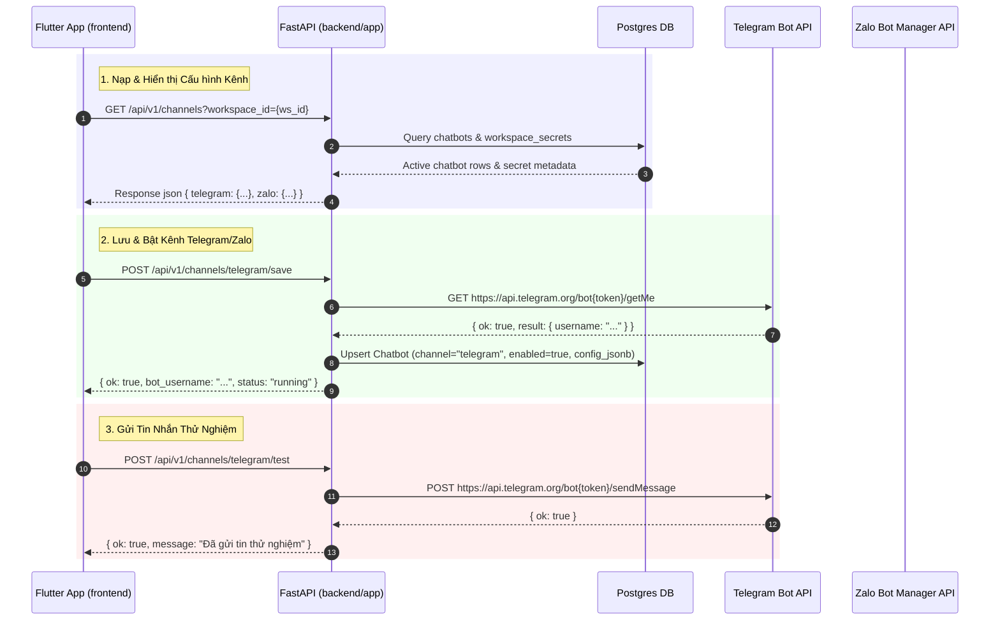

# Technical Spec & Plan: Chức năng Kênh Kết Nối (Telegram & Zalo) & Chatbot Chuyên Trách

Tài liệu này lưu tại `docs/architecture/CHANNEL_FEATURE_SPEC_AND_PLAN.md`.

## 1. Phân tích Chức năng Kênh của Legacy `javis-os`

Trong dự án `javis-os`, tính năng **Kênh kết nối** (Channels) cho phép AI Agent của từng Brain kết nối trực tiếp với các ứng dụng nhắn tin thương mại (Telegram và Zalo Bot) để trả lời tự động hoặc hỗ trợ người dùng từ xa.

### 1.1 Kênh Telegram Bot (`telegram_bot.py`, `bot_gateway.py`)
- **Cơ chế xác thực & kết nối**: Người dùng lấy Bot Token từ `@BotFather` trên Telegram và nhập vào hệ thống. Hệ thống thực hiện API call `getMe` đến Telegram Bot API để xác minh token và lấy `bot_username`.
- **Cấu hình Quyền & Whitelist (`allowed_chat_ids`)**: Để tránh bị lạm dụng hoặc spammed bởi người lạ, bot hỗ trợ danh sách trắng `allowed_chat_ids` (nhiều Chat ID cách nhau bởi dấu phẩy). Chỉ người dùng/nhóm có ID trong danh sách mới được AI phản hồi.
- **Telegram Group Privacy Warning**: Khi bot được đưa vào nhóm, mặc định chế độ riêng tư (Privacy Mode) của Telegram sẽ chặn bot đọc tất cả tin nhắn nhóm trừ khi tin nhắn đề cập (`@bot_name`) hoặc bắt đầu bằng `/`. Hệ thống đưa ra cảnh báo yêu cầu người dùng tắt privacy qua `/setprivacy` trên BotFather nếu muốn bot đọc toàn bộ thảo luận.
- **Xử lý Đa phương tiện & Voice STT**:
  - Gửi/Nhận hình ảnh và file tài liệu qua Telegram Attachment API.
  - Nhận tin nhắn thoại (.ogg voice notes), tự động gửi qua Speech-to-Text (`stt.py` - Whisper API / Groq) để chuyển thành văn bản trước khi đưa vào Agent reasoning.
- **Thao tác Gửi tin thử nghiệm (`/telegram/test`)**: Cho phép người dùng bấm nút **[Gửi test]** trên Dashboard để kiểm tra xem Token và Chat ID có đang hoạt động hay không.

### 1.2 Kênh Zalo Bot Manager / OA (`zalo_bot.py`, `zalo_login.py`)
- **Cơ chế Token Zalo Official Account**: Người dùng mở ứng dụng Zalo, tìm Official Account **Zalo Bot Manager**, chọn **Tạo bot** (với tên bot bắt buộc có tiền tố `"Bot"`). Token được gửi về hộp thư Zalo.
- **Phân biệt ranh giới Zalo Agent MCP vs Zalo Bot Manager**:
  - *Zalo Agent MCP* (trang Kết nối - Connections): Sử dụng session QR login tài khoản cá nhân để Javis thao tác (gửi tin nhắn, đọc chat cá nhân) thay cho người dùng.
  - *Zalo Bot Manager* (trang Kênh - Channels): Là một bot chuyên trách với danh tính riêng biệt, an toàn, dành cho khách hàng hoặc người dùng nhắn cho AI Agent.
- **Tự động bắt Chat ID Zalo**: Nhờ cơ chế hook event, nếu Chat ID để trống, khi người dùng gửi 1 tin nhắn đầu tiên đến Zalo Bot, hệ thống sẽ tự động cập nhật Chat ID của người dùng vào cấu hình bot.

---

## 2. Kiến trúc Chuyển đổi sang `javis-saas`

### 2.1 Ràng buộc Kiến trúc & Ranh giới Runtime (`AGENTS.md`)
- `javis-os` và `backend/server` chỉ là tài liệu tham khảo hành vi. Không import hay gọi trực tiếp.
- `frontend/lib` (Flutter GetX) gọi duy nhất các endpoint REST `/api/v1/*` từ `backend/app`.
- Mọi dữ liệu kênh/chatbot lưu trữ tập trung tại PostgreSQL DB (`chatbots`, `chatbot_conversations`, `workspace_secrets`). Token được mã hóa AES theo `workspace_id`.
- Mọi tài nguyên Kênh/Chatbot phải áp dụng quy tắc phân quyền tenant chặt chẽ: `workspace_id` và `brain_id`.

### 2.2 Sơ đồ Luồng Giao Tiếp (Sequence Diagram)


---

## 3. Chi tiết API Contract (`backend/app`)

### `GET /api/v1/channels`
- **Headers**: Authorization Bearer token
- **Query Params**: `workspace_id` (UUID)
- **Response**:
```json
{
  "telegram": {
    "is_enabled": true,
    "bot_token": "123456:ABC...",
    "allowed_chat_ids": "123456789, 987654321",
    "bot_username": "JavisAssistantBot",
    "status": "running",
    "last_error": null,
    "privacy_warning": false
  },
  "zalo": {
    "is_enabled": false,
    "bot_token": "",
    "allowed_chat_ids": "",
    "bot_username": "",
    "status": "off",
    "last_error": null
  }
}
```

### `POST /api/v1/channels/telegram/save`
- **Request Body**:
```json
{
  "workspace_id": "3fa85f64-5717-4562-b3fc-2c963f66afa6",
  "is_enabled": true,
  "bot_token": "123456:ABC-DEF1234ghIkl-zyx57",
  "allowed_chat_ids": "123456789, 987654321"
}
```
- **Response**:
```json
{
  "status": "success",
  "bot_username": "MyJavisBot",
  "is_enabled": true,
  "message": "Đã xác thực và lưu cấu hình bot Telegram thành công"
}
```

### `POST /api/v1/channels/telegram/test`
- **Request Body**:
```json
{
  "workspace_id": "3fa85f64-5717-4562-b3fc-2c963f66afa6"
}
```
- **Response**:
```json
{
  "status": "success",
  "sent_count": 2,
  "message": "Đã gửi tin nhắn thử nghiệm tới 2 Chat ID thành công"
}
```

---

## 4. Chi tiết Thiết kế UI Frontend (`frontend/lib`)

Thiết kế màn hình **Kênh kết nối** (`ChannelsView`) trong Flutter tuân theo sát mẫu giao diện Dashboard với các phần:

1. **Khối TELEGRAM**:
   - Header icon Telegram (máy bay giấy màu xanh).
   - Checkbox / Switch: **Bật bot Telegram**.
   - Input: **Bot token** (mật khẩu dạng xem/ẩn).
   - Input: **Chat ID được phép dùng** (gợi ý: *nhiều ID cách nhau dấu phẩy*).
   - Nút action: **[Lưu & bật]** và **[Gửi test]**.
   - Thẻ thông báo trạng thái: `Bot CHƯA bật...` hoặc `Đang chạy (@BotUsername)`.

2. **Khối ZALO**:
   - Header icon Zalo (nền xanh lá/xanh dương).
   - Text hướng dẫn: *Bot Zalo chính thức để hỏi Javis từ điện thoại. Khác Zalo Agent MCP ở trang Kết nối...*
   - Checkbox / Switch: **Bật bot Zalo**.
   - Input: **Bot token**.
   - Hướng dẫn lấy token: *Mở app Zalo, tìm Official Account Zalo Bot Manager...*
   - Input: **Chat ID được phép dùng** (gợi ý: *Để trống rồi nhắn cho bot một câu*).
   - Nút action: **[Lưu & bật]** và **[Gửi test]**.
   - Thẻ thông báo trạng thái.

3. **Khối CHATBOTS CHUYÊN TRÁCH (`ChatbotsView`)**:
   - Lưới thẻ hiển thị danh sách các bot chuyên trách đã cấu hình.
   - Trạng thái màu sắc chuẩn: `running` (xanh green), `starting` (vàng amber), `error` (đỏ tươi), `off` (xám textMuted).
