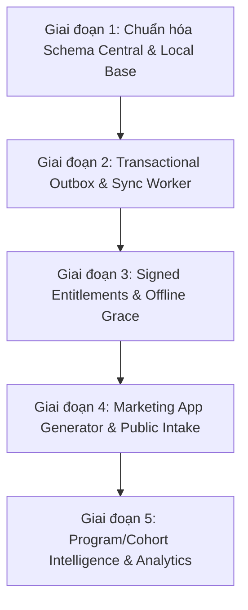

# COSA Hybrid Data Architecture & Project Intelligence Implementation Plan
## Local PostgreSQL + Supabase Self-Hosted Control Plane

> **Superseded by `docs/architecture/COSA_ADK_ORCHESTRATOR_UUID7_PROPOSAL.md` Quyết định 2 (2026-08-21)** — production does not use Supabase; control-plane is pure Postgres via Alembic. Kept for historical context.

> **Tài liệu tham chiếu:** [`markdown/COSA_Hybrid_Local_PostgreSQL_Supabase_Project_Intelligence_Integration_v2.md`](../../markdown/COSA_Hybrid_Local_PostgreSQL_Supabase_Project_Intelligence_Integration_v2.md)  
> **Trạng thái:** Bản thiết kế & Lộ trình triển khai (Chờ phê duyệt)  
> **Phiên bản:** v2.0-Plan

---

## 1. TỔNG QUAN KIẾN TRÚC & TRIẾT LÝ HỆ THỐNG

COSA vận hành theo mô hình **Dual System of Record** với sự phân định ranh giới trách nhiệm rõ ràng:

1. **COSA Platform Control Plane (Supabase Self-Hosted Central)**:
   - System of Record cho Identity toàn cục, Company Registry, Membership, Plans, Licenses, Entitlements.
   - Quản lý **Project Registry**, Stage History (Taxonomy), Milestones và Outcomes.
   - Quản lý Programs & Cohorts (phục vụ đối tác như SIHUB và các vườn ươm khởi nghiệp).
   - Tiếp nhận dữ liệu công khai từ Landing/Forms (Public Intake Gateway) và phân tích dữ liệu tổng hợp (De-identified Aggregate Intelligence).

2. **Company Data Plane (PostgreSQL Local/Private Server)**:
   - System of Record cho toàn bộ dữ liệu nghiệp vụ chi tiết, riêng tư và bảo mật của từng doanh nghiệp: Workspaces, Strategy Canvas, OKRs, Tasks, Agent Memory & Tool Runs, Chi tiết CRM, Transcript phỏng vấn khách hàng, Sổ sách kế toán chi tiết, Tài liệu bảo mật, Vault Credentials.

```
                           ┌────────────────────────────────────────────────────────┐
                           │            COSA PLATFORM (CENTRAL SUPABASE)            │
                           │   - Platform Identity & RBAC                           │
                           │   - Plans, Licenses & Signed Entitlements              │
                           │   - Project Registry & Stage History (Taxonomy)        │
                           │   - Programs / Cohorts (SIHUB Funnel Intelligence)     │
                           │   - Public Intake API & Marketing Registry             │
                           │   - Aggregate Intelligence (De-identified)             │
                           └───────────────────────────┬────────────────────────────┘
                                                       │
                                 ┌─────────────────────┴─────────────────────┐
                                 │ Reliable Sync (Outbox + Signed Snapshots) │
                                 └─────────────────────┬─────────────────────┘
                                                       │
                           ┌───────────────────────────┴────────────────────────────┐
                           │          COMPANY DATA PLANE (LOCAL POSTGRESQL)         │
                           │   - Detailed Strategy, OKRs, Canvas, Workspaces        │
                           │   - Tasks, Sprints, Agents Memory & Runs               │
                           │   - Full CRM, Interviews, Customer Transcripts (PII)   │
                           │   - Detailed Finance, Books, Accounting Ledger         │
                           │   - Private Documents, Vault RAG & Secret Keys         │
                           └────────────────────────────────────────────────────────┘
```

---

## 2. QUY TẮC PHÂN ĐỊNH DỮ LIỆU & QUYỀN SỞ HỮU (DOMAIN OWNERSHIP)

### 2.1 Single Authority Table

| Domain / Entity | Authority duy nhất | Cơ chế Mirror / Sync |
| :--- | :--- | :--- |
| **User Identity & Account** | Supabase Central | Central $\rightarrow$ Local Cache (`platform_user_id`) |
| **Company Tier / Plan / License** | Supabase Central | Central $\rightarrow$ Local (Signed Entitlement Snapshot) |
| **Workspace / Tasks / Sprints** | PostgreSQL Local | Không sync lên Central |
| **Project Detailed Content / Canvas** | PostgreSQL Local | Không sync lên Central |
| **Project Stage & Lifecycle** | PostgreSQL Local | Local $\rightarrow$ Central Outbox (`platform_project_id`, `stage`) |
| **Project Outcome & Milestones** | PostgreSQL Local | Local $\rightarrow$ Central Outbox (Aggregate outcome facts) |
| **Program / Cohort Assignment** | Supabase Central | Central $\rightarrow$ Local Reference |
| **Public Lead / Survey Submissions** | Supabase Central (Intake) | Central $\rightarrow$ Local CRM Sync |
| **Agent Memories, Prompts & Secrets** | PostgreSQL Local | **Tuyệt đối KHÔNG sync** |

### 2.2 Phân loại bảo mật dữ liệu (Data Classification)
- `PLATFORM_REQUIRED`: `platform_user_id`, `company_id`, `project.stage`, `license.status`.
- `ANALYTICS_REQUIRED`: `first_customer_at`, `first_revenue_at`, `revenue_band`, `time_in_stage`.
- `PUBLIC`: Tiêu đề landing page, form definition công khai.
- `COMPANY_PRIVATE`: Transcript phỏng vấn, PII khách hàng, sổ kế toán chi tiết, tài liệu nội bộ.
- `SECRET`: API Keys, Database credentials, Private JWT Signing keys (Chặn hoàn toàn khỏi pipeline sync).

---

## 3. THIẾT KẾ CHI TIẾT CÁC MODULE TRỌNG YẾU

### 3.1 Cơ chế Signed Offline Entitlement Snapshot
- **Mục tiêu**: Đảm bảo Local hoạt động ổn định khi offline hoặc khi Central gián đoạn kết nối.
- **Payload cấu trúc Snapshot**:
  ```json
  {
    "company_id": "cmp_01j...",
    "plan": "pro",
    "limits": {
      "max_projects": 20,
      "max_seats": 5,
      "max_scheduled_agents": 3
    },
    "features": {
      "marketing": true,
      "crm": true,
      "finance": false,
      "custom_domain": true
    },
    "issued_at": "2026-08-19T00:00:00Z",
    "valid_until": "2026-09-19T00:00:00Z",
    "grace_period_days": 7,
    "signature": "ed25519_signature_base64..."
  }
  ```
- **Restricted Mode khi quá hạn Grace Period**:
  - Đọc dữ liệu cũ: **CHO PHÉP**
  - Sao lưu / Xuất dữ liệu: **CHO PHÉP**
  - Tạo mới project/tính năng trả phí: **CHẶN**
  - Chạy agent tự động nâng cao: **CHẶN**

### 3.2 Transactional Outbox Pattern tại Local
Khi có thay đổi trạng thái dự án hoặc tạo outcome tại Local, ghi đồng thời vào bảng `platform_outbox` trong cùng một database transaction:

```sql
BEGIN;
-- 1. Cập nhật trạng thái dự án Local
UPDATE projects SET current_stage = 'mvp', updated_at = NOW() WHERE id = 'prj_local_123';

-- 2. Ghi sự kiện vào outbox
INSERT INTO platform_outbox (
    event_id,
    event_type,
    aggregate_type,
    aggregate_id,
    company_id,
    payload,
    created_at,
    status
) VALUES (
    gen_random_uuid(),
    'project.stage_changed',
    'project',
    'prj_platform_uuid_456',
    'cmp_platform_uuid_789',
    '{"from_stage": "validation", "to_stage": "mvp", "occurred_at": "2026-08-19T08:30:00Z"}'::jsonb,
    NOW(),
    'pending'
);
COMMIT;
```

- **Sync Worker**: Định kỳ quét các bản ghi `status = 'pending'`, gửi qua API Ingestion của Central bằng batch HTTP POST có chứa Idempotency Key, cập nhật `acknowledged_at` khi thành công.

### 3.3 Kiến trúc Marketing App & Landing Pages (Theo Mục 40-62)
- **1 Company = 1 Marketing Application (Next.js)**.
- **Shared Module Library**: `@cosa/landing-sdk`, `@cosa/form-sdk`, `@cosa/ui-marketing`.
- **Mô hình triển khai 3 cấp độ**:
  1. *Level 1 (COSA Managed)*: Hostinger VPS, cấp phát subdomain `company-slug.cosa-domain`. Tối ưu bằng Static Site Generation (SSG) để tiết kiệm tài nguyên server.
  2. *Level 2 (Company VPS + COSA Services)*: Host trên server công ty, sử dụng Public Intake API của Supabase Central để gom Lead/Survey.
  3. *Level 3 (Fully Private)*: Host hoàn toàn nội bộ, chỉ gửi aggregate conversion event về Central.

---

## 4. LỘ TRÌNH TRIỂN KHAI THEO GIAI ĐOẠN (PHASED ROADMAP)



### Giai đoạn 1: Chuẩn hóa Schema Central & Local Base
- [ ] Thiết kế file migration Supabase Central (`companies`, `memberships`, `plans`, `licenses`, `company_entitlements`, `projects_registry`, `project_stage_history`, `project_outcomes`, `programs`, `cohorts`).
- [ ] Bổ sung các trường `platform_company_id`, `platform_project_id` (UUID) vào model `Project`, `Workspace` tại Local PostgreSQL.
- [ ] Thiết lập Row Level Security (RLS) trên Supabase Central.

### Giai đoạn 2: Transactional Outbox & Sync Worker
- [ ] Tạo bảng `platform_outbox` và `platform_inbox` tại Local PostgreSQL.
- [ ] Xây dựng background worker `PlatformSyncAgent` tại Local (Xử lý retry exponential backoff, Idempotency-Key, Batching).
- [ ] Viết Central Ingestion API endpoint trên FastAPI / Supabase Functions.

### Giai đoạn 3: Signed Entitlements & Offline Enforcement
- [ ] Xây dựng module ký Ed25519 / JWT trên Central Control Plane.
- [ ] Xây dựng local verifier và middleware kiểm soát quota (`limits`, `features`) trên Local Backend.
- [ ] Hiện thực cơ chế Grace Period và chế độ Restricted Mode an toàn.

### Giai đoạn 4: Marketing App Generator & Public Intake Gateway
- [ ] Chuẩn hóa bộ module UI tái sử dụng (`Hero`, `Features`, `LeadForm`, `Pricing`, `Survey`).
- [ ] Xây dựng Public Intake API nhận form submissions và đẩy webhook/event về Local CRM.
- [ ] Tích hợp Deployment Service cấu hình subdomain động trên VPS Hostinger.

### Giai đoạn 5: Program / Cohort Funnel & Aggregate Intelligence
- [ ] Thiết lập dữ liệu liên kết Chương trình / Cohort (ví dụ: SIHUB Cohort 2026).
- [ ] Tạo SQL Analytics Views và Funnel metrics:
  $$\text{Sign-up} \rightarrow \text{Validation} \rightarrow \text{MVP} \rightarrow \text{First Customer} \rightarrow \text{First Revenue}$$
- [ ] Tích hợp thẻ trạng thái đồng bộ Platform Sync lên Hologram Hub của Desktop App.

---

## 5. TIÊU CHÍ HOÀN THÀNH (ACCEPTANCE CRITERIA)

1. Identity và License của người dùng được xác thực và kiểm soát từ Central.
2. Local có thể chạy độc lập, an toàn khi mất kết nối mạng nhờ Cached Signed Entitlement.
3. Mọi dữ liệu nhạy cảm (Private Documents, Transcripts, Sổ sách kế toán chi tiết, API Keys) được cách ly tuyệt đối tại Local.
4. Mọi thay đổi về Stage và Outcome của dự án được ghi nhận chính xác vào Central Registry qua Outbox.
5. Form và Landing Page hoạt động 24/7 trên Central Edge mà không phụ thuộc vào trạng thái bật/tắt máy của Founder.
6. Mã nguồn Marketing App có thể export/transfer độc lập mà không bị dính chặt vào hạ tầng COSA.
