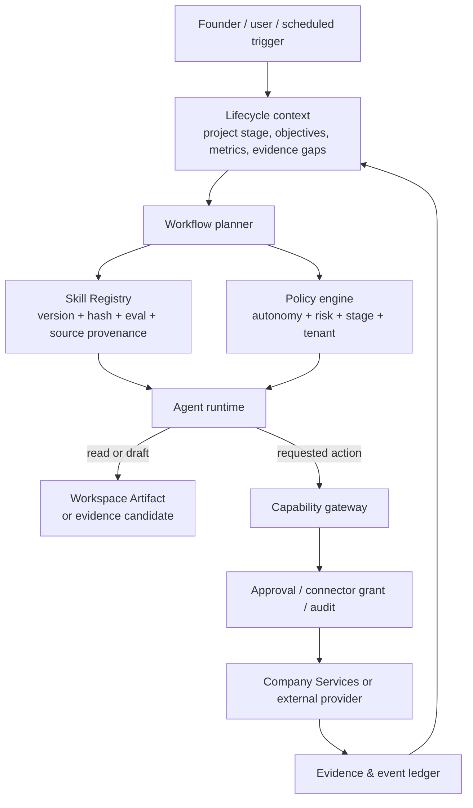

# COSA Lifecycle Skill Operating Model v1.2

**Trạng thái:** Đề xuất kiến trúc và chương trình triển khai — chưa tự động kích hoạt runtime  
**Ngày:** 2026-08-30  
**Phạm vi:** COSA Control Plane, Agent Platform, Company Business và Flutter Experience Plane

## 1. Quyết định điều hành

COSA cần một catalog skill đủ rộng để hỗ trợ Founder/Company Operating System xuyên suốt vòng đời dự án, nhưng **không** cần tạo một agent cho mỗi công việc và không được import nguyên trạng repository bên ngoài.

Mô hình đích:

```text
Lifecycle state + evidence gaps + policy
                ↓
      chọn workflow và skill đã pin
                ↓
  agent soạn thảo / phân tích / đề xuất
                ↓
capability có policy, approval, audit và tenancy
                ↓
 artifact / evidence candidate / business action đã duyệt
```

### 1.1. Catalog mục tiêu: 95 skill

| Mốc | Số skill được publish | Phạm vi | Điều kiện dùng thực tế |
| --- | ---: | --- | --- |
| Launch tranche A | 48 | Core + P0–P2 + P3 tối thiểu | L0/L1; artifact-first; chưa mở side effect ngoại vi. |
| Launch tranche B1 | 62 | Hoàn tất P3 + 2 P2 quyết định pilot | Pilot là human-owned, có instrumentation/support/rollback và evidence thật. |
| Launch tranche B2 | 72 | Hoàn tất P4 | Pilot đã tạo metric contract, snapshot và PMF/maturity scoreboard có thể tái lập. |
| Target operating catalog | **95** | Đầy đủ P0–P6 | P5/P6 chỉ pin khi capability, approval và connector tương ứng đã được verify. |

`95` là số skill độc lập, có contract. Đây không phải 95 agent, 95 prompt rời rạc, hay 95 tích hợp bên ngoài. Một agent role có thể compose nhiều skill trong một workflow nếu capability và policy đều phù hợp.

### 1.2. Các nguyên tắc không thay đổi

1. Business truth thuộc `services/company`; Agent Platform không ghi trực tiếp Company database.
2. `workspace_id` là tenant boundary. Context, evidence, artifact, run, approval và capability call đều phải mang workspace scope.
3. Skill là hướng dẫn và contract chất lượng; capability mới là quyền thực hiện hành động.
4. Không runtime-load, auto-update hoặc tin cậy nội dung từ GitHub/web như system instruction.
5. Không để model tự tạo evidence, tự đánh giá evidence rồi tự pass gate.
6. Mọi version đang chạy phải được pin bằng `skill_id + version + definition_hash`.
7. Các stage canonical hiện tại là P0–P6; không bổ sung P7 trong code ở giai đoạn này.

### 1.3. Thứ tự triển khai bắt buộc

Catalog 95 skill không được đi trước nền tảng production. Thứ tự ưu tiên là:

1. Hoàn tất remediation P1: tenant isolation, credential, shared network boundary, durable scheduler và release security.
2. Hardening lifecycle: RBAC policy/gate, cấm auto-transition, canonical journal/CAS và frontend P-stage.
3. Xây Evidence Kernel: artifact/evidence tách biệt, provenance/freshness/review, ingestion có capability boundary và test chống self-validation.
4. Mở rộng registry/skillpack hiện hữu bằng lifecycle scope, autonomy, human boundary, output class, trust/eval; xử lý toàn bộ strategy capability đang whitelist `pending`.
5. Xây Project Navigator MVP P0–P2 ở L1: adaptive intake, advisory assessment, evidence gap, ACTION/DECISION/LEARN và human task; không có quyền tự pass gate/đổi stage.
6. Sau pilot mới thêm maturity tracks, metric contracts, PMF scoreboard và bounded actions.
7. Academy/Simulation là product line riêng; lesson completion và synthetic evidence không được tác động live evidence/gate.

Điều này thay thế cách hiểu rằng tạo nhiều skillpack là bước khởi đầu. Skill catalog chỉ được publish/pin sau khi các primitive tenant, lifecycle và evidence đủ an toàn để nó dựa vào.

## 2. Từ roadmap 54 bài học đến trạng thái COSA canonical

Tài liệu gợi ý có sáu giai đoạn/54 bài học là taxonomy rất tốt cho nội dung. Tuy nhiên stage runtime phải biểu diễn **độ trưởng thành dựa trên evidence**, không phải mốc tuần/tháng.

| Roadmap gợi ý | Canonical project lifecycle trong code | Ý nghĩa vận hành | Gate |
| --- | --- | --- | --- |
| Khám phá và xác định vấn đề | `P0_DISCOVERY` + `P1_PROBLEM_VALIDATION` | Thiết lập ràng buộc rồi xác thực problem, ICP và buying context. | G0, G1 |
| Xác thực giải pháp và MVP | `P2_SOLUTION_VALIDATION` + `P3_BUILD_VALIDATE` | Chứng minh giải pháp, chọn MVP rẻ nhất để học, pilot có đo lường. | G2, G3 |
| PMF và roadmap | `P4_GO_TO_MARKET` | Xác định tín hiệu PMF tổng hợp, quyết định pivot/persevere. | G4 |
| Marketing và sales | `P4_GO_TO_MARKET` + `P5_OPERATE_GROWTH` | GTM discovery bắt đầu sớm; P5 là repeatability. | G4, G5 |
| Scaling | `P6_SCALE_GOVERN` | Scale sau khi economics, reliability, controls và capacity chấp nhận được. | G6 |
| Sustain liên tục | `P6_SCALE_GOVERN` như một track liên tục | Customer lifecycle, innovation, reputation, culture và governance tiếp diễn. | G6 định kỳ |

**Quy ước:** P0 trong code hiện mang tên `DISCOVERY`. Về nghiệp vụ, P0 bắt buộc bao gồm một lớp Foundation/Governance ngắn trước research. Không đổi enum chỉ để đổi nhãn.

### 2.1. Bảy gate tối thiểu

| Gate | Điều kiện cần có | Ví dụ evidence tối thiểu | Ai quyết định |
| --- | --- | --- | --- |
| G0 — Foundation ready | Scope, owner, constraints, metric/evidence plan, cash/privacy/risk baseline | Venture thesis, metric contract, risk register, approval matrix | Founder/owner |
| G1 — Problem validated | ICP, problem severity, alternatives, buyer/process, willingness-to-pay signal | Interview/call notes có provenance, competitor facts, ICP decision | Founder/Product |
| G2 — Solution validated | Hypothesis có thể falsify; test giải pháp/giá; technical/data viability | Experiment result, usability/pilot commitment, PoC result | Founder/Product/Engineering |
| G3 — Pilot ready | Vertical slice, alpha checks, instrumentation, onboarding/support/rollback | Test/eval results, telemetry checklist, pilot runbook | Product/Engineering/CS |
| G4 — PMF signal | Composite retention, value, pull, revenue/WTP và qualitative feedback | Cohort dashboard, PMF survey, feedback synthesis, decision memo | Founder/Product |
| G5 — Repeatable GTM | Một hoặc nhiều motion có quality/economics repeatable | Funnel/CRM, attribution, CAC/payback, sales-cycle evidence | Revenue owner |
| G6 — Scale & govern | Reliability, capacity, cash envelope, controls, support and incident maturity | Unit economics, SLO, SOP, risk/control reviews, forecast | Leadership + control owners |

Gate policies phải configurable theo business model. Ví dụ Sean Ellis 40% là một tín hiệu P4; nó không được hard-code thành điều kiện duy nhất để pass G4.

## 3. Kiến trúc skill của COSA

### 3.1. Bốn lớp tách biệt



| Lớp | Trách nhiệm | Không được làm |
| --- | --- | --- |
| Lifecycle context | Cung cấp stage, policy, objectives, metrics, evidence gaps và risk đúng project/workspace. | Suy ra stage từ prompt tự do. |
| Skill Registry | Resolve immutable `SkillSpec`; provenance, version, hash, eval và trạng thái publish/pin. | Cấp capability. |
| Agent runtime | Lập kế hoạch, áp dụng skill, tạo artifact/draft/analysis. | Tự quyết authorization, gate override hoặc business write. |
| Capability gateway | Kiểm tra tenant, permission, approval, connector grant, idempotency và audit. | Đọc hướng dẫn từ skill để tự mở thêm quyền. |
| Company Services | Nguồn sự thật cho project, evidence, gate, commercial, finance, operations. | Uỷ quyền policy business cho LLM. |

### 3.2. Effective autonomy

```text
effective_autonomy = min(
  agent.autonomy_level,
  skill.autonomy_ceiling,
  workspace/tenant policy,
  current-stage policy,
  capability grant,
  action-risk policy,
  approval state
)
```

| Mức | Diễn giải | Ví dụ |
| --- | --- | --- |
| L0 — Observe | Đọc dữ liệu đã authorized, phân tích, tạo draft/artifact. | Research brief, interview summary, PMF analysis. |
| L1 — Propose | Đề xuất decision hay action plan có rationale/evidence. | ICP, MVP priority, positioning, gate recommendation. |
| L2-B — Bounded execution | Gọi capability đã đăng ký trong envelope hẹp, có rollback/handoff. | Tạo draft campaign asset, monitor FAQ hẹp, tạo task theo policy. |
| H — Human owned | Skill chuẩn bị tài liệu, con người thực hiện cam kết. | Ký hợp đồng, thay đổi pricing, chi tiền, tuyển/sa thải, gate override. |

L2-B không đồng nghĩa với tự do gửi outbound message, đặt ngân sách ads hay cập nhật stage. Các side effect còn phụ thuộc action policy và approval bind `run_id + tool_call_id + checkpoint_ref`.

### 3.3. Phân loại side effect

| Class | Ví dụ | Default autonomy | Bắt buộc |
| --- | --- | --- | --- |
| R — Read | Đọc project, artifact, analytics, web result sanitized | L0 | Tenant scope, provenance nếu nguồn ngoài. |
| A — Artifact | Tạo draft brief, PRD, runbook, content variant | L0/L1 | Version, source/evidence refs, review status. |
| B — Business write | Tạo evidence, experiment, marketing asset, lead state | L1/L2-B | Capability, idempotency, audit, business policy. |
| X — External communication | Send email/SMS/social, update public page | L1/L2-B | Connector grant, recipient/claim preview, rate limit, approval. |
| M — Money/contract | Spend ads, payout, discount/offer, sign terms | H | Monetary/role threshold, approval, audit. |
| D — Deploy/security | Deploy code, tracking, infrastructure/security setting | H hoặc L2-B rất hẹp | Change review, test, rollback, incident visibility. |

## 4. Danh mục nguồn và chính sách adaptation

| Mã | Nguồn | Giá trị chính | Phạm vi được adapt | Chính sách |
| --- | --- | --- | --- | --- |
| PM | [phuryn/pm-skills](https://github.com/phuryn/pm-skills) | Product discovery, strategy, execution, analytics và GTM workflows. | P0–P4, một phần P5/P6. | Adapt từng skill; không import plugin/workflow nguyên khối. |
| MG | [coreyhaines31/marketingskills](https://github.com/coreyhaines31/marketingskills) và makerskills | Product marketing, research, SEO, CRO, attribution, growth, RevOps, operating methods. | P2–P6. | Nguồn chính GTM/growth; outbound/spend bị loại trừ ở tranche đầu. |
| SM | [charlie947/social-media-skills](https://github.com/charlie947/social-media-skills) | Voice guide, social content, scorecard và analytics. | P4–P6. | Chỉ dùng sau ICP/positioning/brand claim được duyệt. |
| AS | [Agent Skills specification](https://github.com/agentskills/agentskills/blob/main/docs/specification.mdx) | `SKILL.md`, references/assets/scripts và progressive disclosure. | Tất cả skillpack. | Dùng làm compatibility format, không phải policy/tenancy model. |
| SEC | [briiirussell/cybersecurity-skills](https://github.com/briiirussell/cybersecurity-skills) | Threat model, privacy, security assessment và AI-risk thinking. | Core/P0/P3/P6. | Chỉ adapt skill phòng thủ; không đưa offensive tooling vào runtime product. |
| MINING | [wshobson/agents](https://github.com/wshobson/agents), [JayRHa/AgentSkills](https://github.com/JayRHa/AgentSkills) | Tham khảo breadth cho engineering/data/ops. | Backlog có chọn lọc. | Không là nguồn mặc định, không bulk-import. |

### 4.1. Quy trình adaptation bắt buộc

1. **Discover:** xác định gap nghiệp vụ/capability trước, không chọn skill chỉ vì upstream có sẵn.
2. **Review:** kiểm tra license, URL, immutable commit SHA, dependency, tools, dữ liệu, side effect và prompt-injection risk.
3. **Keep/adapt/add/exclude:** ghi rõ phần giữ lại, thay đổi, bổ sung COSA và loại bỏ.
4. **Contract:** viết skillpack có trigger, input, output, evidence, fallback, allowed capabilities, autonomy ceiling và eval cases.
5. **Evaluate:** chạy case tích cực, thiếu-context, cross-tenant, stale/missing evidence, hostile web content và unauthorized action.
6. **Publish:** human-approved immutable publish; sau đó agent chỉ pin version/hash cụ thể.
7. **Observe:** thu feedback + outcome metrics; optimizer chỉ tạo candidate, không tự publish.

Không dùng Git submodule, không `git pull` ở runtime, không nạp script/tool từ upstream vào production và không để source text trở thành trusted instruction.

## 5. Contract chuẩn cho một COSA lifecycle skill

Contract validator hiện đã kiểm tra `manifest.yaml`, `SKILL.md`, capability tool list và source attribution. Để lifecycle model vận hành, cần mở rộng contract/published `SkillSpec` theo các trường dưới đây. Đây là **target schema**, không xác nhận chúng đã được enforce trong runtime hiện tại.

```yaml
apiVersion: cosa.skillpack/v1
kind: SkillPack
metadata:
  id: discovery.interview-summary
  version: 1.0.0
  name: Interview Evidence Summary
  category: discovery
source:
  path: skillpacks/discovery/interview-summary
  upstream:
    repository: phuryn/pm-skills
    commit: <immutable-40-char-sha>
    skill: interview-summarization
    license: MIT
applicability:
  project_stages: [P1_PROBLEM_VALIDATION, P2_SOLUTION_VALIDATION]
  gates: [G1, G2]
  required_context: [project, workspace, interview_artifact]
  required_evidence_types: [customer_interview]
  outputs: [interview_summary, evidence_candidates, unanswered_questions]
autonomy:
  ceiling: L0_OBSERVE
  side_effect_class: A
  human_owned_decisions: [icp_change, gate_pass]
runtime:
  entrypoint: SKILL.md
  tools: [strategy.evidence.create, strategy.evidence.list]
evidence:
  min_source_refs: 1
  freshness_days: 180
  require_fact_inference_split: true
  self_validation_forbidden: true
quality:
  eval_suite: evals/discovery/interview-summary.yaml
  required_negative_cases: [missing-transcript, prompt-injection, cross-workspace]
```

### 5.1. Nội dung tối thiểu của `SKILL.md`

1. Trigger và anti-trigger.
2. Inputs/preconditions, gồm stage/evidence/context bắt buộc.
3. Quy trình audit được; tách fact, inference, assumption, recommendation.
4. Output schema/artifact template.
5. Evidence rules: provenance, recency, contradiction, confidence, missing information.
6. Allowed Tool Calls — chỉ capability trong manifest.
7. Fallback khi không có context/capability/evidence đạt chuẩn.
8. Handoff/approval rules.
9. Eval cases và definition of good/bad output.
10. Nguồn/adaptation record nếu có upstream.

### 5.2. Evidence contract

| Trường đề xuất | Ý nghĩa |
| --- | --- |
| `evidence_id`, `workspace_id`, `project_id` | Định danh và tenant scope. |
| `evidence_type` | Interview, experiment, telemetry, CRM, finance, market source, security review… |
| `artifact_ref` | Raw artifact/snapshot có thể truy nguyên. |
| `claim` | Phát biểu có thể kiểm tra, không phải summary chung chung. |
| `fact_or_inference` | Phân biệt quan sát với suy luận. |
| `source_url`/`source_system` | Nguồn và connector/provenance. |
| `captured_at`, `observed_at`, `fresh_until` | Quản lý recency. |
| `confidence`, `bias`, `contradictions` | Mức tin cậy và giới hạn. |
| `review_status`, `reviewer_ref` | `candidate`, `reviewed`, `rejected`, `superseded`. |
| `created_by_run_ref` | Link tới agent run, không biến run thành validator. |

**Invariant:** output của skill tạo `evidence candidate`; gate evaluator chỉ đọc evidence đủ provenance/review theo policy, và không được coi “skill nói pass” là evidence.

## 6. Catalog mục tiêu: 95 skill

**Legend:** Source `N` = COSA-native; `PM` = adaptation candidate từ pm-skills; `MG` = marketingskills/makerskills; `SM` = social-media-skills; `SEC` = defensive security source. Mỗi skill có một primary stage; `applicability` có thể cho phép gọi ở state khác.

### 6.1. Core lifecycle, evidence và governance — 15 skill

| Skill ID | Mục đích | Ceiling | Source |
| --- | --- | --- | --- |
| `lifecycle.context-resolver` | Context stage/objective/metric/risk/evidence-gap đúng project. | L0 | N |
| `lifecycle.next-best-action` | Xếp action theo gate, evidence gap, impact và constraint. | L1 | N |
| `lifecycle.gate-evaluator` | Đề xuất pass/block/conditional pass, không tự transition. | L1 | N |
| `evidence.intake-provenance` | Chuẩn hoá artifact/claim/source/trust/recency. | L1 | N |
| `evidence.gap-analysis` | Evidence còn thiếu và experiment rẻ nhất để lấp gap. | L0 | N |
| `evidence.artifact-review` | Review candidate và yêu cầu người phụ trách xác nhận. | L1 | N |
| `research.deep-research` | Research brief đa nguồn: citation, contradiction, bias, confidence. | L0 | MG |
| `governance.approval-plan` | Xác định action cần ai duyệt. | L1 | N |
| `governance.policy-resolution` | Tính policy envelope; không bypass policy. | L0 | N |
| `governance.risk-register` | Risk-control-owner-status có provenance. | L1 | N |
| `governance.privacy-assessment` | Data flow, PII, purpose, consent, retention gap. | L0/L1 | SEC |
| `governance.security-assessment` | Threat/control gap và remediation proposal. | L0/L1 | SEC |
| `governance.human-handoff` | Nhận diện escalation, tạo handoff packet. | L1 | N |
| `analytics.metric-contract` | Metric tree, owner, definition, source, guardrail. | L1 | PM |
| `operations.weekly-review` | Objective, variance, risk và next actions. | L0/L1 | N |

### 6.2. P0 — Foundation & Governance — 10 skill

| Skill ID | Mục đích | Ceiling | Source |
| --- | --- | --- | --- |
| `strategy.venture-thesis` | Venture thesis, why-now, scope/non-goals. | L1 | N |
| `strategy.business-model` | Lean/startup canvas, value/revenue/cost assumptions. | L1 | PM |
| `finance.runway-forecast` | Cash/runway scenarios và trigger cảnh báo. | L0/L1 | N |
| `finance.budget-guardrails` | Spend envelope/threshold theo stage và owner. | L1 | N |
| `strategy.decision-rights` | Decision rights, DRI và override path. | L1 | N |
| `research.industry-trends` | Trend scan và implication có citation. | L0 | PM |
| `strategy.pestle-analysis` | Macro/legal/environment scan và uncertainty. | L0 | PM |
| `ai.data-rights-review` | Data rights, purpose limitation, training/use constraints. | L0/L1 | N |
| `ai.model-provider-risk` | Cost, lock-in, availability, data handling, model risk. | L0/L1 | N |
| `governance.compliance-gap-analysis` | Obligation → control → evidence gap map. | L0/L1 | SEC |

### 6.3. P1 — Problem Validation — 12 skill

| Skill ID | Mục đích | Ceiling | Source |
| --- | --- | --- | --- |
| `research.market-sizing` | TAM/SAM/SOM top-down + bottom-up; assumptions explicit. | L0 | PM |
| `strategy.porters-five-forces` | Industry structure và competitive pressure. | L0 | PM |
| `strategy.competitor-profiling` | Competitor/alternative dossier từ snapshots có provenance. | L0 | PM/MG |
| `strategy.icp-definition` | ICP, buyer/payer/champion/blocker, buying constraints. | L1 | PM |
| `discovery.interview-script` | JTBD/Mom-Test guide, no-leading questions. | L0 | PM |
| `discovery.interview-prep` | Participant/account research và question hypotheses. | L0 | N |
| `discovery.interview-summary` | Summary fact/inference/evidence linked; no fabricated quote. | L0 | PM |
| `discovery.jtbd-synthesis` | Jobs, pains, gains, triggers, current alternatives. | L0 | PM |
| `discovery.pain-point-analysis` | Functional, financial, emotional and workflow cost. | L0 | N |
| `discovery.assumption-mapping` | Assumption map by impact/uncertainty/evidence. | L0 | PM |
| `sales.founder-led-sales-copilot` | Call prep, objection map, follow-up draft; founder owns call. | L0/L1 | MG |
| `marketing.channel-strategy` | Early channel hypotheses grounded in ICP/buying motion. | L1 | MG |

### 6.4. P2 — Solution Validation — 12 skill

| Skill ID | Mục đích | Ceiling | Source |
| --- | --- | --- | --- |
| `strategy.value-proposition` | JTBD value proposition and differentiated outcomes. | L1 | PM |
| `strategy.positioning` | Evidence-backed positioning, claims and alternatives. | L1 | MG |
| `strategy.pricing` | Price/packaging/WTP hypothesis; never self-publish price. | L1/H | PM/MG |
| `discovery.assumption-prioritization` | Rank load-bearing assumptions with confidence. | L1 | PM |
| `discovery.experiment-design` | Falsifiable experiment charter and decision rule. | L1 | PM |
| `product.opportunity-solution-tree` | Outcome → opportunity → solution → experiment. | L0/L1 | PM |
| `product.core-workflow-map` | Core job/user journey/time-to-value map. | L0 | N |
| `product.mvp-prioritization` | Risk-first MVP scope and non-goals. | L1 | PM |
| `product.mvp-experiment-selection` | Prototype/concierge/Wizard-of-Oz/fake-door/PoC selection. | L1 | N |
| `product.prototype-brief` | Prototype question, scope, participant, success criteria. | L0 | N |
| `engineering.solution-feasibility` | Build/buy/partner, architecture, data, security feasibility. | L1 | N |
| `sales.design-partner-selection` | Pilot cohort by ICP and learning value, not enthusiasm alone. | L1 | N |

### 6.5. P3 — Build & Validate — 13 skill

| Skill ID | Mục đích | Ceiling | Source |
| --- | --- | --- | --- |
| `product.prd` | Evidence-grounded PRD, non-goals, measurable outcomes. | L0/L1 | PM |
| `product.user-story-and-acceptance` | Stories, acceptance criteria and edge cases. | L0 | PM |
| `engineering.vertical-slice` | One core-job slice in a controlled environment. | L2-B | N |
| `engineering.alpha-validation` | Functional, quality, privacy/security and AI eval readiness. | L2-B | N |
| `product.pilot-onboarding` | Pilot workflow, success criteria, support, escalation, rollback. | L1/L2-B | N |
| `product.feedback-synthesis` | Feedback themes/outliers/unanswered questions with refs. | L0 | N |
| `analytics.instrumentation-plan` | Event taxonomy, identity mapping, consent, DQ checks. | L1 | MG |
| `analytics.product-usage-analysis` | Activation, TTV, cohorts, frequency, failure/quality analysis. | L0 | PM |
| `engineering.observability-readiness` | SLO/telemetry/alerts/runbooks for pilot. | L2-B | N |
| `engineering.release-management` | Release/change risk, flags, rollback and release evidence. | L2-B | N |
| `ai.evaluation-design` | Task taxonomy, eval sets, threshold, human-review criteria. | L1 | N |
| `ai.red-team` | Safe abuse/failure testing in a sandbox. | L2-B | SEC |
| `customer_success.support-copilot` | Support draft/knowledge assist; nontrivial cases hand off. | L0 | N |

### 6.6. P4 — Go to Market & PMF — 10 skill

| Skill ID | Mục đích | Ceiling | Source |
| --- | --- | --- | --- |
| `discovery.affinity-synthesis` | Cluster feedback linked to each evidence ref. | L0 | N |
| `strategy.pivot-persevere` | Decision recommendation; founder decides. | L1/H | N |
| `analytics.pmf-survey` | Segment-aware PMF survey; detects sample bias. | L0 | PM |
| `analytics.pmf-scoreboard` | Composite PMF: retention, pull, usage, WTP, churn. | L0 | N |
| `product.outcome-roadmap` | Outcome/bet roadmap with assumptions/capacity trade-offs. | L1 | PM |
| `product.backlog-prioritization` | RICE plus risk, evidence, cost of delay, strategic fit. | L1 | PM |
| `product.continuous-discovery` | Ongoing opportunity/evidence loop. | L1 | N |
| `growth.experimentation-system` | Registry, statistical/ethical guardrails, decision log. | L1/L2-B | MG |
| `customer_success.health-scoring` | Explainable account-health and at-risk signal. | L0 | N |
| `customer_success.churn-analysis` | Cohort/root-cause/save options; exceptions human approved. | L0/L1 | MG |

### 6.7. P5 — Operate & Growth — 14 skill

| Skill ID | Mục đích | Ceiling | Source |
| --- | --- | --- | --- |
| `marketing.gtm-funnel` | Funnel/lifecycle for sales-led, PLG or partner motion. | L1 | MG |
| `marketing.content-strategy` | Demand gen, education, lifecycle and enablement plan. | L1 | MG |
| `marketing.copywriting` | Evidence/claim-bound copy variants and review. | L0/L1 | MG |
| `marketing.landing-cro` | Landing-page/form hypothesis and conversion backlog. | L1/L2-B | MG |
| `marketing.paid-experiments` | Campaign/budget proposal; approved provider policy for execute. | L1/L2-B | MG |
| `marketing.brand-narrative` | Narrative/voice from positioning and customer language. | L1 | MG/SM |
| `marketing.reputation-monitoring` | Monitoring/triage; crisis/legal response human owned. | L2-B | SM |
| `sales.lead-lifecycle` | Qualification, SLA handoff and CRM data governance. | L2-B | MG |
| `sales.enablement` | Battlecard, objection handling, pitch/deck materials. | L0/L1 | MG |
| `sales.pipeline-analysis` | Pipeline velocity, win/loss and forecast input analysis. | L0 | N |
| `finance.unit-economics` | CAC/payback, margin, LTV, cost-to-serve sensitivity. | L0/L1 | N |
| `growth.ab-testing` | Experiment analysis/execution plan with guardrails. | L1/L2-B | MG |
| `growth.referrals` | Referral mechanics, quality and attribution analysis. | L1/L2-B | MG |
| `customer_success.lifecycle` | Onboarding, adoption, QBR and renewal playbooks. | L1/L2-B | N |

### 6.8. P6 — Scale & Govern — 9 skill

| Skill ID | Mục đích | Ceiling | Source |
| --- | --- | --- | --- |
| `operations.sop-builder` | SOP/runbook versioned for a process already proven stable. | L1/L2-B | N |
| `operations.automation-design` | Automation with owner, rollback and exception path. | L1/L2-B | N |
| `growth.channel-expansion` | Expansion thesis after core motion repeatability. | L1 | MG |
| `strategy.segment-expansion` | New segment as a mini P1→P5 validation loop. | L1 | N |
| `strategy.geo-expansion` | Localization, tax/legal/data/support/economics readiness. | L1/H | N |
| `strategy.partnerships` | Partner scoring/prep; negotiation and signature human owned. | L1/H | MG |
| `growth.expansion-revenue` | Upsell/cross-sell after core value and retention. | L1/L2-B | MG |
| `people.hiring-copilot` | Role scorecard/interview/onboarding; people decisions human. | L0/L1/H | N |
| `people.culture-operating-principles` | Values, rituals and decision rights from observed practice. | L1/H | N |

### 6.9. Catalog arithmetic and release grouping

| Nhóm | Số skill | Tranche A | B1 Pilot | B2 PMF | Tranche C |
| --- | ---: | ---: | ---: | ---: | ---: |
| Core lifecycle/evidence/governance | 15 | 15 | 0 | 0 | 0 |
| P0 Foundation | 10 | 10 | 0 | 0 | 0 |
| P1 Problem | 12 | 12 | 0 | 0 | 0 |
| P2 Solution | 12 | 10 | 2 | 0 | 0 |
| P3 Build & Validate | 13 | 1 | 12 | 0 | 0 |
| P4 PMF | 10 | 0 | 0 | 10 | 0 |
| P5 Operate & Growth | 14 | 0 | 0 | 0 | 14 |
| P6 Scale & Govern | 9 | 0 | 0 | 0 | 9 |
| **Tổng** | **95** | **48** | **14** | **10** | **23** |

B1 đưa tổng số skill published/pinned có thể dùng lên **62**; B2 chỉ bắt đầu sau pilot có dữ liệu và đưa tổng lên **72**; Tranche C đạt **95**. Một skill có thể tồn tại ở catalog nhưng chưa được pin vào `AgentSpec` trước khi capability/eval/gate đạt điều kiện.

### 6.10. Tranche C release evidence (2026-08-31)

Ghi nhận triển khai thật của 23 skill Tranche C (Task 4/5/6 của `docs/superpowers/plans/2026-08-30-cosa-lifecycle-skill-operating-tranche-c-growth-scale.md`): 22 pack mới + `marketing.copywriting` đã publish từ trước (không tạo lại). Người duyệt: phiên triển khai này (agentic session, 2026-08-31); acceptance evidence: `tests/apps/cosa/test_lifecycle_tranche_c_acceptance.py`, `scripts/validate_skillpacks.py` (0 vi phạm), `tests/agent/skills/eval/test_tranche_c_{marketing,revenue,scale}_evals.py` (93 test qua ba file). Tất cả 22 pack dùng `autonomy.ceiling: L1_PROPOSE`, `side_effect_class: A`, `runtime.tools: []` — artifact/proposal-only, không capability thực thi nào được cấp.

| Skill ID | `definition_hash` (16 ký tự đầu) |
| --- | --- |
| `marketing.gtm-funnel` | `eead9ea09375bd50…` |
| `marketing.content-strategy` | `fa10e76a98a0ecb0…` |
| `marketing.landing-cro` | `37190f9c70629929…` |
| `marketing.paid-experiments` | `6b3b3856d6f5049f…` |
| `marketing.brand-narrative` | `c0ed3ea3babeb1ae…` |
| `marketing.reputation-monitoring` | `2a35c36a8890cdf6…` |
| `growth.ab-testing` | `c4834a09453cb6a0…` |
| `sales.lead-lifecycle` | `35e29ac9d6fefc14…` |
| `sales.enablement` | `e4ab3161301dc69e…` |
| `sales.pipeline-analysis` | `48f1f2124a8a9704…` |
| `finance.unit-economics` | `f9fcc77c264b1ad0…` |
| `growth.referrals` | `43ad2bb927aed9aa…` |
| `customer-success.lifecycle` | `369e4a50af9b5768…` |
| `operations.sop-builder` | `c5afab97b0fa930e…` |
| `operations.automation-design` | `148bb889f6220daf…` |
| `growth.channel-expansion` | `0a267a3141be95c5…` |
| `growth.expansion-revenue` | `e87dc64286b20821…` |
| `strategy.segment-expansion` | `c7dc135c989a3688…` |
| `strategy.geo-expansion` | `f28dfde94bff5263…` |
| `strategy.partnerships` | `5e177f887e0e88d3…` |
| `people.hiring-copilot` | `836a535495f9bc5f…` |
| `people.culture-operating-principles` | `f4a9d77f054ce1c0…` |

**Pin matrix (bảo thủ, chỉ pin vào agent role đã tồn tại):**

| Agent | Skill Tranche C được pin |
| --- | --- |
| `cosa.agents.marketing` | 6 skill marketing (`gtm-funnel`, `content-strategy`, `landing-cro`, `paid-experiments`, `brand-narrative`, `reputation-monitoring`) |
| `cosa.agents.operations` | `operations.sop-builder`, `operations.automation-design` |
| `cosa.agents.finance` | `finance.unit-economics` |

**Không pin** (published nhưng chưa gán agent, vì chưa có agent role nghiệp vụ tương ứng — không tự tạo Agent Profile mới theo Quy tắc #3 CLAUDE.md): `growth.ab-testing`, toàn bộ `sales.*`, `growth.referrals`, `growth.channel-expansion`, `growth.expansion-revenue`, `customer-success.lifecycle`, `strategy.segment-expansion`, `strategy.geo-expansion`, `strategy.partnerships`, `people.hiring-copilot`, `people.culture-operating-principles`.

**Enabled-action matrix:** không có action nào trong 22 skill này được enable qua `packages/agent/capabilities/enablements.py` — toàn bộ ở mức `R`/`A` (read/artifact), không khai báo `runtime.tools`, nên không cần capability-enablement record. Không có expiry vì không có action nào được bật.

**Lưu ý đối chiếu kho:** tổng số manifest thật trong `skillpacks/` tại thời điểm này là 117, cao hơn mục tiêu 95 skill của tài liệu này — phần chênh lệch (~22 pack) đến từ các skillpack được thêm ngoài phạm vi tài liệu này (domain `ai`, `commercial`, các pack discovery/product bổ sung...) ở các phiên làm việc khác, chưa được đối chiếu vào taxonomy 95-skill. Việc rà soát toàn bộ 117 pack theo đúng danh mục P0–P6 là việc còn tồn đọng, ngoài phạm vi Tranche C.

## 7. Vai trò agent: nhỏ, ổn định, compose theo skill

Không tạo 95 agent. Các role dưới đây là trần kiến trúc; activate dần theo capability boundary thực tế.

| Agent role | Skill family chính | Ceiling mặc định | Ghi chú |
| --- | --- | --- | --- |
| `research_strategy` | research, strategy, lifecycle, evidence | L0/L1 | Phân tích đa domain, không ghi business truth trực tiếp. |
| `product_discovery` | discovery, product, pricing, experiments | L0/L1 | P1–P2; founder vẫn làm interview/commitment. |
| `product_delivery` | PRD, vertical slice, release, observability, AI eval | L1/L2-B | Chỉ trong engineering capability có kiểm soát. |
| `marketing_growth` | positioning, content, funnel, CRO, growth | L0/L1 | Không tự gửi hoặc chi tiêu. |
| `sales` | founder-sales, lead, enablement, pipeline | L0/L1 | Handoff cho account/contract lớn. |
| `customer_success` | pilot onboarding, support, health/churn/lifecycle | L0/L2-B hẹp | FAQ/narrow automation có coverage policy. |
| `finance` | runway, budget, economics | L0/L1 | Money/contract luôn human owned. |
| `operations` | review, SOP, automation | L0/L2-B | Chỉ automate process đã ổn định. |
| `governance_risk` | approval, privacy, security, compliance | L0/L1 | Review/control; không là enforcement source. |

## 8. Workflow bắt buộc theo state

### 8.1. Universal lifecycle loop

```text
1. Resolve project + workspace + stage context
2. Load policies, metric contract, open risks and evidence gaps
3. Select only skills applicable to current stage and task
4. Verify every pinned spec hash and required capability
5. Produce artifact/evidence candidate or action proposal
6. Validate output against quality/evidence contract
7. Route business write/external action through capability + approval
8. Record event/outcome; update evidence ledger
9. Re-evaluate next-best-action and gate recommendation
```

### 8.2. P1 problem discovery

```text
market sizing + competitor facts
          ↓
ICP / buyer-process hypothesis
          ↓
interview preparation → human interview → transcript/note
          ↓
evidence-linked summary → JTBD/pain synthesis
          ↓
assumption map → highest-risk experiment or G1 recommendation
```

Không bước nào biến summary do model tạo thành verified customer evidence nếu không có raw interview note/recording được phép lưu và provenance hợp lệ.

### 8.3. P2/P3 solution-to-pilot

```text
evidence gap + assumption priority
          ↓
experiment / MVP format selection
          ↓
prototype or feasibility spike
          ↓
human usability/pilot commitment
          ↓
PRD + instrumentation + pilot onboarding + risk/rollback
          ↓
build/alpha evidence → G3 recommendation
```

### 8.4. P4/P5 PMF-to-repeatability

```text
usage/retention/revenue/feedback evidence
          ↓
PMF composite scoreboard + pivot/persevere proposal
          ↓
positioning / channel / funnel hypothesis
          ↓
content, sales enablement, landing/paid experiment proposal
          ↓
attribution + pipeline + unit economics
          ↓
repeatability decision and G5 recommendation
```

## 9. Evals, quality and safety gates

### 9.1. Eval families required for every published skill

| Eval family | Assertion |
| --- | --- |
| Instruction quality | Follows format, asks missing inputs, does not invent customer/revenue facts. |
| Evidence traceability | Every material claim maps to evidence/source ref or is labelled assumption. |
| Lifecycle fit | Rejects/redirects request outside stage or missing gate prerequisite. |
| Policy boundary | Does not claim capability, approval or transition permission it lacks. |
| Tenant isolation | Never retrieves/references another workspace/project material. |
| Prompt injection | Treats web/transcript/competitor text as untrusted data, not instruction. |
| Side-effect safety | Produces proposal/preview/handoff when approval/connector/capability is absent. |
| Outcome quality | Family rubric: usefulness, completeness, accuracy, clarity, next action. |

### 9.2. Publish and promotion criteria

1. Manifest/SKILL contract validator passes.
2. Attribution/license record is complete; upstream SHA is immutable.
3. Capability exists **or** skill has explicit artifact-only fallback.
4. Eval suite includes every applicable negative case from section 9.1.
5. Eval score/holdout criterion is defined per family; no universal score is assumed sufficient.
6. Human reviewer approves candidate → published state.
7. An AgentSpec pins resolved `id/version/hash` only after publish and integration test.

### 9.3. Runtime quality monitoring

Monitor: invocation/fallback by stage; evidence completeness/rejection/supersession; approval requested/approved/denied/expired; capability failure/rate limit/idempotency/rollback; gate recommendation vs human decision; artifact correction; stage outcome metrics; prompt-injection/sensitive-data policy violations.

High correction or low evidence completeness creates an optimization candidate, not automatic prompt mutation or auto-publish.

## 10. Codebase implementation map and prerequisites

### 10.1. Existing building blocks to reuse

| Building block | Current value | Required extension |
| --- | --- | --- |
| `apps/cosa/agents/specs.py` | AgentSpec, AutonomyLevel, PinnedSkillRef, capability refs. | Pin by lifecycle family only after registry/eval integration; do not broaden capability refs just because a skill exists. |
| `packages/agent/skills/contracts.py` | Immutable SkillSpec/candidate concepts. | Lifecycle applicability, autonomy ceiling, side-effect class, evidence contract and eval metadata. |
| `packages/agent/skills/skillpack_contract.py` | Static source validation and allowed-tool checks. | Validate lifecycle/evidence/eval/attribution fields and fail closed for unknown mandatory capability. |
| `apps/cosa/api/skill_registry_routes.py` | Candidate/publish/list API surface. | Expose lifecycle, source, eval, runtime-pin state; persistent candidate/audit storage. |
| `services/company/operations/strategy/*` | P0–P6 transition, evidence, experiment, gate primitives. | Complete evidence/gate source of truth; actual transition only through canonical transition service. |
| Flutter lifecycle/skill UI | Surface for stage and registry. | Map canonical P0–P6; display evidence, policy/approval and provenance, not hard-coded status. |

### 10.2. Non-negotiable blockers before L1/L2 lifecycle activation

1. Align Flutter legacy stage representation/API calls with canonical Company P0–P6 transition API and response contract.
2. Remove every path where gate evaluation directly sets project lifecycle state outside canonical transition CAS/journal/policy checks.
3. Enforce role/approval rules for policy changes, gate overrides and stage transition.
4. Replace expired/pending strategy/evidence capability declarations with registered, workspace-scoped capabilities and focused tests.
5. Close the tenant/credential/control-plane security findings in the remediation program before cross-domain agent workflows.
6. Do not enable money, public send, external account, deploy or identity-changing capability until connector ownership, policy, idempotency and audit are verified.

### 10.3. Implementation waves

| Wave | Deliverable | Key files/areas | Exit evidence |
| --- | --- | --- | --- |
| 0 — Reconcile | Canonical P0–P6/API/frontend alignment and stage/gate security corrections. | `services/company/operations/strategy`, `frontend/lib/data/models/stage_model.dart`, lifecycle services. | Transition policy/CAS/journal/role tests + Flutter mapping tests green. |
| 1 — Contracts | Extend SkillSpec/manifest/validator/eval schema and source ledger; no side effect. | `packages/agent/skills/*`, `skillpacks/*`, registry UI/API. | Contract tests + attribution + negative eval fixtures green. |
| 2 — Core evidence | Publish/pin 15 core skills and evidence/gate workflows as L0/L1 only. | Agent Platform + Company evidence/gate capabilities. | Cross-tenant, missing-evidence, override, hash-pin and artifact tests green. |
| 3 — Discovery | Publish/pin remaining Tranche A P0–P2 and P3 instrumentation plan. | Research/product/strategy packs, governed web read. | A project produces G0–G2 evidence pack with no unsupported business write. |
| 4A — Pilot | Publish B1: remaining P2 + P3; human-owned pilot capabilities. | Delivery, analytics, CS, eval/observability. | Pilot has telemetry, support/rollback and G3 handoff tests; no auto release/transition. |
| 4B — PMF | Publish B2: P4 after real pilot evidence. | Metric contracts, snapshots, PMF/maturity scoreboards. | Reproducible G4 advisory inputs, pilot evidence and no auto-pivot tests. |
| 5 — Growth/Scale | Publish Tranche C P5/P6 per capability integration. | Commercial/finance/ops/connector policy. | Each write/external/money workflow has approval, idempotency, audit, rollback proof. |

### 10.4. Bộ kế hoạch triển khai theo exit gate

| Thứ tự | Kế hoạch | Chỉ bắt đầu khi |
| --- | --- | --- |
| 1 | `docs/superpowers/plans/2026-08-30-audit-remediation-program.md` | Ngay; đây là prerequisite P1. |
| 2–5 | `docs/superpowers/plans/2026-08-30-cosa-lifecycle-skill-operating-tranche-a.md` | Waves 0–4 remediation xanh trước runtime activation. |
| B1 | `docs/superpowers/plans/2026-08-30-cosa-lifecycle-skill-operating-tranche-b-pilot.md` | Tranche A DoD và human G2/P2 evidence. |
| B2 | `docs/superpowers/plans/2026-08-30-cosa-pilot-maturity-pmf.md` | Ít nhất một pilot thật có instrumentation/outcome được review. |
| C | `docs/superpowers/plans/2026-08-30-cosa-lifecycle-skill-operating-tranche-c-growth-scale.md` | Human G4/PMF release và first repeatable-motion owner. |
| Academy | `docs/superpowers/plans/2026-08-30-cosa-academy-simulation-boundary.md` | Tranche A đã có production evidence boundary. |

No calendar date is a promotion criterion. A tranche moves only when its exit evidence exists.

## 11. Operating governance

### 11.1. Ownership

| Decision | Accountable owner | Required consultation |
| --- | --- | --- |
| Lifecycle policy/gate threshold | Founder/Product owner | Finance, Engineering, Revenue, Governance as applicable |
| Skill content candidate | Skill/domain owner | Product, security/privacy, relevant capability owner |
| Skill publish/pin/deprecate | Designated human approver | Eval owner and registry owner |
| Capability enablement | Capability owner | Security, tenancy, connector/provider owner |
| Gate pass/override | Founder/admin under policy | Evidence owner and affected domain owner |
| Money, contract, hiring, legal commitment | Human business owner | Finance/legal/people owner |

### 11.2. Versioning and deprecation

- Patch: non-behavioral metadata/reference clarification only.
- Minor: instruction/output/eval changes preserving compatible capability/side-effect class.
- Major: changed capability, autonomy ceiling, external effect, data sensitivity, evidence/gate semantics or incompatible output.
- A deprecated skill remains resolvable for historical runs; it is not removed or silently rewritten.
- Every upstream review is a new candidate; no live update from upstream is allowed.

### 11.3. External actions policy

| Action | Skill may do | Skill must not do without separate path |
| --- | --- | --- |
| Social/content | Draft, score, propose calendar and variants. | Publish/post/respond to sensitive public issue. |
| Email/outreach | Draft, select evidence-backed personalization, request approval. | Send message, infer recipient consent, bulk send. |
| Ads | Analyse, create proposal/creative, calculate forecast. | Spend money, change targeting or launch campaign. |
| Finance | Analyse cash/economics, draft forecast. | Record sensitive transaction, authorize payout, commit financing term. |
| Engineering | Draft/plan/test in safe environment. | Deploy production, alter identity/security config outside change policy. |
| Lifecycle | Recommend next stage and evidence gap. | Pass gate, override policy, directly mutate project stage. |

## 12. Definition of “COSA can operate”

COSA được coi là vận hành được cho một project khi chuỗi sau chạy end-to-end:

1. Founder tạo/chọn project trong workspace và thấy canonical P0–P6 state.
2. Navigator resolve state, metric contract, policies, open risks và evidence gaps.
3. Founder chạy skill P0/P1/P2; output là artifact có input/source/evidence provenance.
4. Evidence candidate được review và thành governed business evidence qua Company Services.
5. Gate evaluator đưa pass/block/conditional recommendation giải thích được từ governed evidence.
6. Human thực hiện transition qua canonical policy/CAS/journal route.
7. P3 pilot có instrumentation, support/rollback và release evidence trước user-facing operation.
8. External, money hoặc sensitive action có policy-bound approval preview và audit trail.
9. Registry hiển thị skill version/hash/source/eval tạo ra output và có thể retire skill mà không phá traceability lịch sử.

Catalog 95 skill là phương tiện để vận hành chuỗi này, không phải định nghĩa thành công tự thân.

## 13. Immediate next actions

1. Phê duyệt mapping P0–P6 và taxonomy 95-skill trong tài liệu này.
2. Reconcile lifecycle/gate API và Flutter state mismatch trước khi thêm lifecycle automation.
3. Chọn 48 Tranche A skill và tạo source-attribution/eval matrix cho từng skill; pack đã adapt chỉ là candidate, không phải automatic approval.
4. Bổ sung lifecycle/evidence/autonomy metadata vào skill contract và validator trước khi publish pack mới.
5. Implement evidence/gate vertical slice không có external side effect, sau đó thực hiện founder-guided P0→P2 project trial.
6. Dùng các gap quan sát từ trial — không dùng “đủ số lượng catalog” — để sequence B1, B2 và Tranche C; Academy vẫn là đường sản phẩm tách biệt.
