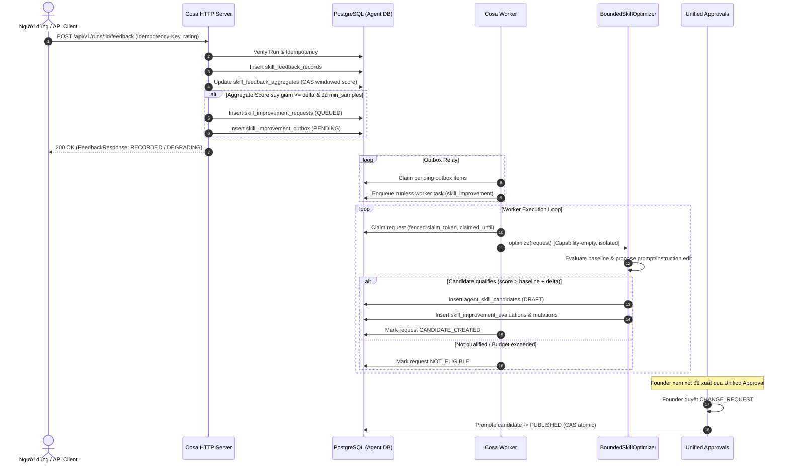

# Feedback-Driven Skill Improvement Loop

Tài liệu kiến trúc, ranh giới an toàn, và luồng vận hành cho Vòng lặp cải tiến Skill dựa trên phản hồi (Phần B.2 + B.4).

---

## 1. Mục đích & Phạm vi

Hệ thống cho phép thu thập phản hồi người dùng (`POST /api/v1/runs/:id/feedback`) một cách an toàn và bền vững, tổng hợp điểm theo cửa sổ trượt (windowed aggregate), tự động phát hiện suy giảm chất lượng (quality degradation), và đưa yêu cầu cải tiến vào hàng đợi bất đồng bộ.

Quá trình tối ưu hóa chạy hoàn toàn độc lập trong worker, tuân thủ nghiêm ngặt ranh giới an toàn:
- **Capability-empty**: Không có quyền gọi external tool, không sửa code, không truy cập tài nguyên nhạy cảm.
- **Proposal-only**: Chỉ tạo bản nháp `SkillCandidate` ở trạng thái `DRAFT` và bản ghi đánh giá (`SkillImprovementEvaluation`).
- **Unified Approval Required**: Tuyệt đối không tự động kích hoạt hay thăng hạng candidate; việc xuất bản sang Skill Registry bắt buộc phải qua phê duyệt hợp nhất của Founder (`CHANGE_REQUEST`).

---

## 2. Các Ranh giới Bất biến (Architectural Invariants)

1. **Định danh Skill 3 phần bất biến**:
   Mọi tham chiếu skill trong toàn bộ vòng đời cải tiến được xác định chính xác qua:
   $$\text{Identity} = (\text{skill\_id}, \text{version}, \text{definition\_hash})$$
   Được phân giải tại thời điểm khởi tạo Run qua `PinnedSkillRef`. Nếu definition hash thay đổi, yêu cầu cũ sẽ bị đánh dấu `STALE` và không được tối ưu trên phiên bản lệch.

2. **Durable Usage Observations**:
   Việc ghi nhận quan sát sử dụng (`agent.skill_usage_observations`) chỉ được thực hiện sau khi `RunRecord` đã tồn tại bền vững trong DB và run đã bắt đầu (`run.started`). Execution Kernel tuyệt đối không tự gọi bộ tối ưu hóa trực tiếp trong runtime path.

3. **Phản hồi Lũy đẳng & Tách biệt Telemetry**:
   - Endpoint `POST /api/v1/runs/:id/feedback` bắt buộc header `Idempotency-Key` và xác thực `run_id` hợp lệ.
   - Điểm đánh giá phản hồi (`aggregate_score`) chỉ là telemetry sức khỏe, **tuyệt đối không được ghi đè** vào `SkillCandidate.eval_score` hay làm thay đổi trực tiếp trạng thái candidate.

4. **Claim Fencing & Worker Isolation**:
   - Worker chạy tác vụ cải tiến dưới dạng **runless worker task** (`skill_improvement`), không có `run_id` và không liên quan tới `RunLeaseManager`.
   - Fencing được đảm bảo 2 lớp: rào chắn claim của task scheduler (`claim_token`) và rào chắn claim của request repository (`claim_token` + `claimed_until`).
   - Outbox relay (`agent.skill_improvement_outbox`) đảm bảo giao việc ít nhất một lần (at-least-once delivery) với cơ chế retry và exponential backoff an toàn.

---

## 3. Kiến trúc Luồng Dữ liệu (Data Flow)



---

## 4. Các Bảng Cơ sở Dữ liệu

| Bảng | Mục đích | Ràng buộc chính |
|---|---|---|
| `agent.skill_usage_observations` | Ghi nhận việc sử dụng skill được ghim theo run | FK `run_id` -> `agent.runs(run_id)` |
| `agent.skill_feedback_records` | Bản ghi phản hồi chi tiết từ user | Unique `(workspace_id, run_id, client_request_token)` |
| `agent.skill_feedback_aggregates` | Điểm tổng hợp theo cửa sổ trượt cho từng skill | Unique `(workspace_id, skill_id, skill_version)` |
| `agent.skill_improvement_requests` | Yêu cầu cải tiến có rào chắn claim | Unique `ux_agent_skill_improvement_requests_live` |
| `agent.skill_improvement_outbox` | Hàng đợi sự kiện giao việc tin cậy | Index `(status, next_attempt_at)` |
| `agent.skill_improvement_evaluations` | Kết quả benchmark của bộ tối ưu hóa | FK `candidate_id` -> `agent.agent_skill_candidates` |
| `agent.skill_improvement_mutations` | Chi tiết các biến đổi prompt/description | FK `candidate_id` -> `agent.agent_skill_candidates` |

---

## 5. Cấu hình Chính (Configuration)

Các tham số điều khiển được quản lý qua `FeedbackImprovementConfig` và biến môi trường:

- `MIN_SAMPLES_FOR_DEGRADATION`: Số lượng mẫu phản hồi tối thiểu trước khi kích hoạt cảnh báo suy giảm (mặc định: `5`).
- `DEGRADATION_THRESHOLD`: Ngưỡng điểm trung bình để coi là suy giảm chất lượng (mặc định: `0.6`).
- `MINIMUM_DEGRADATION_DELTA`: Độ sụt giảm tối thiểu so với phiên bản trước để kích hoạt request (mặc định: `0.15`).
- `MAX_ATTEMPTS`: Ngân sách số lần thử tối ưu tối đa cho mỗi request (mặc định: `3`).
- `COOLDOWN_SECONDS`: Thời gian làm nguội giữa các lần yêu cầu cải tiến trên cùng một skill (mặc định: `3600s`).
- `CLAIM_TIMEOUT_SECONDS`: Thời hạn hiệu lực của rào chắn claim worker (mặc định: `300s`).

---

## 6. Lệnh Kiểm thử & Xác minh Toàn diện

```bash
# Chạy bộ kiểm thử chuyên biệt cho Skill Improvement
make skill-improvement-verify

# Chạy kiểm thử ranh giới phê duyệt hợp nhất
make unified-approval-verify

# Kiểm tra tính tương thích migration và schema
make migration-compat-check

# Kiểm tra hợp lệ của skillpacks
make skillpacks-validate

# Kiểm tra hợp đồng API & schema
make contracts-check
make mvp-contracts-check

# Kiểm tra ranh giới kiến trúc (boundary fences)
make boundary-check
```
