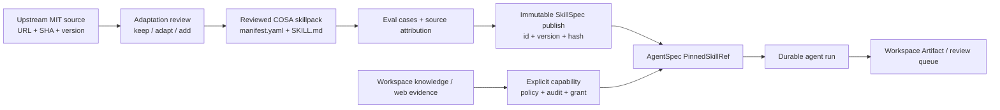

# Đánh giá và kế hoạch tích hợp `marketingskills` + `makerskills` vào COSA

**Ngày:** 2026-08-28  
**Trạng thái:** Khuyến nghị để phê duyệt; chưa cài thêm skill, chưa thay đổi runtime  
**Phạm vi:** Phân tích nội dung hai kho nguồn và đề xuất cách đưa các workflow phù hợp vào COSA theo capability-first, workspace-first và immutable SkillSpec.

## Kết luận điều hành

Nên **adapt có chọn lọc** hai kho nguồn, không cài toàn bộ, không thêm submodule và không để agent tự nạp trực tiếp skill từ GitHub hoặc `.agents/skills/` vào product runtime.

- [`marketingskills`](https://github.com/coreyhaines31/marketingskills) là nguồn tốt nhất để làm sâu các skill marketing hiện có của COSA: product marketing context, customer research, competitive intelligence, copy/CRO, SEO, analytics, attribution và experimentation.
- [`makerskills`](https://github.com/coreyhaines31/makerskills) có giá trị nhất ở các nguyên tắc vận hành: provenance/trust/sensitivity cho Company Brain; brief nghiên cứu có citation; quyết định có revisit date; loop idempotency và bail-out; quy trình adapt skill có attribution/versioning.
- Cả hai có giấy phép MIT, nhưng đều được thiết kế cho agent chạy trong máy cá nhân với file local, cấu hình qua biến môi trường, CLI/API/MCP bên ngoài. Mô hình này không tương thích trực tiếp với COSA, nơi business truth, tenant scope, approval và audit phải đi qua Company Services + Capability Gateway.

Khuyến nghị triển khai là một chương trình bốn lớp:

1. Chốt ranh giới runtime và chuẩn hoá source skillpacks hiện có.
2. Chuyển hoá một nhóm nhỏ nội dung read-only thành các COSA skillpack có attribution.
3. Kích hoạt từng skill bằng publish/hash pin và capability thật, bắt đầu bằng vertical slice rủi ro thấp.
4. Chỉ sau đó mới kết nối công cụ ngoài hoặc cho phép ghi dữ liệu/gửi nội dung ra bên ngoài.

## Nguồn đã kiểm tra

| Nguồn | Snapshot đã đọc | Quy mô | Giấy phép | Ghi chú tích hợp |
| --- | --- | ---: | --- | --- |
| [`coreyhaines31/marketingskills`](https://github.com/coreyhaines31/marketingskills) | `b1aaa3619e747f4a836c61e03084c4a531de1262` (2026-08-26) | 50 `SKILL.md` | MIT | Skill theo [Agent Skills](https://agentskills.io) với `name`, `description`, `metadata.version`; có tài liệu tool/MCP và partner registry. |
| [`coreyhaines31/makerskills`](https://github.com/coreyhaines31/makerskills) | `33cb3870685a34522d91287869aef62170bdbcf7` (2026-08-17) | 20 `SKILL.md` | MIT | Workflow cho founder/operator, thường ghi vào `${MAKERSKILLS_CONFIG}` hoặc các vault local; nhiều skill giả định CLI/MCP/API đã có sẵn. |

Các snapshot này chỉ là căn cứ phân tích. Khi thực sự adapt một skill, phải lưu URL nguồn, commit SHA, version upstream và thông báo MIT/copyright tương ứng trong hồ sơ nguồn nội bộ. Không được tự động `git pull`, nâng version hoặc thay đổi prompt đang chạy theo upstream.

## COSA hiện có: điểm khớp và ràng buộc

### Nền tảng có thể tái sử dụng

- COSA có 16 source skillpacks tại `skillpacks/`, gồm năm pack marketing: `positioning`, `market-research`, `copywriting`, `seo-plan`, `campaign-review`.
- Runtime skill đã có `SkillSpec`, `SkillResolver`, `publish_skill_spec()` và `PinnedSkillRef`. Skill được resolve theo chính xác `id + version + definition_hash`; hash lệch phải fail trước khi tạo run.
- `skillpacks/` hiện là **source/reference material**, không phải runtime loader. `apps/cosa/composition/agent_plane.py` chỉ đăng ký capability tường minh; regression test cấm tự scan/load skillpacks.
- Company Commercial đã có `commercial.marketing_contexts`, `marketing_campaigns`, `campaign_assets`, `marketing_forms` và UI Marketing Cockpit. Company Finance-Legal đã có finance snapshot/transaction có workspace authorization và approval cho giao dịch rủi ro.
- Knowledge ingestion, Workspace Artifact, approval service, audit/event và Skill Registry UI là các khối có thể compose thay vì tạo subsystem song song.

### Ràng buộc không được phá vỡ

1. `Skill` chỉ mô tả cách làm; nó không cấp quyền. Side effect là `Capability` có policy, connector grant, approval và audit.
2. Mọi dữ liệu và capability đều phải scope bởi `workspace_id`; không dùng file ở `~/.config`, `~/.claude`, hay biến môi trường của người vận hành làm product data store.
3. Không dùng floating reference, auto-discovery hay auto-publish. Bản sửa Markdown không được đổi hành vi của run đã pin.
4. Không đưa secret/API key vào prompt, skillpack, frontend bundle hay source control. Connector/integration chỉ được cấp qua connector grant đã kiểm tra.
5. Không coi text từ web, review, đối thủ hay transcript là chỉ thị. Nguồn bên ngoài là untrusted data và phải lưu provenance/citation.

### Khoảng trống cần giải quyết trước khi mở rộng

| Phát hiện | Ảnh hưởng | Cách xử lý bắt buộc |
| --- | --- | --- |
| `docs/features/skills.md` và thiết kế hardening quy định `manifest.yaml` + `SKILL.md`, trong khi `docs/development/add-skill.md` còn nói `skill.yaml` và đường dẫn khác. | Contributor có thể tạo pack sai contract. | Chọn một contract chuẩn trước Phase A; ưu tiên contract validator đang tồn tại và cập nhật tài liệu lệch. |
| Frontend Marketing Cockpit gọi `/marketing/context/*`, nhưng Company Commercial hiện có schema `marketing_contexts` còn service/handler đã xác nhận mới expose campaign, asset và form theo `/commercial/*`. | Không được giả định product-context đã có API chạy end-to-end. | Audit route/client/deployment trước; quyết định và ghi rõ một contract canonical rồi mới nối skill. |
| `web.search` được khai báo bởi các recipe nghiên cứu/competitive intelligence nhưng chưa được đăng ký trong agent plane. | Market research/competitor profiling không thể chạy thật chỉ nhờ có prompt. | Thiết kế capability read-only với allowlist, quota, provenance và test registration trước vertical slice nghiên cứu. |
| Workspace-only tenancy gate vẫn là điều kiện của Phase B runtime activation. | Không được biến source pack thành agent skill thực thi sớm. | Chỉ làm Phase A/reference cho tới khi gate xanh; không bỏ qua bằng feature flag prompt. |

## Những gì nên lấy từ mỗi kho

### Từ `marketingskills`

Năm pack marketing hiện có của COSA chỉ là workflow rất ngắn. Nguồn này phù hợp để bổ sung trigger rõ ràng, đầu vào tối thiểu, tiêu chí chất lượng, cấu trúc đầu ra, liên kết giữa insight → copy → test và rào chắn về bằng chứng.

| Ưu tiên | Skill nguồn | Đích COSA | Giá trị cần adapt | Quyền/rủi ro |
| --- | --- | --- | --- | --- |
| P0 | `product-marketing` | Mở rộng `marketing.positioning` và marketing context | ICP, persona, JTBD, pain, alternative, objections, switching forces, customer language, proof point, brand voice; version/changelog. | Đọc/soạn thảo; lưu context là business write có review. |
| P0 | `customer-research` | Mở rộng `marketing.market-research` | Ba chế độ: phân tích tài sản sẵn có, khai thác tín hiệu công khai, nghiên cứu sơ cấp; quote nguyên văn, confidence, bias và recency. | Web/knowledge read; capture insight là write có provenance. |
| P0 | `competitor-profiling`, `competitors` | Compose với recipe `sales/competitor-intelligence` và `strategy.evidence-synthesis` | Dossier theo template nhất quán; raw snapshot theo ngày; facts khác inferences; chống prompt injection từ web. | Web read; publish profile/page là write. |
| P0 | `analytics`, `attribution`, `ab-testing` | Mở rộng `marketing.campaign-review` + `strategy.experiment-design` | Tracking plan, event/property taxonomy, UTM, source-of-truth, confidence/gaps, hypothesis/metric/sample-size/decision log. | Đọc analytics trước; thiết lập tracking hoặc đổi experiment cần approval. |
| P1 | `copywriting`, `copy-editing`, `cro`, `signup`, `onboarding`, `paywalls`, `popups` | Nâng `marketing.copywriting`; liên kết campaign asset/form/funnel | Brief dựa trên evidence, page/form audit, headline/CTA variants, review copy và backlog experiment. | Sinh artifact rủi ro thấp; publish/sửa trang cần approval riêng. |
| P1 | `seo-audit`, `ai-seo`, `schema`, `site-architecture`, `content-strategy` | Nâng `marketing.seo-plan` | Intent cluster, content prioritization, AI-search visibility, technical audit và structured-data checklist. | Web read; deploy website/schema là capability write. |
| P2 | `pricing`, `offers`, `launch`, `revops`, `sales-enablement`, `prospecting`, `churn-prevention` | Commercial, Finance-Legal và Sales workflows | Decision framework cho pricing/offer/launch; lead lifecycle; battle card; retention analysis. | Có thể ảnh hưởng doanh thu/khách hàng; cần policy và evidence mạnh. |

Không ưu tiên cho runtime ban đầu: `ads`, `ad-creative`, `cold-email`, `emails`, `sms`, `social`, `directory-submissions`, `influencer-marketing`, `events`, `image`, `video`. Chúng có thể hữu ích ở giai đoạn sau, nhưng chạm vào tài khoản quảng cáo, outbound communication, dữ liệu bên thứ ba hoặc chi phí. Không được suy ra quyền gửi hay chi tiêu từ nội dung skill.

### Từ `makerskills`

| Ưu tiên | Skill nguồn | Đích COSA | Giá trị cần adapt | Điều chỉnh bắt buộc |
| --- | --- | --- | --- | --- |
| P0 | `company-brain` | Knowledge ingestion/review + artifacts | `author`, `captured_at`, source, trust (`unreviewed/verified/deprecated/superseded`), sensitivity và quy tắc không để nguồn chưa review lấn át câu trả lời. | Thay vault Markdown bằng knowledge/artifact đã workspace-scope; authorization do COSA thực thi, không dựa frontmatter. |
| P0 | `deep-research` | `strategy.evidence-synthesis` + recipe `research/research-synthesize` | Research brief có citations, contradiction, gap, confidence, date/recency và next steps. | Capability `web.search`/fetch phải sanitize content, log source, quota và giữ evidence artifact. |
| P1 | `decide` | `strategy.decision-capture` | Chọn câu hỏi load-bearing, rationale, expected outcome, revisit date. | Quyết định có hiệu lực business phải qua service/capability; không chỉ archive Markdown. |
| P1 | `loopify` | Scheduler/worker hiện có | Idempotency key, transaction, retry/rate limit, first-run verification, bail-out/manual stop. | Dùng durable scheduler/lease của COSA, không dùng cron local hay self-wakeup trong prompt. |
| P1 | `skillify` | Quy trình quản trị skill nội bộ | Keep/adapt/add, license gate, attribution, version bump, cross-skill impact review. | Thay commit/push tự động bằng candidate → eval → human approval → immutable publish. |
| P2 | `company-cfo` | Finance-Legal snapshot | Cash reconciliation, scenario, monthly/weekly cadence, anomaly checklist. | Không dùng file local/raw bank export; mọi integration tài chính cần connector grant, permission và approval. |
| P2 | `pm`, `toolify` | Operations/capability onboarding | WIP/blocker framing; integration checklist, secret safety, smoke test. | COSA đã có task model và capability gateway; không dùng adapter/API trực tiếp từ skill. |

`second-brain`, `personal-cfo`, `domain`, `paste`, `jab-hook`, `slide-deck`, `watch-video` và `social-fetch` không phải scope product runtime hiện tại. Chỉ lấy nguyên tắc khi có use case cụ thể; đặc biệt loại trừ dữ liệu đời tư và clipboard/local-home path khỏi COSA.

## Kiến trúc tích hợp đề xuất



Đường đi quan trọng là `capability → test → publish → pin`, không phải `SKILL.md → quyền thực thi`. Một skill không có capability vẫn có thể tạo bản nháp/artifact, nhưng không được tự ghi business data hoặc gọi provider ngoài.

### Chuẩn adaptation cho từng skill được chọn

Mỗi candidate phải có một review record với:

```yaml
upstream:
  repository: coreyhaines31/marketingskills # hoặc makerskills
  commit: <40-char SHA>
  skill: <source skill name>
  upstream_version: <metadata.version>
  license: MIT
adaptation:
  kept: [các nguyên tắc/tên template đã giữ]
  changed: [path, tool, terminology, data model đã đổi]
  added: [governance, workspace, approval, audit]
  excluded: [tool/provider/side effect không được nhận]
```

- Viết lại hướng dẫn theo terminology COSA và tiếng Việt nơi phù hợp; không copy nguyên kho hoặc partner/tool registry.
- Nếu sao chép một phần đáng kể, đính kèm MIT license/copyright notice theo license nguồn và ghi URL + SHA bất biến.
- Chuyển dependency liên-skill thành tham chiếu tới COSA `metadata.id`/published `SkillSpec`; không dùng tên tự do làm quyền runtime.
- Mỗi action thực thi phải nằm trong mục `Allowed Tool Calls` và khớp chính xác `runtime.tools`, đồng thời capability đó đã đăng ký trong composition root.

## Lộ trình thực thi

### Phase 0 — Reconcile và sẵn sàng governance

**Mục tiêu:** chuẩn bị mà không thay đổi hành vi runtime.

1. Xác nhận một contract duy nhất cho source skillpacks: `manifest.yaml`, `SKILL.md`, frontmatter discovery name đã chuẩn hoá và validator repository-owned.
2. Chạy/khôi phục quality environment để `tests/agent/skills/test_skillpack_contract.py` và validator được thực thi trong CI; sửa tài liệu `add-skill` mâu thuẫn sau khi contract được xác nhận.
3. Đối chiếu Marketing Cockpit với Company Commercial: `commercial.marketing_contexts` cần một API canonical workspace-scoped trước khi frontend hoặc agent dùng product/customer context như nguồn thật. Không build thêm FastAPI route song song.
4. Tạo source-attribution ledger ở `docs/integrations/` hoặc registry metadata; pin cả repository SHA và per-skill version. Không thêm submodule.
5. Chốt taxonomy dữ liệu evidence: `source_url`, `captured_at`, `captured_by`, `workspace_id`, `confidence`, `trust`, `sensitivity`, `review_status`, `supersedes`, evidence/artifact ID.

**Cổng ra phase:** static contract xanh; contract API canonical được review; workspace-only tenancy gate chưa bị bỏ qua.

### Phase A — Adapt reference-only, không thực thi

**Mục tiêu:** biến kiến thức chọn lọc thành source material đã review và có attribution.

Tạo hoặc nâng cấp theo thứ tự sau, không cần provider ngoài:

1. `marketing.positioning`: dùng `product-marketing` để mở rộng template context và định nghĩa evidence vs. assumption.
2. `marketing.market-research`: dùng `customer-research` + `deep-research` để tạo research brief, confidence, contradiction và bias checks.
3. `strategy.evidence-synthesis` + recipe competitive intelligence: dùng `competitor-profiling` để thống nhất dossier, raw evidence snapshot và prompt-injection handling.
4. `marketing.campaign-review` + `strategy.experiment-design`: dùng `analytics`, `attribution`, `ab-testing` cho hypothesis/metric/decision record.
5. `marketing.copywriting` và `marketing.seo-plan`: chỉ nhận content templates/reference checklists; chưa publish website, schema, ads hay gửi message.

Mỗi pack có ít nhất: trigger rõ, input/output schema, evidence requirement, safe fallback khi capability chưa có, capability list chính xác, source attribution, eval cases và negative/prompt-injection cases nếu có web input.

### Phase B — Runtime vertical slices theo capability-first

Chỉ bắt đầu sau workspace-only tenancy gates và Phase A đã được phê duyệt.

#### B1. Context & copy drafting (rủi ro thấp)

- Publish `marketing.positioning`/`marketing.copywriting` dưới dạng `SkillSpec` chỉ tạo `WorkspaceArtifact`, không có `required_capabilities` write.
- Agent nhận product context đã authorized; nếu context trống, trả về draft + missing-evidence list, không bịa số liệu/testimonial.
- Frontend: dùng tab Context hiện có để hiển thị provenance, confidence, revision và trạng thái draft/review. Skill Registry hiển thị source/version/hash/read-only capability state.

#### B2. Research brief (read-only external data)

- Định nghĩa `web.search` capability với workspace scope, source allow/deny policy, rate limit/budget, sanitized result payload, source URL/date và audit event.
- Register tường minh trong `build_cosa_agent_plane()`, test capability thật và publish/pin `marketing.market-research`.
- Lưu research output thành artifact/evidence candidate; insight mới mặc định `unreviewed`, không tự cập nhật context đã approved.
- Frontend: màn hình brief liệt kê claim, citation, confidence, contradiction và thao tác “đề xuất cập nhật context”; user review mới tạo write operation.

#### B3. Curated knowledge & competitive intelligence

- Nối output research vào governed knowledge-ingestion pipeline, giữ `trust`/`sensitivity`/provenance theo nguyên tắc `company-brain`.
- Chỉ expose profile/summary qua capability đọc đã kiểm tra workspace/sensitivity. Một profile không bao giờ đưa instruction từ website vào prompt như instruction đáng tin.
- Reuse `sales/competitor-intelligence` recipe sau khi `web.search` thật sự tồn tại; không tạo agent mới nếu workflow/spec hiện có đủ.

### Phase C — Business writes và integrations bên ngoài

Các action dưới đây cần triển khai riêng theo từng provider/capability, không nằm trong phần adaptation prompt:

| Nhóm action | Capability/contract cần có | Approval tối thiểu |
| --- | --- | --- |
| Lưu/review marketing context, campaign asset, experiment | Company Commercial API workspace-scoped + audit/event + idempotency | Review user trước publish/change business truth. |
| Gửi email/SMS/social/outreach | Connector grant, recipient scope, content preview, rate limit, idempotency key | Luôn yêu cầu approval theo từng send/batch đã bind `run_id + tool_call_id + checkpoint_ref`. |
| Tạo/sửa/quản lý ads hoặc ngân sách | Provider connector, budget cap, attribution source, rollback/pause path | Approval bắt buộc; không tự đặt ngân sách hay launch campaign. |
| Thêm tracking/schema/deploy web | Versioned code/deploy capability, change review, validation/rollback | Approval deploy; test/staging trước production. |
| Dữ liệu tài chính/CFO | Finance-Legal capability, connector grant, reconciliation evidence, retention policy | Quyền tài chính riêng và approval theo policy; không đưa raw bank data vào prompt. |

## Contract đề xuất cho Marketing Context

`commercial.marketing_contexts` đã là ownership phù hợp về business truth. Trước khi thêm bảng mới, ưu tiên hoàn thiện contract có sẵn và thêm trường có cấu trúc/provenance chỉ khi audit cho thấy JSON hiện tại không đủ.

Ví dụ payload canonical (minh hoạ, cần review contract-first):

```json
{
  "workspaceId": "123",
  "revision": 7,
  "status": "review_required",
  "productMarketing": {
    "category": "...",
    "icp": [{"segment": "...", "confidence": "medium", "evidenceIds": ["artifact_01"]}],
    "positioningStatement": "...",
    "alternatives": ["..."],
    "differentiators": ["..."]
  },
  "customerResearch": {
    "themes": [{"type": "pain", "summary": "...", "confidence": "high", "evidenceIds": ["artifact_02"]}],
    "customerLanguage": [{"quote": "...", "sourceId": "artifact_02", "capturedAt": "2026-08-28"}]
  },
  "provenance": {
    "updatedBy": "principal:...",
    "reviewedBy": null,
    "sourceSkill": {"id": "marketing.positioning", "version": "1.0.0", "definitionHash": "..."}
  }
}
```

API write phải dùng optimistic revision/version để ngăn overwrite; response trả exact revision và audit/evidence references. Agent chỉ gọi write qua capability đăng ký, không gọi HTTP endpoint trực tiếp từ instruction.

## Kế hoạch frontend/backend cho vertical slice đầu tiên

| Lớp | Phạm vi |
| --- | --- |
| Company Commercial | Audit/hoàn thiện API canonical cho marketing context; validate schema; enforce `requireWorkspaceAccess`; tạo revision/audit/evidence relation nếu thiếu. |
| COSA Agent Plane | Capability read trước; capability write sau. Register explicit handler, policy/risk class, idempotency và audit. Publish hash-pinned SkillSpec sau capability test. |
| Knowledge/Evidence | Artifact lưu citation/raw metadata; candidate insight có trust/sensitivity/review state; không auto-promote. |
| Flutter Marketing Cockpit | Reuse Context tab; thay placeholder-generated claim bằng card evidence/provenance/confidence; action review/save hiển thị inline state, không toast che HUD. |
| Flutter Skill Registry | Hiển thị origin, adapted-from SHA, version/hash, required capabilities, eval result, runtime state; workflow candidate/evaluate/promote/deprecate đã có là nền tảng để reuse. |

## Evals, test và Definition of Done

Mỗi skill/capability chỉ được publish khi tất cả mục liên quan đều xanh:

1. Static pack validator kiểm tra manifest, frontmatter, discovery name, source path, entrypoint và tool contract.
2. Eval có happy path, missing-evidence path, stale/contradictory source path và prompt-injection text từ nguồn web.
3. Capability integration test chứng minh `build_cosa_agent_plane()` expose đúng capability ID; test workspace isolation, denied connector grant và approval resume khi có write.
4. `SkillResolver` test valid pin, missing skill và hash mismatch. Không dùng `latest`.
5. Backend API test authorization + revision conflict; Flutter controller/widget test loading/error/review state theo contract thật.
6. E2E chạy qua process/durable worker cho workflow có scheduling, approval hoặc restart; không thay bằng instance thứ hai cùng process.
7. Với provider bên ngoài: fixture/sandbox, rate-limit/retry/idempotency test và post-action verification.

**Definition of Done cho B1:** một workspace có thể review product context, chạy positioning/copy skill đã pin, nhận artifact nêu rõ evidence còn thiếu, xem origin/hash trong UI; workspace khác không đọc được context/artifact đó; không có network/business-write capability bị ngầm cấp.

## Các quyết định cần chủ sở hữu phê duyệt trước khi code

1. Chọn scope đầu tiên: chỉ **Phase 0 + Phase A** (khuyến nghị) hay thêm **B1 context/copy drafting** sau tenancy gate.
2. Xác nhận Company Commercial là API canonical cho marketing context và xử lý chênh lệch route với Marketing Cockpit trước khi mở rộng UI.
3. Phê duyệt taxonomy trust/sensitivity/provenance cho knowledge/marketing evidence; đây là dữ liệu business, không phải YAML địa phương.
4. Chọn một provider/nền tảng và policy cho `web.search` trước khi nhận `customer-research` hoặc `competitor-profiling` vào runtime.
5. Phê duyệt policy attribution: lưu SHA/version, license notice khi copy đáng kể và review định kỳ thủ công; không có background auto-update upstream.

## Tài liệu nguồn

- [Marketing Skills README](https://github.com/coreyhaines31/marketingskills/blob/b1aaa3619e747f4a836c61e03084c4a531de1262/README.md), [AGENTS.md](https://github.com/coreyhaines31/marketingskills/blob/b1aaa3619e747f4a836c61e03084c4a531de1262/AGENTS.md), [MIT License](https://github.com/coreyhaines31/marketingskills/blob/b1aaa3619e747f4a836c61e03084c4a531de1262/LICENSE).
- [Maker Skills README](https://github.com/coreyhaines31/makerskills/blob/33cb3870685a34522d91287869aef62170bdbcf7/README.md), [Company Brain](https://github.com/coreyhaines31/makerskills/blob/33cb3870685a34522d91287869aef62170bdbcf7/skills/company-brain/SKILL.md), [Deep Research](https://github.com/coreyhaines31/makerskills/blob/33cb3870685a34522d91287869aef62170bdbcf7/skills/deep-research/SKILL.md), [Skillify adaptation workflow](https://github.com/coreyhaines31/makerskills/blob/33cb3870685a34522d91287869aef62170bdbcf7/skills/skillify/SKILL.md), [MIT License](https://github.com/coreyhaines31/makerskills/blob/33cb3870685a34522d91287869aef62170bdbcf7/LICENSE).
- COSA internal references: `docs/features/skills.md`, `docs/superpowers/specs/2026-08-27-skillpacks-hardening-design.md`, `packages/agent/skills/contracts.py`, `packages/agent/skills/skillpack_contract.py`, `apps/cosa/composition/agent_plane.py`.
