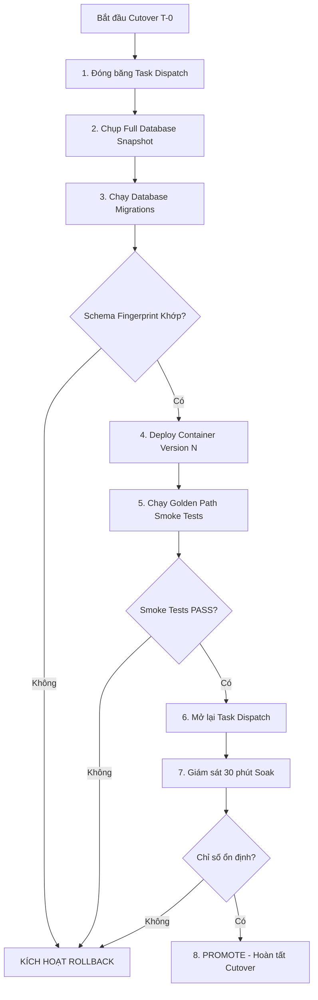

# Production Cutover Runbook

## 1. Tổng quan & Chiến lược

Tài liệu này chuẩn hoá quy trình thực hiện **Cutover lên môi trường Production** cho toàn bộ hệ thống JAVIS SaaS / COSA Agent Platform.

Theo quyết định kiến trúc **[`ADR-CUTOVER-001`](../architecture/adr/ADR-CUTOVER-001-rollback-strategy.md)**:
- Chiến lược triển khai: Triển khai container phiên bản mới $N$ song song với phiên bản trước $N-1$ có thể revert ngay lập tức.
- Chiến lược rollback: **COSA Version N-1 Rollback** (đổi image tag về $N-1$ và restart container), kết hợp chính sách **Backward-Compatible Migrations (Expand-Contract)** và **Task Dispatch Freeze Kill-Switch** (`COSA_TASK_DISPATCH_PAUSED=true`).

---

## 2. Ma trận Phân công Trách nhiệm (RACI Matrix)

| Vai trò | Nhiệm vụ chính | Người phụ trách |
|---|---|---|
| **Cutover Commander** | Điều phối tổng thể, ra lệnh bắt đầu/dừng, duyệt quyết định Promote/Rollback | Lead Architect / Tech Lead |
| **Database Lead** | Thực thi snapshot backup, chạy `make migrate-all`, verify schema fingerprint | Senior DBA / Backend Lead |
| **App & Infra Lead** | Triển khai container version N, giám sát logs, cấu hình env / secrets | DevOps / Infra Lead |
| **QA / Verifier** | Thực thi E2E Golden Path test suite, verify luồng nghiệp vụ trên production | QA Lead |

---

## 3. Điều kiện Tiên quyết (T-24h đến T-0)

Trước khi tiến hành Cutover, tất cả các điều kiện sau PHẢI đạt:

- [ ] **Staging Soak $\ge 48$h**: Bản phát hành $N$ đã chạy ngâm tối thiểu 48h trên Staging với 100% Golden Path pass.
- [ ] **CI Quality Gate**: Nhánh release đã merge vào `main` với tất cả CI jobs XANH (bao gồm `schema-fingerprint` và `migration-rollback`).
- [ ] **Image Availability**: Image container version $N$ và version $N-1$ đã được build, scan bảo mật và có sẵn trên Container Registry.
- [ ] **Database Preflight**: Chạy `make deploy-preflight` trên môi trường target đạt kết quả PASS.
- [ ] **Communication**: Thông báo cửa sổ bảo trì (nếu có) tới các bên liên quan trước tối thiểu 24h.

---

## 3b. Bước 0 — Secret Rotation (T-24h, làm trên staging trước)

Rotate mọi secret prod còn dùng giá trị dev/placeholder **trước** khi mở traffic. Chi tiết cơ chế + lệnh: [`docs/operations/secrets.md`](../operations/secrets.md) §3.

Cửa sổ bảo trì bắt buộc cho `PLATFORM_JWT_SECRET` (rotate làm mọi session đang mở mất hiệu lực).

- [ ] `PLATFORM_JWT_SECRET` — set đồng thời Coolify (`apps/cosa`) + `encore secret set --type prod` (`services/cosa`); redeploy `cosa-api` + `cosa-worker` + `services-cosa` cùng lúc.
- [ ] `WORKER_SERVICE_JWT_SECRET` — set Coolify; mint lại worker token (`scripts/mint-worker-service-token.mjs`); redeploy control plane + workers.
- [ ] `DEEPSEEK_API_KEY` — tạo key mới ở dashboard; set Coolify; redeploy; thu hồi key cũ sau khi xác nhận traffic trên key mới.
- [ ] MinIO `MINIO_ACCESS_KEY` / `MINIO_SECRET_KEY` — thay cả artifact client lẫn env của `scripts/backup/pg-backup.sh`; xoá key `minioadmin` mặc định.
- [ ] Postgres app-role passwords (`agent_core`, `cosa`, `company`) — `ALTER ROLE ... PASSWORD`; cập nhật `*_DATABASE_URL` ở Coolify; redeploy; verify `/ready` 200.

**Verify trên staging (bằng chứng, không bỏ qua):**
- [ ] Token phát hành **trước** rotate `PLATFORM_JWT_SECRET` → gọi API `apps/cosa` trả `401`.
- [ ] Đăng nhập lại → token mới verify OK, `/agent/conversations` trả `200`.
- [ ] Worker với token cũ → bị control plane từ chối; worker mint lại token mới → claim task OK.
- [ ] `bash scripts/e2e/run-golden-path.sh` xanh sau rotate.

## 4. Quy trình Thực thi Cutover Từng bước (Step-by-Step)



### Bước 1: Đóng băng Task Dispatch (Freeze Window)
Tạm dừng việc nhận task mới của các worker để đảm bảo tính nhất quán dữ liệu trong lúc apply migration:
```bash
export COSA_TASK_DISPATCH_PAUSED=true
# Hoặc cập nhật qua env/secret trên orchestrator và reload worker config
```

### Bước 2: Chụp Full Database Snapshot Backup
Bắt buộc tạo bản sao lưu snapshot đầy đủ cho cả 3 database trước khi có bất kỳ thay đổi DDL nào:
```bash
TIMESTAMP=$(date +%Y%m%d_%H%M%S)

# Chụp backup
pg_dump -Fc -h "$DB_HOST" -U "$DB_USER" "$AGENT_CORE_DB" > "/backup/agent_core_${TIMESTAMP}.dump"
pg_dump -Fc -h "$DB_HOST" -U "$DB_USER" "$COSA_DB" > "/backup/cosa_${TIMESTAMP}.dump"
pg_dump -Fc -h "$DB_HOST" -U "$DB_USER" "$COMPANY_DB" > "/backup/company_${TIMESTAMP}.dump"

# Xác nhận file backup tồn tại và kích thước hợp lệ
ls -lh /backup/*_${TIMESTAMP}.dump
export DEPLOY_BACKUP_CONFIRMED=true
```

### Bước 3: Chạy Database Migrations & Kiểm tra Schema
Thực thi tuần tự các migration của Agent Core $\rightarrow$ COSA $\rightarrow$ Company:
```bash
# 1. Chạy migrations
make migrate-all

# 2. Verify tính toàn vẹn của schema so với golden baseline (Gate D)
make schema-fingerprint-check
```
*Nếu `schema-fingerprint-check` thất bại $\rightarrow$ DỪNG NGAY LẬP TỨC và chuyển sang mục 6 (Rollback).*

### Bước 4: Deploy Application Containers (Version N)
Triển khai các container phiên bản mới và kiểm tra health check:
```bash
# 1. Triển khai container app mới
make deploy-app

# 2. Kiểm tra trạng thái healthz của các service (HTTP 200 OK)
curl -fsS http://127.0.0.1:4000/healthz | jq .
curl -fsS http://127.0.0.1:4001/healthz | jq .
curl -fsS http://127.0.0.1:8000/healthz | jq .
```

### Bước 5: Chạy Smoke Tests & E2E Golden Path
Thực thi bộ test kiểm thử chức năng quan trọng:
```bash
bash scripts/e2e/run-golden-path.sh
```
*Yêu cầu*: 100% test cases trong bộ Golden Path (Identity, Agent Execution, Task Claims, Outbox Relay, Document Ingestion) phải PASS.

### Bước 6: Mở lại Task Dispatch & Quan sát 30 phút
Mở lại cờ điều phối task để worker tiếp tục xử lý:
```bash
export COSA_TASK_DISPATCH_PAUSED=false
```

Tiến hành theo dõi liên tục trong **30 phút** với các tiêu chí:
- Error rate HTTP 5xx < 0.1%.
- Worker lease heartbeat ổn định, không có task bị kẹt ở trạng thái zombie / dead-letter bất thường.
- Outbox relay latency p95 $\le 5$s.
- CPU & RAM của các container nằm trong ngưỡng cho phép (< 75%).

### Bước 7: Quyết định Cuối cùng (Promote vs Rollback)
- **PROMOTE**: Nếu sau 30 phút tất cả các chỉ số đều đạt $\rightarrow$ Cutover Commander tuyên bố Cutover thành công.
- **ROLLBACK**: Nếu xuất hiện bất kỳ tiêu chí abort nào dưới đây $\rightarrow$ Kích hoạt Quy trình Rollback ngay lập tức.

---

## 5. Tiêu chí Dừng Khẩn cấp (Abort / Rollback Criteria)

Kích hoạt Rollback ngay lập tức nếu xảy ra một trong các trường hợp sau:
1. **Migration Failure**: Bất kỳ file migration nào lỗi khi chạy `make migrate-all` hoặc `schema-fingerprint-check` báo sai lệch.
2. **Health Check Failure**: `/healthz` không phản hồi 200 sau 60 giây kể từ khi khởi động lại container.
3. **Golden Path Failure**: Bất kỳ bước nào trong `scripts/e2e/run-golden-path.sh` bị fail.
4. **Elevated Production Error Rate**: Tỷ lệ lỗi 5xx vượt quá 1% liên tục trong 5 phút.
5. **Split-Brain / Data Inconsistency**: Worker claim xung đột hoặc rò rỉ dữ liệu giữa các workspace.

---

## 6. Lệnh Rollback Cụ thể (COSA Version N-1 Rollback)

Khi có lệnh Rollback từ Cutover Commander, thực hiện theo thứ tự:

### R1. Tạm dừng Worker Dispatch
```bash
export COSA_TASK_DISPATCH_PAUSED=true
```

### R2. Revert Container Image Tag về N-1
Cập nhật container image tag của `cosa-api`, `cosa-worker`, `company-service`, `cosa-control-plane` về tag $N-1$ trong cấu hình deploy (`docker-compose.yml` hoặc Kubernetes Deployment).

### R3. Restart Containers với Image N-1
```bash
make deploy-app
# Hoặc docker compose up -d / kubectl rollout undo
```

### R4. Rollback Schema (Nếu cần thiết)
Nếu database migration mới có lỗi hoặc cần đưa schema về lại $N-1$:
```bash
# Rollback N bước migration vừa áp dụng
node scripts/test-migration-rollback.mjs --steps 1
```

### R5. Verify lại Health & Smoke trên Version N-1
```bash
curl -fsS http://127.0.0.1:4000/healthz
curl -fsS http://127.0.0.1:4001/healthz
curl -fsS http://127.0.0.1:8000/healthz
bash scripts/e2e/run-golden-path.sh
```

### R6. Mở lại Worker Dispatch & Thông báo
```bash
export COSA_TASK_DISPATCH_PAUSED=false
```
Thông báo cho các bên liên quan về việc rollback an toàn và tiến hành thu thập logs phục vụ Post-Mortem.

---

## 7. Tài liệu Tham chiếu
- [`ADR-CUTOVER-001`](../architecture/adr/ADR-CUTOVER-001-rollback-strategy.md) — Quyết định kiến trúc Rollback Strategy.
- [`docs/operations/migrations.md`](../operations/migrations.md) — Chính sách Backward-Compatible Migrations & Migration Gates.
- [`docs/operations/rollback_pre_cutover.md`](../operations/rollback_pre_cutover.md) — Kế hoạch dự phòng và lịch sử vận hành.
