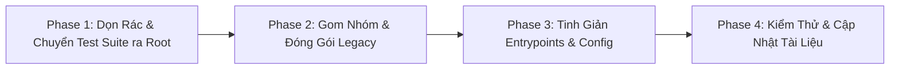

# Implementation Plan: Tinh Gọn & Dọn Dẹp Toàn Diện Thư Mục `backend/`

- **Ngày lập:** 2026-08-22
- **Tài liệu tham chiếu:**
  - `markdown/AI_Agent_OS_Master_Architecture.md`
  - `docs/superpowers/specs/2026-08-22-ai-agent-os-blueprint-design.md`
  - `docs/superpowers/plans/2026-08-22-ai-agent-os-master-synchronization-plan.md`
- **Trạng thái:** Proposed Baseline — Ready for User Review

---

## 1. Mục Tiêu & Bối Cảnh

Thư mục `backend/` hiện tại đang tồn đọng **18 thư mục con** và **4 file entrypoints**, gây ra hiện tượng chồng chéo 3 thế hệ kiến trúc:
- **Thế hệ 1 (Monolith cũ):** `core/`, `business/`, `db/`, `bootstrap/`, `storage/`
- **Thế hệ 2 (COSA Core & Business Core):** `cosa_core/`, `workforce/`, `business_core/`, `platform_core/`, `founder_os/`, `regulations/`, `agent_runtime/`
- **Thế hệ 3 (AI Agent OS & Encore Chuẩn Đích):** `agentos/`, `services/`

Kế hoạch này nhằm tinh gọn toàn bộ codebase, loại bỏ triệt để tình trạng trùng lặp (Triple Duplication), chuyển giao test suite ra Root Level và đóng gói an toàn các module cũ vào `legacy/`.

---

## 2. Kế Hoạch 4 Giai Đoạn



---

### Phase 1: Dọn Rác Tức Thì & Thiết Lập Root Test Suite

1. **Xóa bỏ thư mục rác:**
   - Xóa `backend/backend/` tạo nhầm trong lúc sync trước đây.
2. **Chuyển giao Test Suite ra Root Level:**
   - Di chuyển toàn bộ test suite từ `backend/tests/agentos/` ra `tests/agentos/`.
   - Tạo file cấu hình `pytest.ini` tại Root Level:
     ```ini
     [pytest]
     pythonpath = . agentos
     testpaths = tests/agentos
     asyncio_mode = strict
     ```

---

### Phase 2: Gom Nhóm & Đóng Gói Các Module Legacy (`legacy/`)

Tạo thư mục `legacy/` ở Root Level để lưu trữ an toàn code cũ phục vụ tra cứu / đối soát mà không làm rác thư mục chính:

```text
legacy/
  ├── README.md            # Tài liệu giải thích nguồn gốc và mapping sang kiến trúc mới
  ├── business/            # Đóng gói backend/business và backend/business_core
  ├── agent_runtime/       # Đóng gói backend/cosa_core, backend/workforce, backend/agent_runtime
  ├── domains/             # Đóng gói backend/founder_os, backend/regulations
  ├── platform/            # Đóng gói backend/platform_core, backend/core
  └── entrypoints/         # Đóng gói worker_main.py, central_main.py, full_main.py
```

---

### Phase 3: Tinh Giản Entrypoints & Cấu Hình Hạ Tầng

1. **Đóng gói Entrypoints:**
   - Di chuyển `central_main.py`, `worker_main.py`, `full_main.py` vào `legacy/entrypoints/`.
2. **Cập nhật CLAUDE.md & Tài liệu dự án:**
   - Cập nhật ranh giới quyền sở hữu (Canonical Ownership):
     - AI Agent Core: `agentos/`
     - Business Services: `services/`
     - Domain Skillpacks: `skillpacks/`
     - Test Suite: `tests/agentos/` và `services/**/*.test.ts`
     - Legacy Archive: `legacy/`

---

### Phase 4: Kiểm Thử Toàn Diện & Nghiệm Thu

1. **Kiểm thử AgentOS Test Suite từ Root Level:**
   ```bash
   PYTHONPATH=. pytest tests/agentos/ -v
   ```
2. **Kiểm thử Encore Business Services:**
   ```bash
   cd services && encore test
   ```
3. **Kiểm thử E2E Toàn Trình:**
   ```bash
   PYTHONPATH=. pytest tests/agentos/test_agent_os_full_lifecycle.py -v
   ```
