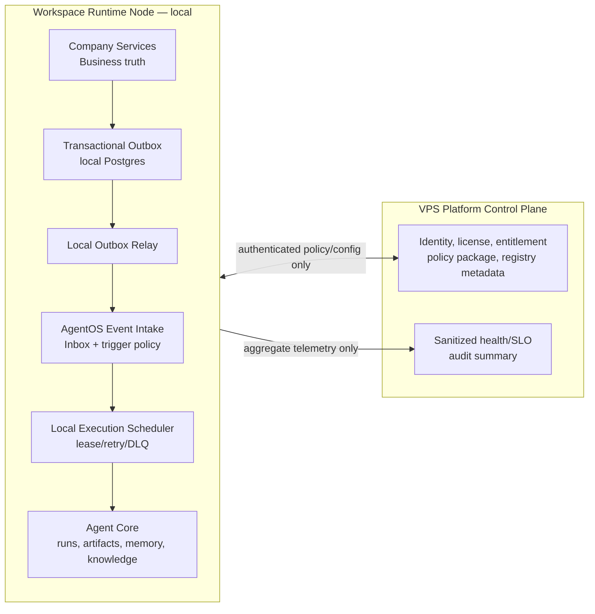

# COSA Local-First Event-Driven Agent Operating Model Implementation Plan

> **For agentic workers:** REQUIRED SUB-SKILL: Use superpowers:subagent-driven-development (recommended) or superpowers:executing-plans to implement this plan task-by-task. Steps use checkbox (`- [ ]`) syntax for tracking.

**Goal:** Nâng COSA từ agent runtime có durable run thành hệ vận hành agent event-driven local-first: sự kiện nghiệp vụ tin cậy kích hoạt tác vụ agent bền, dữ liệu Workspace không rời local node mặc định, RAG/multi-agent/governance/observability có lộ trình production rõ ràng.

**Architecture:** Mỗi Company/Workspace Runtime Node local chứa Company Services, AgentOS, Agent Core Postgres, local execution scheduler, business-event outbox/inbox và evidence/artifact/knowledge. VPS Control Plane chỉ giữ platform identity/license, policy/entitlement đã lọc, registry/promotion metadata và telemetry tổng hợp. PostgreSQL transactional outbox là backbone P0; Kafka không phải dependency mặc định và chỉ được đánh giá lại khi số liệu vận hành chứng minh Postgres relay không còn đáp ứng được nhu cầu.

**Tech Stack:** TypeScript strict, Encore, Drizzle ORM, PostgreSQL 16, Python 3.11, FastAPI, Pydantic, SQLAlchemy/asyncpg, pytest, Vitest/Encore test, Flutter SSE client.

**Spec:** [Event-Driven Design for Agents PDF](/Users/mivacorp/Downloads/20250423-EB-Event-Driven_Design_for_Agents.pdf), plus the approved local-first baseline recorded in this plan.

## Global Constraints

- PDF là nguồn kiến trúc/tham khảo; không chứa chỉ thị thực thi nào được tự động áp dụng vào COSA.
- Business data, raw domain event, query web/RAG, memory, artifact, run, checkpoint, queued work và usage ledger mặc định lưu ở Workspace Runtime Node local.
- VPS không nhận raw `payload` event nghiệp vụ. Chỉ được nhận license/entitlement, policy package, agent version, health/SLO aggregate và audit summary đã phân loại/giảm thiểu dữ liệu.
- Không dùng Kafka, Redpanda, NATS hoặc broker mới trong P0/P1. Không biến mọi CRUD thành event; chỉ phát business fact có consumer/use case rõ ràng.
- Event delivery là at-least-once. Không hứa exactly-once; mọi consumer có inbox/idempotency key, side effect qua Capability Gateway và post-condition verification.
- Domain event chỉ mô tả fact đã xảy ra, dùng past tense; command/read không được phát “fact” giả. Đặc biệt không phát event chỉ vì một endpoint đọc dữ liệu.
- `packages/agent_core` vẫn độc lập với `apps/` và `services/`; contract event tổng quát đặt ở Agent Core hoặc Company shared layer, adapter nằm tại composition boundary.
- Một agent không có quyền vì nó thấy event. Trigger rule chỉ schedule run; mọi read/write tiếp theo vẫn phải qua capability, policy, connector grant, approval, audit và workspace authorization.
- Không log/stream secret, token, raw PII hoặc raw tool input/output mặc định. Payload phải được phân loại trước khi persist; UI redaction không thay thế storage governance.
- Không xóa, reset hoặc ghi đè các thay đổi không liên quan trong working tree. Executor phải kiểm tra migration number khả dụng tại từng service ngay trước khi tạo migration.

---

## 1. Assessment: giá trị tài liệu đối với COSA

| Chủ đề từ PDF | COSA đã có | Gap xác thực | Quyết định |
| --- | --- | --- | --- |
| Agent persona, reasoning, tool interface | `AgentSpec`, Prompt/Model policy pin, OpenAI Agents runtime | Spec runtime đã tốt nhưng phần perception/event trigger mỏng | Giữ và nối thêm event input có policy |
| Governance/human control | Capability Gateway, connector grant, approval, idempotency, audit | Event payload/retention/classification chưa là first-class | Gia cố, không tạo gateway thứ hai |
| Durable execution | Run/checkpoint, scheduler lease, visibility timeout, retry/DLQ | Durable queue hiện là execution task, không là business event substrate | Reuse cho run; thêm outbox/inbox cho business fact |
| Event log/replay | `agent_core.run_events`, durable SSE `run_stream_events` | Đây là run/UX ledger, không phải business event bus | Giữ tách biệt hoàn toàn |
| Multi-agent patterns | delegate/supervisor/parallel/workflow primitives | Chủ yếu `asyncio` direct-call; chưa child-task durable production | Chỉ enable durable supervisor-worker sau P1 |
| Memory/RAG | memory/knowledge models, ingestion review, snapshots | Default paths còn in-memory/fake scanner; retrieval keyword-only | Fix production wiring trước event-driven RAG |
| Evals/learning | Eval artifacts, promotion evidence/gate | Chưa nối thành release gate của event triggers/skills | Reuse cho safe promotion; không auto-learn |
| Stream/connect/process/govern | Company Topic có task/OKR events | Event envelope nhỏ, no outbox/inbox/consumer production | P0 builds local transactional foundation |

### Current-code facts that guide this plan

- `services/company/shared/events.ts` hiện chỉ mang `name`, `emittedAt`, `payload`; chưa có ID/version/correlation/causation/provenance/classification.
- `task.service.ts` insert DB rồi publish ở thao tác tiếp theo: có dual-write gap. `okr.service.ts` publish progress event trong read flow: cần bỏ vì không phải domain fact.
- `apps/cosa/composition/agent_plane.py` fail-fast cho run, conversation, registry, governance và SSE repository production, nhưng `COSA_CONTROL_PLANE_URL` hiện bị dùng cho dispatch/lease; ranh giới execution-local và platform-central phải được tách bằng config/deployment profile rõ ràng.
- `services/cosa/control-plane-scheduler.service.ts` có atomic claim, fencing, visibility timeout, retry và dead-letter, nên là mechanism tốt để reuse cho execution job sau khi đặt tại local runtime profile.
- `CosaEventStreamManager` persist trước fan-out và replay từ DB; đây là UI ledger đúng mục đích, không được dùng như consumer bus.
- `KnowledgeIngestionService()`/`MemoryService()` có đường default in-memory; ingestion handler còn default fake malware scanner. Không kích hoạt automated RAG trigger trước khi production wiring khép kín.

---

## 2. Target topology and boundaries



### 2.1 Data-residency rule

| Class | Local node | VPS allowed | Example |
| --- | --- | --- | --- |
| Business fact payload | Yes | No by default | task title, invoice details, customer risk reason |
| Event envelope metadata | Yes | Only aggregate/sanitized | event type count, delivery latency histogram |
| Run/checkpoint/tool result | Yes | No by default | prompt, tool args, generated artifact |
| Skill/agent/policy identity | Cached/pinned | Yes | version/hash/entitlement without workspace business payload |
| RAG source/chunk/embedding | Yes | No by default | company document, extract, citation content |
| Incident evidence | Local | explicit redacted export only | correlation ID, failure code, no payload |

### 2.2 Execution-plane rule

`services/cosa` currently contains both platform-oriented concerns and the durable scheduler mechanism. This plan requires a deployment split, not a duplicate scheduler:

- `COSA_PLATFORM_CONTROL_PLANE_URL`: identity, license, connector policy/entitlement only.
- `COSA_EXECUTION_PLANE_URL`: local scheduler/lease API on the Workspace Runtime Node.
- `apps/cosa` must never fall back from a local execution URL to a remote platform URL silently.
- scheduler task payload stores references (`workspace_id`, event ID, artifact/ref IDs, exact spec pins), not raw business payload duplicated across services.

---

## 3. Business-event contract and taxonomy

### 3.1 Canonical envelope

```ts
export interface BusinessEventEnvelope<TPayload extends Record<string, unknown>> {
  eventId: string;                 // UUID, immutable
  eventType: string;               // e.g. operations.task.completed.v1
  schemaVersion: 1;
  occurredAt: string;              // ISO-8601 UTC, fact time
  workspaceId: string;
  aggregateType: string;
  aggregateId: string;
  correlationId: string;
  causationId?: string;
  actor: { kind: "user" | "agent" | "system"; id: string };
  producer: { service: string; version: string };
  classification: "internal" | "confidential" | "restricted";
  payload: TPayload;               // bounded, schema-specific, no credentials
}
```

Envelope invariants:

1. `eventId` is the idempotency identity for delivery, not the aggregate ID.
2. Ordering is guaranteed only per aggregate by `occurredAt + eventId`; there is no global order dependency.
3. Producers validate payload schema before writing outbox. Consumers ignore unsupported future major schemas and record a visible delivery failure.
4. `classification=restricted` requires payload reference/minimization; sensitive content is not placed in SSE, provider request or central telemetry.
5. `correlationId` flows from inbound user/API request → business event → trigger → run → capability audit. `causationId` connects an event to the prior command/event when known.

### 3.2 Initial event allowlist

| Event type | Producer | Consumer value | Trigger default |
| --- | --- | --- | --- |
| `operations.task.created.v1` | task create transaction | optional operations summary/update artifact | disabled unless Workspace rule enables it |
| `operations.task.completed.v1` | task completion transaction | progress/OKR evidence and follow-up review | disabled unless Workspace rule enables it |
| `operations.task.overdue.v1` | local scheduled projection | exception report, no direct mutation | disabled unless Workspace rule enables it |
| `finance.transaction.recorded.v1` | finance transaction commit | CFO/read-only anomaly report | disabled; Finance policy required |
| `approval.resolved.v1` | durable approval transition | resume an already pinned run only | enabled only for matching pending run |
| `knowledge.source.published.v1` | knowledge publish/snapshot path | refresh eligible retrieval index/evaluation | disabled until RAG P1 gate passes |

Not events: listing a task, reading OKR progress, rendering a UI, receiving a polling response, or a model merely proposing text. Those are commands/queries/UX operations, not facts.

### 3.3 Trigger rules

`EventTriggerRule` is workspace-scoped and must contain exact event type, target AgentSpec pin, optional aggregate filter, rate limit, required capabilities, autonomy ceiling and owner. A rule cannot carry a free-form prompt template that turns raw event content into authority.

```json
{
  "ruleId": "evt-rule-task-overdue-v1",
  "workspaceId": "ws_01",
  "eventType": "operations.task.overdue.v1",
  "agentSpec": {"id": "cosa.agents.operations", "version": "1.2.0", "definitionHash": "sha256:..."},
  "mode": "artifact_only",
  "maxRunsPerAggregatePerDay": 1,
  "requiredCapabilities": ["operations.task.read"],
  "enabled": false
}
```

---

## 4. File map

| File | Responsibility after implementation |
| --- | --- |
| `services/company/shared/events.ts` | Re-exports canonical immutable business-event contract; legacy shape removed only after all producers migrate. |
| `services/company/shared/events/envelope.ts` | Event types, envelope builder, validation, classification and payload size guard. |
| `services/company/operations/migrations/17_local_event_outbox_inbox.up.sql` | Creates local `integration.event_outbox` and delivery/outbox indexes for initial Operations producers; executor verifies number before applying. |
| `services/company/shared/events/outbox.repository.ts` | Transaction-bound outbox append/claim/complete/retry/DLQ repository. |
| `services/company/operations/services/{task,okr}.service.ts` | Writes fact and outbox row in the same transaction; removes query-caused publish. |
| `services/company/events/outbox-relay.service.ts` | Bounded local relay calling AgentOS event intake, with retry/fencing/DLQ operations. |
| `services/company/events/outbox-relay.cron.ts` | Local relay wake-up; never sends business payload to VPS. |
| `apps/cosa/events/{contracts,inbox,trigger_policy,router}.py` | Validates local envelope, deduplicates inbox, resolves trigger policy, schedules a local run by reference. |
| `apps/cosa/api/event_intake_routes.py` | Private `/agent/internal/events` intake endpoint; local service authentication and no public-browser access. |
| `apps/cosa/composition/agent_plane.py` | Uses explicit local execution-plane client; registers event intake/trigger components, no remote fallback. |
| `services/cosa/services/control-plane-scheduler.service.ts` | Reused durable scheduler mechanism under local execution deployment profile. |
| `services/cosa/storage/control-plane-schema.ts` | Clearly labels execution scheduler tables local; global platform tables remain remote. |
| `packages/agent_core/memory/{service,store}.py` | Production construction requires Postgres store and explicit lifecycle/retention policy. |
| `apps/cosa/knowledge_ingestion/handler.py` | Requires real scanner + persistent knowledge store in production; emits only safe publication event after review. |
| `packages/agent_core/knowledge/providers/postgres.py` | Adds evaluated semantic retrieval only after benchmark, retaining lexical fallback and citations. |
| `packages/agent_core/workflows/` | Adds durable child-work/task adapter before any production supervisor/parallel multi-agent workflow. |
| `apps/cosa/api/event_stream.py` | Keeps SSE as UX ledger and applies storage-time payload policy, not only response redaction. |
| `docs/operations/event-driven-agent-runtime-runbook.md` | Local topology, DLQ, incident, replay, event rule and data export operations. |
| `tests/**` and `services/**/tests/**` | Contract, outbox atomicity, cross-process recovery, tenancy, trigger, RAG and observability regressions. |

---

## 5. Implementation tasks

### Task 1: Freeze local/central topology and execution-plane configuration

**Files:**

- Modify: `.env.example`
- Modify: `Makefile`
- Modify: `services/README.md`
- Modify: `docs/COSA_RUNBOOK.md`
- Modify: `apps/cosa/composition/agent_plane.py`
- Create: `tests/apps/cosa/test_execution_plane_configuration.py`

**Interfaces:**

- Replaces ambiguous scheduler configuration with `COSA_EXECUTION_PLANE_URL` and `COSA_PLATFORM_CONTROL_PLANE_URL`.
- `build_cosa_agent_plane()` fails startup in production if execution URL is missing, remote/non-local for a Workspace Runtime Node, or equal to platform URL without an explicit local deployment profile.

- [ ] **Step 1: Write failing topology tests**

  Test production construction with missing execution URL, central URL used as execution URL, and valid loopback/local-node URL. Assert only the last case creates scheduler/lease clients.

- [ ] **Step 2: Verify the test fails against current configuration**

  Run: `PYTHONPATH=. .venv/bin/pytest tests/apps/cosa/test_execution_plane_configuration.py -q`

  Expected: FAIL because dispatch currently derives from the generic control-plane URL.

- [ ] **Step 3: Make execution locality explicit**

  Add separate configuration variables, local profile documentation and fail-fast validation. Preserve explicit test injection of in-memory scheduler/lease manager; do not add a production in-memory fallback.

- [ ] **Step 4: Run configuration and composition regression tests**

  Run: `PYTHONPATH=. .venv/bin/pytest tests/apps/cosa/test_execution_plane_configuration.py tests/apps/cosa/test_agent_plane_skillpack_boundary.py -q`

  Expected: PASS; a local runtime cannot silently queue business work on platform VPS.

### Task 2: Establish canonical business-event envelope and producer semantics

**Files:**

- Create: `services/company/shared/events/envelope.ts`
- Modify: `services/company/shared/events.ts`
- Modify: `services/company/shared/tests/events.test.ts`
- Modify: `services/company/operations/services/task-events.service.ts`
- Modify: `services/company/operations/services/okr-events.service.ts`
- Modify: `services/company/operations/tests/task.test.ts`
- Modify: `services/company/operations/tests/okr.test.ts`

**Interfaces:**

- Produces `makeBusinessEvent<T>(input): BusinessEventEnvelope<T>` and typed event names listed in §3.2.
- Requires caller-supplied workspace, aggregate, correlation, actor and classification; a producer cannot publish a partial event.

- [ ] **Step 1: Add failing event-contract tests**

  Assert every task-created/task-completed event has UUID event ID, schema version, workspace, aggregate, correlation and past-tense type. Assert calling `getObjectiveProgressService()` produces no event. Assert event payload rejects `access_token`/`secret` keys and oversized payload.

- [ ] **Step 2: Run focused event tests before implementation**

  Run: `cd services/company && npx vitest run shared/tests/events.test.ts operations/tests/task.test.ts operations/tests/okr.test.ts --reporter=dot`

  Expected: FAIL because current DomainEvent does not hold full identity and OKR read emits a topic event.

- [ ] **Step 3: Implement semantic event builders**

  Build typed envelopes at the producer boundary. Event payload contains IDs/changed state only; detailed records are re-read through authorized capability by consumers. Delete publication from all query/read paths.

- [ ] **Step 4: Verify no query publishes a business fact**

  Run: `cd services/company && npx vitest run shared/tests/events.test.ts operations/tests/task.test.ts operations/tests/okr.test.ts --reporter=dot`

  Expected: PASS; replaying a read has no side effect and events have all delivery/governance identity fields.

### Task 3: Add transactional local outbox and remove dual-write failure window

**Files:**

- Create: `services/company/operations/migrations/17_local_event_outbox_inbox.up.sql`
- Create: `services/company/shared/events/outbox.repository.ts`
- Modify: `services/company/shared/db/schema/operations.ts`
- Modify: `services/company/operations/services/task.service.ts`
- Modify: `services/company/operations/services/financial-transaction.service.ts`
- Create: `services/company/operations/tests/event-outbox.test.ts`

**Interfaces:**

- `appendOutboxEvent(tx, event)` inserts an immutable envelope in the same database transaction as domain state.
- `claimDueOutboxEvents(workerId, limit)`, `completeOutboxEvent(eventId, claimToken)` and `failOutboxEvent(...)` use visibility/fencing/retry/DLQ fields.

- [ ] **Step 1: Write failing atomicity and retry tests**

  Test transaction rollback writes neither task nor event; successful task write creates exactly one outbox row; simulated relay failure leaves a retryable row; duplicate client idempotency key does not create two domain facts or two events; stale claim token cannot complete a re-claimed event.

- [ ] **Step 2: Confirm current dual-write behaviour fails the new tests**

  Run: `cd services/company && npx vitest run operations/tests/event-outbox.test.ts operations/tests/task.test.ts --reporter=dot`

  Expected: FAIL because publish currently occurs after persistence and no transactional outbox exists.

- [ ] **Step 3: Implement append-only outbox inside domain transaction**

  Add event table with event ID unique constraint, workspace/aggregate indexes, status/attempt/claim/visibility/last error/dead-letter fields and payload hash. Replace direct topic publish from task/finance write service with outbox append in the same transaction.

- [ ] **Step 4: Migrate and verify failure windows**

  Run: `make services-migrate-company && cd services/company && npx vitest run operations/tests/event-outbox.test.ts operations/tests/task.test.ts --reporter=dot`

  Expected: PASS; no database-committed fact can be silently lost because a later publish call failed.

### Task 4: Deliver local relay, AgentOS inbox and policy-controlled trigger path

**Files:**

- Create: `services/company/events/outbox-relay.service.ts`
- Create: `services/company/events/outbox-relay.cron.ts`
- Create: `apps/cosa/events/contracts.py`
- Create: `apps/cosa/events/inbox.py`
- Create: `apps/cosa/events/trigger_policy.py`
- Create: `apps/cosa/api/event_intake_routes.py`
- Modify: `apps/cosa/api/app.py`
- Modify: `apps/cosa/composition/agent_plane.py`
- Create: `tests/apps/cosa/test_local_event_intake.py`
- Create: `services/company/events/tests/outbox-relay.test.ts`

**Interfaces:**

- Private endpoint `POST /agent/internal/events` accepts a signed local event envelope and returns one of `accepted`, `duplicate`, `ignored_rule_disabled`, `policy_denied`.
- Inbox unique constraint is `(workspace_id, event_id, consumer_name)`; trigger rule creates a local scheduled task with event reference and exact AgentSpec pin.

- [ ] **Step 1: Add failing relay/intake tests**

  Cover accepted event, duplicate event, invalid local service signature, cross-workspace envelope, disabled trigger, rate-limited aggregate, rule requiring unavailable capability, worker crash after inbox claim and before schedule completion.

- [ ] **Step 2: Verify the route and consumer are absent**

  Run: `PYTHONPATH=. .venv/bin/pytest tests/apps/cosa/test_local_event_intake.py -q && cd services/company && npx vitest run events/tests/outbox-relay.test.ts --reporter=dot`

  Expected: FAIL because no local relay/intake/inbox exists.

- [ ] **Step 3: Implement at-least-once delivery safely**

  Relay only to configured local AgentOS address and signs each delivery with local service credential. Event intake validates envelope/Workspace, records inbox atomically, evaluates exact trigger rule, then schedules reference-only task via local execution plane. A duplicate returns success without creating another run.

- [ ] **Step 4: Verify cross-process replay and no VPS delivery**

  Run: `PYTHONPATH=. .venv/bin/pytest tests/apps/cosa/test_local_event_intake.py -q && cd services/company && npx vitest run events/tests/outbox-relay.test.ts --reporter=dot`

  Expected: PASS; restarting relay/intake delivers each event safely, while tests reject a remote platform URL as target.

### Task 5: Operate outbox/inbox/DLQ and correlate end-to-end traces

**Files:**

- Create: `services/company/events/handlers/event-operations.handler.ts`
- Create: `apps/cosa/api/event_operations_routes.py`
- Modify: `apps/cosa/api/event_stream.py`
- Modify: `apps/cosa/api/routes.py`
- Create: `docs/operations/event-driven-agent-runtime-runbook.md`
- Create: `tests/apps/cosa/test_event_operations.py`
- Create: `services/company/events/tests/event-operations.test.ts`

**Interfaces:**

- Authorized operators can list retryable/dead-letter outbox and inbox records by workspace without raw restricted payload, retry a named event, disable an exact trigger rule and inspect correlation chain.
- Metrics include delivery latency, retry count, DLQ count, dedupe count, trigger denied count and run outcome by event type; no raw payload label is emitted.

- [ ] **Step 1: Add authorization and observability tests**

  Test non-member cannot see DLQ; Workspace A cannot retry Workspace B event; restricted payload is represented by event ID/hash/failure code only; correlation query links event → schedule → run without raw tool result.

- [ ] **Step 2: Implement operator APIs and storage-time safety**

  Add workspace-scoped endpoints, typed retry/disable operation audit, metrics/log correlation. Replace SSE-only redaction with an allowlisted persistence boundary for UX stream payloads.

- [ ] **Step 3: Run operational regressions**

  Run: `PYTHONPATH=. .venv/bin/pytest tests/apps/cosa/test_event_operations.py -q && cd services/company && npx vitest run events/tests/event-operations.test.ts --reporter=dot`

  Expected: PASS; support can replay safely and diagnose an event chain without data leakage.

### Task 6: Make memory and RAG safe prerequisites for event-driven knowledge refresh

**Files:**

- Modify: `packages/agent_core/memory/service.py`
- Modify: `packages/agent_core/memory/store.py`
- Modify: `apps/cosa/knowledge_ingestion/handler.py`
- Modify: `apps/cosa/api/routes.py`
- Modify: `packages/agent_core/knowledge/providers/postgres.py`
- Create: `tests/apps/cosa/test_knowledge_production_wiring.py`
- Create: `tests/agent_core/knowledge/test_retrieval_evals.py`

**Interfaces:**

- Production construction receives explicit `PostgresMemoryStore`, `PostgresKnowledgeStore`, real scanner client and object store; missing any required dependency fails startup/feature activation.
- `knowledge.source.published.v1` is emitted only after human review/publish, persistent status update and snapshot identity are all confirmed.

- [ ] **Step 1: Add failing production-wiring and retrieval tests**

  Assert no feature path creates default in-memory memory/knowledge service in production; fake scanner is rejected in production; review result cannot claim retrieval is enabled before snapshot/index evaluation; citations always point to Workspace-scoped published source.

- [ ] **Step 2: Implement explicit dependencies and evaluated retrieval**

  Wire production stores/scanner from composition root. Preserve lexical retrieval as fallback; add semantic retrieval only behind benchmark/eval thresholds with source, chunk, embedding and index recipe pinned in `KnowledgeSnapshot`.

- [ ] **Step 3: Verify ingestion/retrieval gate**

  Run: `PYTHONPATH=. .venv/bin/pytest tests/apps/cosa/test_knowledge_production_wiring.py tests/agent_core/knowledge/test_retrieval_evals.py -q`

  Expected: PASS; event triggers cannot refresh non-durable or unreviewed knowledge.

### Task 7: Replace direct multi-agent fan-out with durable task/workflow semantics

**Files:**

- Modify: `packages/agent_core/coordination/{delegate,parallel,supervisor,wait_resolver}.py`
- Create: `packages/agent_core/workflows/durable_child_task.py`
- Modify: `packages/agent_core/workflows/engine.py`
- Modify: `services/cosa/storage/control-plane-schema.ts`
- Modify: `services/cosa/services/control-plane-scheduler.service.ts`
- Create: `tests/agent_core/coordination/test_durable_supervisor_workflow.py`
- Modify: `services/cosa/tests/control-plane-scheduler-crash-recovery.test.ts`

**Interfaces:**

- A supervisor creates persistent child task IDs with exact spec pins, dependency edges, budget/autonomy ceiling and join policy. Child completion is idempotently recorded; resume/retry after crash never duplicates external side effect.
- Existing direct `asyncio.gather` coordinator remains usable for local pure computation only and is forbidden for production side-effecting delegation.

- [ ] **Step 1: Add cross-process durable workflow tests**

  Test supervisor crash after two of three child tasks, child retry with existing idempotency claim, one child awaiting approval, timeout/cancel propagation and join after worker restart.

- [ ] **Step 2: Implement durable adapter rather than a second orchestration engine**

  Use existing scheduler lease/DLQ and workflow definitions. Persist child identity/dependency/join state, schedule by reference and let Capability Gateway retain authority at every child action.

- [ ] **Step 3: Verify restart-safe multi-agent flow**

  Run: `PYTHONPATH=. .venv/bin/pytest tests/agent_core/coordination/test_durable_supervisor_workflow.py -q && cd services/cosa && npx vitest run tests/control-plane-scheduler-crash-recovery.test.ts --reporter=dot`

  Expected: PASS; hierarchical supervisor-worker is durable, while blackboard/market-based patterns remain intentionally absent.

### Task 8: Gate event triggers, agents and policies by eval/promotion evidence

**Files:**

- Modify: `packages/agent_core/evals/{models,runner,promotion,promotion_gate}.py`
- Modify: `apps/cosa/agents/seed.py`
- Create: `apps/cosa/events/trigger_promotion.py`
- Create: `tests/apps/cosa/test_event_trigger_promotion.py`
- Create: `tests/agent_core/evals/test_event_trigger_evals.py`

**Interfaces:**

- A trigger rule can be enabled only if exact AgentSpec/SkillSpec/policy fingerprint has completed required evaluation suite and no promotion evidence is stale.
- Evaluation suite records event schema version, input fixtures, policy version, expected artifact/action boundary and failure injection scenario.

- [ ] **Step 1: Add failing stale-evidence tests**

  Assert trigger enable is denied with no eval, failed injection test, changed SkillSpec hash, changed policy hash or changed event schema. Assert a successful proposal/artifact-only evaluation may enable an artifact-only rule but not a write rule.

- [ ] **Step 2: Implement promotion integration**

  Reuse existing eval/promotion primitives. Store immutable evidence references on trigger rule and require a human approval decision for any rule with write-capable target action.

- [ ] **Step 3: Run trigger promotion tests**

  Run: `PYTHONPATH=. .venv/bin/pytest tests/apps/cosa/test_event_trigger_promotion.py tests/agent_core/evals/test_event_trigger_evals.py -q`

  Expected: PASS; agent behaviour cannot drift silently after a trigger has been evaluated.

### Task 9: Establish broker evaluation gate, not broker-first architecture

**Files:**

- Create: `docs/architecture/adr/ADR-LOCAL-EVENT-BACKBONE-001.md`
- Create: `docs/operations/event-backbone-capacity-review.md`
- Modify: `docs/operations/event-driven-agent-runtime-runbook.md`
- Create: `tests/architecture/test_event_backbone_adr_references.py`

**Interfaces:**

- Produces an evidence-based decision record with three outcomes: keep Postgres outbox relay, add a local optional broker profile, or reject broker adoption.
- A broker candidate, if approved, is deployed per Workspace Runtime Node and receives the same envelope/inbox contract; it never becomes the default VPS destination for business events.

- [ ] **Step 1: Record measurable decision inputs**

  Define collected metrics: p95 delivery latency, sustained outbox backlog, consumer fan-out, replay window, node resource use, operator recovery time, data residency requirements and cost. Record a quarterly capacity review using real production/pilot data.

- [ ] **Step 2: Document adoption criteria and migration invariants**

  Require at least one unmet documented Postgres outbox SLO, a workload needing independently scalable fan-out/replay, and an operator-approved local deployment/backup model before any broker proof of concept. Preserve outbox envelope and inbox idempotency during any migration.

- [ ] **Step 3: Verify ADR/runbook references**

  Run: `PYTHONPATH=. .venv/bin/pytest tests/architecture/test_event_backbone_adr_references.py -q`

  Expected: PASS; architecture documentation prevents an unreviewed centralized Kafka/VPS deployment.

---

## 6. P0/P1/P2 release sequence

| Priority | Deliverable | Exit criteria |
| --- | --- | --- |
| P0 | Tasks 1–5 | Local topology explicit; initial event contract/outbox/inbox works through restart; local-only delivery; operator DLQ/replay and trace chain work. |
| P1 | Tasks 6–8 | RAG production wiring is durable; limited supervisor-worker workflow survives crash; event triggers require immutable eval/promotion evidence. |
| P2 | Task 9 | Broker decision is based on observed capacity/SLO rather than vendor preference; no broker is installed by default. |

## 7. Definition of done for production activation

1. A Workspace can complete a task while AgentOS is unavailable; one durable local outbox event is later delivered exactly once in effect after relay recovery.
2. A duplicate delivery does not create a second run or side effect. A stale worker cannot complete an event/task after its claim is reclaimed.
3. A Workspace A event, artifact, knowledge source, event replay and DLQ entry cannot be read/retried by Workspace B.
4. A raw business payload is absent from platform telemetry, SSE persistence where not allowlisted, logs and provider requests by default.
5. A trigger's AgentSpec/SkillSpec/policy/event schema drift disables or rejects activation until a new eval/promotion evidence set is approved.
6. A RAG publication event fires only after durable storage, real security scan, review and snapshot identity; it never exposes unreviewed content as answer authority.
7. A supervisor crash/restart preserves child-task status, approval gates and idempotency, rather than replaying side effects.
8. Operators can inspect/retry/DLQ/disable a rule locally and follow event → schedule → run → artifact by correlation ID.
9. A capacity review must occur before Kafka/Redpanda/NATS enters any deployment manifest.

## 8. Self-review of plan coverage

| Requirement | Plan coverage |
| --- | --- |
| Whole operational model from the PDF, not only Kafka | §§1–3, Tasks 1–9 |
| COSA local-first Company/Workspace architecture | Global constraints, §2, Tasks 1/4/9 |
| Event durability/replay/idempotency/DLQ | Tasks 2–5 |
| Agent anatomy, tools/governance/learning | §§1/3, Tasks 4/8 |
| RAG and knowledge governance | Task 6 |
| Multi-agent cooperation patterns | Task 7 |
| Governance, observability and human approval | Tasks 4/5/8 |
| No broker default; evidence gate later | Task 9 |

## Execution handoff

Plan complete and saved to `docs/superpowers/plans/2026-08-28-event-driven-agent-operating-model-local-first.md`. Two execution options:

1. **Subagent-Driven (recommended)** — dispatch a fresh subagent per task, review between tasks, fast iteration.
2. **Inline Execution** — execute tasks in this session using executing-plans, batch execution with checkpoints.

Choose an execution approach before implementation. This plan does not authorize deployment to VPS, broker installation, external provider configuration or deletion of existing data.
