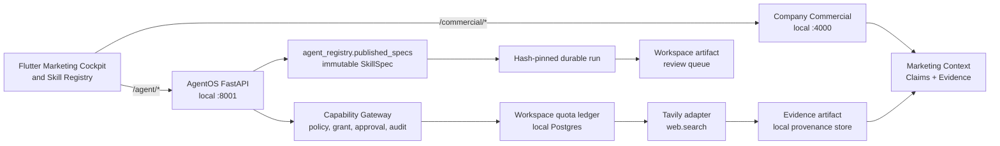

# Marketing & MarketSale: 18-Pack Production Readiness Implementation Plan

> **For agentic workers:** REQUIRED SUB-SKILL: Use superpowers:subagent-driven-development (recommended) or superpowers:executing-plans to implement this plan task-by-task. Steps use checkbox (`- [ ]`) syntax for tracking.

**Goal:** Đưa danh mục 18 năng lực Marketing/MarketSale đã chốt vào COSA với web search Tavily thật, Marketing Context canonical, Skill Registry HTTP cho Flutter, và các gate đủ để chạy staging/production an toàn.

**Architecture:** Company Commercial vẫn là nguồn sự thật local của Marketing Context, campaign và dữ liệu thương mại. AgentOS (`apps/cosa`) sở hữu registry, lifecycle skill, execution, eval và API `/agent/skills/*`; mọi action qua Capability Gateway. `web.search` dùng adapter Tavily đầu tiên sau quota ledger theo workspace, provider secret và policy egress; kết quả chỉ trở thành evidence/artifact có provenance, không thành business truth tự động.

**Tech Stack:** TypeScript strict, Encore, Drizzle ORM, PostgreSQL 16, Python 3.11, FastAPI, Pydantic, SQLAlchemy/asyncpg, Flutter, Tavily Search API, pytest, Vitest/Encore test.

**Spec:** `docs/integrations/2026-08-28-marketingskills-makerskills-adoption-plan.md`; danh mục 18 delivery unit tại §3 của tài liệu này là catalogue đã chốt thay cho danh sách mở trong tài liệu nguồn.

## Global Constraints

- Dữ liệu doanh nghiệp, evidence, context, artifact, run và quota ledger thuộc Workspace Runtime Node local; Control Plane không nhận raw query, raw result, customer data hoặc raw financial data.
- Không gọi Tavily, analytics, CRM hay provider bên ngoài từ prompt, skill Markdown hoặc Flutter. Chỉ Capability Gateway gọi provider sau policy, connector grant, quota và audit.
- `web.search` production dùng Tavily adapter đầu tiên. Tavily không được lộ ra như dependency của skill: Skill chỉ yêu cầu capability ID `web.search`.
- Mỗi Workspace có quota persisted riêng. Quota chưa cấu hình, connector chưa grant, hoặc policy không cho phép đều phải `deny`; không dùng quota mặc định rộng để bypass.
- Không để content web làm system/developer instruction. Web result là untrusted data; chỉ đưa vào context dưới dạng evidence có provenance, date, trust, sensitivity và giới hạn kích thước.
- `packages/agent_core` không import `apps/` hoặc `services/`. Company Commercial không sở hữu registry thứ hai; `agent_registry.published_specs` là nguồn sự thật SkillSpec đã publish.
- SkillSpec đã publish là immutable và AgentSpec luôn pin `skill_id + version + definition_hash`. UI không có endpoint sửa tại chỗ một version đã publish.
- Write vào context, campaign, pricing, connector, CRM hay external system phải qua capability có approval/idempotency/audit; generation artifact hoặc recommendation không đồng nghĩa action đã diễn ra.
- Không dùng source upstream như runtime loader. Mỗi adaptation lưu upstream URL, commit SHA, version, MIT notice, phần giữ/sửa/loại và eval evidence.
- Không xóa, reset hoặc ghi đè những thay đổi hiện có trong working tree. Mỗi task phải kiểm tra lại migration number trước khi tạo migration mới.

---

## 1. Quyết định kiến trúc đã chốt

### 1.1 Đích production



### 1.2 Những điều tài liệu này không làm

- Không cho agent tự gửi email, SMS, social post, cold outreach, tạo ads, tăng ngân sách hoặc publish website.
- Không tự cập nhật approved Marketing Context từ web result hoặc agent output.
- Không dùng Tavily `crawl`, `extract`, `research` hay `advanced search` trong release đầu nếu capability/risk tier riêng chưa được test và phê duyệt.
- Không tạo Company-side `/skills/*` registry hoặc copy SkillSpec vào `commercial` database.
- Không biến `loop-hardening`, `skill-adaptation` hay `capability-onboarding` thành prompt pin vào agent nghiệp vụ.

### 1.3 Điều chỉnh cần thiết với proposal Claude Code

1. `finance.cfo-review` là **restricted runtime delivery unit**, không phải meta pack. Nó có thể tạo reconciliation/scenario/anomaly report read-only, nhưng luôn cần Finance-Legal capability, connector grant, data classification và approval cho bất kỳ financial action nào.
2. `research.deep-research` là engine tạo research brief/citation dùng chung. `marketing.market-research` phải compose engine này theo ngữ cảnh marketing, không được tự dựng thêm một web orchestration song song.
3. `sales.prospecting` chỉ được research, score và tạo internal artifact/lead candidate. Không bao gồm cold email, message, enrichment trả phí hay CRM write tự động.
4. `platform.skill-adaptation` và `capability-onboarding` là hai chuẩn vận hành nằm trong một delivery unit governance: hai tài liệu/checklist/test gate riêng, không phải hai SkillSpec runtime. Vì vậy catalogue vẫn đủ 18 delivery unit mà không tạo prompt giả để kiểm soát platform.

---

## 2. Foundation bắt buộc trước khi runtime activation

### 2.1 Marketing Context: schema lai, không full-normalize

Giữ document-shaped data có vòng đời chỉnh sửa nguyên khối ở JSONB; chuẩn hoá chỉ dữ liệu cần query/compare theo evidence.

| Ownership | Dữ liệu | Lưu trữ | Lý do |
| --- | --- | --- | --- |
| Marketing Context | `product_marketing`, `offer_architecture`, `twelve_week_plan`, `brand_voice` | JSONB versioned | Thay đổi theo revision, thường đọc/ghi như một document; không cần join theo từng field. |
| Research claim | claim, type, confidence, recency, status, summary | `commercial.marketing_research_claims` | Cần filter theo confidence, freshness, contradiction và review state. |
| Evidence link | claim/context revision ↔ artifact/knowledge source | `commercial.marketing_evidence_links` | Có quan hệ nhiều-nhiều, provenance và nguồn có thể bị supersede. |
| Revision/audit | revision, review status, actor, source SkillSpec pin | `commercial.marketing_context_revisions` | Optimistic concurrency, review và reproducibility; không ghi đè history. |

Contract write canonical:

```json
{
  "expectedRevision": 7,
  "section": "product_marketing",
  "content": { "icp": [], "positioningStatement": "" },
  "evidenceIds": ["art_01", "art_02"],
  "reviewIntent": "propose"
}
```

Server lấy `workspace_id` từ bearer token + `X-Workspace-Id`, kiểm tra `expectedRevision`, validate evidence trong cùng Workspace, tạo revision mới và trả `409` khi conflict. Request body không được là authority cho Workspace.

### 2.2 Web Search: Tavily thật với provider boundary

Tavily công bố free plan 1.000 credits/tháng; basic search tốn 1 credit, advanced search tốn 2 credits. Hạn mức này thuộc API key/account, không phải Workspace, nên COSA phải giữ workspace quota riêng. [Tavily Credits & Pricing](https://docs.tavily.com/documentation/api-credits)

Interface dùng trong Agent Core:

```python
class WebSearchProvider(Protocol):
    async def search(self, request: WebSearchRequest) -> WebSearchResult: ...

class WebSearchRequest(BaseModel):
    workspace_id: str
    query: str
    max_results: int = 5
    search_depth: Literal["basic", "advanced"] = "basic"
    include_domains: list[str] = []
    exclude_domains: list[str] = []
    run_id: str
    tool_call_id: str
```

Initial policy:

| Item | Release 1 value |
| --- | --- |
| Provider | Tavily through `TavilyWebSearchProvider` only |
| Capability | `web.search` read-only, risk L1 |
| Depth | `basic` only |
| Default quota | denied until Workspace config grants a budget |
| Workspace limit | configurable daily/monthly credits, requests/run, max concurrent searches |
| Egress | query minimization; reject raw PII, secret-like input and disallowed domains |
| Persistence | request hash, provider request ID, charged credits, safe citation metadata, artifact ref |
| Retries | retry typed transient errors once with idempotency key; never retry quota/policy denial |
| User-visible output | citations, date, source title and confidence—not raw unbounded page content |

### 2.3 Skill Registry HTTP cho Flutter

AgentOS FastAPI đã có namespace `/agent/*`; Flutter phải gọi namespace này thay vì `/skills/*` vào Company API. Backend query `SpecRegistryRepository`/eval/promotion evidence, không dùng `SkillRegistry` in-memory như data store production.

| Endpoint | Purpose | Authority |
| --- | --- | --- |
| `GET /agent/skills` | List immutable published skills and runtime readiness | authenticated Workspace member; no instructions returned |
| `GET /agent/skills/{skill_id}/versions` | List versions and status | authenticated member |
| `GET /agent/skills/{skill_id}/versions/{version}` | Metadata, attribution, capability requirements, eval/promotion evidence | authenticated member |
| `POST /agent/skills/candidates` | Submit candidate metadata and source attribution | privileged operator; creates candidate only |
| `POST /agent/skills/{skill_id}/versions/{version}/evaluate` | Start/record eval through durable eval path | evaluator role |
| `POST /agent/skills/{skill_id}/versions/{version}/promotion-requests` | Request human promotion decision | approver workflow; no auto-publish |
| `POST /agent/skills/{skill_id}/versions/{version}/retire` | Retire immutable version with reason | authorized owner, audited |

`PUT /skills/{id}` and `POST /skills/sync-built-in` from the legacy Flutter client are deliberately removed from the production contract: they conflict with immutable versioning.

---

## 3. Catalogue 18 delivery unit đã chốt

Mỗi item có upstream attribution riêng ở implementation record. “Runtime” nghĩa là một SkillSpec được publish/pin; “governance” nghĩa là code policy/test/runbook, không inject vào prompt agent nghiệp vụ.

### Nhóm A — nâng cấp 8 skillpack runtime đã có

| # | COSA ID | Upstream material | Output production | Capability / gate |
| ---: | --- | --- | --- | --- |
| 1 | `marketing.positioning` | `product-marketing` | positioning context proposal, ICP/JTBD/proof/objection matrix | Context read; proposed context write needs review |
| 2 | `marketing.market-research` | `customer-research`, `deep-research` modes | marketing brief with claims, confidence, bias, recency, citations | `web.search`; compose #10 |
| 3 | `marketing.copywriting` | copywriting, copy-editing, CRO, signup, onboarding, paywalls, popups | copy variants and funnel audit artifact | context/evidence read; no publishing/send |
| 4 | `marketing.seo-plan` | SEO audit, AI SEO, schema, site architecture, content strategy | search/content plan and technical checklist | `web.search` or supplied analytics; no deploy |
| 5 | `marketing.campaign-review` | analytics, attribution, A/B testing | retrospective, attribution gaps and recommendation artifact | approved analytics read; no metric mutation |
| 6 | `strategy.evidence-synthesis` | competitors | facts/inference separated dossier; injection-safe synthesis | #10 evidence input; no web tool direct |
| 7 | `strategy.experiment-design` | A/B testing | hypothesis, metric, guardrail, sample-size assumptions, decision plan | proposed experiment only; approval before setup |
| 8 | `strategy.decision-capture` | decide | decision record, rationale, owner, revisit date | decision service write through approval/policy |

### Nhóm B — 7 runtime skillpack mới, provider-dependent/commercial

| # | COSA ID | Upstream material | Output production | Capability / gate |
| ---: | --- | --- | --- | --- |
| 9 | `strategy.competitor-profiling` | competitor-profiling | dated competitor dossier with raw evidence refs | `web.search`, #10, recipe `sales/competitor-intelligence` |
| 10 | `research.deep-research` | deep-research | reusable multi-source research brief/citation set | `web.search`; trusted evidence artifact; no business write |
| 11 | `commercial.pricing` | pricing, offers | pricing/offer scenario and approval-ready recommendation | commercial/finance read; pricing change remains approval-gated |
| 12 | `commercial.launch` | launch | launch readiness plan, dependency and risk register | artifacts/context read; outbound/deploy separately approved |
| 13 | `commercial.revops` | revops, sales-enablement | funnel/hand-off diagnosis and internal battlecards | authorized CRM/analytics read; no CRM mutation |
| 14 | `commercial.churn-prevention` | churn-prevention | risk cohort explanation and retention proposal | customer/finance data read; no customer contact |
| 15 | `sales.prospecting` | prospecting | internal prospect fit/priority artifact | approved public/CRM read; **no send/outreach/enrichment purchase** |

### Nhóm C — governance và restricted finance delivery unit

| # | COSA ID | Classification | Output production | Gate |
| ---: | --- | --- | --- | --- |
| 16 | `finance.cfo-review` | restricted runtime, not meta | reconciliation/scenario/anomaly report | Finance-Legal read capability, connector grant, retention policy; no payment action |
| 17 | `platform.skill-adaptation` | governance delivery unit | two documents: adaptation standard and capability-onboarding checklist; validation fixtures | license/source gate, registry lifecycle test, connector/security review; not AgentSpec pin |
| 18 | `operations.loop-hardening` | governance delivery unit | scheduler/idempotency/retry/bail-out/DLQ standard and executable regression suite | durable scheduler/lease/restart test; not AgentSpec pin |

### Excluded permanently from this programme

Ads, ad creative, cold email, email/SMS sending, social posting, influencer marketing, directory submission, media generation/publishing, personal CFO, second brain, clipboard/file-home workflows, `domain`, `paste`, `jab-hook`, slide/video/social-fetch are not implicit outcomes of any pack above. They require a separate product decision and provider-specific plan.

---

## 4. File map

| File | Responsibility after implementation |
| --- | --- |
| `services/company/commercial/migrations/17_marketing_context_revisions_and_evidence.up.sql` | Adds context revisions, research claims and evidence links after current migration 16; number must be reconciled before execution. |
| `services/company/shared/db/schema/commercial.ts` | Drizzle schema for new context/research/evidence relations. |
| `services/company/commercial/services/marketing-context.service.ts` | Canonical workspace-scoped read/propose/review context contract with optimistic revision. |
| `services/company/commercial/handlers/marketing-context.handler.ts` | Encore public routes under `/commercial/marketing/context/*`; derives Workspace server-side. |
| `services/company/commercial/tests/marketing-context.test.ts` | Context authorization, revision conflict, evidence scope and review-state integration tests. |
| `packages/agent_core/capabilities/web_search.py` | Provider-neutral request/result contracts and `WebSearchProvider` protocol. |
| `apps/cosa/capabilities/tavily_web_search.py` | Tavily HTTP adapter, safe response shaping, typed errors and provider usage parsing. |
| `packages/agent_core/governance/web_search_quota.py` | Durable workspace quota/usage interface; cannot reuse in-memory BudgetGate as source of truth. |
| `packages/agent_core/migrations/018_web_search_quota_and_usage.sql` | Workspace quota, reservation/usage/audit rows; recheck sequence before execution. |
| `apps/cosa/capabilities/web_search_handler.py` | Gateway handler for `web.search`; preflight quota/grant/policy then artifact/evidence output. |
| `apps/cosa/api/skill_registry_routes.py` | `/agent/skills/*` HTTP API backed by persistent registry/evals. |
| `apps/cosa/api/app.py` | Mounts Skill Registry router once. |
| `apps/cosa/api/schemas.py` | Typed Skill Registry DTOs; instructions excluded from list DTO. |
| `frontend/lib/modules/skills/services/skill_registry_service.dart` | Switches legacy `/skills/*` calls to `/agent/skills/*` and immutable lifecycle contract. |
| `frontend/lib/modules/marketing/services/marketing_service.dart` | Uses canonical Commercial Context endpoints rather than unimplemented legacy `/marketing/context/*`. |
| `skillpacks/{marketing,strategy,research,commercial,sales,finance}/...` | The 16 runtime source packs and manifest attribution. |
| `docs/operations/marketing-marketsale-runbook.md` | Tavily key onboarding, quotas, response handling, incident/bail-out and release checklist. |
| `docs/governance/skill-adaptation-and-capability-onboarding.md` | Delivery unit #17; source attribution, license, security and capability onboarding gates. |
| `docs/operations/loop-hardening-standard.md` | Delivery unit #18; reusable scheduler/retry/lease/DLQ standard. |
| `tests/apps/cosa/{test_web_search,test_skill_registry_api,test_marketing_skillpacks}.py` | AgentOS capability, registry, source-pack and tenant-security tests. |
| `tests/agent_core/{capabilities,governance,skills}/` | Provider adapter contracts, quota concurrency, injection and pinned-skill regressions. |
| `frontend/test/{skill_registry_service_test,marketing_service_test}.dart` | Correct AgentOS/Commercial route selection and UI states. |

---

## 5. Implementation tasks

### Task 1: Freeze the catalogue, attribution and source-pack contract

**Files:**

- Modify: `docs/integrations/2026-08-28-marketingskills-makerskills-adoption-plan.md`
- Create: `docs/integrations/marketing-marketsale-upstream-attribution.yaml`
- Modify: `docs/development/add-skill.md`
- Modify: `tests/agent_core/skills/test_skillpack_contract.py`
- Modify: `scripts/validate_skillpacks.py`

**Interfaces:**

- Produces an attribution record for every runtime pack: `{ cosa_id, upstream_repository, upstream_commit, upstream_skill, upstream_version, license, kept, changed, excluded }`.
- Produces one source-pack contract: `manifest.yaml + SKILL.md`; source packs remain non-executable until published as SkillSpec.

- [ ] **Step 1: Add failing attribution and catalogue tests**

  Assert all sixteen runtime COSA IDs from §3 exist once in the attribution file, each has a 40-character commit SHA and MIT license, and neither #17 nor #18 appears as a runtime manifest.

  ```python
  assert ids == EXPECTED_RUNTIME_PACK_IDS
  assert all(len(row["upstream_commit"]) == 40 for row in rows)
  assert "platform.skill-adaptation" not in runtime_manifest_ids
  ```

- [ ] **Step 2: Run the static gate and confirm the failure**

  Run: `PYTHONPATH=. .venv/bin/pytest tests/agent_core/skills/test_skillpack_contract.py -q`

  Expected: FAIL because the locked 16 runtime pack attribution records and their contract assertions do not yet exist.

- [ ] **Step 3: Add attribution records and reconcile source contract**

  Add all records, update contributor documentation to only use `manifest.yaml`, and add exact upstream notices when any significant content is carried over. Do not add git submodules, background updates or an upstream runtime loader.

- [ ] **Step 4: Verify source-pack integrity**

  Run: `PYTHONPATH=. .venv/bin/pytest tests/agent_core/skills/test_skillpack_contract.py -q && python scripts/validate_skillpacks.py`

  Expected: PASS; every runtime source pack has one manifest/SKILL pair and every record can be traced to upstream source.

### Task 2: Deliver Encore-CTX canonical backend and schema lai

**Files:**

- Create: `services/company/commercial/migrations/17_marketing_context_revisions_and_evidence.up.sql`
- Modify: `services/company/shared/db/schema/commercial.ts`
- Create: `services/company/commercial/services/marketing-context.service.ts`
- Create: `services/company/commercial/handlers/marketing-context.handler.ts`
- Modify: `services/company/commercial/handlers/index.ts`
- Create: `services/company/commercial/tests/marketing-context.test.ts`
- Modify: `frontend/lib/modules/marketing/services/marketing_service.dart`
- Modify: `frontend/test/marketing_service_test.dart`

**Interfaces:**

- Produces `GET /commercial/marketing/context/{section}`, `POST /commercial/marketing/context/{section}/proposals`, and `POST /commercial/marketing/context/proposals/{id}/review`.
- `MarketingContextProposal` consumes `expectedRevision`, `content`, `evidenceIds` and returns immutable revision metadata; it never accepts authoritative `workspaceId` from JSON.

- [ ] **Step 1: Add database and endpoint tests before migration**

  Test that Workspace A cannot read or attach Workspace B's artifact as evidence; test that two proposals created against revision 7 produce exactly one accepted revision 8 and one `409` conflict; test a reviewer can approve a proposal without altering the original revision.

- [ ] **Step 2: Run the focused Company test and confirm it fails**

  Run: `cd services/company && npx vitest run commercial/tests/marketing-context.test.ts --reporter=dot`

  Expected: FAIL because no canonical context service/route/revision tables exist.

- [ ] **Step 3: Implement hybrid persistence and fail-closed service**

  Create revision, claim and evidence-link relations. Validate all artifact/evidence references with `workspace_id`; implement compare-and-swap on current revision; return `404` for cross-workspace records and `409` only for same-workspace stale revision. Keep offer architecture and 12-week plan JSONB inside a revision row.

- [ ] **Step 4: Migrate, test and update Flutter route contract**

  Run: `make services-migrate-company && cd services/company && npx vitest run commercial/tests/marketing-context.test.ts --reporter=dot && cd ../../frontend && flutter test test/marketing_service_test.dart`

  Expected: PASS; Flutter calls `/commercial/marketing/context/*`, receives revision/conflict state and no longer targets phantom `/marketing/context/*` routes.

### Task 3: Implement Tavily-backed `web.search` with durable Workspace quota

**Files:**

- Create: `packages/agent_core/capabilities/web_search.py`
- Create: `apps/cosa/capabilities/tavily_web_search.py`
- Create: `packages/agent_core/governance/web_search_quota.py`
- Create: `packages/agent_core/migrations/018_web_search_quota_and_usage.sql`
- Create: `apps/cosa/capabilities/web_search_handler.py`
- Modify: `apps/cosa/composition/agent_plane.py`
- Create: `tests/agent_core/capabilities/test_web_search_provider.py`
- Create: `tests/agent_core/governance/test_web_search_quota.py`
- Create: `tests/apps/cosa/test_web_search_capability.py`

**Interfaces:**

- Produces capability ID `web.search` and accepts only `{query, max_results, include_domains?, exclude_domains?, search_depth?}`.
- Produces `{results, citations, provider_request_id, charged_credits, artifact_ref}`; raw content remains bounded and is not copied into a prompt by default.
- Produces atomic `reserve(workspace_id, credit_upper_bound, idempotency_key)` and `settle(reservation_id, actual_credits)` quota operations.

- [ ] **Step 1: Write failing provider, quota and injection tests**

  Cover a valid basic search, missing connector grant, zero quota, concurrent reservations that together exceed quota, provider `429`, provider usage of 2 credits, disallowed domain, PII-shaped query, and a result containing “ignore previous instructions”. Assert the last case becomes untrusted evidence, never a policy instruction.

- [ ] **Step 2: Verify tests are red before implementation**

  Run: `PYTHONPATH=. .venv/bin/pytest tests/agent_core/capabilities/test_web_search_provider.py tests/agent_core/governance/test_web_search_quota.py tests/apps/cosa/test_web_search_capability.py -q`

  Expected: FAIL because `web.search`, provider adapter and persisted quota reservation do not exist.

- [ ] **Step 3: Implement the provider boundary and Tavily adapter**

  Read `TAVILY_API_KEY` only inside the connector/provider adapter. Send basic search initially, parse response `request_id` and `usage.credits`, normalize title/url/published date/snippet, and classify all returned content as untrusted. Map HTTP 401, 403, 429 and 5xx into typed errors; only a typed transient error may be retried once through the gateway idempotency key.

- [ ] **Step 4: Implement atomic persisted quota and Gateway registration**

  Store per-workspace daily/monthly limits and reservations in Postgres. Reserve before the network call, settle actual credits after response, release reservation only on confirmed no-charge failure, and audit query hash—not raw sensitive query. Register handler explicitly in `build_cosa_agent_plane()` with connector-grant verification.

- [ ] **Step 5: Run real sandbox and regression tests**

  Run: `PYTHONPATH=. .venv/bin/pytest tests/agent_core/capabilities/test_web_search_provider.py tests/agent_core/governance/test_web_search_quota.py tests/apps/cosa/test_web_search_capability.py -q`

  Expected: PASS with deterministic provider fixture. A separate staging smoke test, using a non-production Workspace quota and real Tavily key, verifies one basic search, citation storage and credit settlement.

### Task 4: Provide the persistent Skill Registry HTTP backend and fix Flutter routing

**Files:**

- Create: `apps/cosa/api/skill_registry_routes.py`
- Modify: `apps/cosa/api/app.py`
- Modify: `apps/cosa/api/schemas.py`
- Modify: `packages/agent_core/registry/repository.py`
- Modify: `frontend/lib/modules/skills/services/skill_registry_service.dart`
- Modify: `frontend/lib/modules/skills/controllers/skill_registry_controller.dart`
- Create: `tests/apps/cosa/test_skill_registry_api.py`
- Modify: `frontend/test/prompt_registry_service_test.dart`

**Interfaces:**

- Produces the seven `/agent/skills/*` endpoints in §2.3.
- Read DTO exposes id/version/name/description/hash/attribution/capabilities/eval/promotion status; full instructions require a separately authorized exact-version endpoint only when needed by runtime.

- [ ] **Step 1: Add failing API and Flutter path tests**

  Assert `GET /agent/skills` reads only persistent published records, `GET` exact version rejects missing hash/version, candidate submission cannot mutate a published row, and every Flutter registry call resolves to AgentOS `:8001` under `/agent/skills`.

- [ ] **Step 2: Verify tests fail against current phantom routes**

  Run: `PYTHONPATH=. .venv/bin/pytest tests/apps/cosa/test_skill_registry_api.py -q && cd frontend && flutter test test/prompt_registry_service_test.dart`

  Expected: FAIL because the registry HTTP router is absent and Flutter still calls `/skills/*` via Company base URL.

- [ ] **Step 3: Implement read-first immutable registry API**

  Query `agent_registry.published_specs` through `SpecRegistryRepository`, exact version only. Candidate/evaluate/promotion/retire endpoints must create lifecycle records and evidence references; no endpoint changes instructions for a published version. Preserve authorization and Workspace visibility without creating a Company registry mirror.

- [ ] **Step 4: Verify backend/frontend integration**

  Run: `PYTHONPATH=. .venv/bin/pytest tests/apps/cosa/test_skill_registry_api.py -q && cd frontend && flutter test test/prompt_registry_service_test.dart`

  Expected: PASS; UI lists source/version/hash/runtime readiness from AgentOS and handles empty/error states without pretending old routes are available.

### Task 5: Adapt, validate and publish Group A packs

**Files:**

- Modify: `skillpacks/marketing/{positioning,market-research,copywriting,seo-plan,campaign-review}/{SKILL.md,manifest.yaml}`
- Modify: `skillpacks/strategy/{evidence-synthesis,experiment-design,decision-capture}/{SKILL.md,manifest.yaml}`
- Create: `tests/apps/cosa/test_marketing_group_a_skillpacks.py`
- Create: `tests/agent_core/skills/test_marketing_group_a_evals.py`

**Interfaces:**

- Produces eight exact SkillSpec candidates whose required capability list is accurate, with source attribution and negative cases.
- `marketing.market-research` requires `research.deep-research`/#10 evidence output when web input is required; `strategy.evidence-synthesis` accepts evidence artifact references, not arbitrary URL content.

- [ ] **Step 1: Write content and eval fixtures first**

  For each pack add one happy path, missing-evidence path, stale/contradictory evidence path and an untrusted-web-text case where applicable. For positioning/copy, assert the output labels unsupported claims rather than inventing proof. For decision capture, assert a revisit date is mandatory.

- [ ] **Step 2: Run the validation suite and confirm the initial failure**

  Run: `PYTHONPATH=. .venv/bin/pytest tests/apps/cosa/test_marketing_group_a_skillpacks.py tests/agent_core/skills/test_marketing_group_a_evals.py -q`

  Expected: FAIL until source metadata, exact capabilities and eval fixtures match the updated content.

- [ ] **Step 3: Adapt content without adding implicit permissions**

  Add structured inputs/outputs, evidence standards, fallback behaviour, source attribution and `Allowed Tool Calls`. Retain `tools: []` for packs that only create artifacts. Only market research/SEO/campaign review may declare the exact registered read capabilities needed by their reviewed flow.

- [ ] **Step 4: Publish only after exact-pin integration test**

  Run: `PYTHONPATH=. .venv/bin/pytest tests/apps/cosa/test_marketing_group_a_skillpacks.py tests/agent_core/skills/test_marketing_group_a_evals.py tests/agent_core/registry/test_skill_resolver.py -q`

  Expected: PASS; each candidate can be published to persistent registry, an AgentSpec resolves the exact hash, and mismatched hash fails before run creation.

### Task 6: Build Group B research/commercial packs with controlled data boundaries

**Files:**

- Create: `skillpacks/research/deep-research/{SKILL.md,manifest.yaml}`
- Create: `skillpacks/strategy/competitor-profiling/{SKILL.md,manifest.yaml}`
- Create: `skillpacks/commercial/{pricing,launch,revops,churn-prevention}/{SKILL.md,manifest.yaml}`
- Create: `skillpacks/sales/prospecting/{SKILL.md,manifest.yaml}`
- Create: `tests/apps/cosa/test_marketing_group_b_skillpacks.py`
- Create: `tests/agent_core/skills/test_marketing_group_b_evals.py`

**Interfaces:**

- `research.deep-research` returns cited evidence artifact IDs and is the only Group B pack that orchestrates `web.search`.
- Commercial packs consume authorized context/evidence/CRM/analytics capability results and emit artifacts or approval-ready proposals; none invokes outbound capability.

- [ ] **Step 1: Add boundary-first tests**

  Assert deep research cannot run without `web.search` grant/quota; competitor profiling separates fact/inference and ignores injected web instructions; pricing/launch/revops/churn cannot mutate commercial data; prospecting cannot expose send, message or purchase-enrichment capability IDs.

- [ ] **Step 2: Verify the suite fails before packs exist**

  Run: `PYTHONPATH=. .venv/bin/pytest tests/apps/cosa/test_marketing_group_b_skillpacks.py tests/agent_core/skills/test_marketing_group_b_evals.py -q`

  Expected: FAIL because the Group B manifests, source attribution and evaluated capability boundaries have not been created.

- [ ] **Step 3: Create each pack as a versioned source pack**

  Define outputs as citations, dossiers, scenarios, risk registers, internal battlecards or review proposals. For pricing and finance-adjacent claims, require source assumptions and label uncertainty. For all customer-related packs, require workspace-scoped data source reference and retention/sensitivity treatment.

- [ ] **Step 4: Verify publication and negative capability cases**

  Run: `PYTHONPATH=. .venv/bin/pytest tests/apps/cosa/test_marketing_group_b_skillpacks.py tests/agent_core/skills/test_marketing_group_b_evals.py -q`

  Expected: PASS; every Group B pack is hash-pinnable and its forbidden side effect is rejected by policy/registry contract tests.

### Task 7: Deliver restricted `finance.cfo-review`

**Files:**

- Create: `skillpacks/finance/cfo-review/{SKILL.md,manifest.yaml}`
- Modify: `apps/cosa/composition/agent_plane.py`
- Create: `tests/apps/cosa/test_cfo_review_skillpack.py`
- Create: `tests/agent_core/skills/test_cfo_review_evals.py`

**Interfaces:**

- Produces `finance.cfo-review` read-only SkillSpec requiring Finance-Legal report capability and optional approved connector read capability.
- Output contains `scenario`, `assumption`, `anomaly`, `source_ref`, `confidence`, `retention_class`; it never returns a payment instruction or raw bank payload.

- [ ] **Step 1: Add finance boundary tests**

  Assert the pack is unavailable without finance grant, cross-workspace finance data returns no result, raw account number/token fields are redacted from artifact, and a payout/transaction write capability cannot be invoked by this pack.

- [ ] **Step 2: Implement read-only pack and capability registration**

  Register only reporting/read capability. Use the existing Gateway policy for data classification and connector grant. Keep finance action capabilities separate and approval-required.

- [ ] **Step 3: Run focused security/eval tests**

  Run: `PYTHONPATH=. .venv/bin/pytest tests/apps/cosa/test_cfo_review_skillpack.py tests/agent_core/skills/test_cfo_review_evals.py -q`

  Expected: PASS; a review can produce a bounded report while no financial side effect is reachable.

### Task 8: Convert governance delivery units #17 and #18 into enforceable standards

**Files:**

- Create: `docs/governance/skill-adaptation-and-capability-onboarding.md`
- Create: `docs/operations/loop-hardening-standard.md`
- Modify: `scripts/validate_skillpacks.py`
- Modify: `Makefile`
- Create: `tests/agent_core/skills/test_adaptation_governance.py`
- Modify: `services/cosa/tests/control-plane-scheduler-crash-recovery.test.ts`
- Modify: `tests/apps/cosa/worker/test_main.py`

**Interfaces:**

- #17 produces an executable release checklist: attribution/license, exact capabilities, connector secret safety, policy class, eval artifacts, rollout/rollback and owner sign-off.
- #18 produces scheduler invariants: idempotency key, bounded retry, lease/heartbeat, visibility timeout, stale-claim fencing, dead-letter, manual bail-out and restart recovery.

- [ ] **Step 1: Add failing release-gate tests**

  Add a validator test that rejects a runtime skill without attribution, eval evidence or declared capabilities. Add scheduler tests for worker crash, stale completion fencing, max-attempt dead-letter and manual stop.

- [ ] **Step 2: Implement standards and CI targets**

  Add the standards, make validator emit actionable violations, and add one `make marketing-marketsale-release-gate` target that runs source validation, evals, web-search tests, skill registry API, tenancy and worker crash-recovery tests.

- [ ] **Step 3: Verify standards are executable**

  Run: `make marketing-marketsale-release-gate`

  Expected: PASS only when no runtime pack violates attribution/capability/eval requirements and durable execution recovery suites pass.

### Task 9: Stage, production rollout and operator readiness

**Files:**

- Create: `docs/operations/marketing-marketsale-runbook.md`
- Modify: `.env.example`
- Modify: `docs/COSA_RUNBOOK.md`
- Create: `tests/apps/cosa/test_marketing_marketsale_staging_smoke.py`

**Interfaces:**

- Produces onboarding for a Workspace Tavily connector, zero-to-nonzero quota approval, key rotation, real search smoke test, provider outage handling, usage reconciliation, kill switch and rollback.

- [ ] **Step 1: Add staging smoke test guarded by explicit environment**

  The test must skip unless `RUN_TAVILY_STAGING_SMOKE=1`, a dedicated non-production key is set and the target Workspace has a finite quota. It performs one basic query, verifies citation/artifact/quota settlement, and never runs against production customer data.

- [ ] **Step 2: Write runbook and environment validation**

  Document required variables without secrets, connector grant flow, quota configuration, dashboard queries, `429` response handling, provider disable path and evidence retention. Startup must fail closed when production config lacks connector/quota persistence.

- [ ] **Step 3: Run release verification**

  Run: `make marketing-marketsale-release-gate && RUN_TAVILY_STAGING_SMOKE=1 PYTHONPATH=. .venv/bin/pytest tests/apps/cosa/test_marketing_marketsale_staging_smoke.py -q`

  Expected: all deterministic suites pass; the staging test reports exactly one bounded Tavily request, persisted usage and retrievable citation artifact.

---

## 6. Acceptance matrix

| Gate | Required before Group A | Required before Group B | Required before production |
| --- | --- | --- | --- |
| Source contract + MIT attribution | Yes | Yes | Yes |
| Workspace tenancy isolation | Yes | Yes | Yes |
| Encore-CTX revisions/evidence | Yes for context packs | Yes | Yes |
| Skill Registry HTTP + immutable pin | Yes | Yes | Yes |
| Tavily adapter/quota/egress policy | Only packs needing web | Yes | Yes for enabled Workspace |
| Prompt-injection/contradiction eval | Yes where evidence enters | Yes | Yes |
| Approval/idempotency/audit | Any proposed write | Any proposed write | Yes |
| Crash/lease/DLQ recovery | If scheduled | If scheduled | Yes |
| Real provider staging smoke | No | Yes for web packs | Yes |
| Operator runbook/kill switch | No | Yes | Yes |

## 7. Self-review of plan coverage

| Requirement | Covered by |
| --- | --- |
| 18 locked delivery units from Claude Code proposal | §3, Tasks 5–8 |
| Tavily production search and 1,000-credit pilot safety | §2.2, Task 3, Task 9 |
| No provider lock-in in skill content | Global constraints, Task 3 |
| Local-first data boundary | Global constraints, §1.1, Tasks 2–3 |
| Hybrid CTX rather than high-risk full normalization | §2.1, Task 2 |
| Full HTTP backend for Skill Registry UI | §2.3, Task 4 |
| Meta packs as policy/test/runbook rather than agent prompt | §1.3, Group C, Task 8 |
| Test and production readiness gates | Tasks 1–9, §6 |

No task relies on a floating upstream version or an unbounded provider credential. Every runtime pack has an explicit capability boundary and every production action is either read-only or subject to the existing governance/approval path.

## Execution handoff

Plan complete and saved to `docs/superpowers/plans/2026-08-28-marketing-marketsale-18-pack-production-readiness.md`. Two execution options:

1. **Subagent-Driven (recommended)** — dispatch a fresh subagent per task, review between tasks, fast iteration.
2. **Inline Execution** — execute tasks in this session using executing-plans, batch execution with checkpoints.

Choose one approach before implementation starts. This plan itself does not authorize a deployment, paid Tavily usage, provider key creation, or external outreach.
