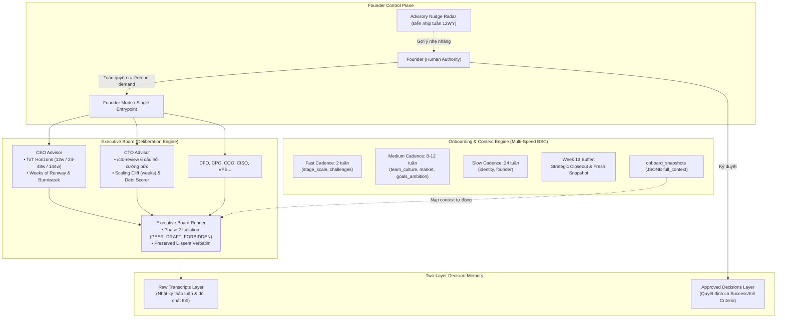

# Kế Hoạch Triển Khai: Virtual C-Suite Agent Architecture (12WY & Founder-Driven)

**Ngày lập:** 2026-09-18  
**Tài liệu tham chiếu:** 
- [`docs/cosa.md`](file:///Volumes/SSD/javis-saas/docs/cosa.md)  
- [`skillpacks/operations/twelve-week-year/SKILL.md`](file:///Volumes/SSD/javis-saas/skillpacks/operations/twelve-week-year/SKILL.md)  
- [`docs/agent/1-ceo.md`](file:///Volumes/SSD/javis-saas/docs/agent/1-ceo.md), [`docs/agent/2-cto.md`](file:///Volumes/SSD/javis-saas/docs/agent/2-cto.md)  
- [`c-level-agents`](https://github.com/alirezarezvani/claude-skills/tree/main/c-level-agents) & [`c-level-advisor`](https://github.com/alirezarezvani/claude-skills/tree/main/c-level-advisor)  
**Trạng thái:** Đã lưu vào dự án — Chờ Founder kích hoạt các đợt thực thi  

---

## 1. Tóm Tắt Mục Tiêu & Triết Lý Cốt Lõi

Kế hoạch này tích hợp các mô hình thực hành tốt nhất từ Virtual C-Suite (`c-level-agents` và `c-level-advisor`) vào hệ thống Agent của **COSA (javis-saas)**, bảo đảm tuyệt đối 2 nguyên lý nền tảng:

1. **Founder Sovereignty (Chủ quyền tối cao của Nhà sáng lập):**
   - **Nhịp độ (Cadence) chỉ là Khuyến nghị (Advisory Baseline / Contextual Nudge):** Hệ thống không tự động ép buộc hay khóa quyền thao tác của Founder khi dữ liệu quá hạn.
   - **Founder toàn quyền quyết định:** Kích hoạt phân tích bất kỳ lúc nào (*On-demand*), chấp nhận đề xuất, tạm hoãn (*Snooze $N$ tuần*), hoặc bỏ qua (*Ignore*) để dồn lực vào sprint thực thi.
   - **Non-blocking with Evidence Tagging:** Nếu Founder tiến hành họp Hội đồng hoặc tạo Goal trên dữ liệu cũ, Agent vẫn phục vụ bình thường nhưng gắn nhãn minh bạch: `🟡 Assumed from Snapshot W{X}`.

2. **Quy Chuẩn Thời Gian theo 12 Week Year (12WY Standard):**
   - Không dùng mốc "tháng" hay "quý 3 tháng" cố định.
   - Mọi chu kỳ chiến lược, mục tiêu, runway và kỳ hạn phân tích đều được quy đổi sang **Số Tuần ($W$)**:
     - Chu kỳ thực thi cốt lõi: **12 tuần**.
     - Tuần đệm chiến lược & Closeout: **Tuần 13**.
     - Nhịp sprint kiểm tra số liệu: **2 tuần**.

---

## 2. Bản Đồ Kiến Trúc Hệ Thống

---

## 3. Phân Rã Chi Tiết Các Hợp Phần

---

### Hợp Phần 1: Onboarding Đa Nhịp Độ & Hướng Sự Kiện (`apps/cosa` + `services/company`)

- **Chuẩn hóa Nhịp Tuần 12WY**:
  - **Fast (2 tuần ~ 1 Bi-weekly Sprint)**: `stage_scale` (doanh thu ARR, cash on hand, runway theo tuần, biến động headcount), `challenges` (vấn đề cấp bách nhất, quyết định né tránh).
  - **Medium (8 – 12 tuần ~ 1 Chu kỳ 12WY)**: `team_culture` (thay đổi lãnh đạo, xung đột), `market` (động thái đối thủ), `goals_ambition` (mục tiêu chu kỳ).
  - **Slow (24 tuần ~ 2 Chu kỳ 12WY)**: `identity` (sứ mệnh, giá trị có thể sa thải), `founder` (profile, điểm mù).
  - **Week 13 Buffer**: Tuần đệm tổng kết, tự động nhắc nhở rà soát bối cảnh toàn diện để đóng băng Snapshot mới cho chu kỳ 12WY tiếp theo.

- **Hai Chế Độ Phiên Hội Thoại**:
  1. **Full Onboard Interview (`session_type = 'initial'`)**: Khảo sát sâu 7 chiều khi khởi tạo workspace mới.
  2. **Micro-Intake (`session_type = 'partial_update'`)**: Phỏng vấn nhanh 2 phút khi Founder đồng ý cập nhật chiều Fast.

- **Event-Driven Auto-Prompting**:
  - Khi hội thoại của Founder xuất hiện tín hiệu biến động lớn (vừa gọi vốn, vừa tuyển/sa thải nhân sự chủ chốt, đối thủ tung tính năng mới), Agent nhận diện và chủ động hỏi Founder có muốn lưu snapshot mới hay không.

---

### Hợp Phần 2: Nâng Cấp CEO Advisor (`skillpacks/executive/ceo-advisor` + `packages/agent`)

- **Định vị Persona & Bookended Voice**:
  - **Mở đầu**: *"Câu hỏi chiến lược mà chúng ta thực sự cần trả lời ở đây là gì?"*
  - **Bộ câu hỏi cưỡng bức**:
    - *"Chúng ta đang đứng ở đâu so với tầm nhìn 144 tuần?"*
    - *"Số tuần runway sinh tồn còn lại là bao nhiêu ở mức burn/tuần hiện tại?"*
    - *"Đâu là sự đánh đổi phân bổ vốn lớn nhất trong chu kỳ 12 tuần này?"*
  - **Kết luận**: *"Việc của CEO là đưa ra câu trả lời dứt khoát cho các câu hỏi khó. Hãy chọn phương án đi."*

- **Kỹ Thuật Suy Luận Tree of Thought (ToT)**:
  - Khảo sát tối thiểu 3 nhánh tương lai (Upside, Downside, Reversibility, Second-order effects).
  - 3 tầng tầm nhìn theo tuần:
    - *Tactical*: 12 tuần (Chu kỳ 12WY hiện tại).
    - *Strategic*: 24 – 48 tuần (2 – 4 chu kỳ 12WY).
    - *Vision*: 144 tuần (~3 năm dương lịch).

- **Công Cụ Tính Toán Định Lượng (Python Analyzers)**:
  - `calculate_weeks_of_runway(cash, burn_per_week)`: Đo lường chính xác số tuần sống sót và điểm gãy gọi vốn.
  - `model_financial_scenarios(base, bull, bear)`: Mô hình hóa dòng tiền và năng lực tài chính chu kỳ 12 tuần.
  - `score_strategic_options(options, weights)`: Ma trận chấm điểm quyết định chiến lược Go/No-Go.

---

### Hợp Phần 3: Nâng Cấp CTO Advisor (`skillpacks/executive/cto-advisor` + `packages/agent`)

- **Định vị Persona & Bookended Voice**:
  - **Mở đầu**: *"Quyết định kiến trúc nào đang dẫn dắt cuộc thảo luận này?"*
  - **Bộ 6 câu hỏi cưỡng bức (/cto-review)**:
    1. *Scaling Cliff theo số tuần ($W$)*: Hệ thống sẽ gãy ở ngưỡng nào, sau bao nhiêu tuần nữa?
    2. *Nợ kỹ thuật*: Món nợ lớn nhất tiêu tốn bao nhiêu giờ kỹ sư/tuần?
    3. *Team Scaling*: Tốc độ hòa nhập của nhân sự mới theo tuần (W1 PR, W4 độc lập, W12 full capacity).
    4. *Build vs Buy*: Tính tổng chi phí sở hữu (TCO) trong 144 tuần. Mặc định là BUY trừ khi là Core Moat.
    5. *SLOs*: Ngân sách lỗi đang bị đốt với tốc độ bao nhiêu % mỗi tuần?
    6. *Bảo mật & Cố vấn CISO*: CISO đã ký duyệt rủi ro bề mặt tấn công chưa?
  - **Kết luận**: *"CTO là người phiên dịch giữa kinh doanh và kỹ thuật. Hãy chọn kiến trúc khớp với tầm nhìn kinh doanh, chứ đừng chọn theo sự phấn khích công nghệ của kỹ sư."*

- **Phân Định Trách Nhiệm Rạch Ròi**:
  - **CTO Advisor**: Kiến trúc nền tảng, chiến lược công nghệ dài hạn, Build vs Buy, và TCO 144 tuần.
  - **VPE Advisor**: Thông lượng giao hàng, quy trình sprint tuần, và các chỉ số DORA metrics.

- **Công Cụ Tính Toán Định Lượng (Python Analyzers)**:
  - `calculate_tech_debt_priority(severity, blast_radius, cost_to_fix_days)`: Áp dụng công thức:
    $$\text{Priority Score} = \frac{\text{Severity} \times \text{Blast Radius}}{\text{Cost-to-fix}}$$
  - `calculate_team_scaling_model(current_team, target_team, ramp_weeks)`: Tính toán ngân sách và điểm hòa vốn năng suất kỹ thuật.

---

### Hợp Phần 4: Hội Đồng Quản Trị & Bộ Nhớ Quyết Định 2 Lớp (`packages/agent/executive_board`)

- **Quy Trình Họp 6 Pha với Cách Ly Nhận Thức (Phase 2 Isolation)**:
  1. *Pha 1 — Briefing*: Nạp đề xuất và snapshot `v_current_company_context`.
  2. *Pha 2 — Independent Thinking (Isolation)*: Từng C-Level phân tích độc lập. Engine thực thi kiểm tra nghiêm ngặt `PEER_DRAFT_FORBIDDEN`.
  3. *Pha 3 — Cross-Examination*: Đối chất chéo giữa các vai trò (CFO soi bài toán dòng tiền, CTO soi khả năng chịu tải, CISO soi rủi ro...).
  4. *Pha 4 — Devil's Advocate*: Cố vấn đóng vai phản biện gay gắt để lật ngược vấn đề.
  5. *Pha 5 — Synthesis & Preserved Dissent*: Chief of Staff tổng hợp ý kiến số đông, **ghi nhận nguyên văn ý kiến bảo lưu bất đồng** của bên phản đối.
  6. *Pha 6 — Founder Hand-off*: Trình biên bản lên Founder.

- **Cơ Chế Bộ Nhớ 2 Lớp (Two-Layer Memory)**:
  - **Tầng 1 (Raw Transcripts)**: Toàn bộ nhật ký tranh luận, đối chất thô được lưu vào lịch sử để kiểm toán, không tự động inject vào prompt tương lai để tránh ô nhiễm context.
  - **Tầng 2 (Approved Decisions)**: Chỉ lưu trữ các quyết định đã có chữ ký phê duyệt của Founder, bao gồm:
    - *Phương án được chọn & Lý do loại bỏ các phương án khác*.
    - *Success Criteria (Ràng buộc)*: Chỉ số đo lường thành công sau $N$ tuần.
    - *Kill Criteria (Ràng buộc)*: Ngưỡng kích hoạt hủy bỏ hoặc xoay trục nếu thất bại.
    - *Preserved Dissent*: Ý kiến cảnh báo ban đầu để đối chiếu khi xảy ra sự cố (Post-mortem).

---

## 4. Danh Mục Files Sẽ Tác Động Khi Triển Khai

| Thao Tác | Đường Dẫn File | Mục Đích |
| :--- | :--- | :--- |
| **[MODIFY]** | [`apps/cosa/capabilities/startup_os_onboard.py`](file:///Volumes/SSD/javis-saas/apps/cosa/capabilities/startup_os_onboard.py) | Thêm tham số `snooze_weeks` và hỗ trợ Freshness Score theo tuần. |
| **[NEW]** | `apps/cosa/workflows/conversational_onboarding.py` | Workflow đối thoại phỏng vấn Full Setup và Micro-Intake 2 phút. |
| **[MODIFY]** | [`skillpacks/executive/ceo-advisor/SKILL.md`](file:///Volumes/SSD/javis-saas/skillpacks/executive/ceo-advisor/SKILL.md) | Inject Bookended Voice, câu hỏi cưỡng bức và ToT theo tuần 12WY. |
| **[MODIFY]** | [`skillpacks/executive/cto-advisor/SKILL.md`](file:///Volumes/SSD/javis-saas/skillpacks/executive/cto-advisor/SKILL.md) | Inject Bookended Voice, bộ 6 câu hỏi `/cto-review`, và ranh giới với VPE. |
| **[MODIFY]** | [`packages/agent/executive_board/analyzers.py`](file:///Volumes/SSD/javis-saas/packages/agent/executive_board/analyzers.py) | Bổ sung hàm tính Runway theo tuần, Debt Scorer, và Team Scaling. |
| **[MODIFY]** | [`packages/agent/executive_board/models.py`](file:///Volumes/SSD/javis-saas/packages/agent/executive_board/models.py) | Bổ sung model cho `PreservedDissent` và `BindingDecisionRecord`. |
| **[MODIFY]** | [`packages/agent/executive_board/runner.py`](file:///Volumes/SSD/javis-saas/packages/agent/executive_board/runner.py) | Hoàn thiện luồng tổng hợp Boardroom 6 pha kế thừa Phase 2 Isolation. |

---

## 5. Kế Hoạch Kiểm Thử & Nghiệm Thu (Verification Plan)

### Kiểm Thử Tự Động (Automated Tests)
- `tests/agent/executive_board/test_ceo_advisor_and_analyzers.py`: Test tính toán Runway theo tuần, kịch bản burn rate.
- `tests/agent/executive_board/test_cto_advisor_and_analyzers.py`: Test công thức chấm điểm nợ kỹ thuật và scaling cliff.
- `tests/agent/executive_board/test_executive_isolation.py`: Xác minh chặn lỗi `PEER_DRAFT_FORBIDDEN` khi có rò rỉ ý kiến độc lập.
- `tests/agent/capabilities/test_onboard_cadence_advisory.py`: Xác minh tính non-blocking và hỗ trợ snooze theo tuần.

### Kiểm Thử Nghiệp Vụ (Manual Checks)
1. Thử nghiệm một phiên Micro-Intake 2 phút cập nhật nhanh 2 chiều Fast.
2. Thử nghiệm phiên `/cto-review` trên một đề xuất kỹ thuật với đầy đủ 6 câu hỏi cưỡng bức.
3. Thử nghiệm một phiên họp Boardroom giả lập có ý kiến bất đồng được ghi nhận vào `Preserved Dissent`.
