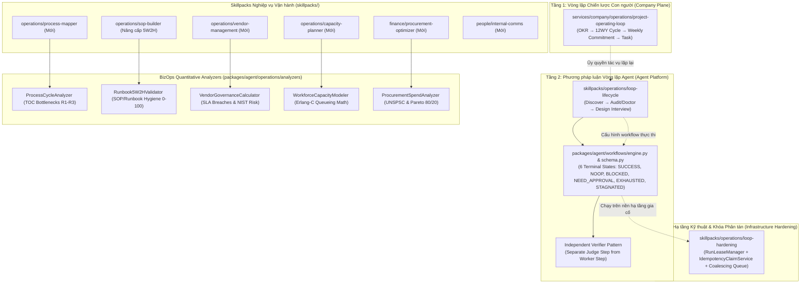

# Kế Hoạch Triển Khai: Tích Hợp Business Operations & Loop Lifecycle vào COSA

**Ngày lập:** 2026-09-19  
**Tài liệu tham chiếu:**  
- [`docs/cosa.md`](file:///Volumes/SSD/javis-saas/docs/cosa.md)  
- [`CLAUDE.md`](file:///Volumes/SSD/javis-saas/CLAUDE.md)  
- [`skillpacks/operations/loop-hardening/SKILL.md`](file:///Volumes/SSD/javis-saas/skillpacks/operations/loop-hardening/SKILL.md)  
- [`skillpacks/operations/sop-builder/SKILL.md`](file:///Volumes/SSD/javis-saas/skillpacks/operations/sop-builder/SKILL.md)  
- [`alirezarezvani/claude-skills/business-operations`](https://github.com/alirezarezvani/claude-skills/tree/main/business-operations) (v2.8.0)  
- [`alirezarezvani/claude-skills/loop-library`](https://github.com/alirezarezvani/claude-skills/tree/main/loop-library)  
**Trạng thái:** Dự thảo kế hoạch — Chờ Founder duyệt trước khi thực thi

---

## 1. Mục Tiêu & Ranh Giới Thiết Kế

Kế hoạch này tích hợp các mô hình thực hành tốt nhất từ `business-operations` và `loop-library` vào hệ thống **COSA (javis-saas)**, giải quyết triệt để 2 khoảng trống lớn:
1. **Khoảng trống định lượng Vận hành (BizOps Quantitative Gap):** Bổ sung các thuật toán tất định (Theory of Constraints, 5W2H, Erlang-C, NIST SP 800-161, UNSPSC) vào `packages/agent` và hệ thống skillpack nghiệp vụ.
2. **Khoảng trống phương pháp luận Vòng lặp (Loop Methodology Gap):** Tách bạch rõ 3 tầng vòng lặp (Chiến lược con người 12WY, Phương pháp luận phản hồi Agent, và Hạ tầng khóa phân tán Hardening), bổ sung 6 Terminal States chuẩn và cơ chế Thẩm định độc lập (Independent Verifier).

### Nguyên Tắc Bắt Buộc:
- **100% Python Standard Library:** Không thêm external package vào `requirements.txt`.
- **Business Truth thuộc `services/*` (Encore.ts):** Mọi thao tác đọc/ghi dữ liệu thực tế phải qua Capability Gateway hoặc Service RPC; LLM không tự ý quyết định ghi DB trực tiếp.
- **Quy chuẩn 10 mục Skillpack:** Mọi skillpack mới/nâng cấp đều có `manifest.yaml`, `SKILL.md` tiếng Việt 10 mục, và `evals/<domain>/<name>.yaml`.
- **Founder Sovereignty & 12WY:** Nhịp độ rà soát vận hành đồng bộ theo 12 tuần ($W1 \rightarrow W12$ và Tuần 13 buffer), cảnh báo mang tính khuyến nghị (Advisory Baseline), không chặn quyền thao tác của Founder.

---

## 2. Bản Đồ Kiến Trúc Sau Tích Hợp



---

## 3. Các Hợp Phần Triển Khai Chi Tiết

---

### HỢP PHẦN 1: Module Phân Tích Định Lượng (`packages/agent/operations/analyzers/`)

Xây dựng module thuần Python stdlib chứa các công cụ toán học và logic tất định:

1. **`process_cycle_analyzer.py`**:
   - Tách thời gian chu kỳ thành: `value_add_time`, `wait_time`, `rework_time`.
   - Áp dụng 3 quy tắc chẩn đoán điểm nghẽn theo Theory of Constraints:
     - **R1 (Stage bottleneck)**: P50 thời gian công đoạn $> 2\times$ trung bình các công đoạn tạo giá trị.
     - **R2 (Handoff bottleneck)**: Thời gian chờ $> 40\%$ tổng chu kỳ (cho phép hiệu chỉnh theo profile: saas, services, manufacturing).
     - **R3 (Quality bottleneck)**: Tỷ lệ làm lại $> 15\%$ tổng chu kỳ.
   - Trả về danh sách điểm nghẽn xếp hạng theo mức độ nghiêm trọng kèm khuyến nghị khắc phục.

2. **`runbook_5w2h_validator.py`**:
   - Kiểm định tài liệu SOP và Runbook (định dạng Markdown hoặc cấu trúc JSON) theo 6 tiêu chí bắt buộc:
     1. `named_owner`: Phải có người/chức danh chịu trách nhiệm cụ thể, cấm từ mơ hồ ("team", "ops").
     2. `expected_duration`: Có thời gian dự kiến cụ thể.
     3. `success_signal`: Tín hiệu thành công quan sát/đo lường được.
     4. `failure_signal`: Tín hiệu thất bại/cảnh báo dừng.
     5. `rollback_path`: Quy trình hoàn tác rõ ràng (hoặc chỉ định rõ không thể rollback).
     6. `escalation_contact`: Người/kênh liên hệ khẩn cấp khi thất bại.
   - Chấm điểm vệ sinh tài liệu (0 - 100) và xếp loại: `SAFE-TO-USE` ($\ge 80$), `USE-WITH-CAUTION` ($60-79$), `NOT-SAFE` ($<60$).

3. **`vendor_governance_calculator.py`**:
   - Chấm điểm nhà cung cấp đa tiêu chí có trọng số (Delivery, Quality, Security, Support).
   - Giám sát vi phạm SLA: Tính số phút vi phạm downtime/MTTR và tính toán khoản bồi hoàn dịch vụ (Service Credits) tự động.
   - Phân loại rủi ro chuỗi cung ứng theo tiêu chuẩn NIST SP 800-161 & ISO 27036 (Tier 1 Critical, Tier 2 High, Tier 3 Medium/Low).

4. **`workforce_capacity_modeler.py`**:
   - Giải thuật hàng đợi **Erlang-C**: Đầu vào gồm tốc độ yêu cầu đến ($\lambda$), thời gian xử lý trung bình ($AHT$), mục tiêu SLA (ví dụ: $80\%$ phản hồi trong $300$ giây) $\rightarrow$ Tính số lượng nhân sự trực tiếp cần thiết ($N$), xác suất phải chờ $P(W>0)$, và tỷ lệ khai thác ($Utilization$).
   - Cảnh báo nguy cơ kiệt sức (Burnout Alert) khi tỷ lệ khai thác vượt $85\%$.
   - Tính toán chuỗi tuyển dụng (Hiring Sequencer) khớp với các sprint của chu kỳ 12 tuần.

5. **`procurement_spend_analyzer.py`**:
   - Phân loại chi tiêu theo bảng mã chuẩn quốc tế UNSPSC (phần mềm, hạ tầng, dịch vụ).
   - Phân tích Pareto 80/20: Xác định $20\%$ danh mục ngốn $80\%$ ngân sách.
   - Phát hiện công cụ dư thừa (Duplicate tool detector) và lập đề xuất gom nhà cung cấp (Consolidation Plan) kèm điều kiện an toàn: Cấm cắt giảm xuống single-source ở Tier-1 nếu chưa có Break-glass contingency plan.

*Kiểm thử đơn vị tương ứng:* `tests/agent/operations/test_analyzers.py`.

---

### HỢP PHẦN 2: Bổ Sung & Nâng Cấp Skillpacks Nghiệp Vụ Vận Hành

Toàn bộ các skillpack được định nghĩa theo chuẩn 10 mục của COSA và có file cấu hình đánh giá (eval suite) tương ứng:

1. **Nâng cấp `skillpacks/operations/sop-builder`**:
   - Chuyển đổi từ file 49 dòng sơ khai thành tài liệu chuẩn 10 mục.
   - Bắt buộc kiểm tra 6 thuộc tính của `Runbook5W2HValidator` trước khi đề xuất ban hành bản nháp.
   - Cập nhật `evals/operations/sop-builder.yaml`.

2. **Tạo mới `skillpacks/operations/process-mapper`**:
   - Áp dụng Lean Six Sigma & Theory of Constraints để lập bản đồ quy trình công việc tuần.
   - Manifest: `domain: operations`, `category: process`, `autonomy: L1_PROPOSE`.
   - Tạo file `evals/operations/process-mapper.yaml`.

3. **Tạo mới `skillpacks/operations/vendor-management`**:
   - Giám sát scorecard nhà cung cấp, đối soát cam kết SLA, phân loại rủi ro theo NIST SP 800-161.
   - Tạo file `evals/operations/vendor-management.yaml`.

4. **Tạo mới `skillpacks/operations/capacity-planner`**:
   - Định biên nhân sự vận hành / CS theo mô hình Erlang-C, giám sát cảnh báo quá tải đội ngũ.
   - Tạo file `evals/operations/capacity-planner.yaml`.

5. **Tạo mới `skillpacks/finance/procurement-optimizer`**:
   - Rà soát chi phí định kỳ, phân loại UNSPSC, tìm điểm tối ưu hóa SaaS và loại bỏ công cụ trùng lặp.
   - Tạo file `evals/finance/procurement-optimizer.yaml`.

6. **Tạo mới `skillpacks/people/internal-comms`**:
   - Xây dựng thông điệp thay đổi nội bộ theo mô hình ADKAR và Kotter 8-step.
   - Tạo file `evals/people/internal-comms.yaml`.

---

### HỢP PHẦN 3: Phương Pháp Luận Vòng Lặp & Tích Hợp Workflow Engine (`loop-library`)

1. **Tạo mới `skillpacks/operations/loop-lifecycle`**:
   - Cung cấp 5 chế độ: **Discover** (đào bới mã nguồn và nhật ký để tìm quy trình lặp $\ge 2$ lần), **Find** (tra cứu mẫu loop chuẩn), **Audit / Loop Doctor** (kiểm toán sửa lỗi vòng lặp), **Adapt** (điều chỉnh ngưỡng), **Design** (phỏng vấn 5 câu hỏi cốt lõi).
   - Thiết lập chu trình 6 bước: *Quan sát (Observe) $\rightarrow$ Chọn (Choose) $\rightarrow$ Hành động (Act) $\rightarrow$ Thẩm định (Verify) $\rightarrow$ Ghi nhận (Record) $\rightarrow$ Lặp lại hoặc Dừng (Repeat/Stop)*.
   - Tạo file `evals/operations/loop-lifecycle.yaml`.

2. **Cập nhật `packages/agent/workflows/schema.py`**:
   - Bổ sung enum `LoopTerminalState`:
     - `SUCCESS`: Hoàn thành mục tiêu đề ra.
     - `NOOP`: Kiểm tra thấy không có công việc tồn đọng (trạng thái sạch).
     - `BLOCKED`: Tắc nghẽn do thiếu tài nguyên hoặc phụ thuộc ngoài.
     - `NEED_APPROVAL`: Đang dừng tại trạm kiểm soát chờ con người phê duyệt.
     - `EXHAUSTED`: Chạm trần số lượt lặp hoặc ngân sách token/chi phí.
     - `STAGNATED`: Không tạo ra tiến triển đo lường được giữa 2 vòng lặp liên tiếp.
   - Hỗ trợ trường `terminal_state` và hợp đồng thẩm định `verifier_spec` trong `WorkflowState`.

3. **Cập nhật `packages/agent/workflows/automation_blueprints.py`**:
   - Thêm blueprint mới: `operations.loop-doctor` (chuyên rà soát các định nghĩa tự động hóa để phát hiện vòng lặp vô hạn hoặc thiếu điểm dừng).
   - Thêm blueprint mới: `operations.process-bottleneck-audit` (định kỳ chạy `ProcessCycleAnalyzer` rà soát tiến độ task trong project).

---

## 4. Kế Hoạch Xác Minh & Quality Gates

Sau khi triển khai, tiến hành kiểm tra lần lượt qua các chốt kiểm soát tự động của repository:

1. **Kiểm tra hợp đồng Skillpacks:**
   ```bash
   make skillpacks-validate
   ```
   Bảo đảm tất cả các file `manifest.yaml`, `SKILL.md` và `evals/*.yaml` đều vượt qua script kiểm tra contract.

2. **Kiểm thử đơn vị Python:**
   ```bash
   source .venv/bin/activate && pytest tests/agent/operations/test_analyzers.py tests/agent/workflows/test_loop_lifecycle.py -q
   ```
   Đảm bảo 100% test case cho 5 analyzers và workflow schema mới chạy xanh.

3. **Kiểm tra Định dạng & Typecheck:**
   ```bash
   make lint
   make typecheck-py
   ```

4. **Kiểm tra Gate Tổng thể:**
   ```bash
   make boundary-check
   make agent-test
   ```
