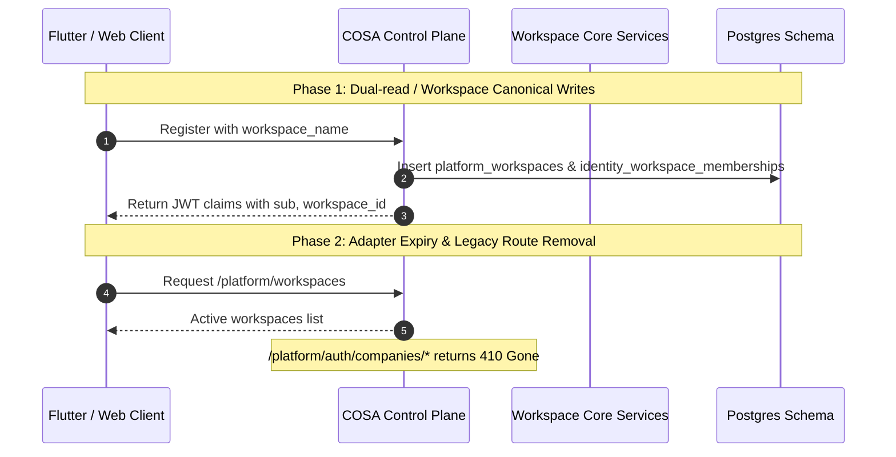

# Workspace-Canonical M2 Cutover Design Specification

**Status:** APPROVED FOR PLANNING  
**Date:** 2026-08-30  
**Author:** Architecture & Security Team  
**Scope:** Elimination of legacy `Company` aggregate across Backend (COSA Control Plane, Company Services), Agent Core, and Flutter Client, migrating permanently to `Workspace` as the sole canonical tenant boundary.

---

## 1. Context & Motivation

During early iterations of Javis SaaS, tenancy was ambiguously split between `company_id` and `workspace_id`. In M0/M1 milestones, ADR-001 established `workspace_id` as the sole cryptographic and data isolation boundary.

However, remnants of the legacy `Company` aggregate still exist in:
1. `services/cosa/handlers/company.handler.ts` & `services/company.service.ts` (`/platform/auth/companies/*`).
2. Registration payload in `auth.service.ts` (`company_name` vs `workspace_name`).
3. Policy snapshot queries (`company_agent_policy` table).
4. Flutter frontend registration views and company switcher widgets.

This design specifies the complete cutover and deprecation roadmap for M2.

---

## 2. Legacy Entity Classification & Mapping

| Legacy Concept / Endpoint / Field | Action | Workspace Canonical Replacement | Deprecation / Removal Milestone |
|---|---|---|---|
| `POST /platform/auth/companies/create` | 410 Gone / Deprecated | `POST /platform/workspaces` | M2 Cutover (Wave 4) |
| `POST /platform/auth/companies/join` | 410 Gone / Deprecated | `POST /platform/workspaces/:id/join` | M2 Cutover (Wave 4) |
| `GET /platform/auth/me/companies` | 410 Gone / Deprecated | `GET /platform/workspaces` | M2 Cutover (Wave 4) |
| `RegisterParams.company_name` | Remove | `RegisterParams.workspace_name` | M2 Cutover (Wave 2) |
| `RegisterParams.join_company_id` | Remove | `RegisterParams.join_workspace_id` | M2 Cutover (Wave 2) |
| `TokenResponse.company_id` | Remove | `TokenResponse.workspace_id` | M2 Cutover (Wave 2) |
| `company_agent_policy` (table) | Drop | `workspace_agent_policy` (table) | M2 Cutover (Wave 1) |
| `companies` / `company_memberships` (tables) | Drop | `platform_workspaces` / `identity_workspace_memberships` | M2 Cutover (Wave 1) |
| `CompanyScopeSwitcher` (Flutter) | Replace | `WorkspaceScopeSwitcher` | M2 Cutover (Wave 3) |
| Counterparty / Vendor "company" references | Valid Keep | Preserved in `finance_legal` & `customer_engagement` | N/A (Business counterparty domain) |

---

## 3. Architecture & Transition Strategy

### 3.1 Expand-Contract Migration Sequence

### 3.2 Security & Tenant Isolation Invariants

1. **Cryptographic Token Claims:** All JWTs issued by platform auth contain `workspace_id` as the tenant claim. `company_id` is completely omitted from claims payload.
2. **Deterministic Foreign Keys:** All entity tables enforce `workspace_id NOT NULL REFERENCES platform_workspaces(id)`.
3. **Negative Isolation Testing:** Every API test suite must include cross-tenant negative assertions (Principal in Workspace A cannot read or modify Workspace B resources).

---

## 4. Rollback Boundaries & Data Safety

- Migration scripts will follow Postgres transactional DDL.
- Backward compatibility adapters will log deprecation warnings for 1 release before returning `410 Gone`.
- A golden-path smoke test verifies all user flows (Register -> Onboard -> Create Project -> Run Strategy Agent -> View Results) using only `workspace_id`.
