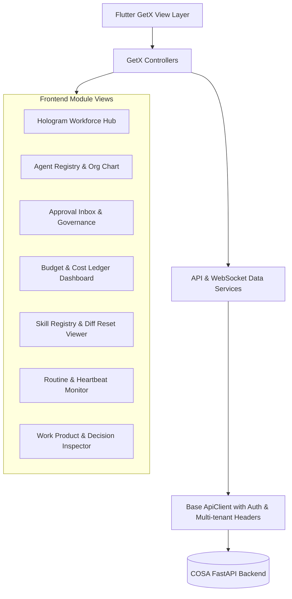

# KẾ HOẠCH TRIỂN KHAI FRONTEND: COSA AGENT WORKFORCE CONTROL PLANE
## Thiết kế giao diện Flutter + GetX đồng bộ từ Phase A đến Phase F (Tham chiếu D3 Paperclip)

- **Trạng thái:** Bản kế hoạch chính thức (Ready for Implementation)
- **Công nghệ UI:** Flutter Desktop / Web + GetX (State Management & Routing) + Custom Theme System
- **Tài liệu tham chiếu:** `markdown/D3-COSA_Paperclip_Agent_Workforce_Integration.md` & `markdown/D3-COSA_Agent_Workforce_Implementation_Plan.md`

---

## 1. KIẾN TRÚC TỔNG THỂ FRONTEND (FLUTTER / GETX ARCHITECTURE)

---

## 2. MA TRẬN ĐỒNG BỘ BACKEND & FRONTEND THEO CÁC PHASE

| Giai đoạn | Trọng tâm Backend | Module Frontend tương ứng (Flutter / GetX) |
| :--- | :--- | :--- |
| **Phase A** | Agent Registry, Runtime Adapters, Task Run Lifecycle, Audit Logs | `lib/modules/agents/`: Agent Cards, Org Chart Tree, Test Run Drawer, Runtime Capability Badges, Run History & Step Trace. |
| **Phase B** | Unified RBAC, 4 Risk Levels, Approval Engine, Budget Hard-stop, Cost Ledger | `lib/modules/approvals/`: Human Approval Inbox (1-click Approve/Reject). `lib/modules/usage/`: Budget Gauges & Cost Ledger Data Table (USD/VND). |
| **Phase C** | Skill Registry (`SKILL.md`), Versioning, Diff Engine, Reset to Default | `lib/modules/skills/`: Skill Catalog, YAML Metadata Editor, Side-by-Side Diff Viewer, 1-Click "Reset to Default" Modal. |
| **Phase D** | Event Bus, Heartbeat Monitor, Routine Scheduler (Cron Asia/HCM) | `lib/modules/hologram_hub/`: Pulse & Live Stream. `lib/modules/workflows/`: Routine Scheduler with Cron Builder & Liveness Indicators. |
| **Phase E** | Secure Workspace, Git Worktree, Work Product Contract, Decision Records | `lib/modules/tasks/`: Work Product Markdown/Diff Viewer with Accept/Revise Actions, Decision Record Timeline (ADR). |
| **Phase F** | Dashboard Summary API, System Health, Multi-tenant Isolation | `lib/modules/dashboard/`: Founder "Company Pulse" (Needs Attention: Approvals, Blocked, Warnings), Cost & ROI Analytics. |

---

## 3. CHI TIẾT KẾ HOẠCH FRONTEND THEO TỪNG GIAI ĐOẠN

---

### PHASE A (Frontend): Agent Workforce Directory, Org Chart & Runtime Inspector

#### 1. Mục tiêu giao diện:
- Hiển thị danh sách 12+ Agent chuẩn hoá với trạng thái thời gian thực (`idle`, `busy`, `paused`, `error`, `offline`).
- Trực quan hoá sơ đồ cây tổ chức (*Org Chart Visualizer*) thể hiện quan hệ báo cáo `reports_to` giữa các Agent và Founder/Human Leads.
- Drawer kiểm thử Agent (*Interactive Test Run*): Cho phép Founder test trực tiếp với prompt mẫu, chọn Model Override và xem kết quả + token cost ngay lập tức.
- Badge hiển thị năng lực Runtime Adapter (`Claude Code`, `DeepSeek R1`, `Gemini Flash`, `Local HTTP`).
- Chi tiết phiên chạy (*Run Detail & Step Timeline*): Xem prompt snapshot, output markdown, latency và các bước `AgentStep`.

#### 2. Các file triển khai / nâng cấp:
- `lib/modules/agents/views/agents_view.dart`: Bổ sung Tab `Danh sách Agent`, Tab `Sơ đồ Org Chart`, và Tab `Lịch sử phiên chạy (Runs)`.
- `lib/modules/agents/views/widgets/agent_card.dart`: Thiết kế thẻ Agent hiện đại kèm Avatar, Department Badge, Model Profile Tag, Trạng thái liveness.
- `lib/modules/agents/views/widgets/agent_org_chart_widget.dart`: Sơ đồ cây phân cấp tương tác phóng to/thu nhỏ, click vào node để xem chi tiết Agent.
- `lib/modules/agents/views/widgets/agent_test_run_drawer.dart`: Drawer trượt phải để test agent với model selector, temperature slider và output console.
- `lib/modules/agents/views/widgets/agent_run_detail_dialog.dart`: Hộp thoại xem chi tiết `AgentRun`, danh sách `AgentStep`, JSON payload và Token Breakdown.
- `lib/modules/agents/controllers/agents_controller.dart`: Quản lý reactive state cho danh sách Agent, Org Chart, Test Run, và Lịch sử Runs.
- `lib/data/services/agents_service.dart`: Gọi API `GET /api/v1/agent-platform/agents`, `GET /org-chart`, `POST /agents/{key}/test-run`, `GET /runtimes`.

---

### PHASE B (Frontend): Approval Inbox, Unified Permissions & Budget Ledger

#### 1. Mục tiêu giao diện:
- **Approval Inbox Center**: Bảng điều khiển tập trung cho Founder duyệt các hành động có rủi ro `HIGH` (gửi Email, gửi Zalo, Publish MXH, Deploy Production) với nút 1-click **Chấp thuận (Approve)** / **Từ chối (Reject)** / **Yêu cầu sửa (Request Revision)**.
- **Budget Control Dashboard**: Đồng hồ đo tỷ lệ chi tiêu ngân sách AI (% Spent) theo Company, Department và Agent kèm cảnh báo màu (Xanh $<80\%$, Vàng $80-99\%$, Đỏ $100\%$ Hard-stop).
- **Cost Ledger Explorer**: Bảng dữ liệu bất biến tra cứu chi phí từng token, chi phí quy đổi USD $\leftrightarrow$ VND (tỷ giá 25,400) lọc theo chu kỳ 12-Week Year.
- **Unified Permission Matrix**: Bảng phân quyền phân tầng ma trận giữa User/Agent với các Resource (`crm.*`, `finance.*`, `email.send`, `prompt.write`).

#### 2. Các file triển khai / nâng cấp:
- `lib/modules/approvals/views/approvals_view.dart`: Giao diện hộp thư duyệt lệnh phân loại theo mức độ rủi ro (`HIGH`, `CRITICAL`).
- `lib/modules/approvals/controllers/approvals_controller.dart`: Xử lý hành động Approve/Reject thời gian thực và tự động refresh list.
- `lib/modules/usage/views/usage_view.dart`: Nâng cấp giao diện biểu đồ chi tiêu AI và bảng kê Cost Ledger.
- `lib/modules/usage/controllers/usage_controller.dart`: Nạp dữ liệu từ `/api/v1/agent-platform/budgets` và `/api/v1/agent-platform/cost-ledger`.
- `lib/data/services/governance_service.dart`: Tích hợp các API Approval, Budget, Cost Ledger và Unified Permissions.

---

### PHASE C (Frontend): Skill Registry, YAML Editor & Diff / Reset to Default

#### 1. Mục tiêu giao diện:
- **Skill Catalog Grid**: Trình duyệt thư viện kỹ năng dạng thẻ phân loại theo phòng ban (`Sales`, `Marketing`, `Finance TT58`, `Legal`, `Engineering`).
- **Markdown & YAML Frontmatter Viewer**: Xem cấu trúc chuẩn của `SKILL.md` (Metadata, Purpose, When to use, Steps, Constraints).
- **Side-by-Side Diff Viewer**: Trực quan hoá sự khác biệt giữa phiên bản tùy chỉnh hiện tại và bản gốc mặc định của hệ thống (*Default System Skill*).
- **1-Click Reset to Default Modal**: Hộp thoại xác nhận khôi phục kỹ năng/prompt về mặc định với cảnh báo an toàn (không ảnh hưởng dữ liệu CRM/Kế toán).

#### 2. Các file triển khai / nâng cấp:
- `lib/modules/skills/views/skills_view.dart`: Giao diện quản lý kỹ năng, bộ lọc phòng ban và tìm kiếm theo từ khoá.
- `lib/modules/skills/views/widgets/skill_diff_dialog.dart`: Widget so sánh trực quan Diff (màu đỏ: dòng xoá, màu xanh: dòng thêm).
- `lib/modules/skills/views/widgets/skill_editor_dialog.dart`: Trình soạn thảo cú pháp Markdown hỗ trợ YAML frontmatter.
- `lib/modules/skills/controllers/skills_controller.dart`: Quản lý danh sách skill, lịch sử phiên bản và logic reset default.

---

### PHASE D (Frontend): Hologram Hub Pulse, Routine Scheduler & Heartbeats

#### 1. Mục tiêu giao diện:
- **Hologram Hub Live Stream**: Giao diện trực quan hoá trung tâm chỉ huy số, biểu diễn các luồng tương tác thời gian thực giữa các Agent qua nhịp tim (*Pulse*).
- **Heartbeat & Liveness Badges**: Đèn tín hiệu trạng thái của từng Agent (`Xanh: Healthy`, `Vàng: Degraded`, `Cam: Stalled`, `Xám: Offline`).
- **Routine Scheduler UI**: Trình lập lịch công việc tự động theo chu kỳ 12-Week Year (vd: Thứ Hai giao việc tuần, Thứ Sáu tổng kết Scoreboard), hỗ trợ cấu hình Cron trực quan theo múi giờ `Asia/Ho_Chi_Minh`.

#### 2. Các file triển khai / nâng cấp:
- `lib/modules/hologram_hub/views/hologram_hub_view.dart`: Tích hợp Live Activity Feed và trạng thái nhịp tim của Workforce.
- `lib/modules/workflows/views/routines_view.dart`: Giao diện danh sách Routine tự động và nút kích hoạt thủ công (*Trigger Now*).
- `lib/modules/workflows/views/widgets/cron_builder_widget.dart`: Bộ chọn lịch định kỳ thân thiện với người dùng (Hàng ngày, Hàng tuần, Hàng tháng).

---

### PHASE E (Frontend): Work Product Inspector, Git Worktrees & Decision Timeline

#### 1. Mục tiêu giao diện:
- **Work Product Delivery Viewer**: Trình xem sản phẩm đầu ra có cấu trúc của Agent (Báo cáo Markdown, Đề xuất chiến dịch, Tài liệu kỹ thuật, Bảng tính).
- **Accept / Request Revision Flow**: Founder có thể chấp thuận nghiệm thu (*Accept*) hoặc nhập phản hồi yêu cầu Agent làm lại (*Request Revision*).
- **Decision Records (ADR) Timeline**: Dòng thời gian hiển thị các quyết định chiến lược/kiến trúc do Agent đề xuất và Founder đã phê duyệt.

#### 2. Các file triển khai / nâng cấp:
- `lib/modules/tasks/views/widgets/work_product_viewer_dialog.dart`: Widget render Markdown và file đính kèm với 2 nút hành động Accept / Revise.
- `lib/modules/tasks/views/widgets/decision_record_timeline.dart`: Trình hiển thị danh sách quyết định theo cấu trúc Context $\rightarrow$ Decision $\rightarrow$ Consequences.

---

### PHASE F (Frontend): Founder Dashboard ("Company Pulse") & Analytics

#### 1. Mục tiêu giao diện:
- **Khu vực Needs Attention**: Widget nổi bật đầu trang hiển thị 3 chỉ số cấp bách:
  - 🔴 Số lượng yêu cầu chờ duyệt (*Pending Approvals*).
  - 🟡 Số lượng tác vụ bị nghẽn (*Blocked Tasks*).
  - 🟠 Cảnh báo ngân sách chạm ngưỡng (*Budget Warnings*).
- **Company Pulse Scoreboard**: Tiến độ OKR tuần hoàn 12-Week Year, doanh thu, dòng tiền và điểm số thực thi của toàn đội ngũ.
- **Cost & ROI Analytics**: Biểu đồ chi phí AI theo ngày/tuần và ước tính giá trị công việc hoàn thành.

#### 2. Các file triển khai / nâng cấp:
- `lib/modules/dashboard/views/dashboard_view.dart`: Bổ sung Card `AI Workforce Pulse` và `Needs Attention Alert Bar`.
- `lib/modules/dashboard/controllers/dashboard_controller.dart`: Nạp dữ liệu tổng hợp từ `/api/v1/agent-platform/dashboard-summary`.

---

## 4. QUY CHUẨN THIẾT KẾ & TRẢI NGHIỆM NGƯỜI DÙNG (DESIGN SYSTEM & UX)

1. **Tone màu & Trực quan:**
   - Dark Mode cao cấp với hiệu ứng Glassmorphism nhẹ, nền xám than (`#0F172A`), viền phát sáng nhẹ cho Agent đang bận (`#3B82F6`).
2. **Trạng thái Agent (State Badges):**
   - 🟢 `IDLE`: Xanh lá nhạt, biểu thị sẵn sàng nhận task.
   - 🔵 `WORKING`: Xanh dương phát sáng kèm animation xoay nhẹ.
   - 🟠 `WAITING_APPROVAL`: Cam hổ phách nhấp nháy, cần Founder xử lý.
   - 🔴 `BLOCKED / BUDGET_EXCEEDED`: Đỏ rực kèm tooltip hướng dẫn.
3. **Tương tác mượt mà (Micro-interactions):**
   - Click vào thẻ Agent mở nhanh Drawer thông tin.
   - Giao task 1-click trực tiếp từ danh mục Weekly Tactics.
   - Duyệt lệnh Approval với hiệu ứng vuốt hoặc phím tắt nhanh (`A: Approve`, `R: Reject`).

---

## 5. KẾ HOẠCH BẮT ĐẦU TRIỂN KHAI FRONTEND (PHASE A FRONTEND TASKS)

- [ ] **FA.1**: Cập nhật `lib/data/services/agents_service.dart` đồng bộ endpoint `/api/v1/agent-platform/agents`, `/org-chart`, `/runtimes`.
- [ ] **FA.2**: Nâng cấp `lib/modules/agents/views/agents_view.dart` tích hợp giao diện 3 Tab: Danh bạ, Sơ đồ Org Chart và Lịch sử Runs.
- [ ] **FA.3**: Xây dựng Widget `AgentCard` hiển thị Model Profile, Avatar, Department và Runtime Badges.
- [ ] **FA.4**: Xây dựng Widget `AgentOrgChartWidget` hiển thị sơ đồ cấp bậc quản trị AI Workforce.
- [ ] **FA.5**: Hoàn thiện Drawer `AgentTestRunDrawer` cho phép Founder test prompt trực tiếp trên UI và xem kết quả tức thì.
