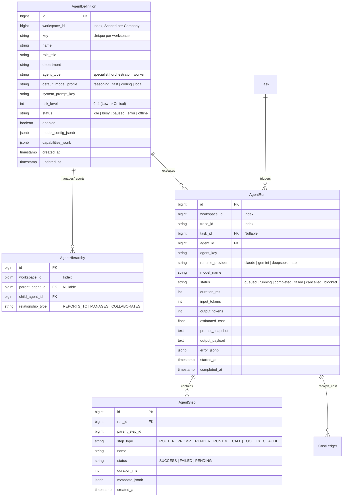
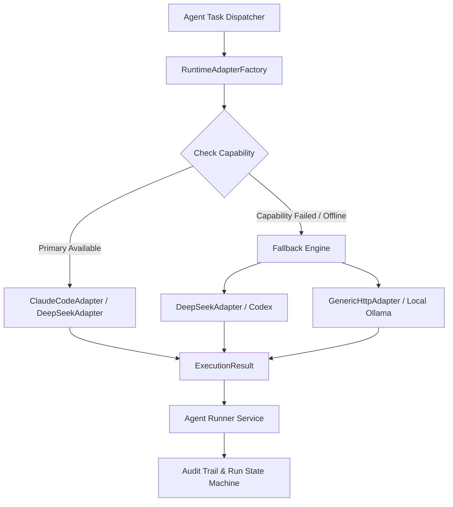
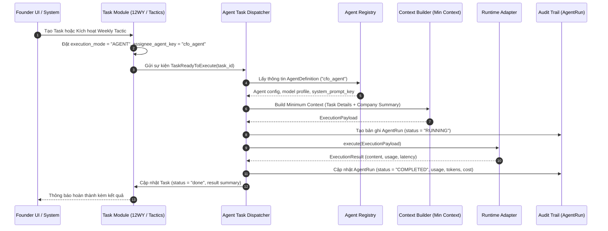

# Kế hoạch Triển khai Chi tiết: Phase A — Core Control Plane (COSA)
## Chuẩn hóa theo tài liệu D3 — Tham chiếu Paperclip Agent Workforce

Tài liệu này đặc tả chi tiết kế hoạch kỹ thuật, kiến trúc mã nguồn, database schema, interface adapters và luồng thực thi cho **Phase A — Core Control Plane** thuộc hệ thống **COSA (Founder Operating System + AI Workforce Control Plane)**.

---

## 1. Mục Tiêu & Tiêu Chí Thành Công (Phase A Objectives)

### 1.1. Mục tiêu cốt lõi
1. **Agent Registry & Org Structure**: Quản lý toàn bộ danh bạ Agent, định danh, role, model profile mặc định, trạng thái hoạt động (`idle`, `busy`, `paused`, `error`, `offline`) và sơ đồ tổ chức cấp bậc (*Org Chart*).
2. **Runtime Adapter Layer**: Xây dựng lớp trừu tượng đa nhà cung cấp (*Model/Provider Agnostic*) cho phép Agent chạy trên Claude Code, Gemini (ADK 2.0), DeepSeek và Generic OpenAI/HTTP Endpoint với 4 phương thức chuẩn (`check_capability`, `execute`, `cancel`, `health`) và cơ chế **Capability Detection & Fallback Chain**.
3. **Task Assignment & Dispatcher Engine**: Kết nối thông suốt giữa các Task từ chu kỳ vận hành doanh nghiệp (Weekly Tactics/12-Week Year) với Agent hoặc Human, quản lý vòng đời chuyển trạng thái tác vụ.
4. **Minimum Required Context Loader**: Chỉ nạp đúng context cần thiết cho task (Task details, Company summary, Project liên quan), tránh dump toàn bộ DB công ty vào context.
5. **Agent Run & Execution Pipeline**: Quản lý phiên chạy (Run Context), thu thập token metrics, duration, output payload, cost ledger và error handler.
6. **Immutable Core Audit Trail**: Ghi nhật ký kiểm toán không thể can thiệp cho mọi lần chạy (trace ID, prompt snapshot, model response, tool invocations).
7. **Company/Workspace Isolation**: Đảm bảo 100% truy vấn và phiên chạy được scoped theo `workspace_id` / `company_id`.

### 1.2. Tiêu chí nghiệm thu (Definition of Done - DoD)
- [ ] CRUD và quản lý Agent đầy đủ qua REST API và SQLAlchemy models.
- [ ] Khởi tạo thành công 12+ Agent chuẩn từ Factory Defaults (Founder Assistant, CFO, CMO, Sales Lead, Legal Officer, Tech Lead, DevOps, Data Analyst, Product Lead, HR...).
- [ ] Hoàn thành 4 Runtime Adapters (`ClaudeCodeAdapter`, `GeminiAdapter`, `DeepSeekAdapter`, `GenericHttpAdapter`) có đầy đủ `check_capability()`, `execute()`, `cancel()`, `health()`.
- [ ] Triển khai cơ chế Fallback tự động khi Runtime chính bị ngắt kết nối hoặc không đủ capabilities.
- [ ] Task gán cho AI Agent được tự động Dispatcher nhận diện, nạp Minimum Context, gọi Runtime tương ứng và cập nhật trạng thái `COMPLETED` kèm `AgentRun` log.
- [ ] Toàn bộ quá trình chạy được lưu vết vào `platform_agent_runs` và `platform_agent_steps` với đầy đủ token metrics.

---

## 2. Thiết Kế Database Schema & Data Models



---

## 3. Kiến Trúc Runtime Adapter Layer & Fallback Engine



### 3.1 Interface Chuẩn `BaseRuntimeAdapter`
```python
# backend/app/agent_platform/adapters/base.py

from abc import ABC, abstractmethod
from dataclasses import dataclass, field
from typing import List, Dict, Any, Optional, AsyncIterator
from enum import Enum

class ModelRole(str, Enum):
    SYSTEM = "system"
    USER = "user"
    ASSISTANT = "assistant"
    TOOL = "tool"

@dataclass
class Message:
    role: ModelRole
    content: str
    name: Optional[str] = None
    tool_call_id: Optional[str] = None
    metadata: Dict[str, Any] = field(default_factory=dict)

@dataclass
class ExecutionPayload:
    trace_id: str
    agent_key: str
    model_name: str
    messages: List[Message]
    temperature: float = 0.2
    max_tokens: int = 4096
    tools_schema: Optional[List[Dict[str, Any]]] = None
    stop_sequences: Optional[List[str]] = None
    extra_params: Dict[str, Any] = field(default_factory=dict)

@dataclass
class TokenUsage:
    prompt_tokens: int = 0
    completion_tokens: int = 0
    total_tokens: int = 0
    cost_usd: float = 0.0

@dataclass
class ExecutionResult:
    trace_id: str
    content: str
    tool_calls: List[Dict[str, Any]] = field(default_factory=list)
    usage: TokenUsage = field(default_factory=TokenUsage)
    finish_reason: str = "stop"  # stop | length | tool_calls | error
    latency_ms: int = 0
    raw_response: Optional[Dict[str, Any]] = None

class BaseRuntimeAdapter(ABC):
    """Abstract Interface chuẩn hóa cho mọi AI Provider trong COSA Control Plane."""

    def __init__(self, api_key: Optional[str] = None, base_url: Optional[str] = None, config: Optional[Dict[str, Any]] = None):
        self.api_key = api_key
        self.base_url = base_url
        self.config = config or {}

    @abstractmethod
    async def check_capability(self) -> Dict[str, Any]:
        """Kiểm tra runtime CLI/API có sẵn sàng, authenticated, hỗ trợ headless/tools."""
        pass

    @abstractmethod
    async def execute(self, payload: ExecutionPayload) -> ExecutionResult:
        """Thực thi một payload hoàn chỉnh và trả về kết quả chuẩn hóa ExecutionResult."""
        pass

    @abstractmethod
    async def cancel(self, run_id: str) -> bool:
        """Hủy phiên thực thi."""
        pass

    @abstractmethod
    async def health(self) -> Dict[str, Any]:
        """Kiểm tra liveness/health của adapter."""
        pass

    @abstractmethod
    def estimate_cost(self, model_name: str, prompt_tokens: int, completion_tokens: int) -> float:
        """Tính toán chi phí USD ước tính."""
        pass
```

---

## 4. Quy Trình Phân Công & Thực Thi Tác Vụ (Task Dispatcher Workflow)



---

## 5. Danh Mục Các Bước Triển Khai Chi Tiết (Execution Roadmap)

### Bước A.1: Database Models & Scoping
- Rà soát các model `AgentDefinition`, `AgentHierarchy`, `AgentRun`, `AgentStep` trong `backend/app/agent_platform/models.py`.
- Bảo đảm 100% queries có mệnh đề `WHERE workspace_id = :workspace_id`.

### Bước A.2: Factory Defaults & Registry Service
- Cập nhật catalog 12 Agents chuẩn trong `backend/app/agent_platform/registry/defaults.py`.
- Bổ sung methods quản lý Org Chart, gán quan hệ phân cấp cấp trên/cấp dưới.

### Bước A.3: Runtime Adapter Layer & Fallback Engine
- Cập nhật `BaseRuntimeAdapter` bổ sung `check_capability()`, `cancel()`, `health()`.
- Cập nhật các adapter: `ClaudeCodeAdapter`, `DeepSeekAdapter`, `GeminiAdapter`, `GenericHttpAdapter`.
- Bổ sung logic Fallback Chain trong `RuntimeAdapterFactory`.

### Bước A.4: Context Builder & Task Dispatcher
- Cập nhật `AgentContextBuilder` để chỉ nạp Minimum Required Context.
- Hoàn thiện `AgentTaskDispatcher` và `AgentRunnerService` với State Machine đầy đủ (`queued`, `running`, `completed`, `failed`, `cancelled`, `blocked`).

### Bước A.5: REST API Endpoints
- `GET /api/v1/agent-platform/agents`: Danh sách Agent.
- `POST /api/v1/agent-platform/agents`: Đăng ký Agent mới.
- `GET /api/v1/agent-platform/agents/{key}`: Chi tiết Agent.
- `PATCH /api/v1/agent-platform/agents/{key}`: Cập nhật cấu hình Agent.
- `POST /api/v1/agent-platform/agents/{key}/test-run`: Test chạy trực tiếp.
- `GET /api/v1/agent-platform/org-chart`: Lấy sơ đồ cây phân cấp.
- `GET /api/v1/agent-platform/runs`: Lịch sử các lần chạy.
- `GET /api/v1/agent-platform/runtimes/capabilities`: Trạng thái và năng lực các adapters.

### Bước A.6: Test Suite Toàn Diện Cho Phase A
- Chạy test suite `backend/app/tests/agent_platform/test_cosa_phase_a_control_plane.py`.
- Kiểm thử các ca: Adapter factory, Capability detection, Fallback switching, Tenant isolation, Task Dispatching, Run Lifecycle state machine.
