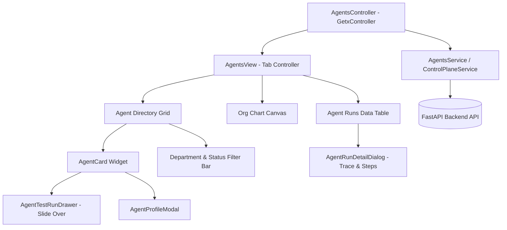

# Kế Hoạch Triển Khai Chi Tiết: Phase A Frontend — Agent Workforce Control Plane
## Module Giao Diện: Quản Trị Danh Bạ Agent, Sơ Đồ Cây Org Chart & Trình Kiểm Thử Runtime (Flutter + GetX)

- **Trạng thái:** Bản kế hoạch chi tiết (Ready for Implementation)
- **Công nghệ UI:** Flutter Desktop / Web + GetX (State Management & Reactive Binding)
- **Tài liệu tham chiếu:** `markdown/D3-COSA_Paperclip_Agent_Workforce_Integration.md` & `markdown/COSA_Phase_A_Detailed_Plan.md`

---

## 1. MỤC TIÊU & PHẠM VI (PHASE A FRONTEND OBJECTIVES)

Giao diện **Phase A Frontend** tập trung hoàn thiện khu vực quản trị trung tâm của đội ngũ AI Workforce (`lib/modules/agents/`), bao gồm 3 phân hệ chính:

```
┌─────────────────────────────────────────────────────────────────────────────┐
│                          COSA AGENTS WORKFORCE UI                           │
├──────────────────────────┬────────────────────────────┬─────────────────────┤
│  TAB 1: DANH BẠ AGENT    │  TAB 2: SƠ ĐỒ ORG CHART    │  TAB 3: PHIÊN CHẠY  │
│  (Registry & Directory)  │  (Hierarchical Tree View)  │  (Runs & Traces)    │
└──────────────────────────┴────────────────────────────┴─────────────────────┘
```

1. **Tab 1: Danh bạ Agent (Agent Directory & Cards)**:
   - Hiển thị danh sách 12+ Agent cốt lõi theo dạng thẻ (Card Grid) hoặc Danh sách (List View).
   - Bộ lọc đa năng: Theo phòng ban (`All`, `Leadership`, `Finance`, `Marketing`, `Sales`, `Tech`, `Legal`, `Operations`), theo trạng thái (`All`, `Active`, `Busy`, `Paused`).
   - Thẻ Agent (`AgentCard`) hiển thị đầy đủ: Avatar, Role Title, Department, Model Profile (`Reasoning`, `Fast`, `Coding`, `Local`), Runtime Badge (`Claude Code`, `DeepSeek R1`, `Gemini Flash`, `Generic HTTP`), Liveness Status và nút kích hoạt nhanh (*Quick Test Run*).

2. **Tab 2: Sơ Đồ Cây Phân Cấp (Org Chart Visualizer)**:
   - Trực quan hoá sơ đồ cây tổ chức nhân sự số của doanh nghiệp: `Founder ➔ Chief of Staff / Executive Assistant ➔ Department Leads ➔ Specialist Agents`.
   - Quan hệ phân cấp `reports_to` và `MANAGES` thể hiện qua các đường nối động.
   - Hỗ trợ phóng to/thu nhỏ (Zoom & Pan), click vào từng node Agent để xem thông tin chi tiết.

3. **Tab 3: Lịch Sử Phiên Chạy & Step Trace (Runs & Observability)**:
   - Danh sách các phiên chạy `AgentRun` với bộ lọc theo Agent, Trạng thái (`Completed`, `Running`, `Failed`), Thời gian.
   - Bảng chi tiết phiên chạy: Trace ID, Runtime Provider, Input/Output Tokens, Chi phí USD, Thời gian thực thi (Latency).
   - Hộp thoại xem chi tiết (`AgentRunDetailDialog`): Xem Prompt snapshot nạp vào, Output markdown trả về, và từng bước span (`AgentStep`).

4. **Trình Kiểm Thử Trực Tiếp (Interactive Test Run Drawer)**:
   - Drawer trượt từ cạnh phải màn hình khi bấm nút "Test Run" trên thẻ Agent.
   - Cho phép Founder nhập câu lệnh test, chọn Model Override, điều chỉnh Temperature, và xem kết quả thực thi trả về ngay trên giao diện.

---

## 2. KIẾN TRÚC THÀNH PHẦN FRONTEND (FLUTTER COMPONENT ARCHITECTURE)



---

## 3. DANH SÁCH FILE & CHI TIẾT CÁC THÀNH PHẦN CẦN TRIỂN KHAI

### 3.1. Data Service Layer (`lib/data/services/`)
- **`[MODIFY] lib/data/services/agents_service.dart`**:
  - Bổ sung methods kết nối chuẩn hóa với Backend Control Plane:
    - `Future<List<Map<String, dynamic>>> getAgents({String? department, String? status})` $\rightarrow$ gọi `GET /api/v1/agent-platform/agents`
    - `Future<Map<String, dynamic>> getOrgChart()` $\rightarrow$ gọi `GET /api/v1/agent-platform/org-chart`
    - `Future<Map<String, dynamic>> testRunAgent(String key, {required String prompt, String? modelOverride, double temperature})` $\rightarrow$ gọi `POST /api/v1/agent-platform/agents/{key}/test-run`
    - `Future<List<Map<String, dynamic>>> getRuntimes()` $\rightarrow$ gọi `GET /api/v1/agent-platform/runtimes`
    - `Future<Map<String, dynamic>> getRuntimeCapabilities(String adapterKey)` $\rightarrow$ gọi `GET /api/v1/agent-platform/runtimes/{adapterKey}/capabilities`
    - `Future<List<Map<String, dynamic>>> getAgentRuns({String? agentKey, String? status, int limit, int offset})` $\rightarrow$ gọi `GET /api/v1/agent-platform/runs`
    - `Future<Map<String, dynamic>> getAgentRunDetail(int runId)` $\rightarrow$ gọi `GET /api/v1/agent-platform/runs/{runId}`

---

### 3.2. State Management Controller (`lib/modules/agents/controllers/`)
- **`[MODIFY] lib/modules/agents/controllers/agents_controller.dart`**:
  - Quản lý các biến Reactive State (`Rx`):
    - `selectedTab = 0.obs` (0: Danh bạ, 1: Org Chart, 2: Runs)
    - `agents = <Map<String, dynamic>>[].obs` (Danh sách Agent)
    - `filteredAgents = <Map<String, dynamic>>[].obs` (Danh sách sau khi lọc)
    - `selectedDepartment = 'All'.obs`
    - `selectedStatus = 'All'.obs`
    - `orgChartData = <String, dynamic>{}.obs` (Dữ liệu cây phân cấp)
    - `runs = <Map<String, dynamic>>[].obs` (Lịch sử các lần chạy)
    - `selectedRunDetail = Rxn<Map<String, dynamic>>()`
    - `runtimes = <Map<String, dynamic>>[].obs` (Danh sách runtime khả dụng)
    - `isTestingRun = false.obs` (Trạng thái đang test run)
    - `testRunOutput = Rxn<Map<String, dynamic>>()`
  - Methods điều khiển:
    - `loadAgents()`, `loadOrgChart()`, `loadRuns()`, `loadRuntimes()`
    - `filterByDepartment(String dept)`, `filterByStatus(String status)`
    - `executeTestRun(String agentKey, String prompt, ...)`
    - `viewRunDetail(int runId)`

---

### 3.3. Views & Custom Widgets (`lib/modules/agents/views/`)

#### 1. Màn hình chính: `lib/modules/agents/views/agents_view.dart`
- Cấu trúc thanh Header: Tiêu đề "AI Workforce Directory", nút "Làm mới (Refresh)", nút "Thêm Agent", và TabBar (3 Tabs).
- TabView 1: `AgentGridWidget` hiển thị lưới các thẻ `AgentCard`.
- TabView 2: `AgentOrgChartWidget` hiển thị sơ đồ phân cấp.
- TabView 3: `AgentRunsTableWidget` hiển thị bảng lịch sử chạy.

#### 2. Thẻ Agent: `lib/modules/agents/views/widgets/agent_card.dart`
- **Header Thẻ**:
  - Avatar đại diện theo phòng ban với viền phát sáng trạng thái (Xanh: Sẵn sàng, Xanh dương: Đang bận, Cam: Chờ duyệt, Xám: Tạm dừng).
  - Tên Agent (vd: `CFO Agent`, `Founder Copilot`).
  - Role Title (vd: `Chief Financial Officer`).
- **Body Thẻ**:
  - Badge Phòng ban (`Finance`, `Marketing`, `Engineering`,...).
  - Tag Model Profile (`Reasoning - Claude 3.5`, `Fast - Gemini 2.0`, `Deep - DeepSeek R1`).
  - Badge Runtime (`Claude Code`, `DeepSeek API`, `Local HTTP`).
  - Mức độ rủi ro (Risk Level: `R0: Auto` $\rightarrow$ `R4: Critical`).
- **Footer Thẻ**:
  - Nút "Test Run": Mở Drawer kiểm thử nhanh.
  - Nút "Chi tiết (Details)": Mở modal cấu hình Agent.
  - Nút "Tạm dừng (Pause)" / "Kích hoạt (Resume)".

#### 3. Sơ đồ Org Chart: `lib/modules/agents/views/widgets/agent_org_chart_widget.dart`
- Vẽ cấu trúc cây từ `Founder` $\rightarrow$ `Executive Assistant` $\rightarrow$ `Department Leads` $\rightarrow$ `Sub-Agents`.
- Tương tác: Hỗ trợ InteractiveViewer (Pan, Zoom 0.5x $\rightarrow$ 2.0x).
- Mỗi Node trong cây là một Card thu nhỏ có thể click để làm nổi bật nhánh trực thuộc.

#### 4. Drawer Kiểm Thử: `lib/modules/agents/views/widgets/agent_test_run_drawer.dart`
- Drawer trượt mượt mà từ bên phải màn hình (Right Slide Drawer).
- Cấu hình chạy thử:
  - Input Prompt đa dòng (*Multi-line TextArea*).
  - Dropdown chọn Model Override (Tùy chọn: Mặc định, Claude 3.5 Sonnet, DeepSeek R1, Gemini 2.0 Flash).
  - Slider điều chỉnh Temperature ($0.0 \rightarrow 1.0$).
  - Nút "Thực thi (Run Test)" kèm hiệu ứng Loading spinner.
- Khu vực hiển thị kết quả (Result Console):
  - Output Markdown được render đẹp mắt có cú pháp tô màu code.
  - Hộp thông số: Prompt tokens, Completion tokens, Chi phí ước tính (\$USD), Độ trễ (Latency ms).

#### 5. Hộp thoại chi tiết Run: `lib/modules/agents/views/widgets/agent_run_detail_dialog.dart`
- Modal kích thước lớn (Large Dialog) hiển thị toàn bộ dấu vết kiểm toán của một phiên chạy:
  - Thông tin chung: Trace ID, Agent, Runtime, Thời gian bắt đầu, Thời gian hoàn thành, Tổng chi phí.
  - Tab 1: **Prompt Snapshot** (Xem toàn bộ prompt hệ thống và ngữ cảnh nạp vào).
  - Tab 2: **Output Payload** (Nội dung phản hồi hoàn chỉnh).
  - Tab 3: **Step Spans Timeline** (Danh sách các bước `AgentStep` con trong Run: Router, Context Build, Model Call, Tool Exec, Audit).

---

## 4. QUY CHUẨN MÀU SẮC & GIAO DIỆN (DESIGN TOKENS)

| Thành phần | Màu sắc / Mã Hex | Ý nghĩa |
| :--- | :--- | :--- |
| **Nền Canvas (Background)** | `#0F172A` (Slate Dark) | Nền tổng thể tối cao cấp |
| **Thẻ Card & Dialogs** | `#1E293B` (Slate 800) | Thẻ nổi khối có bo góc 12px |
| **Đường viền (Border)** | `#334155` (Slate 700) | Viền mảnh 1px tách biệt khối |
| **Trạng thái IDLE** | `#10B981` (Emerald 500) | Agent sẵn sàng nhận việc |
| **Trạng thái BUSY / RUNNING** | `#3B82F6` (Blue 500) | Agent đang thực thi (kèm viền phát sáng) |
| **Trạng thái WAITING APPROVAL**| `#F59E0B` (Amber 500) | Chờ Founder phê duyệt lệnh |
| **Trạng thái ERROR / BLOCKED** | `#EF4444` (Red 500) | Lỗi hoặc bị chặn ngân sách |
| **Phòng ban Leadership** | `#8B5CF6` (Purple 500) | Founder / Chief of Staff |
| **Phòng ban Finance** | `#059669` (Teal 600) | Kế toán, Dòng tiền TT58 |
| **Phòng ban Tech** | `#2563EB` (Royal Blue) | Tech Lead, DevOps, Sandbox |

---

## 5. KỊCH BẢN KIỂM THỬ GIAO DIỆN (UI VERIFICATION PLAN)

| STT | Kịch bản kiểm thử (Test Case) | Các bước thực hiện trên UI | Kết quả mong đợi (Expected Outcome) |
| :--- | :--- | :--- | :--- |
| **FE-1** | Hiển thị Danh bạ 12 Agent | Mở màn hình `Agents` $\rightarrow$ Tab 1 | 12 thẻ Agent xuất hiện đầy đủ, đúng phòng ban, icon và model tag. |
| **FE-2** | Lọc theo phòng ban | Bấm chọn filter `Finance` | Chỉ hiển thị `CFO Agent` và các agent thuộc phòng Finance. |
| **FE-3** | Kiểm tra sơ đồ Org Chart | Chuyển sang Tab 2 `Org Chart` | Cây sơ đồ tổ chức phân cấp xuất hiện, có thể zoom/pan và click vào từng Node. |
| **FE-4** | Chạy thử nghiệm Test Run | Bấm nút "Test Run" trên thẻ CFO $\rightarrow$ Nhập prompt "Phân tích dòng tiền" $\rightarrow$ Bấm Run | Drawer mở ra, spinner chạy, sau đó trả về nội dung Markdown kèm bảng thống kê Token & Chi phí (\$0.0016). |
| **FE-5** | Xem lịch sử phiên chạy | Chuyển sang Tab 3 `Lịch sử phiên chạy` $\rightarrow$ Bấm vào 1 dòng Run | Mở hộp thoại `AgentRunDetailDialog` hiển thị đúng Trace ID, Prompt snapshot và các bước `AgentStep`. |
| **FE-6** | Responsive Layout | Thu nhỏ/mở rộng cửa sổ Desktop / Web | Giao diện tự động co giãn từ 1 cột (Mobile) sang 3-4 cột (Desktop 4K) mượt mà không bị lỗi overflow pixel. |

---

## 6. KẾ HOẠCH BẮT ĐẦU TRIỂN KHAI THEO THỨ TỰ (EXECUTION CHECKLIST)

```
Bước 1: Nâng cấp AgentsService kết nối các API Agent Platform
   ↓
Bước 2: Nâng cấp AgentsController quản lý Tabs, Filters, Test Run State
   ↓
Bước 3: Xây dựng Widget AgentCard & Bộ lọc đa năng
   ↓
Bước 4: Xây dựng Widget AgentOrgChartWidget (Sơ đồ cây phân cấp)
   ↓
Bước 5: Xây dựng Drawer AgentTestRunDrawer (Kiểm thử trực tiếp trên UI)
   ↓
Bước 6: Xây dựng Dialog AgentRunDetailDialog (Chi tiết phiên chạy & Step Trace)
   ↓
Bước 7: Tích hợp vào AgentsView và kiểm thử E2E trên ứng dụng Flutter
```
