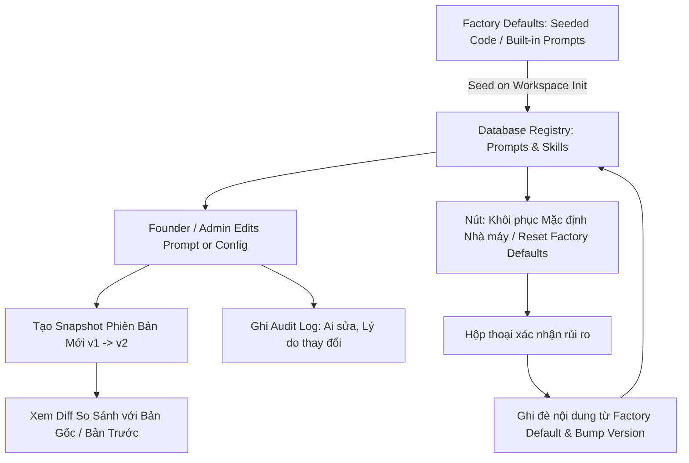

# Kế Hoạch Triển Khai Chi Tiết: Phase C (Backend & Frontend)
## Quản Lý Kỹ Năng (Skill Registry), Kiểm Soát Phiên Bản Prompt (Prompt Versioning) & Khôi Phục Mặc Định (Reset to Factory Defaults)

- **Trạng thái:** Bản kế hoạch chính thức (Ready for Implementation)
- **Tài liệu tham chiếu:** `markdown/D3-COSA_Paperclip_Agent_Workforce_Integration.md` (Mục 11, 20, 21, 22, 50)
- **Phạm vi:** Backend (FastAPI + SQLAlchemy) & Frontend (Flutter + GetX)

---

## 1. NGUYÊN TẮC KIẾN TRÚC & QUY TẮC BẮT BUỘC TRONG PHASE C

### 1.1. Các Quy Tắc Cốt Lõi:
1. **Bảo toàn Factory Defaults**: Mọi Prompt Template và Skill mặc định của hệ thống đều có bản sao gốc tĩnh (`default_content`). Khi người dùng tùy chỉnh, nội dung hiện tại (`content`) thay đổi và `version` tăng lên, nhưng `default_content` luôn giữ nguyên.
2. **Khôi phục 1-Click (Restore to Factory Defaults)**: Cho phép Founder hoàn tác mọi sai sót cấu hình về trạng thái nguyên bản nhà máy bất kỳ lúc nào mà không làm mất lịch sử phiên bản (`PromptVersion` lưu vết).
3. **So sánh Diff Trực quan (Visual Diff Viewer)**: So sánh sự khác biệt từng dòng giữa phiên bản đang chạy và Factory Default (hoặc giữa 2 phiên bản bất kỳ).
4. **Kiểm soát Quyền Sửa Đổi**: Chỉ Founder/Admin mới có quyền sửa đổi Prompt và Skill; Agent bị cấm tự ý sửa đổi code/prompt của chính mình.

---

## 2. THIẾT KẾ BACKEND (FASTAPI + SQLALCHEMY)

### 2.1. Data Models & Services (`backend/app/agent_platform/skills/`)
1. **`SkillVersioningService` (`backend/app/agent_platform/skills/versioning.py`)**:
   - `get_prompt_diff(key, workspace_id, target_version) -> Dict`: Tính toán diff dòng lệnh (additions, deletions, unmodified).
   - `get_tool_versions(tool_id) -> List`: Lấy lịch sử thay đổi của công cụ/kỹ năng.
   - `reset_tool_to_default(key, workspace_id, updated_by) -> ToolDefinition`: Nạp lại `default_content` hoặc default config từ Factory Defaults và ghi nhận phiên bản mới.
2. **`PromptRegistryService` (`backend/app/agent_platform/skills/prompt_registry.py`)**:
   - `get_prompt_content(key, workspace_id)`
   - `update_prompt_content(key, new_content, workspace_id, updated_by, change_note)`
   - `restore_prompt_to_default(key, workspace_id, updated_by)`

### 2.2. REST APIs (`backend/app/agent_platform/api/admin_api.py`)
- `GET /api/v1/agent-platform/prompts/{key}`: Lấy thông tin prompt, phiên bản hiện tại và `default_content`.
- `PUT /api/v1/agent-platform/prompts/{key}`: Cập nhật nội dung prompt & tăng version.
- `GET /api/v1/agent-platform/prompts/{key}/diff`: Lấy diff so sánh giữa bản hiện tại và `default_content` hoặc phiên bản target.
- `GET /api/v1/agent-platform/prompts/{key}/versions`: Danh sách các phiên bản trong quá khứ.
- `GET /api/v1/agent-platform/skills`: Danh sách toàn bộ Skills / Tools được đăng ký.
- `GET /api/v1/agent-platform/skills/{key}/versions`: Lịch sử các phiên bản của Skill.
- `POST /api/v1/agent-platform/skills/{key}/restore-default`: Khôi phục Skill về mặc định ban đầu.

---

## 3. THIẾT KẾ FRONTEND (FLUTTER + GETX)

### 3.1. Phân Hệ Quản Lý Kỹ Năng (`lib/modules/skills/` hoặc tích hợp trong Hub)
- **`skill_registry_service.dart` / `prompt_registry_service.dart`**:
  - `getPrompts()`, `getPromptDetail()`, `updatePrompt()`, `getPromptDiff()`, `getPromptVersions()`.
  - `getSkills()`, `restoreSkillDefault()`.
- **Giao diện Quản Lý Prompt & Visual Diff Dialog**:
  - Trình soạn thảo Prompt có Syntax Highlighting.
  - Hộp thoại Visual Diff chia 2 cột (Bản hiện tại vs. Factory Default) với màu xanh lục (thêm mới) và đỏ (xóa bỏ).
  - Nút 🔄 **"Khôi phục Mặc định (Restore Default)"** với Dialog cảnh báo an toàn.

---

## 4. KẾ HOẠCH TEST SUITE CHO PHASE C

### 4.1. Backend Tests (`backend/app/tests/agent_platform/test_cosa_phase_c_skills_prompts.py`):
1. `test_prompt_creation_and_versioning`: Tạo prompt $\rightarrow$ cập nhật nội dung $\rightarrow$ kiểm tra snapshot phiên bản được lưu và version tăng lên.
2. `test_prompt_diff_generation`: So sánh nội dung cũ và mới, xác nhận diff phát hiện đúng dòng thay đổi.
3. `test_restore_prompt_to_default`: Cập nhật prompt tùy chỉnh $\rightarrow$ gọi restore default $\rightarrow$ nội dung trở về đúng `default_content`.
4. `test_skill_registry_and_restore_default`: Đăng ký tool tùy chỉnh $\rightarrow$ khôi phục mặc định nhà máy thành công.

### 4.2. Frontend Tests:
1. `flutter analyze` xác nhận sạch 100% không có lint/type error.
2. Mở hộp thoại Diff kiểm tra hiển thị đúng các dòng thay đổi.
