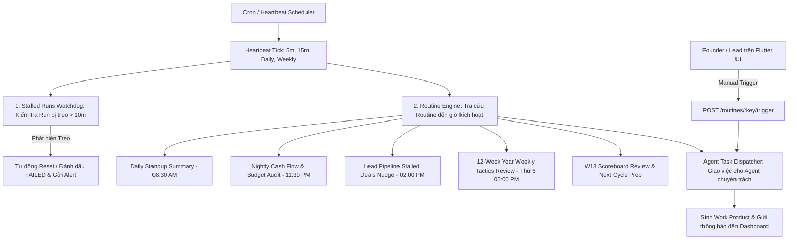

# Kế Hoạch Triển Khai Chi Tiết: Phase D (Backend & Frontend)
## Tự Động Hóa (Automation), Nhịp Tim Tác Vụ (Heartbeats) & Quy Trình Định Kỳ (Agent Routines)

- **Trạng thái:** Bản kế hoạch chính thức (Ready for Implementation)
- **Tài liệu tham chiếu:** `markdown/D3-COSA_Paperclip_Agent_Workforce_Integration.md` (Mục 17, 18, 19, 51)
- **Phạm vi:** Backend (FastAPI + SQLAlchemy) & Frontend (Flutter + GetX)

---

## 1. NGUYÊN TẮC KIẾN TRÚC & QUY TẮC BẮT BUỘC TRONG PHASE D

### 1.1. Các Quy Tắc Cốt Lõi:
1. **Chủ Động Vận Hành (Proactive Execution)**: Workforce không thụ động chờ tin nhắn chat của Founder mà tự giác vận hành theo chu kỳ nhịp tim định sẵn.
2. **Tách Biệt Trò Chuyện Thông Thường (Casual Chat Separation)**: Tin nhắn chào hỏi hoặc trò chuyện vu vơ không kích hoạt chu trình công việc nặng của công ty.
3. **Giám Sát Run Bị Treo (Stalled Run Watchdog)**: Mọi `AgentRun` đang ở trạng thái `RUNNING` quá 10 phút mà không có nhịp tim cập nhật sẽ tự động bị đánh dấu `FAILED` hoặc chuyển sang phục hồi để tránh chiếm dụng quota.
4. **Bộ Danh Mục Quy Trình Định Kỳ (Routine Catalog)**:
   - `daily_standup_summary`: Tóm tắt tiến độ các phòng ban mỗi sáng (08:30).
   - `lead_pipeline_nudge`: Quét các deal bị tồn đọng quá 3 ngày và gợi ý hành động.
   - `nightly_cashflow_reconciliation`: Kiểm toán dòng tiền và ngân sách token cuối ngày.
   - `w12_weekly_tactics_review`: Đánh giá tỷ lệ hoàn thành chiến thuật tuần (Weekly Tactics Execution Score $\ge 85\%$).
   - `w13_scoreboard_eval`: Tổng kết toàn bộ chu kỳ 12-Week Year vào Tuần 13.

---

## 2. THIẾT KẾ BACKEND (FASTAPI + SQLALCHEMY)

### 2.1. Automation Service Layer (`backend/app/agent_platform/automation/`)
1. **`heartbeat_monitor.py` (`HeartbeatMonitorService`)**:
   - `record_heartbeat(agent_key, workspace_id, metadata)`: Ghi nhận liveness của Agent.
   - `list_heartbeats(workspace_id)`: Trả về trạng thái hoạt động của toàn bộ Agent.
   - `check_and_recover_stalled_runs(stalled_timeout_minutes, workspace_id)`: Quét và giải cứu các phiên chạy bị treo.
2. **`routine_service.py` (`RoutineService`)**:
   - `list_routines(workspace_id)`: Danh mục các Routine kèm lịch biểu cron và trạng thái.
   - `trigger_routine(key, workspace_id)`: Kích hoạt thủ công một Routine từ Dashboard hoặc gọi tự động từ Scheduler.
   - `seed_default_routines(workspace_id)`: Khởi tạo các Routine mặc định của chuẩn COSA.

### 2.2. REST APIs (`backend/app/agent_platform/api/admin_api.py`)
- `GET /api/v1/agent-platform/heartbeats`: Lấy danh sách nhịp tim của toàn bộ Agent Workforce.
- `POST /api/v1/agent-platform/heartbeats/check-stalled`: Kích hoạt watchdog thu hồi các phiên chạy bị treo.
- `GET /api/v1/agent-platform/routines`: Danh sách các quy trình tự động định kỳ.
- `POST /api/v1/agent-platform/routines/{key}/trigger`: Kích hoạt thủ công Routine ngay lập tức.

---

## 3. THIẾT KẾ FRONTEND (FLUTTER + GETX)

### 3.1. Phân Hệ Quản Lý Routines & Heartbeat Monitor
- **`agent_platform_service.dart`**:
  - `listHeartbeats()`, `checkStalledRuns()`, `listRoutines()`, `triggerRoutine(key)`.
- **Giao diện Giám Sát Nhịp Tim & Tự Động Hóa**:
  - Thẻ hiển thị các Routine: Tên Routine, Cron Expression, Agent phụ trách, Lần chạy gần nhất, Trạng thái (`ACTIVE`, `PAUSED`).
  - Nút ⚡ **"Chạy Ngay (Run Now)"** để Founder kích hoạt thủ công Routine bất kỳ.
  - Widget hiển thị Liveness Radar của các Agent.

---

## 4. KẾ HOẠCH TEST SUITE CHO PHASE D

### 4.1. Backend Tests (`backend/app/tests/agent_platform/test_cosa_phase_d_automation.py`):
1. `test_heartbeat_recording_and_listing`: Ghi nhận heartbeat và trả về liveness timestamp chính xác.
2. `test_stalled_run_detection_and_recovery`: Tạo Run bị treo > 15 phút $\rightarrow$ watchdog phát hiện và chuyển trạng thái sang `FAILED`.
3. `test_routine_catalog_and_manual_trigger`: Kích hoạt `daily_standup_summary` $\rightarrow$ tạo task và sinh kết quả thành công.

### 4.2. Frontend Tests:
1. `flutter analyze` xác nhận sạch 100% không có lỗi.
