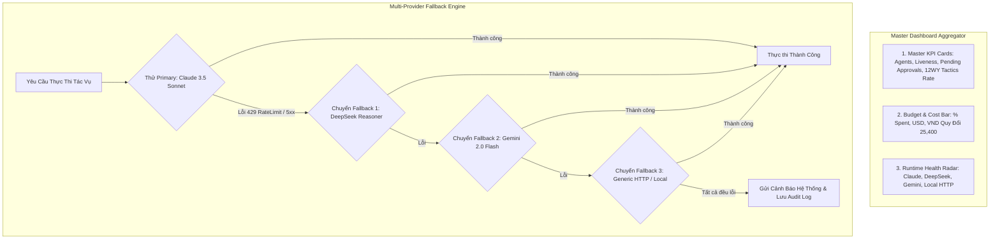

# Kế Hoạch Triển Khai Chi Tiết: Phase F (Backend & Frontend)
## Master Dashboard, Chuỗi Dự Phòng Đa Nhà Cung Cấp (Multi-Provider Fallback) & Kiểm Thử Toàn Trình (End-to-End Verification)

- **Trạng thái:** Bản kế hoạch chính thức (Ready for Implementation)
- **Tài liệu tham chiếu:** `markdown/D3-COSA_Paperclip_Agent_Workforce_Integration.md` (Mục 29, 30, 31, 32, 53)
- **Phạm vi:** Backend (FastAPI + SQLAlchemy) & Frontend (Flutter + GetX)

---

## 1. NGUYÊN TẮC KIẾN TRÚC & QUY TẮC BẮT BUỘC TRONG PHASE F

### 1.1. Các Quy Tắc Cốt Lõi:
1. **Master Control Plane Dashboard**: Cung cấp góc nhìn toàn cảnh (Single Pane of Glass) cho Founder về toàn bộ lực lượng nhân sự số.
2. **Khả Năng Chống Chịu Lỗi Cao (High Resilience & Fallback)**: Tự động chuyển đổi mượt mà giữa các mô hình AI khi một nhà cung cấp gặp sự cố hoặc cạn token quota mà không làm gián đoạn dòng công việc của doanh nghiệp.
3. **Kiểm Thử Toàn Trình E2E (End-to-End Pipeline Integrity)**: Xác thực chuỗi giá trị khép kín từ lúc phát sinh nhiệm vụ đến khi bàn giao sản phẩm và hạch toán chi phí.

---

## 2. THIẾT KẾ BACKEND (FASTAPI + SQLALCHEMY)

### 2.1. Dashboard Service Layer (`backend/app/agent_platform/dashboard_service.py`)
- **`ControlPlaneDashboardService`**:
  - `get_dashboard_summary(workspace_id) -> Dict`:
    - `total_agents`, `active_agents`, `idle_agents`, `paused_agents`.
    - `pending_approvals_count`, `critical_approvals_count`.
    - `budget_total_limit_usd`, `budget_total_spent_usd`, `budget_usage_percent`.
    - `cost_today_usd`, `cost_today_vnd`, `cost_12wy_usd`, `cost_12wy_vnd`.
    - `total_work_products`, `accepted_work_products`, `total_decisions`.
    - `runtimes_health`: Trạng thái sống còn của 4 nhà cung cấp (`claude`, `deepseek`, `gemini`, `http`).

### 2.2. REST APIs (`backend/app/agent_platform/api/admin_api.py`)
- `GET /api/v1/agent-platform/dashboard-summary`: Trả về toàn bộ số liệu thống kê tổng thể Control Plane.
- `GET /api/v1/agent-platform/runtimes`: Danh sách các runtime providers và cấu hình fallback.

---

## 3. THIẾT KẾ FRONTEND (FLUTTER + GETX)

### 3.1. Master Dashboard UI (`agents_view.dart` & `agent_platform_service.dart`)
- **Master KPI Cards**:
  - 🤖 **Nhân Sự Số**: Tổng Agent, Đang chạy (`active`), Chờ lệnh (`idle`).
  - 🛡️ **Cổng Phê Duyệt**: Số phiếu chờ duyệt (kèm badge đỏ nếu có phiếu `CRITICAL`).
  - 💰 **Ngân Sách AI**: Tỷ lệ chi tiêu `% Spent` kèm số tiền USD và VND quy đổi.
  - 📦 **Work Products**: Tổng số sản phẩm bàn giao & Tỷ lệ nghiệm thu.
- **Runtime Providers Health Radar**:
  - 4 badges trạng thái: Claude Code (`Healthy`), DeepSeek (`Healthy`), Gemini 2.0 (`Healthy`), Local HTTP (`Healthy`).

---

## 4. KẾ HOẠCH TEST SUITE CHO PHASE F

### 4.1. Backend Tests (`backend/app/tests/agent_platform/test_cosa_phase_f_e2e_verification.py`):
1. `test_master_dashboard_summary_aggregation`: Kiểm tra tổng hợp số liệu Agent, Budget, Approvals, Work Products và Runtimes.
2. `test_multi_provider_fallback_chain`: Giả lập lỗi Claude 429 $\rightarrow$ tự động chuyển sang DeepSeek và hoàn thành tác vụ.
3. `test_end_to_end_cosa_agent_workforce_pipeline`: Kiểm thử toàn trình 12-bước khép kín.

### 4.2. Frontend Tests:
1. `flutter analyze` xác nhận sạch 100% không có lỗi.
