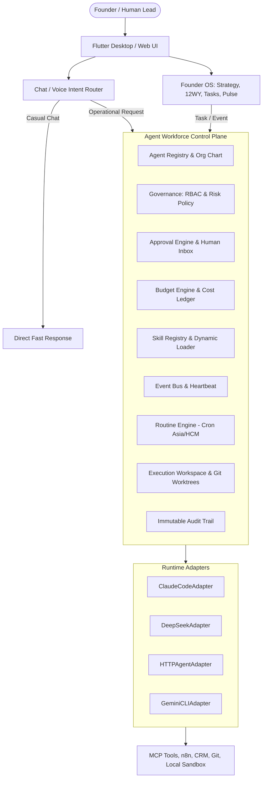

# KẾ HOẠCH TRIỂN KHAI: COSA AGENT WORKFORCE CONTROL PLANE
## Tham chiếu kiến trúc Paperclip — Tối ưu cho COSA Local-First & Private License

- **Trạng thái:** Bản kế hoạch chính thức (Ready for Implementation)
- **Tài liệu nguồn:** `markdown/D3-COSA_Paperclip_Agent_Workforce_Integration.md`
- **Mục tiêu:** Chuẩn hóa lớp quản trị AI Agent của COSA theo mô hình **AI Workforce**, biến COSA thành **Founder & Company Operating System** có năng lực kiểm soát, phân quyền, quản trị ngân sách và thực thi an toàn.

---

## 1. TỔNG QUAN PHÂN TÍCH & NGUYÊN TẮC THIẾT KẾ

### 1.1 Triết lý Cốt Lõi
1. **Founder/Company OS thay vì Chatbot rời rạc:**
   - Mỗi Agent là một thực thể nhân sự AI có danh tính, vai trò, cấp trên/cấp dưới (Org Chart), ngân sách, quyền hạn (RBAC), audit log và không gian làm việc (workspace) độc lập.
2. **Loại bỏ Startup Validation khỏi Core Flow:**
   - Flow cốt lõi của COSA:
     $$\text{Vision} \rightarrow \text{Mission} \rightarrow \text{3 Core Values} \rightarrow \text{Projects} \rightarrow \text{Objectives} \rightarrow \text{OKRs} \rightarrow \text{12 Week Year} \rightarrow \text{Weekly Tactics} \rightarrow \text{Tasks} \rightarrow \text{Execution} \rightarrow \text{Work Product} \rightarrow \text{Review} \rightarrow \text{Week 13 Scoreboard}$$
   - Các khảo sát thị trường, phỏng vấn khách hàng chỉ đóng vai trò là **Evidence / Reference** đính kèm, không phải cổng chặn (validation gate) bắt buộc.
3. **Chat Router & Intent Classification:**
   - Casual chat hoặc lời chào hỏi ("Chào", "Hi") tuyệt đối không tự ý nạp toàn bộ Company Context hoặc kích hoạt pipeline tốn kém.
   - Chỉ khi có `Operational Intent` rõ ràng (vd: "Phân tích OKR", "Giao task Marketing", "Chạy weekly review") thì mới gọi Agent Workforce.
4. **Minimum Required Context:**
   - Chỉ nạp đúng context cần thiết cho từng nhiệm vụ của Agent (không nạp dữ liệu Finance/Legal nhạy cảm cho Sales Agent nếu không được cấp phép).
5. **Human Authority Gate & 4 Mức Độ Rủi Ro:**
   - `LOW`: Tự động chạy (research, summarize, draft, read CRM).
   - `MEDIUM`: Chạy kèm notify/audit log (tạo internal task, update non-critical CRM).
   - `HIGH`: Bắt buộc Founder/Admin duyệt (send Email/Zalo, publish social, deploy prod, modify accounting).
   - `CRITICAL`: Chỉ Founder thao tác (API keys, banking, modify system prompt, spec, policy, license).
6. **Separation of Concerns & Reset to Default:**
   - Tách biệt: **Prompts** (giao tiếp), **Skills** (nghiệp vụ `SKILL.md`), **Policies** (phân quyền/ngân sách), **Specs** (đặc tả hệ thống).
   - Cho phép Admin xem Diff và Reset về bản gốc hệ thống mà không làm mất dữ liệu nghiệp vụ (CRM, Kế toán, Dự án).
7. **Event-Driven First:**
   - *Event-Driven First, Schedule Second, Polling Last*. Đánh thức Agent qua Event Bus, Routine tạo task theo cron `Asia/Ho_Chi_Minh`.

---

## 2. KIẾN TRÚC TỔNG THỂ (SYSTEM ARCHITECTURE)



---

## 3. LỘ TRÌNH TRIỂN KHAI CHI TIẾT THEO GIAI ĐOẠN

```
Phase A (P0): Core Control Plane ──────────┐
Phase B (P1): Governance & Budget ─────────┼──► Core Enterprise Ready
Phase C (P1): Skill Registry & Reset ──────┘
Phase D (P2): Event-Driven & Routine ──────┐
Phase E (P2/P3): Workspace & Security ─────┼──► Full Autonomous Automation
Phase F (P1/P2): Hologram Hub & UX ────────┘
```

---

### PHASE A: Core Control Plane & Runtime Abstraction (Ưu tiên P0)

#### Mục tiêu:
Xây dựng Agent Registry, Runtime Adapter Base, Task Assignment và vòng đời Agent Run có Audit Log đầy đủ.

#### Các hạng mục kỹ thuật:
1. **Data Models (`backend/app/agent_platform/models.py`):**
   - `AgentDefinition`: Quản lý danh tính, phòng ban, role, runtime adapter, config, risk level, status.
   - `AgentHierarchy`: Quản lý cây phân cấp báo cáo (`reports_to`, `MANAGES`, `REPORTS_TO`).
   - `AgentRun`: Theo dõi từng lần thực thi, trace_id, input/output tokens, cost, runtime, status (`queued`, `running`, `completed`, `failed`, `cancelled`, `blocked`).
   - `AgentStep`: Lưu trữ từng bước thực thi span trong mỗi Run.
2. **Runtime Adapter Layer (`backend/app/agent_platform/adapters/`):**
   - Hoàn thiện interface `BaseRuntimeAdapter` với 4 methods:
     - `check_capability() -> dict`
     - `execute(payload) -> ExecutionResult`
     - `cancel(run_id) -> bool`
     - `health() -> dict`
   - Chuẩn hóa Adapter: `ClaudeCodeAdapter`, `DeepSeekAdapter`, `HTTPAgentAdapter`, `GeminiAdapter`.
   - Cơ chế **Capability Detection & Fallback Chain**: Tự động fallback sang secondary adapter nếu primary CLI/API không khả dụng.
3. **Task Assignment & Execution Service:**
   - Cho phép gán task cho `Human` hoặc `Agent`.
   - Dispatcher nhận task, nạp context tối thiểu, gọi Adapter thực thi và lưu kết quả.
4. **API Endpoints:**
   - `GET /api/v1/agents`, `POST /api/v1/agents`, `GET /api/v1/agents/{id}`, `PATCH /api/v1/agents/{id}`
   - `POST /api/v1/agents/{id}/run`, `POST /api/v1/agents/{id}/pause`, `POST /api/v1/agents/{id}/resume`
   - `GET /api/v1/agent-runs`, `GET /api/v1/agent-runs/{id}`
   - `GET /api/v1/runtimes`, `GET /api/v1/runtimes/{adapter}/capabilities`

---

### PHASE B: Governance, Human Authority Gate & Budget (Ưu tiên P1)

#### Mục tiêu:
Thiết lập cơ chế kiểm soát an toàn, phê duyệt rủi ro và quản trị chi phí AI bất biến.

#### Các hạng mục kỹ thuật:
1. **Permission Engine (Unified RBAC):**
   - Model `UnifiedPermission`: Áp dụng cho cả User và Agent (`principal_type: USER | AGENT`).
   - Quyền hạn phân tầng: `project.*`, `okr.*`, `task.*`, `crm.*`, `sales.*`, `finance.*`, `email.send`, `social.publish`, `code.execute`, `prompt.read`, `prompt.write` (chỉ Admin).
2. **Risk Policy & Approval Engine:**
   - Model `ApprovalRequest`: Quản lý yêu cầu duyệt hành động rủi ro cao.
   - Flow: Agent yêu cầu hành động `HIGH` $\rightarrow$ Tạm dừng Run $\rightarrow$ Tạo phiếu duyệt trong Approval Inbox $\rightarrow$ Founder Approve/Reject $\rightarrow$ Tiếp tục thực thi.
   - Cấm hoàn toàn Agent tự sửa đổi các tài nguyên `CRITICAL` (System Prompts, Specs, Policies, API Keys, License).
3. **Budget Engine & Immutable Cost Ledger:**
   - Model `AgentBudget`: Cấu hình ngân sách theo Company, Department, Agent, Project.
   - Ngưỡng kiểm soát:
     - $80\%$: Warning notification.
     - $90\%$: Urgent warning.
     - $100\%$: Hard Stop (chặn thực thi trừ khi Founder override).
   - Model `CostLedger`: Ghi nhận bất biến chi phí từng token, chi phí tool, model, thời gian chạy và quy đổi USD $\leftrightarrow$ VND.

---

### PHASE C: Modular Skill Registry & Reset to Defaults (Ưu tiên P1)

#### Mục tiêu:
Chuyển đổi từ monolithic prompts sang các Skill nhỏ độc lập dạng `SKILL.md`, có versioning và cơ chế khôi phục mặc định.

#### Các hạng mục kỹ thuật:
1. **Cấu trúc File Skill (`skills/{department}/{skill_name}/SKILL.md`):**
   - YAML Frontmatter: `id`, `name`, `department`, `version`, `risk`, `description`.
   - Nội dung chuẩn: Metadata, Purpose, When to use, When NOT to use, Inputs, Outputs, Step-by-step Process, Constraints, Failure modes, Escalation rules.
2. **Skill Registry Database & Loader:**
   - Model `ToolDefinition`, `PlatformToolVersion`, `AgentToolPermission`.
   - `source: default | custom`, `version`, `content_hash`.
   - Dynamic Loader: Chỉ inject đúng các skill được gán và cần thiết cho task hiện tại vào prompt.
3. **Reset Default Engine:**
   - API xem Diff giữa bản hiện tại và bản gốc hệ thống (`/api/v1/skills/{id}/diff`).
   - API Reset từng Skill/Prompt hoặc toàn bộ module về Default mà không ảnh hưởng đến dữ liệu nghiệp vụ (Projects, CRM, Kế toán).

---

### PHASE D: Event-Driven Automation, Heartbeat & Routine (Ưu tiên P2)

#### Mục tiêu:
Vận hành tự động hóa không dùng polling liên tục, gắn liền với chu kỳ 12-Week Year.

#### Các hạng mục kỹ thuật:
1. **In-Process / Async Event Bus:**
   - Định nghĩa các topic: `task.assigned`, `approval.approved`, `routine.triggered`, `agent.run.requested`, `work_product.created`.
2. **Heartbeat Engine:**
   - Model `AgentHeartbeat`: Giám sát trạng thái liveness (`HEALTHY`, `DEGRADED`, `STALLED`, `OFFLINE`).
   - Cơ chế đánh thức Agent chính xác theo Event (Event-Driven Wakeup).
3. **Routine Engine:**
   - Model `AgentRoutine`, `RoutineExecution`.
   - Hỗ trợ biểu thức Cron theo múi giờ `Asia/Ho_Chi_Minh`.
   - Tự động sinh Task định kỳ (vd: Thứ Sáu 17:00 chạy Weekly Sales Review $\rightarrow$ Tạo task $\rightarrow$ Gán Sales Agent $\rightarrow$ Nộp báo cáo Work Product).

---

### PHASE E: Secure Workspace, Boundary & Loop Protection (Ưu tiên P2/P3)

#### Mục tiêu:
Cách ly không gian thực thi, phòng chống loop vô tận và bảo vệ dữ liệu trước nguồn dữ liệu ngoại vi không tin cậy.

#### Các hạng mục kỹ thuật:
1. **Execution Workspace:**
   - Thư mục làm việc cô lập: `workspaces/{project_id}/{task_id}/{agent_id}`.
   - Hỗ trợ Git Worktrees cho Coding Agent: cấm commit trực tiếp lên `main`, cấm push production khi chưa duyệt.
2. **Untrusted Boundary & Low-Trust Profile:**
   - Toàn bộ dữ liệu từ Web, Email, Zalo, Webhook, Upload file được đánh dấu `untrusted` và sanitize trước khi đưa vào context.
   - Profile `low_trust_research`: cấm write filesystem, cấm shell execute, cấm đọc credentials.
3. **Loop & Scope Protection:**
   - Cấu hình giới hạn: `max_run_minutes: 30`, `max_tool_calls: 50`, `max_child_tasks: 5`, `max_delegate_depth: 2`.
   - Cấm Agent tự ý mở rộng scope công việc (chỉ được tạo Recommendation để Founder duyệt đưa vào backlog).

---

### PHASE F: Hologram Workforce Hub & Founder UI (Ưu tiên P1/P2)

#### Mục tiêu:
Cung cấp giao diện trực quan hóa toàn bộ đội ngũ AI Agent và bảng điều khiển trung tâm cho Founder.

#### Các hạng mục kỹ thuật:
1. **Hologram Workforce Hub (Flutter):**
   - Thẻ Agent tương tác: Tên, Avatar, Department, Trạng thái (Idle, Working, Blocked, Error), Task hiện tại, Ngân sách tiêu thụ ($ / Limit), Health status.
   - Org Chart Visualizer: Sơ đồ cây phân cấp quản trị AI Workforce.
2. **Founder Dashboard ("Company Pulse"):**
   - Khu vực "Needs Attention": Danh sách Pending Approvals (1-click Approve/Reject), Blocked Tasks, Budget Warnings.
   - Cost & ROI Dashboard: Biểu đồ chi phí AI theo ngày/tuần/tháng, phân bổ theo Agent và Project.
3. **Work Product & Decision Viewer:**
   - Trình duyệt hiển thị Markdown / Code Diff / Decision Record cho các sản phẩm đầu ra do Agent bàn giao.

---

## 4. CHECKLIST NGHIỆM THU (DEFINITION OF DONE)

Một tính năng được nghiệm thu hoàn chỉnh khi đáp ứng 14 tiêu chí:
- [ ] 1. Mở Hologram Hub: thấy danh sách và trạng thái toàn bộ AI Agent.
- [ ] 2. Xem được Agent nào đang làm nhiệm vụ gì theo thời gian thực.
- [ ] 3. Giao task cho Agent thành công qua UI hoặc Routine tự động.
- [ ] 4. Hệ thống tự động chọn Runtime Adapter phù hợp và fallback khi cần.
- [ ] 5. Permission Engine kiểm tra quyền trước khi cho phép chạy.
- [ ] 6. Budget Engine kiểm tra hạn mức và chặn cứng tại 100%.
- [ ] 7. Agent thực thi trong Workspace riêng biệt và lưu log từng bước.
- [ ] 8. Đầu ra trả về là **Work Product** có cấu trúc, không phải text chat thô.
- [ ] 9. Cost Ledger ghi nhận chi tiết token, USD, VND cho mỗi Run.
- [ ] 10. Các hành động rủi ro cao (Email, Zalo, Deploy) kích hoạt Approval Inbox.
- [ ] 11. Toàn bộ hành động được lưu vết trong Audit Log bất biến.
- [ ] 12. Admin có thể xem Diff và Reset Skill/Prompt về Default.
- [ ] 13. Export cấu hình Company an toàn mà không để lộ API keys / Secrets.
- [ ] 14. Query dữ liệu 100% được cô lập an toàn theo từng Company/Workspace.
