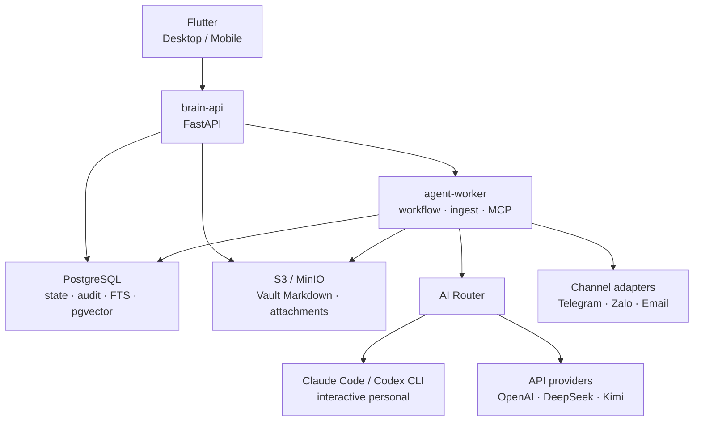
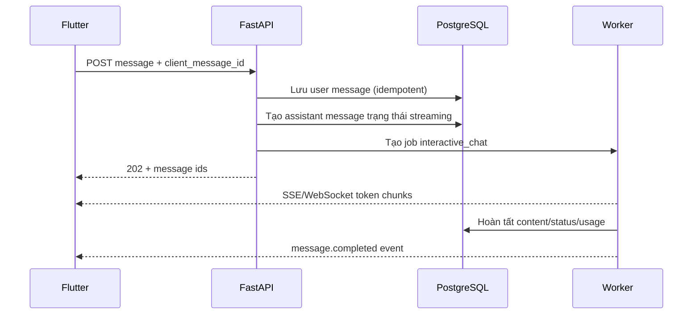

# Đặc tả tái kiến trúc Javis Platform

**Mục đích:** tài liệu triển khai để Claude Code xây lại Javis thành nền tảng Brain/Agent local-first, sử dụng được qua Flutter desktop và mobile.

**Phiên bản tài liệu:** v3 — 2026-08-09  
**Trạng thái:** kiến trúc mục tiêu cho MVP cá nhân, có đường mở rộng lên multi-user/workspace.

**Quy ước bắt buộc:** các từ **MUST**, **SHOULD**, **MAY** lần lượt có nghĩa bắt buộc, nên làm, và tùy chọn.

---

## 0. Tính năng vừa cập nhật — bắt buộc triển khai

Phần này là danh sách điều hướng để Claude Code không bỏ sót các hạng mục mới. Đặc tả dữ liệu, API, màn hình, workflow và kiểm thử tương ứng nằm ở các mục được dẫn chiếu.

| Tính năng | Hành vi bắt buộc | Đặc tả chi tiết |
|---|---|---|
| Task là nguồn chuẩn | Một Task có thể có task con, dependency, ưu tiên, hạn hoàn thành, assignee, Initiative/KR link và lịch chạy flow. | §4.3, §6.1, §7.3, §8.4 |
| List, Calendar, Kanban | Chỉ là ba chế độ xem cùng entity Task; không tạo bảng dữ liệu riêng hay trạng thái riêng. | §4.3, §7.3, §13 |
| Lịch và flow theo Task | Founder có thể Run now, đặt lịch một lần hoặc lặp; worker tạo workflow run mới với idempotency/deduplication và không vượt approval. | §4.3, §6.2, §8.4 |
| Chuỗi chiến lược | Vision/Mission/Core Values → Context Pack → PESTEL/SWOT/TOWS → BSC → OKRs → 12 Week Year → Initiative/Task, có truy vết hai chiều và cảnh báo stale. | §4.4, §6.1, §7.4 |
| BSC tinh gọn | Bốn góc nhìn, tối đa 8 strategic objectives ban đầu; metric có baseline/target/cadence và Strategy Map nhân quả. | §4.4.1, §6.1 |
| AI hỗ trợ có kiểm soát | AI chỉ thu thập bằng chứng, tạo draft và đề xuất liên kết/phân rã/lịch; founder duyệt mọi strategic decision, mục tiêu active, recurring task và external action. | §4.4.5, §8.5, §10.2 |
| Nhịp 12 Week Year | Chu kỳ 12 tuần gồm weekly plan/commitment; dashboard hằng ngày chỉ ưu tiên 1–3 Task gắn mục tiêu hiện hành. | §4.4.3–§4.4.4, §7.4 |

**Tiêu chí bàn giao của Claude Code:** không được đánh dấu Phase 2B hoặc Phase 4 hoàn thành nếu người dùng chưa tạo được một chuỗi từ Vision đến Task, xem được cùng Task ở Calendar/Kanban, và chạy được một flow theo lịch có log, dedupe và approval khi cần.

---

## 1. Kết quả cần đạt

Javis mới là một nền tảng cá nhân để lưu tri thức, chat với Brain, thực thi workflow có kiểm soát, và kết nối Telegram/Zalo/dịch vụ ngoài. Hệ thống không được xây như một chatbot đơn lẻ hoặc một vector database.

Người dùng cần có thể:

1. Mở Flutter desktop/mobile, đọc lịch sử chat gần nhất ngay cả khi mất mạng.
2. Chat với Brain, nhận câu trả lời có trích dẫn đến Markdown/Vault khi câu trả lời dùng tri thức nội bộ.
3. Quản lý Vault gồm Sources, Wiki, Memory, Skills, Agents, Workflows, Decisions và Templates.
4. Chạy workflow có trạng thái bền vững, retry, log và checkpoint phê duyệt.
5. Dùng Claude Code/Codex như trợ lý cá nhân tương tác; dùng API AI cho tác vụ nền hoặc lịch chạy.
6. Bật/tắt skill, plugin và connector theo quyền rõ ràng, không cho mã bên ngoài tự động có quyền thực thi.
7. Dùng Telegram trước; Zalo là channel adapter riêng và chỉ dùng đúng loại API/tài khoản đã được chấp thuận.
8. Điều hành từ tầm nhìn đến việc hằng ngày: Vision/Mission/Core Values, BSC tinh gọn, phân tích có bằng chứng, OKRs, chu kỳ 12 tuần và Task có thể xem qua List/Calendar/Kanban.

### Không nằm trong MVP

- SaaS public đa tenant hoàn chỉnh hoặc marketplace plugin.
- Tự động đăng bài/gửi tin không có approval.
- Dùng gói Claude/ChatGPT như API workflow nền không giới hạn.
- Chạy plugin Python tải trực tiếp từ S3 hoặc cho model chạy shell tùy ý.
- Vector database riêng; `pgvector` chỉ là index dẫn xuất.

---

## 2. Các quyết định kiến trúc đã chốt

| Khu vực | Quyết định | Lý do |
|---|---|---|
| Giao diện | Flutter desktop + mobile | Một codebase, có SQLite cache/offline tốt |
| Brain Runtime | FastAPI/Python | Phù hợp agent, plugin Python, MCP, workflow và AI tooling |
| Database chuẩn | PostgreSQL + `pgvector` + full-text search | Lưu trạng thái vận hành, audit, metadata và retrieval index |
| Nội dung Brain | Markdown Vault trên S3/MinIO | Đọc/sửa/version/backup được, không khóa vào database |
| Cache thiết bị | SQLite trong Flutter | Đọc nhanh lịch sử, cache vault, offline outbox; không là nguồn chuẩn |
| Worker | Python worker tách FastAPI | Chạy workflow/AI/MCP/plugin nặng không làm nghẽn API |
| Hàng đợi MVP | Bảng queue trong PostgreSQL | Durable, ít hạ tầng; có thể thêm Redis khi cần tải lớn |
| AI | AI Router hybrid | CLI subscription cho interactive, API cho job nền |
| Điều hành chiến lược | Strategy Operating System trong cùng Brain | Liên kết minh bạch giữa BSC, phân tích, OKR, chu kỳ 12 tuần và Task; không tạo một app quản trị thứ hai |
| Triển khai | Docker Compose, service tách container | Tách rủi ro API, worker và database |
| Không dùng ở v1 | Encore TS, database SQLite backend, vector DB riêng | Giảm hai runtime/hai nguồn ghi dữ liệu |

### Quy tắc nguồn dữ liệu chuẩn

| Dữ liệu | Nguồn chuẩn | Ghi chú |
|---|---|---|
| Wiki, memory, skill, agent, workflow definition | Object version trên S3/MinIO | FastAPI kiểm soát revision và quyền |
| File PDF/ảnh/audio | S3/MinIO | Markdown chỉ lưu link/metadata khi phù hợp |
| User, workspace, quyền, chat, task, workflow run, approval, audit | PostgreSQL | Không ghi trực tiếp từ Flutter vào DB |
| Strategy profile, BSC, phân tích, OKR và cycle đã được duyệt | PostgreSQL + revision tham chiếu Vault | PostgreSQL giữ state/quan hệ/metric; Markdown giữ narrative, evidence và quyết định có thể đọc/phiên bản hóa |
| FTS/chunk/embedding/vector | PostgreSQL | Dữ liệu dẫn xuất, phải dựng lại được từ Vault |
| Chat/vault cache và offline outbox | SQLite trên Flutter | Có thể xóa và đồng bộ lại |
| Secret/API key/session CLI | Secret store + Agent Host | Tuyệt đối không lưu Vault, SQLite, log hay app Flutter |

---

## 3. Kiến trúc tổng thể



### Ranh giới service

| Service | Được làm | Không được làm |
|---|---|---|
| `brain-api` | Auth, RBAC, CRUD, WebSocket/SSE, tạo job, đọc DB/S3 có kiểm soát | Chạy CLI AI lâu, plugin không tin cậy, giữ token channel |
| `agent-worker` | Nhận job, workflow, ingest, AI Router, plugin host, MCP, channel outbox | Public Internet API, tin cậy input chưa xác thực |
| `postgres` | Dữ liệu chuẩn, full-text, vector index, durable queue | Chứa secret plaintext hoặc file Vault lớn |
| `minio` (dev/self-host) | Object storage versioned | Quyết định quyền ứng dụng |
| Flutter | UI, cache offline, outbox client | Cầm S3 access key, API key AI, DB credential |

`brain-api`, `agent-worker`, `postgres` **MUST** là các container riêng. Có thể dùng chung Docker image Python cho API/worker nhưng phải dùng lệnh khởi động khác nhau. PostgreSQL phải có named volume riêng, backup độc lập và không được expose public.

---

## 4. Mô hình domain

### 4.1 Đơn vị sở hữu

```text
User → Workspace → Brain → Vault / Chat / Workflow / Channel / AI policy
```

- **User:** danh tính đăng nhập.
- **Workspace:** phạm vi quyền và dữ liệu. MVP tạo một personal workspace cho chủ sở hữu.
- **Brain:** một bộ tri thức/cấu hình tác nhân trong workspace. MVP có thể tạo mặc định `personal-brain`.
- **Vault:** tập logical của tài liệu Markdown và tệp đính kèm; object thật nằm S3/MinIO.
- **Run:** lần chạy cụ thể của chat/workflow/ingest/AI, luôn có trace/audit.

Thiết kế vẫn dùng `workspace_id` và `brain_id` ngay từ đầu, dù MVP chỉ có một người, để tránh phải migration lớn khi có thêm thiết bị/người dùng.

### 4.2 Phân quyền

| Role | Quyền chính |
|---|---|
| `owner` | Toàn quyền; duyệt external action/dangerous action; quản lý secret/plugin |
| `admin` | Quản trị vault/workflow/agent, không đọc secret raw |
| `editor` | Viết vault, tạo draft, chạy workflow được cấp |
| `viewer` | Đọc nội dung được cấp, không chạy external action |
| `service` | Account kỹ thuật scoped cho adapter/worker, không login UI |

MVP có thể chỉ hiển thị `owner`, nhưng backend vẫn phải enforce RBAC và ownership ở mọi query.

### 4.3 Task là lớp điều phối công việc

**Task không phải là một workflow và cũng không phải một màn Kanban riêng.** Task là cam kết/công việc có thể theo dõi; Calendar và Kanban chỉ là hai cách xem cùng một dữ liệu Task. Workflow là một định nghĩa tái sử dụng để Task có thể kích hoạt khi đến thời điểm hoặc khi người dùng yêu cầu.

```text
Chat / UI / Telegram
        → tạo hoặc cập nhật Task
        → Task hiển thị List · Calendar · Kanban
        → đến lịch hoặc người dùng bấm Run
        → Worker tạo Workflow Run từ version đã ghim
        → task cập nhật trạng thái theo run / approval / kết quả
```

Mỗi Task phải có tối thiểu: `title`, `status`, `priority`, `planned_start_at`, `due_at`, `timezone`, `assignee` và `source`. Với MVP cá nhân, assignee mặc định là owner nhưng vẫn giữ `assignee_id` để không phải đổi schema khi mở workspace.

| Khái niệm | Ý nghĩa | Ví dụ |
|---|---|---|
| Task | Đơn vị cam kết và theo dõi | “Chuẩn bị báo cáo thị trường tuần này” |
| Task cha/con | Phân rã công việc | Task báo cáo → thu thập, phân tích, duyệt |
| Dependency | Điều kiện hoàn thành giữa Task | “Viết bản tin” chờ “Thu thập tín hiệu” |
| Schedule | Thời điểm/lặp lại phải kích hoạt | Mỗi Thứ Hai 08:00, múi giờ Việt Nam |
| Workflow binding | Liên kết Task với một workflow version và input | Task báo cáo → `weekly-market-brief` v3 |
| Workflow run | Một lần chạy thực tế do Task hoặc người dùng khởi động | Run ngày 2026-08-10 |

Status chuẩn MVP: `inbox`, `planned`, `in_progress`, `blocked`, `waiting_approval`, `done`, `cancelled`. Không tạo một bảng trạng thái riêng cho Calendar/Kanban. Workspace có thể đổi nhãn/màu cột, nhưng ánh xạ về status chuẩn để worker và báo cáo không bị lệch nghĩa.

Quy tắc quan trọng:

1. Task có `planned_start_at`/`due_at` thì xuất hiện ở Calendar; không có ngày vẫn xuất hiện List/Kanban.
2. Kanban kéo thả chỉ là thay đổi `status` và `sort_key`, luôn ghi audit/event; không được cập nhật workflow run một cách ngầm định.
3. Một Task có thể chạy workflow thủ công, theo lịch một lần hoặc lặp. Mỗi lần chạy phải tạo `workflow_run` mới, gắn `task_id`, có `idempotency_key` riêng; không tái sử dụng run cũ.
4. Khi run chờ duyệt external action, Task chuyển `waiting_approval`. Duyệt hoặc từ chối vẫn tuân theo snapshot approval/outbox của workflow; Task không được bỏ qua policy này.
5. Sửa lịch, input hoặc workflow binding chỉ áp dụng cho lần chạy tương lai. Run đã tạo phải giữ workflow version, input hash và lịch đã kích hoạt để audit/retry chính xác.
6. AI có thể đề xuất Task, phân rã thành subtask, tạo draft workflow binding hoặc đề xuất lịch; chỉ API/owner mới được lưu hoặc activate schedule. AI không tự bật recurring flow hay external action.

---

### 4.4 Hệ điều hành chiến lược cho one-person company

Javis **MUST** coi chiến lược và thực thi là một chuỗi liên kết có thể truy vết, không phải các biểu mẫu độc lập. Mục tiêu của MVP là giúp founder trả lời nhanh: *việc hôm nay phục vụ Key Result nào, Key Result đó phục vụ mục tiêu BSC nào, và mục tiêu đó có còn đúng với bối cảnh hiện tại không?*

Chuỗi chuẩn:

```text
Vision · Mission · Core Values
→ BSC bản nháp / câu hỏi chiến lược
→ Strategic Context Pack đã duyệt
→ PESTEL có nguồn → SWOT có bằng chứng → TOWS có lựa chọn
→ BSC Strategy Map đã chốt
→ OKRs → 12 Week Year → Project / Initiative → Task
→ daily · weekly · 12-week review → điều chỉnh có audit
```

Chuỗi này có vòng phản hồi, không phải đường một chiều. PESTEL/SWOT/TOWS có thể làm BSC hoặc OKR trở thành `stale`; hệ thống phải hiển thị trạng thái đó để founder chủ động xem lại, **không tự sửa mục tiêu hoặc hủy kế hoạch đang chạy**.

#### 4.4.1 Strategic profile và BSC tinh gọn

`strategy_profile` là bản đã duyệt của Vision, Mission và Core Values cho một `workspace`/`brain`; narrative dài nằm trong Vault, còn PostgreSQL giữ state, owner và revision đang active. Một BSC/Strategy Map thuộc về một profile và một khoảng thời gian hiệu lực.

Với founder một mình hoặc nhóm rất nhỏ, BSC mặc định dùng bốn góc nhìn sau. Chỉ tạo mục tiêu khi nó dẫn tới một quyết định hoặc phép đo thật; không bắt buộc phải lấp đầy KPI.

| Góc nhìn | Câu hỏi điều hành | Giới hạn MVP khuyến nghị |
|---|---|---|
| `financial` | Dòng tiền, doanh thu, biên lợi nhuận, runway có đủ không? | 1–2 objective |
| `customer_market` | Khách hàng mục tiêu và vấn đề nào đáng giải quyết? | 1–3 objective |
| `internal_process` | Nút thắt tạo sản phẩm, bán hàng, vận hành hay an toàn là gì? | 1–2 objective |
| `learning_growth` | Founder/nhóm cần học, tự động hóa hoặc xây tài sản tri thức gì? | 1–2 objective |

Tổng BSC ban đầu **SHOULD NOT** vượt quá 8 strategic objective. Mỗi objective có owner, kỳ hiệu lực, chỉ số dẫn dắt/kết quả, baseline, target, nguồn dữ liệu, cadence review và các liên kết nguyên nhân–kết quả sang objective khác. `strategic_objective_links` biểu diễn Strategy Map, ví dụ `learning_growth → internal_process → customer_market → financial`.

#### 4.4.2 Context Pack, PESTEL, SWOT và TOWS

AI chỉ được phân tích dựa trên một `Strategic Context Pack` đã được owner duyệt. Context Pack là tập tài liệu/citation có phạm vi, thời điểm chốt, thị trường/segment, giả định và mức tin cậy rõ ràng; có thể gồm Vault, dữ liệu vận hành, phản hồi khách hàng và tín hiệu thị trường đã được phép thu thập.

| Artefact | Nội dung bắt buộc | Trạng thái hợp lệ |
|---|---|---|
| PESTEL item | yếu tố, nhóm `political/economic/social/technology/environmental/legal`, tác động, horizon, nguồn/citation, confidence | `draft`, `review`, `approved`, `stale`, `archived` |
| SWOT item | loại `strength/weakness/opportunity/threat`, mô tả, evidence hoặc assumption, impact, likelihood, owner | như trên |
| TOWS option | ô `SO/ST/WO/WT`, SWOT inputs cụ thể, trade-off, expected impact, confidence, đề xuất quyết định | như trên |
| Strategic decision | lựa chọn được founder chấp nhận/từ chối, rationale, revision/context pack tham chiếu | `approved`, `superseded`, `archived` |

Nguyên tắc bắt buộc:

1. Mọi PESTEL/SWOT/TOWS phải lưu `context_pack_id`, `input_revision_ids` và citation/evidence. AI không được trình bày suy đoán như sự thật.
2. Một item không có bằng chứng vẫn có thể tồn tại, nhưng phải gắn `evidence_status=assumption`, có confidence thấp và không được tự động tạo OKR.
3. TOWS là nơi đề xuất lựa chọn; BSC là nơi mô tả ưu tiên đã chọn. Founder phải duyệt TOWS/decision trước khi mục tiêu BSC hoặc OKR chuyển sang `active`.
4. Workflow đọc tín hiệu thị trường có thể chạy `read_only`; workflow phân tích chỉ tạo `draft`. Không một node AI nào được tự phê duyệt Context Pack, chiến lược hay quyết định đầu tư.

#### 4.4.3 OKRs, liên kết ngang và 12 Week Year

OKR là lớp cam kết thực thi ngắn hạn của Strategy Map, không phải danh sách ước muốn. Mỗi KR **MUST** đo được bằng `formula`, `unit`, `baseline`, `current_value`, `target_value`, `data_source`, `check_in_cadence` và kỳ hiệu lực. Một Objective/KR phải liên kết ngược tới ít nhất một BSC objective hoặc strategic decision đã duyệt.

`okr_links` hỗ trợ OKR liên kết ngang mà không nhân bản nội dung. Loại liên kết tối thiểu: `contributes_to`, `supports`, `depends_on`, `conflicts_with`, `shared_metric`. Backend phải cấm vòng `depends_on`; các liên kết khác được hiển thị rõ như quan hệ tham khảo, không tự đổi ownership hoặc tiến độ.

Mỗi `twelve_week_cycle` có `start_date`, `end_date`, `theme`, `commitment_level`, owner và trạng thái `planning/active/reviewed/closed`. Với one-person company, một cycle chỉ nên cam kết tối đa **1–3 Objectives và 3–5 KRs tổng cộng**. Cycle gồm 12 `weekly_plan` (tuần có `focus`, commitment, execution score, blocker và reflection); mỗi commitment phải dẫn tới Initiative/Task cụ thể.

Các lớp thực thi liên kết như sau:

```text
BSC objective / strategic decision
  → OKR objective → Key Result ↔ Key Result khác
  → Initiative / Project
  → 12-week weekly commitment
  → Task / subtask / workflow binding
```

Một Task có thể được tạo độc lập, nhưng chỉ được tính là đóng góp chiến lược khi nó liên kết qua `initiative` hoặc `weekly_commitment`. List, Calendar và Kanban vẫn là các view của chính Task; chúng không trở thành một hệ quản trị chiến lược thứ hai.

#### 4.4.4 Project, gate và nhịp review

Project quản lý một gói đầu tư/khám phá lớn hơn Initiative. MVP dùng hai phase: `discovery` và `execution`, với gate phải do owner duyệt:

| Gate | Mục tiêu |
|---|---|
| `D0_context` | Context Pack và giả định đã rõ phạm vi |
| `D1_evidence` | Có bằng chứng đủ để kiểm tra problem/market/solution |
| `D2_investment_readiness` | Đã có lựa chọn chiến lược, chi phí/rủi ro và KPI dự kiến |
| `D3_spending_readiness` | Cho phép chi tiền hoặc external action theo policy riêng |

Nhịp điều hành mặc định:

- **Hằng ngày:** Javis hiển thị 1–3 Task ưu tiên gắn cycle hiện hành; không tự ưu tiên lại chỉ vì AI có đề xuất.
- **Hằng tuần:** check-in KR, đánh giá execution score, blocker, điều chỉnh tuần kế tiếp; thay đổi commitment phải có audit.
- **Mỗi 4 tuần hoặc khi có tín hiệu lớn:** review Context Pack/PESTEL và đánh dấu phân tích có thể stale.
- **Cuối 12 tuần:** review KR, learning và BSC assumptions; đóng cycle trước khi mở cycle kế tiếp.
- **Mỗi quý hoặc khi đổi hướng:** founder review BSC/Strategy Map và strategic decisions.

#### 4.4.5 Ranh giới AI và phê duyệt của founder

| Việc | AI/worker được làm | Owner phải làm |
|---|---|---|
| Thu thập/tóm tắt tín hiệu | chạy workflow `read_only`, tạo evidence/citation | kiểm tra nguồn khi quyết định |
| PESTEL, SWOT, TOWS | tạo bản nháp có evidence, confidence và assumption | duyệt/sửa/từ chối |
| BSC, Objective, KR, plan tuần | đề xuất liên kết và structured draft | chốt mục tiêu, baseline, target, commitment |
| Project/Initiative/Task | phân rã và đề xuất lịch/binding | xác nhận ưu tiên, assignee, schedule active |
| Gửi tin, đăng bài, chi tiền, đổi credential | không tự thực hiện | approval theo policy hiện có |

Backend **MUST** enforce các ranh giới này, không dựa vào prompt. Mọi approve/reject/activate, đổi metric target, chuyển `active`, hoặc sửa gate phải tạo `audit_logs`, `task_events`/strategy event và lưu actor, payload snapshot, thời gian, revision liên quan.

---

## 5. Vault Markdown trên S3/MinIO

### 5.1 Cấu trúc logical bắt buộc

```text
vault/{workspace_id}/{brain_id}/
  sources/
  wiki/
  memory/
  skills/{skill_slug}/
    SKILL.md
    checklist.md
    templates/
  agents/{agent_slug}.md
  workflows/{workflow_slug}.md
  strategy/
    vision-mission-values.md
    bsc/{period}.md
    context-packs/{context_pack_slug}.md
    analyses/{analysis_slug}.md
    decisions/{decision_slug}.md
    okrs/{cycle_slug}.md
    twelve-week/{cycle_slug}.md
    projects/{project_slug}.md
  decisions/
  templates/
  attachments/{yyyy}/{mm}/
```

Không trộn `javis-vault` dữ liệu riêng với repository mã nguồn `javis-platform`.

### 5.2 Markdown frontmatter

Mọi tài liệu được quản lý qua Vault **SHOULD** có YAML frontmatter. Ví dụ workflow:

```markdown
---
id: weekly-market-brief
kind: workflow
title: Tổng hợp thị trường tuần
tags: [market-research, vung-tau]
status: active
trust_level: reviewed
allowed_tools: [vault.search, web.read, telegram.send_draft]
created_at: 2026-08-09T00:00:00Z
updated_at: 2026-08-09T00:00:00Z
---

# Mục tiêu
...
```

Không tin cậy `workspace_id`, `owner_id`, quyền hay revision được khai báo trong frontmatter. Các giá trị đó được lấy từ PostgreSQL và request context.

Tài liệu chiến lược **MUST** chứa đủ metadata để liên kết với state PostgreSQL, tối thiểu `kind`, `status`, `period`, `context_pack_id` (nếu là analysis), `source_revision_ids` và `approved_at`/`approved_by` khi đã chốt. Backend vẫn là nơi kiểm tra revision, quyền và state transition; frontmatter chỉ là bản diễn giải có thể đọc trong Vault.

### 5.3 Version, locking và conflict

1. Flutter đọc revision hiện hành qua API và lưu `base_revision_id` khi người dùng bắt đầu sửa.
2. Khi save, Flutter gửi nội dung + `base_revision_id` đến FastAPI.
3. FastAPI kiểm tra role, tạo object S3 mới (không overwrite key logic), ghi `vault_revisions`, rồi đổi `vault_documents.current_revision_id` trong cùng transaction DB hợp lý.
4. Nếu `base_revision_id` không khớp bản hiện hành, API trả `409 VAULT_REVISION_CONFLICT` gồm metadata hai bản. UI phải yêu cầu merge/ghi thành bản mới; không ghi đè âm thầm.
5. Sau commit, FastAPI tạo job `vault.index_requested` để worker FTS/chunk/embed lại.

Bật S3 Versioning là lớp phục hồi bổ sung, nhưng PostgreSQL mới là nơi chọn revision ứng dụng đang active.

### 5.4 Local Vault Cache trên Agent Host

Worker tải bản required về thư mục local cache, ví dụ `/var/lib/javis/vault-cache/{brain_id}`. CLI chỉ được đọc cache này, không có access key S3. Cache gồm `revision_id` + hash; khi worker nạp skill/agent/workflow, phải kiểm tra hash trước khi dùng.

---

## 6. Data model PostgreSQL

Tên bảng dùng `snake_case`, UUID v7/UUID chuẩn cho ID, `timestamptz` UTC cho thời gian. Mọi bảng domain phải có `workspace_id` nếu dữ liệu thuộc workspace.

### 6.1 Các bảng lõi

| Bảng | Cột chính | Mục đích |
|---|---|---|
| `users` | `id`, `email`, `display_name`, `status` | Danh tính |
| `workspaces` | `id`, `name`, `plan`, `created_by` | Ranh giới tenant |
| `workspace_members` | `workspace_id`, `user_id`, `role` | RBAC |
| `brains` | `id`, `workspace_id`, `name`, `settings_jsonb` | Cấu hình Brain |
| `strategy_profiles` | `id`, `workspace_id`, `brain_id`, `vision_revision_id`, `mission_revision_id`, `core_values_revision_id`, `status`, `effective_from`, `effective_to` | Phiên bản chiến lược nền tảng đã được duyệt |
| `strategic_context_packs` | `id`, `workspace_id`, `brain_id`, `title`, `scope_jsonb`, `as_of_at`, `status`, `approved_by`, `approved_at` | Tập bằng chứng/phạm vi đầu vào cho phân tích |
| `context_pack_sources` | `workspace_id`, `context_pack_id`, `revision_id`, `source_type`, `citation_jsonb`, `included_by` | Tài liệu, dữ liệu hoặc tín hiệu đã được chọn vào Context Pack |
| `strategy_analyses` | `id`, `workspace_id`, `context_pack_id`, `kind`, `status`, `input_hash`, `output_revision_id`, `created_by` | Logical analysis PESTEL/SWOT/TOWS; narrative/version nằm Vault |
| `pestel_items` | `id`, `workspace_id`, `analysis_id`, `factor`, `statement`, `impact`, `horizon`, `confidence`, `evidence_status` | Các tín hiệu PESTEL đã chuẩn hóa |
| `swot_items` | `id`, `workspace_id`, `analysis_id`, `category`, `statement`, `impact`, `likelihood`, `confidence`, `evidence_status` | Điểm mạnh/yếu, cơ hội/thách thức có evidence/assumption |
| `tows_options` | `id`, `workspace_id`, `analysis_id`, `quadrant`, `title`, `tradeoffs`, `expected_impact`, `confidence`, `status` | Lựa chọn SO/ST/WO/WT có các SWOT input rõ ràng |
| `strategic_decisions` | `id`, `workspace_id`, `brain_id`, `context_pack_id`, `tows_option_id`, `decision`, `rationale_revision_id`, `status`, `decided_by` | Quyết định founder nhận/từ chối/supersede lựa chọn |
| `bsc_scorecards` | `id`, `workspace_id`, `strategy_profile_id`, `period_start`, `period_end`, `status`, `approved_by` | BSC/Strategy Map theo kỳ |
| `strategic_objectives` | `id`, `workspace_id`, `scorecard_id`, `perspective`, `statement`, `owner_id`, `status`, `metric_id` | Mục tiêu BSC thuộc 4 góc nhìn |
| `strategic_objective_links` | `workspace_id`, `from_objective_id`, `to_objective_id`, `relation_type` | Liên kết nhân quả của Strategy Map |
| `metrics` | `id`, `workspace_id`, `brain_id`, `name`, `formula`, `unit`, `baseline_value`, `target_value`, `data_source`, `cadence`, `status` | Định nghĩa metric dùng chung cho BSC/KR |
| `metric_checkins` | `id`, `workspace_id`, `metric_id`, `as_of_at`, `value`, `source_ref`, `entered_by` | Giá trị kiểm chứng theo kỳ; không ghi đè lịch sử |
| `okr_cycles` | `id`, `workspace_id`, `brain_id`, `name`, `start_date`, `end_date`, `status` | Chu kỳ OKR, thường liên kết với cycle 12 tuần |
| `okr_objectives` | `id`, `workspace_id`, `cycle_id`, `strategic_objective_id`, `title`, `owner_id`, `status` | Objective thực thi, nối ngược về BSC/decision |
| `key_results` | `id`, `workspace_id`, `objective_id`, `metric_id`, `baseline_value`, `current_value`, `target_value`, `unit`, `cadence`, `status` | KR đo được và có baseline/target rõ ràng |
| `okr_links` | `workspace_id`, `from_entity_type`, `from_entity_id`, `to_entity_type`, `to_entity_id`, `relation_type` | Liên kết ngang `supports/depends_on/conflicts_with/shared_metric` |
| `projects` | `id`, `workspace_id`, `brain_id`, `title`, `phase`, `current_gate`, `status`, `owner_id` | Nhóm đầu tư/khám phá lớn có gate D0–D3 |
| `initiatives` | `id`, `workspace_id`, `brain_id`, `project_id`, `title`, `status`, `owner_id` | Sáng kiến triển khai được liên kết với KR |
| `initiative_key_result_links` | `workspace_id`, `initiative_id`, `key_result_id`, `contribution_type` | Nối sáng kiến với một/nhiều KR không nhân bản KR |
| `twelve_week_cycles` | `id`, `workspace_id`, `brain_id`, `okr_cycle_id`, `theme`, `start_date`, `end_date`, `commitment_level`, `status` | Chu kỳ thực thi 12 tuần |
| `weekly_plans` | `id`, `workspace_id`, `cycle_id`, `week_no`, `start_date`, `focus`, `execution_score`, `blockers_jsonb`, `reflection` | Kế hoạch và review theo từng tuần |
| `weekly_commitments` | `id`, `workspace_id`, `weekly_plan_id`, `initiative_id`, `title`, `status`, `planned_effort` | Cam kết tuần, sau đó được phân rã thành Task |
| `vault_documents` | `id`, `brain_id`, `path`, `kind`, `current_revision_id`, `status` | Logical document |
| `vault_revisions` | `id`, `document_id`, `object_key`, `sha256`, `size_bytes`, `created_by` | Immutable revision |
| `attachments` | `id`, `brain_id`, `object_key`, `mime_type`, `sha256` | File ngoài Markdown |
| `document_chunks` | `id`, `revision_id`, `ordinal`, `text`, `fts`, `embedding` | Dẫn xuất retrieval |
| `chat_sessions` | `id`, `brain_id`, `title`, `last_message_at` | Hội thoại |
| `chat_messages` | `id`, `session_id`, `role`, `content`, `status`, `client_message_id` | Tin nhắn chuẩn |
| `tasks` | `id`, `workspace_id`, `brain_id`, `parent_task_id`, `weekly_commitment_id`, `initiative_id`, `assignee_id`, `title`, `status`, `priority`, `planned_start_at`, `due_at`, `timezone`, `sort_key`, `source` | Nguồn chuẩn cho List/Calendar/Kanban; link rõ đến thực thi chiến lược khi có |
| `task_dependencies` | `task_id`, `depends_on_task_id`, `dependency_type` | Ràng buộc hoàn thành/thứ tự |
| `task_schedules` | `id`, `task_id`, `kind`, `rrule`, `run_at`, `timezone`, `next_run_at`, `active` | Lịch một lần hoặc lặp để tạo workflow run |
| `task_workflow_bindings` | `id`, `task_id`, `workflow_version_id`, `input_template_jsonb`, `active` | Flow/version và input được Task kích hoạt |
| `workflow_definitions` | `id`, `brain_id`, `slug`, `current_version_id` | Logical workflow |
| `workflow_versions` | `id`, `definition_id`, `revision_id`, `graph_jsonb`, `version_no` | Version compile từ Vault |
| `workflow_runs` | `id`, `version_id`, `task_id`, `status`, `trigger`, `input_jsonb`, `idempotency_key` | Một lần chạy, có thể do Task tạo |
| `workflow_steps` | `id`, `run_id`, `node_id`, `status`, `attempt`, `output_jsonb` | State của node |
| `approvals` | `id`, `run_id`, `step_id`, `action_type`, `payload_jsonb`, `status`, `expires_at` | Checkpoint xác nhận |
| `jobs` | `id`, `type`, `payload_jsonb`, `status`, `scheduled_at`, `locked_at`, `attempts` | Durable job queue MVP |
| `task_events` | `id`, `workspace_id`, `aggregate_type`, `aggregate_id`, `event_type`, `payload_jsonb` | Timeline realtime/audit kỹ thuật |
| `outbox` | `id`, `channel`, `payload_jsonb`, `status`, `dedupe_key` | Gửi tin an toàn, retry được |
| `ai_runs` | `id`, `workflow_run_id`, `provider`, `model`, `mode`, `input_hash`, `usage_jsonb`, `cost_estimate` | Theo dõi AI/budget |
| `plugins` | `id`, `slug`, `version`, `manifest_jsonb`, `trust_level` | Plugin registry |
| `workspace_plugins` | `workspace_id`, `plugin_id`, `enabled`, `granted_permissions` | Kích hoạt plugin |
| `credentials` | `id`, `workspace_id`, `provider`, `secret_ref`, `scopes`, `status` | Chỉ lưu pointer secret |
| `audit_logs` | `id`, `actor_type`, `actor_id`, `action`, `target_type`, `target_id`, `metadata_jsonb` | Nhật ký không sửa |

### 6.2 Constraint và index quan trọng

- `vault_documents`: unique `(brain_id, path)`.
- `vault_revisions`: unique `(document_id, sha256)` nếu cùng nội dung không tạo revision trùng.
- `chat_messages`: unique `(session_id, client_message_id)` khi client gửi idempotency key.
- `strategy_profiles`: không có hai profile `active` cùng `brain_id` và thời điểm hiệu lực chồng lấn; một profile chỉ active sau owner approval.
- `strategic_context_packs`: chỉ Context Pack `approved` mới được dùng để tạo analysis/OKR draft; analysis lưu `input_hash` của toàn bộ source revision để phát hiện `stale`.
- `pestel_items`/`swot_items`: `evidence_status` là `verified|assumption|unverified`; item `assumption`/`unverified` không thể là input duy nhất của decision/OKR active.
- `strategic_objectives`: `perspective` bị giới hạn `financial|customer_market|internal_process|learning_growth`; `metric_id` phải cùng `brain_id`.
- `strategic_objective_links`: unique `(from_objective_id, to_objective_id, relation_type)`; cấm self-reference và cấm cycle cho relation nhân quả.
- `metrics`: `formula`, `unit`, `baseline_value`, `data_source` và `cadence` bắt buộc trước khi metric được dùng làm KR active; `metric_checkins` append-only.
- `key_results`: phải có baseline, target, unit, metric/formula và ít nhất một strategic objective/decision đã duyệt; không cho sửa target của cycle active mà không tạo audit/review record.
- `okr_links`: `relation_type=depends_on` cấm cycle; `shared_metric` yêu cầu hai đầu có cùng `metric_id`.
- `twelve_week_cycles`: unique `(brain_id, start_date)`; khi `active`, ngày kết thúc phải đúng 12 tuần; `weekly_plans`: unique `(cycle_id, week_no)` với `week_no` từ 1 đến 12.
- `weekly_commitments`: link đến Initiative; Task chỉ được link tới commitment/initiative cùng `brain_id`; task hoàn tất không tự cập nhật KR nếu chưa có metric check-in hoặc policy rõ ràng.
- `projects`: chỉ đi tiếp gate `D0_context → D1_evidence → D2_investment_readiness → D3_spending_readiness` sau owner approval; gate có payload snapshot/audit.
- `tasks`: index `(workspace_id, status, sort_key)` cho List/Kanban và `(workspace_id, planned_start_at, due_at)` cho Calendar; `parent_task_id` không được tạo vòng lặp.
- `task_dependencies`: unique `(task_id, depends_on_task_id)`; cấm self-reference và cấm dependency cycle tại service layer.
- `task_schedules`: MVP chỉ cho một schedule active mỗi Task; job kích hoạt phải có unique dedupe theo `schedule_id` + timestamp lịch.
- `task_workflow_bindings`: MVP chỉ cho một binding active mỗi Task; workflow version phải thuộc cùng workspace/brain với Task; xóa/archived binding không ảnh hưởng run đã tạo.
- `workflow_definitions`: unique `(brain_id, slug)`.
- `workflow_runs`: unique `(workspace_id, idempotency_key)` nếu khóa khác `NULL`.
- `outbox`: unique `(channel, dedupe_key)`.
- `jobs`: index `(status, scheduled_at)`; worker dùng `FOR UPDATE SKIP LOCKED` để lấy job.
- `document_chunks.fts`: GIN index với `to_tsvector('simple', text)`; dùng cấu hình phù hợp tiếng Việt ở giai đoạn tối ưu sau.
- `document_chunks.embedding`: HNSW/IVFFlat `pgvector` sau khi có lượng dữ liệu đủ; không cần tối ưu vector ở tuần đầu.
- Toàn bộ query theo workspace phải có composite index bắt đầu với `workspace_id`.

### 6.3 Chính sách xóa

Không hard delete chat, vault revision, approval, ai run hay audit trong MVP. Dùng `archived_at`/`deleted_at` cho logical resource. Object S3 chỉ bị GC sau retention policy rõ ràng và job kiểm tra không còn revision nào tham chiếu.

---

## 7. Chat, streaming và offline

### 7.1 Luồng gửi tin nhắn online



FastAPI ghi user message vào PostgreSQL **trước** khi đẩy job. Worker không ghi từng token; worker buffer token để stream nhưng chỉ checkpoint nội dung assistant theo từng khoảng thời gian ngắn hoặc khi hoàn tất. Nếu worker chết, assistant message chuyển `interrupted`, cho phép retry tạo message mới có tham chiếu parent thay vì âm thầm nối sai nội dung.

### 7.2 SQLite Flutter

SQLite trong app chỉ có các bảng local:

- `cached_sessions`
- `cached_messages`
- `cached_vault_headers`
- `client_outbox`
- `sync_cursor`

Khi mở app: render từ cache trước, sau đó gọi `GET /sync?cursor=...`. Tin nhắn offline vào `client_outbox` với UUID `client_message_id`; khi có mạng gửi đúng ID để server deduplicate. Server là nơi quyết định thứ tự và trạng thái cuối cùng. Không có SQLite backend hay cơ chế “backend ghi SQLite rồi mới sync PostgreSQL”.

### 7.3 Task, Calendar và Kanban trong Flutter

Flutter phải có một feature `tasks` dùng **cùng endpoint, cùng entity và cùng cursor sync** cho ba chế độ xem:

| Chế độ xem | Điều kiện dữ liệu | Tương tác chính |
|---|---|---|
| Inbox/List | Mọi Task theo filter | tạo nhanh, tìm kiếm, phân rã thành subtask, chọn ưu tiên |
| Calendar | `planned_start_at` hoặc `due_at` khác `NULL` | kéo ngày, đặt thời gian, xem deadline/lịch flow |
| Kanban | Nhóm theo `status` chuẩn | kéo thả status/thứ tự, thấy block/approval/run đang chạy |

Không tạo “Calendar task” hay “Kanban task” riêng. Khi người dùng đổi ngày từ Calendar hoặc đổi cột từ Kanban, Flutter gửi mutation idempotent đến API; server cập nhật `tasks`, ghi `task_events`, phát event và đồng bộ ngược về SQLite.

Luồng tạo Task từ hội thoại phải theo structured output, không parse text mơ hồ trực tiếp thành automation:

```text
User: “Mỗi thứ Hai 8 giờ hãy tổng hợp thị trường Vũng Tàu”
→ AI trả TaskPlanDraft: title, schedule, timezone, workflow đề xuất, input draft
→ Flutter hiển thị bản xem trước và policy/rủi ro
→ owner xác nhận
→ API tạo Task + binding + schedule inactive/active theo lựa chọn
→ worker chỉ tạo run khi schedule đã active
```

SQLite local bổ sung `cached_tasks`, `cached_task_dependencies`, `cached_task_schedules` và `task_client_outbox`. Không xếp workflow run vào outbox offline nếu request đó là external action; chỉ xếp yêu cầu tạo/sửa Task hoặc `run workflow` ở trạng thái draft, rồi server kiểm tra lại quyền, schedule và policy khi đồng bộ.

### 7.4 Strategy dashboard, OKR và 12-week execution trong Flutter

Flutter thêm feature `strategy`, `okrs` và `execution_cycles`, nhưng **không** giữ logic chiến lược hoặc phép tính tiến độ như nguồn chuẩn trong client. Client chỉ render projection API, cache để đọc offline và gửi mutation idempotent; backend validate mọi relation/status/gate.

| Màn hình | Mục tiêu sử dụng | Dữ liệu phải nhìn thấy |
|---|---|---|
| Strategy Home | Founder nhìn toàn chuỗi từ hướng đi đến việc tuần | Vision/Mission/Values, BSC 4 góc nhìn, cảnh báo stale, cycle active, 1–3 Task ưu tiên hôm nay |
| Context & Analysis | Xem/dự thảo PESTEL, SWOT, TOWS có chứng cứ | Context Pack, citations, evidence status, confidence, AI draft và nút approve/reject |
| BSC / Strategy Map | Chốt và review ưu tiên chiến lược | objective, metric/baseline/target, quan hệ nhân quả, decision liên quan |
| OKR | Cam kết kết quả có thể đo | Objective/KR, formula, check-in, liên kết ngang, Initiative/Project đóng góp |
| 12 Week Year | Chuyển OKR thành nhịp tuần | theme, tuần 1–12, commitment, execution score, blocker, review |
| Task views | Thực hiện việc hằng ngày | Task/subtask, liên kết Initiative/KR, Calendar, Kanban, workflow/approval |

Luồng tạo mới từ UI/chat phải là: tạo `draft` → người dùng xem relation/citation/rủi ro → owner approve/activate → event/sync. Flutter không được cho kéo thả trực tiếp làm đổi target KR, chuyển Gate Project, chốt BSC hoặc bật recurring flow mà không qua API action có confirmation.

---

## 8. Workflow Runtime durable

Workflow definition là Markdown/Vault theo version; runtime không thực thi trực tiếp text Markdown. Khi activate workflow, worker parse/validate ra `graph_jsonb` trong `workflow_versions`.

### 8.1 Node type MVP

| Node | Mô tả | Mode/risk |
|---|---|---|
| `input` | Validate input schema | read-only |
| `vault_search` | FTS + vector retrieval có citation | read-only |
| `ai_generate` | Gọi AI Router tạo structured draft | draft/read-only |
| `transform` | Code transform đã được allowlist | read-only |
| `write_draft` | Lưu Markdown draft/revision mới | draft |
| `request_approval` | Tạo checkpoint | approval |
| `channel_send` | Gửi outbox sau approval | external_action |
| `webhook_call` | HTTP tới destination allowlist | external_action |
| `branch` | Đi nhánh trên structured condition | read-only |
| `delay` | Lịch chạy node tiếp | read-only |

Không có node `shell` hoặc `python_eval` trong MVP. Mọi khả năng chạy code phải đi qua plugin đã review và sandbox.

### 8.2 State machine

```text
queued → running → waiting_approval → queued → completed
                  ↘ cancelled
running → retry_wait → queued
running → failed
```

- Mỗi step có `attempt`, `started_at`, `finished_at`, `error_code`, `error_detail_safe`.
- Worker bắt job bằng lock; lock phải có lease/heartbeat để job sống lại sau khi worker chết.
- Retry chỉ cho lỗi transient được phân loại. Dùng exponential backoff, giới hạn attempts và dead-letter status.
- `idempotency_key` bắt buộc cho trigger từ channel/webhook, và `dedupe_key` bắt buộc cho outbox.
- Mỗi external action phải snapshot `payload_jsonb` trong `approvals` trước khi user bấm duyệt. Nếu payload thay đổi, approval cũ vô hiệu.

### 8.3 Chính sách trust theo hành động

| Cấp | Ví dụ | Chính sách |
|---|---|---|
| `read_only` | Tìm vault, tóm tắt, phân loại | Tự chạy khi workflow active |
| `draft` | Viết nháp email/báo cáo/vault draft | Tự chạy vào vùng nháp |
| `external_action` | Gửi Telegram/email, đăng mạng xã hội, gọi API ghi dữ liệu | Luôn approval trước khi outbox gửi |
| `dangerous` | Cài plugin, đổi credential, chạy CLI/shell có quyền | Chỉ owner thực hiện trực tiếp tại Agent Host |

### 8.4 Điều phối Task → Workflow

Worker phải có job `task.schedule_tick`/claim query chạy theo `next_run_at`. Khi đến hạn, worker thực hiện transaction có khóa để:

1. kiểm tra Task, schedule và workflow binding còn `active`, thuộc đúng workspace và không bị archived;
2. tính `occurrence_key` từ schedule ID + thời điểm lịch + timezone, rồi deduplicate;
3. snapshot `workflow_version_id`, render/validate `input_template_jsonb`, tạo `workflow_run` với `task_id` và trigger `task_schedule`;
4. cập nhật `next_run_at`, tạo `task_events` và durable job cho run mới.

Nếu Task bị `blocked`, `cancelled`, workflow binding inactive, hoặc dependency chưa đạt điều kiện, worker không chạy flow; tạo event `task.run_skipped` với lý do an toàn và tính lần kiểm tra tiếp theo. Không retry vô hạn bằng cách tạo run mới.

Khi workflow run đổi trạng thái, projection cập nhật Task theo quy tắc rõ ràng: run đang chạy → `in_progress`; run chờ approval → `waiting_approval`; run thất bại → `blocked` (kèm reason an toàn); run hoàn tất không tự đóng Task nếu Task có subtask/dependency chưa hoàn thành. Chỉ auto-mark `done` khi Task khai báo `completion_policy=workflow_success` và không còn điều kiện mở.

Nút **Run now** tạo workflow run với trigger `task_manual`. Nút này không bypass schedule, budget, approval, RBAC hay một workflow version đã archived.

### 8.5 Workflow template cho điều hành chiến lược

MVP cung cấp template versioned, nhưng mỗi template chỉ tạo bản nháp/projection. Không template nào tự tạo strategic decision, active OKR hoặc thay đổi lịch Task.

| Template | Trigger phù hợp | Input bắt buộc | Output được phép |
|---|---|---|---|
| `strategy.context-refresh` | lịch 4 tuần hoặc Run now | scope, source allowlist, cutoff time | evidence/citation draft, đề xuất Context Pack revision |
| `strategy.pestel-swot-tows-draft` | owner request | `context_pack_id` đã approved, analysis horizon | PESTEL/SWOT/TOWS structured draft, confidence, evidence/assumption labels |
| `strategy.bsc-okr-draft` | owner request | approved decision + BSC/metric hiện hành | BSC/Objective/KR/Initiative draft và link đề xuất |
| `strategy.weekly-review` | lịch cuối tuần hoặc owner request | active 12-week cycle, metric check-ins, Task events | execution score, blocker, reflection, weekly commitment draft |
| `strategy.cycle-review` | cuối cycle | cycle, KR check-ins, decisions, task/workflow summary | review draft, learning, đề xuất cycle tiếp theo |

`strategy.pestel-swot-tows-draft` phải trả structured output theo schema server-defined: item, citation refs, evidence status, confidence, impact/likelihood và source revision. Nếu nguồn thiếu hoặc model không chắc, worker trả `insufficient_evidence`; không bù bằng văn bản suy đoán. `strategy.weekly-review` không tự di chuyển Task, không update progress KR bằng suy luận và không tự tạo schedule mới.

---

## 9. Skill, plugin và MCP

Ba khái niệm không được gộp thành một.

| Thành phần | Bản chất | Nơi lưu | Cách thực thi |
|---|---|---|---|
| Skill | Hướng dẫn/quy trình cho AI | Vault Markdown (`SKILL.md`) | AI Router nạp có chọn lọc |
| Plugin | Mã Python có capability | Package versioned trong registry/repository | Plugin Host cô lập |
| MCP connector | Giao thức tool tới dịch vụ ngoài | MCP Hub registry | Qua schema, policy, audit |

### 9.1 Skill Registry

Mỗi skill có `SKILL.md` với frontmatter tối thiểu:

```yaml
name: market-research
description: Thu thập và tổng hợp tín hiệu thị trường có kiểm chứng.
tags: [research, hospitality]
trust_level: reviewed
allowed_tools: [vault.search, web.read, report.write_draft]
```

Backend index metadata vào `skills`/`vault_documents`, nhưng chỉ đọc toàn văn khi agent thật sự cần. Tool `load_skill(slug)` phải kiểm tra `enabled`, `trust_level`, workspace và hash revision. Không nhét toàn bộ skills vào system prompt.

### 9.2 Plugin manifest

Plugin cài sẵn được packaging/pin version; plugin ngoài ở `untrusted` mặc định. Ví dụ `plugin.yaml`:

```yaml
id: telegram-channel
version: 1.0.0
entrypoint: javis_plugins.telegram:run
permissions:
  - channel.telegram.receive
  - channel.telegram.send
  - brain.read
  - outbox.write
config_schema: schemas/config.json
risk_level: medium
```

Kích hoạt plugin phải qua API:

1. Flutter hiển thị manifest, version, publisher, hash và từng permission.
2. Owner chọn permissions cần cấp.
3. FastAPI lưu `workspace_plugins.enabled=true` và permission grant.
4. Worker khởi động plugin trong process/container riêng với token scope hẹp.
5. Plugin gọi internal capability API; plugin không truy cập trực tiếp PostgreSQL, S3 hoặc secret raw.

**Cấm:** tải `.py` từ S3 rồi `import`/thực thi ngay; plugin chạy trong FastAPI process; plugin tự cài dependency runtime; plugin đọc toàn Vault khi không có scope.

### 9.3 MCP Hub

Mỗi tool MCP được register với:

- JSON Schema input/output;
- owner/plugin/version;
- `risk_level` và permission;
- timeout, retry class, rate limit;
- audit event và redaction rule.

AI model chỉ gọi tool thông qua policy layer. Model không được tự thêm server MCP, đổi endpoint, cấp credential, hoặc gọi arbitrary URL.

---

## 10. AI Router hybrid

### 10.1 Mode bắt buộc

| Mode | Nguồn phù hợp | Loại tác vụ |
|---|---|---|
| `interactive_personal` | Claude Code/Codex CLI đã login tại Agent Host | Phân tích sâu, code, chat có chủ sở hữu chủ động |
| `background_api` | API OpenAI/DeepSeek/Kimi | Lịch, retry, ingest, phân loại/tóm tắt hàng loạt |
| `local_embedding` | Model embedding local đa ngôn ngữ | Index Vault, không phát sinh token API |

Không dùng token/OAuth của gói thuê bao Claude/ChatGPT làm fallback tự động cho workflow nền. Không tự đổi provider để né quota. Mỗi run phải biết chính xác provider/model/policy nào được chọn.

### 10.2 Input policy AI Router

```json
{
  "task_type": "chat|research|strategy|classify|extract|code|voice",
  "mode": "interactive_personal|background_api",
  "risk_level": "read_only|draft|external_action|dangerous",
  "latency_class": "realtime|standard|batch",
  "max_cost": 0.10,
  "requires_json_schema": true,
  "allowed_providers": ["openai", "deepseek"]
}
```

Router quyết định model bằng policy server-side, không tin giá/model do Flutter hay prompt gửi lên. Ghi `ai_runs` gồm prompt template version, retrieval revision IDs, model, latency, token/usage trả về và ước tính chi phí. Chỉ log hash hoặc bản đã redaction của input nhạy cảm.

Với `task_type=strategy`, policy bắt buộc có `context_pack_id` đã `approved`, schema output xác định trước và citation cho từng evidence claim. Kết quả AI luôn là `draft`; router/API từ chối request tạo BSC active, đổi KR active, phê duyệt gate hoặc kích hoạt Task schedule trực tiếp từ AI output.

### 10.3 API keys và budget

- API key nằm secret store, worker nhận secret theo scope ngắn hạn.
- Flutter chỉ biết `credential status`, không lấy được secret value.
- Có budget theo workspace/tháng, theo workflow run, theo provider/model.
- Có circuit breaker, timeout, retry phân biệt theo provider.
- Nếu AI fail: workflow tạo event/notification, không bịa kết quả hay tự chuyển qua credential khác.

---

## 11. Retrieval và citation

Pipeline:

```text
Vault revision committed
→ index job
→ extract Markdown/text attachment
→ deterministic chunks
→ FTS + local embedding
→ PostgreSQL index
→ hybrid retrieval (FTS + vector + metadata filter)
→ answer with citation document path + revision + chunk/heading
```

Nguyên tắc:

- Retrieval luôn filter `workspace_id`, `brain_id`, quyền user và document status trước khi rank.
- Câu trả lời dựa vào Vault phải trả `citation` gồm path, revision ID, heading/chunk ID; Flutter render link mở đúng revision.
- Không đưa content từ document untrusted vào system instruction. Treat retrieved text as data; prompt phải chống prompt injection.
- Có thể xóa toàn `document_chunks` và rebuild từ revisions mà không mất Brain.
- Khi một revision thuộc Context Pack thay đổi, worker đánh dấu analysis/decision/BSC/OKR phụ thuộc là `stale_candidate`; owner quyết định retain, review hoặc supersede. Không tự thay nội dung đã duyệt.

---

## 12. Channel adapters: Telegram và Zalo

Tách adapter khỏi chat runtime:

```text
Incoming event → verify/dedupe → job → Brain/Workflow
→ draft hoặc approval → outbox → adapter send → delivery event
```

### 12.1 Telegram MVP

- Chọn một trong `long-polling` (Agent Host private) hoặc `webhook HTTPS` (VPS public); không chạy cả hai cho một bot.
- Allowlist `telegram_chat_id` và `telegram_user_id` map với `workspace_member`.
- Dedupe theo `update_id`.
- Trả HTTP 200 sớm nếu webhook; xử lý thực tế trong worker.
- Gửi file/tin nhắn qua outbox có `dedupe_key`, retry và audit.
- Lệnh chat không được đổi credential, cài plugin, nâng role hoặc chạy shell.

### 12.2 Zalo

Zalo phải được khai báo provider type rõ ràng: `official_bot`, `official_oa`, hoặc `personal_connector`. Các connector tài khoản cá nhân không chính thức là rủi ro cao: chỉ dùng tài khoản phụ, manual approval, không gửi hàng loạt và không là kênh vận hành duy nhất. Chỉ triển khai sau Telegram khi loại API, quyền sử dụng và nhu cầu nghiệp vụ được xác minh.

---

## 13. FastAPI API contract

Prefix API: `/api/v1`. Auth bearer JWT/session server-issued. Tất cả endpoint trả `request_id`; tất cả mutating request hỗ trợ header `Idempotency-Key` khi phù hợp.

| Nhóm | Endpoint quan trọng |
|---|---|
| Auth/profile | `GET /me`, `GET /workspaces`, `POST /sessions/refresh` |
| Brain | `GET/POST /brains`, `GET/PATCH /brains/{id}` |
| Vault | `GET /vault/documents`, `GET /vault/documents/{id}`, `POST /vault/documents`, `POST /vault/documents/{id}/revisions`, `GET /vault/search` |
| Chat | `GET/POST /chat/sessions`, `GET /chat/sessions/{id}/messages`, `POST /chat/sessions/{id}/messages` |
| Strategy profile/BSC | `GET/PATCH /strategy/profile`, `GET/POST /strategy/scorecards`, `POST /strategy/scorecards/{id}/approve`, `GET/POST/PATCH /strategy/objectives`, `POST /strategy/objectives/{id}/links` |
| Context & analysis | `GET/POST /strategy/context-packs`, `POST /strategy/context-packs/{id}/approve`, `POST /strategy/analyses/draft`, `GET/PATCH /strategy/analyses/{id}`, `POST /strategy/analyses/{id}/approve`, `POST /strategy/decisions/{id}/approve` |
| Metrics/OKRs | `GET/POST /metrics`, `POST /metrics/{id}/checkins`, `GET/POST /okr/cycles`, `GET/POST/PATCH /okr/objectives`, `GET/POST/PATCH /okr/key-results`, `POST /okr/links` |
| 12 Week / projects | `GET/POST /execution-cycles`, `POST /execution-cycles/{id}/activate`, `GET/PATCH /execution-cycles/{id}/weeks/{week_no}`, `POST /projects/{id}/gate-requests`, `POST /projects/{id}/gate-requests/{gate_id}/approve` |
| Tasks | `GET/POST /tasks`, `GET/PATCH /tasks/{id}`, `POST /tasks/{id}/move`, `POST /tasks/{id}/dependencies`, `POST /tasks/{id}/schedules`, `POST /tasks/{id}/run` |
| Task views | `GET /tasks?view=list|calendar|kanban&from=...&to=...&status=...`; server trả cùng Task entity, chỉ khác filter/sort |
| Workflows | `GET/POST /workflows`, `POST /workflows/{id}/activate`, `POST /workflow-runs`, `GET /workflow-runs/{id}` |
| Approval | `GET /approvals`, `POST /approvals/{id}/approve`, `POST /approvals/{id}/reject` |
| Plugins | `GET /plugins`, `POST /workspace-plugins/{id}/enable`, `POST /workspace-plugins/{id}/disable` |
| Sync | `GET /sync?cursor=...` |
| Event stream | `GET /events` (SSE) hoặc `/ws` (WebSocket) |

### 13.1 Response envelope

```json
{
  "data": {},
  "meta": {
    "request_id": "...",
    "cursor": "..."
  }
}
```

### 13.2 Error format

```json
{
  "error": {
    "code": "VAULT_REVISION_CONFLICT",
    "message": "Tài liệu đã có phiên bản mới hơn.",
    "details": {"current_revision_id": "..."}
  },
  "meta": {"request_id": "..."}
}
```

Mã lỗi tối thiểu: `AUTH_REQUIRED`, `FORBIDDEN`, `NOT_FOUND`, `IDEMPOTENCY_CONFLICT`, `VAULT_REVISION_CONFLICT`, `CONTEXT_PACK_NOT_APPROVED`, `STRATEGY_EVIDENCE_REQUIRED`, `STRATEGY_STALE`, `BSC_LINK_INVALID`, `METRIC_DEFINITION_INVALID`, `OKR_DEPENDENCY_CYCLE`, `KR_TARGET_CHANGE_REQUIRES_REVIEW`, `TWELVE_WEEK_CYCLE_INVALID`, `PROJECT_GATE_NOT_APPROVED`, `TASK_DEPENDENCY_CYCLE`, `TASK_SCHEDULE_INVALID`, `TASK_RUN_NOT_ALLOWED`, `APPROVAL_EXPIRED`, `PLUGIN_PERMISSION_DENIED`, `AI_BUDGET_EXCEEDED`, `PROVIDER_UNAVAILABLE`, `WORKFLOW_INVALID`.

---

## 14. Repository và cấu trúc module

```text
javis-platform/
  README.md
  docker-compose.yml
  .env.example
  backend/
    app/
      api/                 # FastAPI routers, dependencies, schemas
      core/                # config, auth, RBAC, logging, errors
      db/                  # SQLAlchemy models, repositories, migrations
      domains/
        strategy/              # context pack, PESTEL/SWOT/TOWS, BSC, decisions
        metrics/               # definitions, check-ins, progress projection
        okrs/                  # objectives, KRs, horizontal links
        execution_cycles/      # 12 Week Year, weekly plan and commitment
        projects/              # project/initiative and gates D0-D3
        vault/
        chat/
        tasks/
        workflows/
        approvals/
        plugins/
        channels/
        ai_router/
        retrieval/
      services/            # business use-cases, no HTTP details
      workers/             # job claim/dispatch/handlers
      integrations/        # S3, LLM API, CLI adapter, Telegram
      mcp/                 # tool registry/policy/client
      tests/
    alembic/
    pyproject.toml
    Dockerfile
  flutter_app/
    lib/
      features/chat/
      features/strategy/        # profile, context, analysis, BSC map
      features/okrs/
      features/execution_cycles/
      features/projects/
      features/tasks/           # List, Calendar, Kanban dùng chung state/entity
      features/vault/
      features/workflows/
      features/approvals/
      features/settings/
      core/api/
      core/cache/
      core/sync/
    test/
  plugin_sdk/
    README.md
    plugin_manifest.schema.json
  docs/
    architecture/
    adr/
  deploy/
    compose/
    scripts/
```

### Code rules cho Claude Code

- Use-case/domain service không import FastAPI request/response hoặc Flutter concept.
- API router mỏng: validate → authorize → gọi use-case → map response.
- Repository chỉ access DB, không chứa policy/workflow logic.
- Tất cả side effect ngoài DB (S3, AI, Telegram) phải chạy qua adapter interface và outbox/job khi có thể.
- Không có global mutable session/state trong FastAPI process.
- Pydantic schema tách khỏi ORM model.
- Migration Alembic là con đường duy nhất thay schema production.
- Mọi domain action mutating phải ghi audit log trong transaction phù hợp.

---

## 15. Bảo mật, an toàn và quan sát

### Bắt buộc trước khi có plugin/channel thật

1. RBAC enforced server-side; không chỉ ẩn nút UI.
2. Mọi query tenant-scoped filter workspace ngay tại repository.
3. Secrets dùng secret reference/encrypted store; redact trong log, exception, audit và AI prompt.
4. S3 private bucket; presigned URL ngắn hạn chỉ cho object user được phép đọc/tải.
5. Worker/plugin principle of least privilege; no root container, filesystem mount read-only nếu có thể.
6. Rate-limit API và login; validate MIME/size attachment; antivirus/quarantine là phase tiếp theo trước public upload.
7. Audit immutable logic cho approval, external action, plugin enable, credential config và role change.
8. External send luôn thông qua outbox; không gọi send trực tiếp ở HTTP handler.
9. Lưu `correlation_id` đi từ request → job → workflow step → AI run → outbox.
10. Không đưa whole Vault hoặc secret vào prompt; retrieval và tool permission là server-enforced.
11. Mọi Strategy Context Pack, evidence, approval, metric check-in, đổi KR target và Project Gate phải lưu revision/source/actor; AI draft không được hiển thị như strategic decision đã chốt.

### Observability tối thiểu

- Structured JSON logs với request/correlation IDs.
- Metrics: latency API, queue depth, job failures, workflow state, provider errors, outbox retry, DB pool.
- Health endpoints riêng `live`/`ready`.
- Backup PostgreSQL định kỳ, test restore, lifecycle/version cho S3/MinIO.

---

## 16. Docker Compose MVP

Service tối thiểu:

```text
postgres       PostgreSQL + pgvector, named volume, private network
minio          Object storage local/dev, named volume, private network
brain-api      FastAPI; port public qua reverse proxy
agent-worker   worker; không public port; vault cache volume riêng
```

`redis` là **tùy chọn**, chỉ thêm khi event fan-out, rate limit hoặc queue load vượt khả năng job-table. Không đặt Redis làm nguồn state chuẩn của workflow.

Biến môi trường trong `.env.example` chỉ là tên biến không có secret thật:

```dotenv
DATABASE_URL=postgresql+asyncpg://...
S3_ENDPOINT=...
S3_BUCKET=javis-vault
S3_REGION=...
JWT_ISSUER=...
SECRET_STORE_MODE=development
VAULT_CACHE_DIR=/var/lib/javis/vault-cache
WORKER_CONCURRENCY=1
```

Credential ChatGPT/Codex/Claude CLI không bake vào Docker image. Nếu cần CLI trong Agent Host, dùng volume/profile riêng được bảo vệ, chỉ mount vào worker cần thiết; `brain-api` không có quyền đọc volume đó.

---

## 17. Lộ trình triển khai và tiêu chí nghiệm thu

### Phase 0 — Khởi tạo nền sạch (2–3 ngày)

- Tạo monorepo, Docker Compose, lint/test/format, CI local.
- FastAPI health check; Postgres + pgvector migration; MinIO private bucket.
- Flutter shell có login mock, navigation Chat/Tasks/Vault/Workflows/Approvals.

**Done khi:** một lệnh local khởi động API, worker, DB, object storage; health ready; migration chạy lặp lại an toàn.

### Phase 1 — Identity, workspace và Vault (1–2 tuần)

- Auth, workspace/brain/RBAC.
- CRUD document/revision ở S3 + Postgres transaction model.
- Flutter Vault browser/editor; conflict `409`; presigned upload attachment.
- Audit và index job placeholder.

**Done khi:** tạo/sửa/khôi phục revision; user không có quyền không thể đọc object bằng API; thiết bị khác thấy revision mới sau sync.

### Phase 2 — Chat, Task và offline cache (1–2 tuần)

- Chat sessions/messages; SSE/WebSocket event.
- CRUD Task/subtask/dependency; List, Calendar, Kanban là các view của cùng Task entity.
- SQLite Flutter cache, client outbox, cursor sync, idempotency cho chat và task.
- Mock AI adapter trước, sau đó một API provider sandbox.

**Done khi:** gửi trùng request không tạo 2 tin hoặc 2 task; app offline tạo outbox và sync lại; Calendar/Kanban luôn phản ánh một trạng thái Task; worker chết giữa stream không làm hỏng lịch sử.

### Phase 2B — Strategy Operating System (2 tuần)

- Strategy profile: Vision, Mission, Core Values versioned trong Vault và projection PostgreSQL.
- Context Pack có source revisions/citations; PESTEL, SWOT, TOWS tạo structured draft kèm evidence status/confidence.
- BSC 4 góc nhìn, Strategy Map, metric definition/check-in và founder approval cho decision/objective active.
- OKR Objective/KR/link ngang; validation formula/baseline/target/data source/cadence.
- Project/Initiative/gate D0–D3; 12 Week cycle, weekly plan/commitment và link Commitment/Initiative → Task.
- Flutter Strategy Home, Context & Analysis, BSC, OKR và 12 Week Year; chỉ đọc cache offline, mutation vẫn qua API có audit.

**Done khi:** founder tạo được một chuỗi hoàn chỉnh Vision → Context Pack → PESTEL/SWOT/TOWS → BSC → OKR → 12-week commitment → Task; mọi relation mở được hai chiều; AI chỉ tạo draft có citation; không thể activate chiến lược/OKR/recurring Task khi thiếu owner approval hoặc evidence policy.

### Phase 3 — Retrieval và AI Router (1–2 tuần)

- Markdown parser/chunker; FTS; local embedding; pgvector hybrid retrieval.
- Citation render Flutter; provider policy/budget/`ai_runs`.
- CLI adapter chỉ enable interactive personal mode, concurrency 1.

**Done khi:** update Markdown tạo index job; câu trả lời có citation đúng revision; job nền không dùng subscription CLI.

### Phase 4 — Workflow và Approval (2 tuần)

- Workflow definition compile/validate; durable run/step/job state.
- Task workflow binding, Run now, lịch one-shot/recurring, occurrence dedupe và projection run → Task.
- `read_only`, `draft`, `external_action`, approval/outbox/retry.
- UI run timeline và approval payload snapshot.

**Done khi:** restart worker vẫn tiếp tục/đánh dấu đúng job; mỗi occurrence lịch chỉ tạo một run; external action không thể gửi nếu chưa approve; approve cũ không áp dụng payload đã đổi.

### Phase 5 — Plugin/MCP và Telegram (1–2 tuần)

- Plugin manifest/registry/permission; Plugin Host cô lập.
- MCP policy/audit; Telegram inbound/outbox.
- Zalo chỉ bắt đầu bằng ADR sau khi xác minh loại API.

**Done khi:** plugin không có scope bị chặn; Telegram update dedupe; mọi send có audit/outbox; không có code Python remote execution.

### Phase 6 — Migration dữ liệu Javis cũ (sau MVP)

1. Export SQLite/Javis dữ liệu cũ sang file snapshot read-only.
2. Lập mapping: chat/session/task → PostgreSQL; Markdown tồn tại → Vault documents/revisions.
3. Import dry-run có report số lượng, hash, lỗi và duplicate.
4. Reindex Vault; so sánh sampling output/citation.
5. Cutover bằng read-only window; giữ legacy read-only đến khi backup/restore đã thử.

Không port nguyên `main.py`, HTML dashboard hoặc SQLite backend Javis cũ. Chỉ migrate data và logic domain đã được kiểm chứng.

---

## 18. Chiến lược kiểm thử

| Cấp | Kiểm tra |
|---|---|
| Unit | RBAC policy, revision conflict, Context Pack approval, evidence/assumption policy, Strategy Map/OKR dependency cycle, metric/KR validation, 12-week boundaries, task dependency cycle, schedule occurrence dedupe, idempotency, workflow state transition, AI selection |
| Integration | PostgreSQL/S3 transaction model, worker job lock/retry, outbox dedupe, adapter mock |
| Contract | OpenAPI API, plugin manifest schema, MCP tool JSON schema |
| E2E | Founder draft/approve Context Pack → PESTEL/SWOT/TOWS → BSC → OKR → 12-week commitment → Task; Flutter offline message/task → sync; Calendar/Kanban cùng Task state; scheduled task → workflow run → approval → Telegram mock send; Vault edit conflict |
| Security | Cross-workspace access denied, secret redaction, malicious markdown prompt injection regression |
| Recovery | worker crash, DB restart, S3 unavailable, duplicate webhook, retry exhausted |

Claude Code phải tạo test trước hoặc đồng thời với từng use-case. Không đánh dấu phase done nếu thiếu test cho permission, idempotency và external action.

---

## 19. Prompt giao việc cho Claude Code

Đưa toàn bộ file này vào repository rồi dùng prompt sau. Claude Code phải triển khai theo từng phase, không tự mở rộng kiến trúc.

```text
Bạn là technical lead triển khai Javis Platform. Hãy đọc toàn bộ file
JAVIS_PLATFORM_REBUILD_SPEC_FOR_CLAUDE_CODE.md và tuân thủ nó như kiến trúc
nguồn chuẩn.

Nhiệm vụ hiện tại: triển khai Phase <N> duy nhất. Trước khi sửa code, hãy:
1) đọc README, cấu trúc repository và các ADR hiện có;
2) lập kế hoạch thay đổi ngắn gọn gồm file, migration, API, test và rủi ro;
3) chỉ ra mọi điểm mâu thuẫn với đặc tả; không tự quyết định đổi kiến trúc.

Quy tắc bắt buộc:
- FastAPI API, agent-worker và PostgreSQL là các service/container tách biệt.
- PostgreSQL là nguồn chuẩn cho state; S3/MinIO là nội dung Vault versioned;
  SQLite chỉ chạy trong Flutter làm cache/offline outbox.
- Không thêm Encore TS, SQLite backend, vector database riêng, hoặc framework
  queue mới nếu chưa có ADR và chấp thuận.
- Không để Flutter truy cập PostgreSQL, S3 access key hay API key AI.
- Không thực thi plugin Python trong FastAPI process hoặc tải Python từ S3.
- External action phải đi qua approval và outbox có idempotency/audit.
- Task là nguồn chuẩn; Calendar và Kanban chỉ là view. Lịch Task chỉ tạo workflow run mới qua worker, occurrence dedupe và workflow version đã ghim.
- Strategy phải nối Vision/Mission/Core Values → Context Pack đã duyệt → PESTEL/SWOT/TOWS có evidence → BSC → OKRs → 12 Week Year → Initiative/Task. Không sao chép cùng mục tiêu ở nhiều bảng; dùng foreign key/link rõ ràng.
- AI strategy chỉ tạo draft có citation và distinction evidence/assumption. Owner approval bắt buộc trước khi active BSC, decision, OKR, Project Gate hoặc recurring Task; backend phải validate, không dựa vào prompt/UI.
- Mỗi KR active phải có formula, baseline, target, unit, data source và cadence. Liên kết OKR ngang `depends_on` không được tạo cycle.
- Gói CLI subscription chỉ cho interactive_personal; background workflow dùng API.
- Mọi query workspace-scoped phải enforce RBAC ở backend.
- Tạo hoặc cập nhật test cho hành vi mới. Chạy formatter, test liên quan và
  báo cáo chính xác lệnh/kết quả.

Hãy bắt đầu bằng Phase <N>. Chỉ triển khai các hạng mục của phase đó. Khi gặp
thông tin thiếu, tạo một danh sách câu hỏi/ADR đề xuất thay vì tự đoán.
```

---

## 20. Danh sách ADR cần chốt trước production

1. Nhà cung cấp auth và cách phát JWT/session trên Flutter.
2. S3 cloud hay MinIO self-host; region, encryption, versioning, retention và backup.
3. Secret manager cụ thể cho dev/VPS/prod.
4. Cơ chế chạy Claude Code/Codex CLI trên Agent Host và mức cô lập phù hợp.
5. Provider API/model policy, quota/budget và data residency.
6. Lựa chọn Telegram webhook hay long-polling.
7. Loại tích hợp Zalo hợp lệ theo use case.
8. Khi nào cần thêm Redis và cơ chế realtime fan-out.
9. Chiến lược backup/restore drill và retention audit.
10. Chính sách metadata/content nào được gửi đến từng AI provider.
11. Chuẩn định nghĩa metric, nguồn dữ liệu tài chính/vận hành và cách xác nhận metric check-in thủ công/import.
12. Quy tắc evidence, confidence, stale và thẩm quyền founder cho Context Pack, BSC, OKR, cycle 12 tuần và Project Gate.

---

## Kết luận triển khai

Javis mới phải giữ Markdown Vault như Brain đọc được và versioned, PostgreSQL là hệ điều hành trạng thái, FastAPI là API/policy layer, worker là nơi thực thi bất đồng bộ có kiểm soát, còn Flutter là trải nghiệm đa thiết bị có offline cache. Strategy Operating System biến hướng đi thành việc làm theo chuỗi BSC → phân tích có evidence → OKR → 12 Week Year → Task, nhưng mọi lựa chọn chiến lược vẫn thuộc về founder. Skill là hướng dẫn, plugin là code cô lập, MCP là cổng tool có policy. Các lớp này phải được giữ ranh giới từ ngày đầu để hệ thống vừa đơn giản cho one-person company, vừa không phải xây lại khi cần mobile, automation hay workspace về sau.
