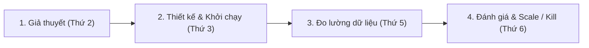

# Growth Experimentation Engine Playbook (Chuẩn 12WY)

> **Tài liệu tham chiếu chuyên sâu dành cho:** CMO Advisor & Growth Marketing Teams  
> **Nguyên tắc cốt lõi:** Nhịp độ 2-4 experiments/tuần, Khung ICE, Đo lường chuyển đổi tuần, Tối ưu hóa CAC.

---

## 1. Chu Trình Thử Nghiệm Tăng Trưởng Hàng Tuần (Weekly Growth Cadence)

Marketing trong mô hình 12WY không phải là chiến dịch lớn 6 tháng rồi chờ đợi phép màu. Đó là một cỗ máy thử nghiệm khoa học, kỷ luật, lặp lại hàng tuần:

### Tiêu Chuẩn Vận Tốc Thử Nghiệm (Experiment Velocity):
- **Tối thiểu:** 2 giả thuyết mới được khởi chạy mỗi tuần.
- **Mục tiêu:** 4 giả thuyết mới mỗi tuần đối với giai đoạn khám phá thị trường (Discovery / GTM).
- **Tỷ lệ thành công kỳ vọng:** Khoảng $20\% - 30\%$. Mục tiêu của cỗ máy không phải là 100% thử nghiệm đều thắng, mà là **học hỏi với chi phí rẻ nhất và nhanh nhất**.

---

## 2. Khung Ưu Tiên Thử Nghiệm ICE (ICE Scoring Model)

Trước khi đưa một thử nghiệm vào tuần thực thi, chấm điểm 3 yếu tố từ 1 đến 10:

$$\text{ICE Score} = \frac{\text{Impact} + \text{Confidence} + \text{Ease}}{3}$$

1. **Impact (1 - 10):** Nếu thử nghiệm thành công rực rỡ, nó có tạo ra bước nhảy vọt về MQL, SQL hoặc giảm CAC không?
2. **Confidence (1 - 10):** Chúng ta có bằng chứng nào từ dữ liệu quá khứ hoặc case study tương tự rằng ý tưởng này sẽ hiệu quả?
3. **Ease (1 - 10):** Thử nghiệm này có thể tự thực thi và ra kết quả trong vòng $\le 5$ ngày mà không cần phụ thuộc vào đội kỹ thuật dev code phức tạp không?

---

## 3. Cấu Trúc Bản Đề Xuất Thử Nghiệm Chuẩn (Experiment Card)

Mọi thử nghiệm trước khi chạy phải được ghi lại trên 1 trang tài liệu:

- **Tên thử nghiệm:** Ngắn gọn, mô tả rõ kênh và góc tiếp cận.
- **Giả thuyết:** *"Bằng việc thay đổi [Biến số X] trên kênh [Y], chúng tôi kỳ vọng sẽ tăng [Chỉ số Leading Metric Z] từ A lên B vì [Lý do hành vi]."*
- **Thời gian chạy:** Tối đa 1 đến 2 tuần.
- **Ngân sách tối đa:** Không vượt quá $\$300 - \$500$ cho một thử nghiệm vi mô ban đầu.
- **Chỉ số đo lường chính (OEC - Overall Evaluation Criterion):** Cost per MQL hoặc Tỷ lệ chuyển đổi Click-to-Sign-up.
- **Quyết định sau thử nghiệm:**
  - **Scale (Dồn lực):** Tăng ngân sách gấp 3 lần và tích hợp vào quy trình chuẩn.
  - **Iterate (Tinh chỉnh):** Chạy biến thể mới nếu tín hiệu hứa hẹn.
  - **Kill (Dừng lại):** Đóng thử nghiệm nếu CAC vượt ngưỡng trần hoặc không đạt kết quả tối thiểu.
