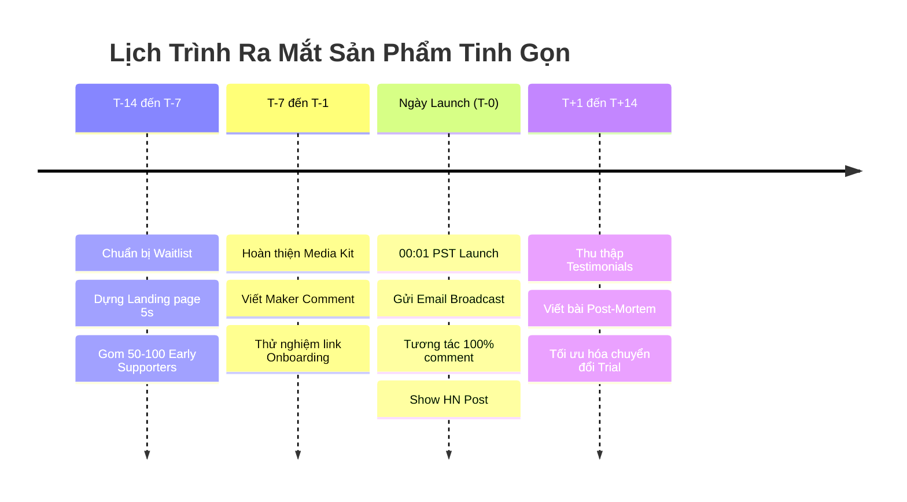

# Product Hunt & Hacker News Launch Playbook (Kịch Bản Ra Mắt Tinh Gọn)

Cẩm nang chuẩn bị và thực thi chiến dịch ra mắt sản phẩm trên Product Hunt (PH), Hacker News (Show HN) và các cộng đồng chuyên môn với ngân sách $0.

---

## 1. Dòng Thời Gian 4 Tuần (The 4-Week Launch Timeline)

---

## 2. Chuẩn Bị Bộ Tài Sản Ra Mắt (Launch Media Kit)

1. **Tagline (Tối đa 60 ký tự):** Rõ ràng, mô tả đúng việc sản phẩm làm, không dùng từ sáo rỗng.
   - *Tốt:* "AI Co-Founder for Solo Founders — 1 Goal per Week, 2-Week MVP"
   - *Tệ:* "The revolutionary next-gen AI platform changing the world"
2. **Thumbnail GIF/Video (240x240 px, < 3MB):** Hiển thị trực diện giao diện sản phẩm hoạt động trong 3 giây đầu.
3. **Gallery Images (Tối thiểu 5 ảnh, 1270x760 px):**
   - Ảnh 1: Vấn đề nhức nhối nhất & Giải pháp.
   - Ảnh 2: Giao diện tính năng cốt lõi (Core loop).
   - Ảnh 3: Bằng chứng kết quả (Before vs After).
   - Ảnh 4: Tích hợp và khả năng tương thích.
   - Ảnh 5: Lời cam kết và ưu đãi ngày Launch.
4. **Maker Comment (Bình luận đầu tiên từ Người sáng tạo):**
   - Tại sao chúng tôi xây dựng sản phẩm này (câu chuyện cá nhân đau đớn).
   - Sản phẩm giải quyết bài toán gì cho ai.
   - Điểm khác biệt so với các giải pháp hiện hành.
   - Lời mời gọi đóng góp ý kiến trung thực kèm ưu đãi đặc biệt cho cộng đồng PH.

---

## 3. Kịch Bản Ngày Ra Mắt (Launch Day Playbook - Giờ PST)

- **00:01 PST:** Sản phẩm xuất hiện trên Product Hunt.
- **00:05 PST:** Founder post Maker Comment ngay lập tức.
- **00:15 PST:** Kích hoạt email gửi cho danh sách Early Access / VIP Waitlist (kêu gọi feedback chân thực, tuyệt đối không mua upvote ảo).
- **02:00 PST:** Đăng bài `Show HN: Tên sản phẩm – Mô tả ngắn` trên Hacker News (tuân thủ văn hóa HN: kỹ thuật, trung thực, không quảng cáo rẻ tiền).
- **Suốt 24h:** Trả lời **100% bình luận** trên Product Hunt trong vòng dưới 15 phút. Biến mỗi bình luận thành một cuộc hội thoại khai thác nhu cầu người dùng.

---

## 4. Các Điều Cấm Kỵ Tuyệt Đối (Anti-Triggers)

- 🔴 **Cấm mua Upvote hoặc dùng Bot:** Product Hunt có thuật toán phạt nặng (shadowban) các sản phẩm có dấu hiệu gian lận.
- 🔴 **Cấm xin Upvote trắng trợn trên mạng xã hội:** Hãy xin "Feedback" và "Trải nghiệm thử", không xin vote.
- 🔴 **Cấm tung sản phẩm chưa hoàn thiện luồng thanh toán:** Phải có cơ chế thu tiền hoặc kích hoạt dùng thử ngay trong 5 phút đầu.
