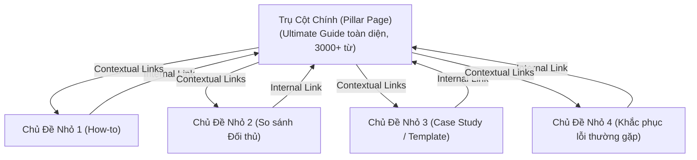

# Topic Cluster & Compounding Content Template (Cụm Chủ Đề Nội Dung Tích Lũy)

Khung xây dựng cỗ máy nội dung 90 ngày không dùng ngân sách quảng cáo, tối ưu hóa thứ hạng tìm kiếm tự nhiên và chuyển đổi khách hàng tiềm năng thành người dùng thật.

---

## 1. Kiến Trúc Cụm Chủ Đề (Topic Cluster Architecture)

---

## 2. Lộ Trình 3 Tháng Của Cỗ Máy Nội Dung 90 Ngày

| Giai đoạn | Mục tiêu trọng tâm | Tần suất xuất bản | Kênh phân phối bắt buộc |
| :--- | :--- | :--- | :--- |
| **Tháng 1: Nền tảng** | 1 Trụ cột chính + 8 bài viết cụm giải quyết nỗi đau trực tiếp của ICP. | 2 bài / tuần | LinkedIn cá nhân Founder, diễn đàn chuyên ngành, newsletter tuần. |
| **Tháng 2: Khuyếch đại & Backlink** | Viết bài so sánh giải pháp thay thế ([Đối thủ] Alternative) + Templates miễn phí. | 2 bài / tuần | Guest post, trích dẫn chuyên gia, đăng bài trên Indie Hackers / Dev.to. |
| **Tháng 3: Tối ưu & Chuyển đổi** | Đo lường tỷ lệ chuyển đổi bài viết, làm mới nội dung có tín hiệu traffic, mở rộng cụm 2. | 3 bài / tuần | Dẫn dắt vào chuỗi email onboarding tự động, webinar chia sẻ chuyên môn. |

---

## 3. Checklist Kiểm Tra Chất Lượng Trước Khi Xuất Bản (Mandatory QA)

Mỗi bài viết trước khi xuất bản **bắt buộc phải vượt qua 4 tiêu chuẩn**:
1. **Giá trị thực tế:** Trả lời một câu hỏi cụ thể hoặc giải quyết một vấn đề nhức nhối thật của người dùng. Cấm nội dung sáo rỗng (*no filler content*).
2. **Kế hoạch phân phối xác định trước:** Biết chính xác bài viết này sẽ được gửi vào cộng đồng nào, kênh nào, nhóm nào. Tuyệt đối không xuất bản rồi ngồi chờ người đọc tự đến.
3. **Đường dẫn chuyển đổi rõ ràng (Conversion Path):** Ở cuối bài (hoặc trong bài) phải có lời kêu gọi hành động cụ thể: Dùng thử tính năng, tải template, hoặc đăng ký nhận tin.
4. **Liên kết nội bộ (Internal Linking):** Tối thiểu 2 liên kết trỏ về Trụ cột chính (Pillar) và 1 liên kết trỏ sang bài viết cùng cụm.
